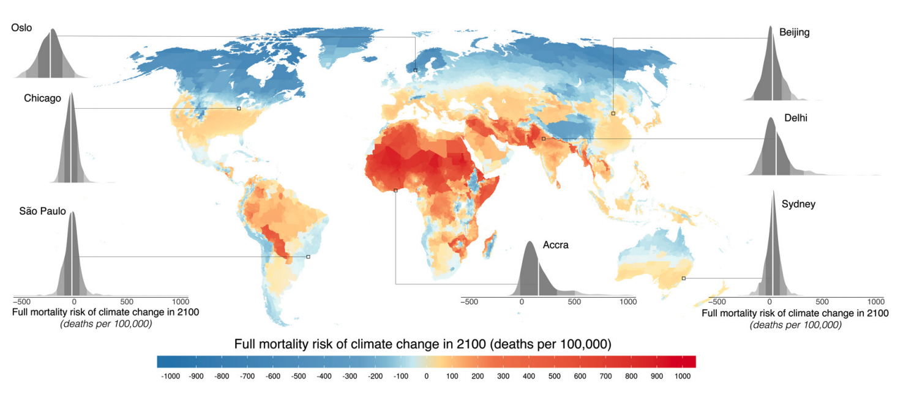

exclude: true
```{r setup}
if (!require("pacman")) install.packages("pacman")
pacman::p_load(
  tidyverse, xaringanExtra, rlang, patchwork, nycflights13, tweetrmd, vembedr
)
options(htmltools.dir.version = FALSE)
knitr::opts_hooks$set(fig.callout = function(options) {
  if (options$fig.callout) {
    options$echo <- FALSE
  }
knitr::opts_chunk$set(echo = TRUE, fig.align="center")
  options
})
```
```{r xaringanExtra, echo = FALSE}
xaringanExtra::use_xaringan_extra(c("tile_view", "panelset", "webcam"))

```
```{r echo=FALSE}
xaringanExtra::style_panelset(panel_tab_color_active = "red")
```

---

# Roadmap

- What is environmental economics?
- What are the goals for this class?
- Microeconomics recap

---

class: inverse, center, middle
name: what_is_enviro

# What is environmental economics?

<html><div style='float:left'></div><hr color='#EB811B' size=1px width=796px></html>


---

# What's enviro econ?

First, what is economics?

--

.hi[Economics:] the study of how agents (people, firms, etc) make choices with scarce resources and the social results of these choices

--

Everything is scarce compared to wants and needs

--

We need to choose among alternatives and make trade offs

--

These ideas can be applied to the environment

---

# What is enviro econ?

.hi[Environmental Economics:] the application of economics to the study of the environment as a resource or good

--

Environmental economics helps us understand things like:

--

The value of mitigating pollution

--

How agents will response to climate change policies

--

Whether investment tax credits for wind power are cost-effective

---

# Air pollution is bad

<center>
```{r, out.width = "70%", fig.pos="c", echo = FALSE}
knitr::include_graphics("files/01-pollution.jpg")
```
</center>


---

# How do people respond to info?

.pull-left[
```{r sequoia-tweet, echo = FALSE, fig.pos="c"}
tweet_screenshot(
  "https://twitter.com/SequoiaKingsAir/status/1300813316491673606",
  maxwidth = 200
  )
```
]

.pull-right[

  Places provide info to help people avoid air pollution
  
  Does it work?
  
  How well?

]


---

# Climate change

<center>
```{r temp-anomaly, out.width = "50%", fig.pos="c", echo = FALSE}

```
</center> 


---

# Climate change

```{r, echo = FALSE}
embed_url("https://youtu.be/c8vLVrxWIpg") %>%
  use_align("center")
```


---

# Climate change

Why do economists care about climate change?

--

It affects the economy and how we have to allocate resources! How?

--

- Production
--

- Learning
--

- Leisure
--

- Fishing
--

- etc, etc


---

# Climate change: heat hurts learning

<center>
```{r learning, out.width = "60%", fig.pos="c", echo = FALSE}

```
</center> 

Park et al. (2020)

---

# Climate change: heat hurts the economy

<center>
```{r growth, out.width = "75%", fig.pos="c", echo = FALSE}

``` 
</center> 

Rudik et al. (2021)

---

# Climate change: extreme heat/cold increases mortality

<center>
```{r mortality, out.width = "100%", fig.pos="c", echo = FALSE}

``` 
</center> 

Carleton et al. (2020)

---

# What is enviro econ?


.pull-left[
Environmental economics is actually pretty new

Spurred by .hi[John Krutilla] in the 1950s

His paper .green[Conservation Reconsidered] is the landmark paper in the field (sort of like Wealth of Nations and economics as a whole)

]

.pull-right[
 


]

---

class: inverse, center, middle
name: goals

# What are the goals of this class?

<html><div style='float:left'></div><hr color='#EB811B' size=1px width=796px></html>


---

# What are the goals of this class?

Enhance your understanding of	how economists think about solving real environmental problems

--

Prepare you for after college:
  - Industry jobs (energy, transportation, finance)
  - Public sector and NGOs (EPA, DOE, RFF, Brookings, Federal Reserve)
  - Graduate programs
  
--

Learn both the theory and .hi[applications] of environmental economics

---

class: inverse, center, middle
name: micro_recap

# Microeconomics recap

<html><div style='float:left'></div><hr color='#EB811B' size=1px width=796px></html>


---

# Micro recap

Is Intro to Micro applicable everywhere?

--

```{r, echo = FALSE}
embed_url("https://youtu.be/9qjvwQrZmpk") %>%
  use_align("center")
```

---

# Creating markets to solve problems

How do we solve some problems in practice?

--

```{r, echo = FALSE}
embed_url("https://youtu.be/QwgximJ9vPk") %>%
  use_align("center")
```

---

# Micro recap: terminology

.hi[Market:] 
--
a decentralized collection of all actual and potential buyers and sellers whose interactions determine the allocation and price of a good or service through exchange

--

.hi[Demand curve:] 
--
A schedule or graph showing the quantity of a good that buyers wish to buy at each price; it gives us the marginal willingness to pay or the marginal benefit

--

.hi[Supply curve:] 
--
A schedule or graph showing the quantity of a good that sellers wish to sell at each price; it gives us the marginal willingness to accept or the marginal cost


---

# Market demand

.pull-left[
```{r demand, echo = FALSE, fig.show = 'hide', warning = F}
demand <- function(x) 30 - x
ggplot() +
  annotate("text", x = 28, y = 7, label = "Demand", size = 8) +
  stat_function(fun = demand, color = "#ca5670", size = 1.5) +
  annotate("segment", x = 0, xend = 20, y = 10, yend = 10, 
           linetype = "dashed", size = 1.5, color = "grey50") +
  annotate("segment", x = 20, xend = 20, y = 0, yend = 10, 
           linetype = "dashed", size = 1.5, color = "grey50") +
  theme_minimal() +
  theme(
    legend.position = "none",
    title = element_text(size = 24),
    axis.text.x = element_text(size = 24), axis.text.y = element_text(size = 24),
    axis.title.x = element_text(size = 24), axis.title.y = element_text(size = 24),
    panel.grid.minor.x = element_blank(), panel.grid.major.y = element_blank(),
    panel.grid.minor.y = element_blank(), panel.grid.major.x = element_blank(),
    panel.background = element_rect(fill = "#ffffff",colour = NA),
    plot.background = element_rect(fill = "#ffffff",colour = NA),
    axis.line = element_line(colour = "black")
  ) +
  lims(x = c(0, 30), y = c(0, 30)) +
  labs(x = "Quantity of Lobster Demanded (millions)",
       y = "Price of Lobster",
       title = "Market demand gives quantity\ndemanded at each price")
  
```

`)
]

.pull-right[

Market demand is aggregated from all individual demand curves


]


---

# Market demand

.pull-left[
`)
]

.pull-right[

Market demand is aggregated from all individual demand curves

.hi-blue[Horizontal interpretation:] if buyers face a price of $10/lobster they will want to purchase 20 million


]


---

# Market demand

.pull-left[
`)
]

.pull-right[

Market demand is aggregated from all individual demand curves

.hi-blue[Horizontal interpretation:] if buyers face a price of $10/lobster they will want to purchase 20 million

.hi-blue[Vertical interpretation:] if buyers are buying 20 million lobsters, the marginal buyer is willing to pay at most $10


]

---

# Market demand slopes down

Why do demand curves slope down?

--

As the price of a good increases, people switch to other, similar goods

--

This is the .hi-red[substitution effect]: if the price of Coke goes up, people buy more Pepsi
  
--

As the price of a good increases, they can't afford as much of it: purchasing power goes down

--

This is the .hi-blue[income effect]: if the price of pizza goes up, we have a lower real budget


---

# Market supply

.pull-left[
```{r supply, echo = FALSE, fig.show = 'hide', warning = F}
supply <- function(x) 5 + 0.5*x
ggplot() +
  annotate("text", x = 28, y = 22, label = "Supply", size = 8) +
  stat_function(fun = supply, color = "#638ccc", size = 1.5) +
  annotate("segment", x = 0, xend = 20, y = 15, yend = 15, 
           linetype = "dashed", size = 1.5, color = "grey50") +
  annotate("segment", x = 20, xend = 20, y = 0, yend = 15, 
           linetype = "dashed", size = 1.5, color = "grey50") +
  theme_minimal() +
  theme(
    legend.position = "none",
    title = element_text(size = 24),
    axis.text.x = element_text(size = 24), axis.text.y = element_text(size = 24),
    axis.title.x = element_text(size = 24), axis.title.y = element_text(size = 24),
    panel.grid.minor.x = element_blank(), panel.grid.major.y = element_blank(),
    panel.grid.minor.y = element_blank(), panel.grid.major.x = element_blank(),
    panel.background = element_rect(fill = "#ffffff",colour = NA),
    plot.background = element_rect(fill = "#ffffff",colour = NA),
    axis.line = element_line(colour = "black")
  ) +
  lims(x = c(0, 30), y = c(0, 30)) +
  labs(x = "Quantity of Lobster Supplied (millions)",
       y = "Price of Lobster",
       title = "Market supply gives quantity\nsupplied at each price")
  
```

`)
]

.pull-right[

Market supply is aggregated from all individual supply/MC curves

]


---

# Market supply

.pull-left[
`)
]

.pull-right[

Market supply is aggregated from all individual supply/MC curves

.hi-blue[Horizontal interpretation:] if sellers face a price of $15/lobster they will want to sell 20 million


]


---

# Market supply

.pull-left[
`)
]

.pull-right[

Market supply is aggregated from all individual supply/MC curves

.hi-blue[Horizontal interpretation:] if sellers face a price of $15/lobster they will want to sell 20 million

.hi-blue[Vertical interpretation:] if sellers are selling 20 million lobsters, the marginal cost of the last lobster is $15


]

---

# Market supply slopes up

Why do supply curves slope up?

--

If we produce more of a good, we choose the lowest (opportunity) cost production processes first, higher cost production processes later

--

Marginal costs go up as production goes up $\rightarrow$ producers need higher prices in order to produce more goods


---

# Market equilibrium

.pull-left[
```{r equilibrium, echo = FALSE, fig.show = 'hide', warning = F}
supply <- function(x) 5 + 0.5*x
demand <- function(x) 30 - x
ggplot() +
  annotate("text", x = 28, y = 22, label = "Supply", size = 8) +
  annotate("text", x = 28, y = 7, label = "Demand", size = 8) +
  stat_function(fun = demand, color = "#ca5670", size = 1.5) +
  stat_function(fun = supply, color = "#638ccc", size = 1.5) +
  annotate("segment", x = 0, xend = 16.67, y = 13.33, yend = 13.33, 
           linetype = "dashed", size = 1.5, color = "grey50") +
  annotate("segment", x = 16.67, xend = 16.67, y = 0, yend = 13.33, 
           linetype = "dashed", size = 1.5, color = "grey50") +
  theme_minimal() +
  theme(
    legend.position = "none",
    title = element_text(size = 24),
    axis.text.x = element_text(size = 24), axis.text.y = element_text(size = 24),
    axis.title.x = element_text(size = 24), axis.title.y = element_text(size = 24),
    panel.grid.minor.x = element_blank(), panel.grid.major.y = element_blank(),
    panel.grid.minor.y = element_blank(), panel.grid.major.x = element_blank(),
    panel.background = element_rect(fill = "#ffffff",colour = NA),
    plot.background = element_rect(fill = "#ffffff",colour = NA),
    axis.line = element_line(colour = "black")
  ) +
  lims(x = c(0, 30), y = c(0, 30)) +
  labs(x = "Quantity of Lobster (millions)",
       y = "Price of Lobster",
       title = "Market equilibrium is where\nsupply equals demand")
  
```

`)
]

.pull-right[

A market equilibrium is a price/quantity pair where the demand curve crosses the supply curve

]


---

# Market equilibrium

.pull-left[
`)
]

.pull-right[

A market equilibrium is a price/quantity pair where the demand curve crosses the supply curve

This gives us the price where the quantity demanded exactly equals the quantity supplied: no shortages, no surpluses

]

---

# Market equilibrium

.pull-left[
```{r cs, echo = FALSE, fig.show = 'hide', warning = F}
supply <- function(x) 5 + 0.5*x
demand <- function(x) 30 - x
cs_points <- tibble(x = c(0, 16.67, 0),
                     y = c(13.33, 13.33, 30))
ps_points <- tibble(x = c(0, 16.67, 0),
                     y = c(13.33, 13.33, 5))
ggplot() +
  geom_polygon(data = cs_points, aes(x = x, y = y), fill = "red", alpha = 0.2) +
  geom_polygon(data = ps_points, aes(x = x, y = y), fill = "blue", alpha = 0.2) +
  annotate("text", x = 28, y = 22, label = "Supply", size = 8) +
  annotate("text", x = 28, y = 7, label = "Demand", size = 8) +
  stat_function(fun = demand, color = "#ca5670", size = 1.5) +
  stat_function(fun = supply, color = "#638ccc", size = 1.5) +
  annotate("segment", x = 0, xend = 16.67, y = 13.33, yend = 13.33, 
           linetype = "dashed", size = 1.5, color = "grey50") +
  annotate("segment", x = 16.67, xend = 16.67, y = 0, yend = 13.33, 
           linetype = "dashed", size = 1.5, color = "grey50") +
  theme_minimal() +
  theme(
    legend.position = "none",
    title = element_text(size = 24),
    axis.text.x = element_text(size = 24), axis.text.y = element_text(size = 24),
    axis.title.x = element_text(size = 24), axis.title.y = element_text(size = 24),
    panel.grid.minor.x = element_blank(), panel.grid.major.y = element_blank(),
    panel.grid.minor.y = element_blank(), panel.grid.major.x = element_blank(),
    panel.background = element_rect(fill = "#ffffff",colour = NA),
    plot.background = element_rect(fill = "#ffffff",colour = NA),
    axis.line = element_line(colour = "black")
  ) +
  lims(x = c(0, 30), y = c(0, 30)) +
  labs(x = "Quantity of Lobster (millions)",
       y = "Price of Lobster",
       title = "Market equilibrium is where\nsupply equals demand")
  
```

`)
]

.pull-right[

.hi-red[Consumer surplus] is the difference between willingness to pay (demand) and price

.hi-blue[Producer surplus] is the difference between price and marginal cost (supply)

.hi[Total surplus] is the sum of CS and PS

]

---

# Efficiency

We have two notions of efficiency: 

1. A .hi[socially optimal quantity] is the quantity of the good the maximizes total surplus
--

2. An allocation is .hi[Pareto efficient] if there's no way to change things to make at least one person strictly better off, without making at least one person strictly worse off

--

If you can make one person better off without making anyone else worse off its called a .hi-blue[Pareto improvement]

---

# Are markets efficient?

Are (competitive) markets efficient?

--

Under some assumptions, yes: the .hi[First Welfare Theorem] tells us that any competitive equilibrium is Pareto efficient

--

Under these assumptions competitive markets also maximize social welfare

--

.hi-red[Main takeaway]: markets are often a nice way to allocate scarce resources

---

# Under what assumptions are markets efficient?

What are the underlying assumptions for market efficiency?

1. Perfect competition
2. Perfect information
3. Complete markets (minimal transactions costs)
4. .hi-red[No externalities]

--

.hi-red[Externalities] are when an economic transaction imposes a cost or benefit on a third party

--

They drive a wedge between private and social marginal cost, or private and social marginal benefit

---

# The key departures in environmental economics

In enviro econ, the key departure from the standard perfect market is the introduction of externalities and non-rival and non-excludable goods:

--

.hi-red[Non-rival]: additional people can get the benefits of consuming the same unit of the good at no extra cost to others

--

.hi-blue[Non-excludable]: extra individuals can't be precluded from consuming the good

--

|           	|          **Excludable**         	|            **Non-Excludable**            	|
|-----------	|:---------------------------:	|:------------------------------------:	|
|**Rival**    	|     Private goods (food)    	| Common-pool resources (fish, timber) 	|
| **Non-rival**	| Club goods (parks, netflix) 	| Public goods (air, national defense) 	|

---

# Imperfect information

We will also discuss .hi[imperfect information]: when economic actors are uncertainty about the prices or quality of a good

--

If there's imperfect information then efficiency may not be achieved

--

Why?

--

Without the adequate information, buyers or sellers cannot make the choices in their best interest

---

# Efficiency and equity

The First Welfare Theorem guarantees competitive markets give (Pareto) efficient allocations

--

It does not guarantee that these allocations are desirable, any examples?

--

E.g.

--

- If Elon Musk held **all** the wealth in the world, that would be a Pareto efficient outcome even though it goes against basically all people's notions of equity

--

- Perfect price discrimination is also Pareto efficient: producers capture all the surplus but it is maximized

---

# Ecological wealth

```{r, echo = FALSE}
embed_url("https://youtu.be/1yzmOrcLIPo") %>%
  use_align("center")
```

