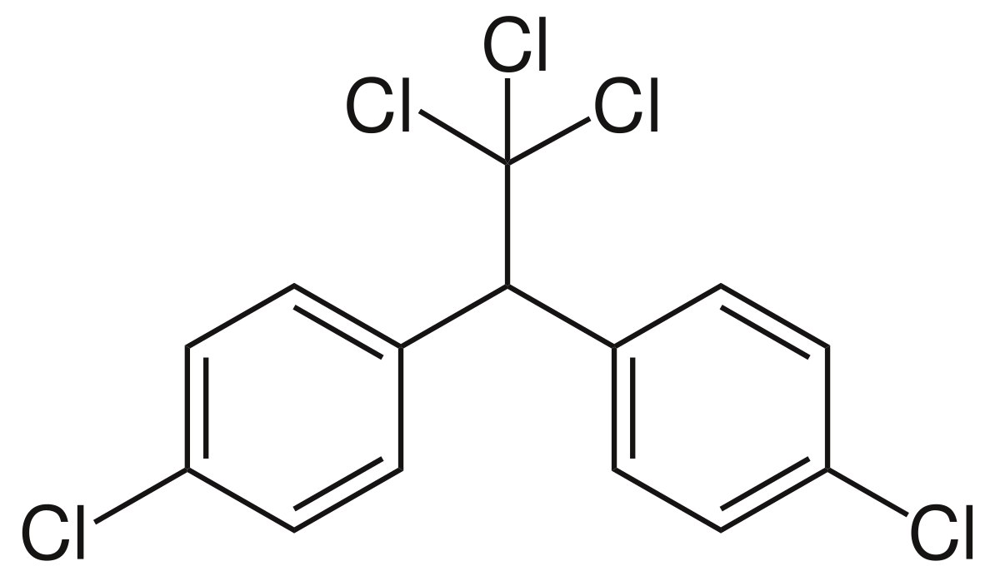
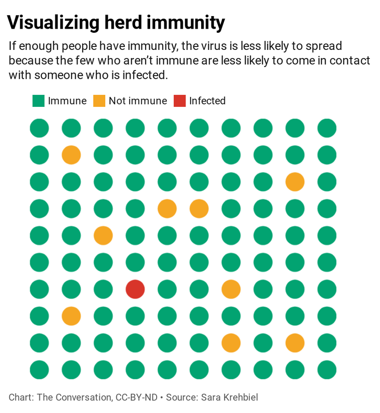
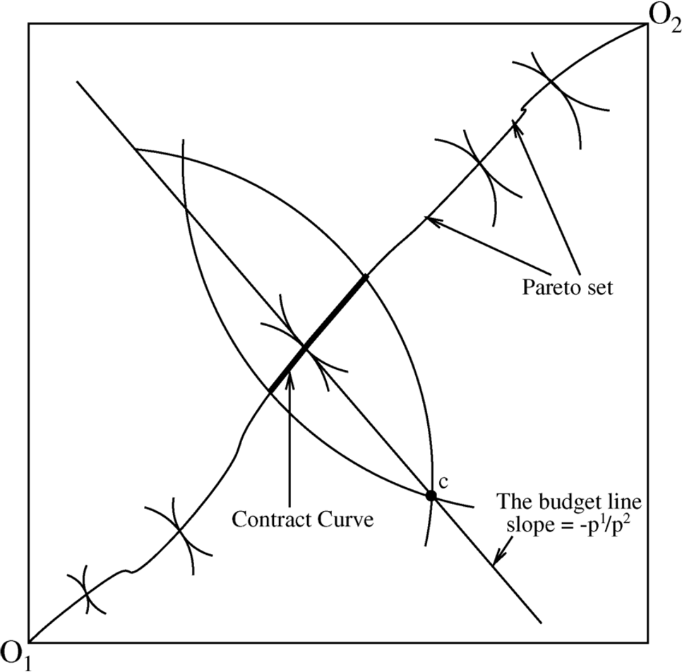
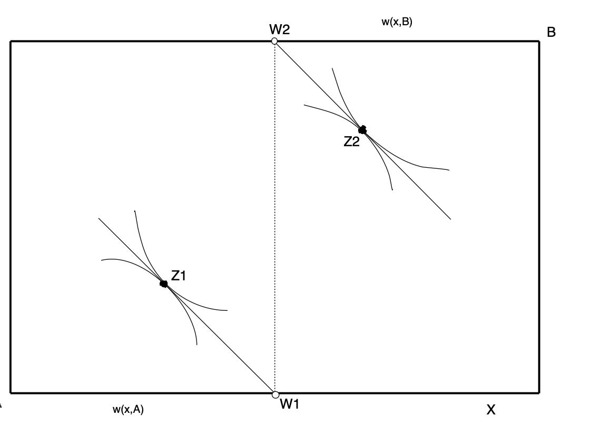

exclude: true
```{r setup}
if (!require("pacman")) install.packages("pacman")
pacman::p_load(
  tidyverse, xaringanExtra, rlang, patchwork, nycflights13, tweetrmd, vembedr
)
options(htmltools.dir.version = FALSE)
knitr::opts_hooks$set(fig.callout = function(options) {
  if (options$fig.callout) {
    options$echo <- FALSE
  }
knitr::opts_chunk$set(echo = TRUE, fig.align="center")
  options
})
```
```{r xaringanExtra, echo = FALSE}
xaringanExtra::use_xaringan_extra(c("tile_view", "panelset", "webcam"))

```
```{r echo=FALSE}
xaringanExtra::style_panelset(panel_tab_color_active = "red")
```

---

# Roadmap

- What are market failures?
- When do they happen?
- What are the consequences?

---

class: inverse, center, middle
name: what_is_enviro

# Market failures and the environment

<html><div style='float:left'></div><hr color='#EB811B' size=1px width=796px></html>


---

# The ideal world

In the best case scenario, a market equilibrium leads to the efficient allocation

--

Example: bread

--

We have a private bread supply curve (private MC)

--

We have a private bread demand curve (private MB)

--

In equilibrium: supply = demand so PMC = PMB = price

--

For bread, the private costs and benefits are very likely the social costs and benefits


---

# Market equilibrium

.pull-left[
```{r pmb-pmb, echo = FALSE, fig.show = 'hide', warning = F}
supply <- function(x) 5 + 0.5*x
demand <- function(x) 30 - x
cs_points <- tibble(x = c(0, 16.67, 0),
                     y = c(13.33, 13.33, 30))
ps_points <- tibble(x = c(0, 16.67, 0),
                     y = c(13.33, 13.33, 5))
ggplot() +
  geom_polygon(data = cs_points, aes(x = x, y = y), fill = "red", alpha = 0.2) +
  geom_polygon(data = ps_points, aes(x = x, y = y), fill = "blue", alpha = 0.2) +
  annotate("text", x = 26, y = 22, label = "PMC", size = 8) +
  annotate("text", x = 26, y = 7, label = "PMB", size = 8) +
  stat_function(fun = demand, color = "#ca5670", size = 1.5) +
  stat_function(fun = supply, color = "#638ccc", size = 1.5) +
  annotate("segment", x = 0, xend = 16.67, y = 13.33, yend = 13.33, 
           linetype = "dashed", size = 1.5, color = "grey50") +
  annotate("segment", x = 16.67, xend = 16.67, y = 0, yend = 13.33, 
           linetype = "dashed", size = 1.5, color = "grey50") +
  theme_minimal() +
  theme(
    legend.position = "none",
    title = element_text(size = 24),
    axis.text.x = element_text(size = 24), axis.text.y = element_text(size = 24),
    axis.title.x = element_text(size = 24), axis.title.y = element_text(size = 24),
    panel.grid.minor.x = element_blank(), panel.grid.major.y = element_blank(),
    panel.grid.minor.y = element_blank(), panel.grid.major.x = element_blank(),
    panel.background = element_rect(fill = "#eeeeee",colour = NA),
    plot.background = element_rect(fill = "#eeeeee",colour = NA),
    axis.line = element_line(colour = "black")
  ) +
  scale_x_continuous(labels = expression(Q^'*'), breaks = c(16.67), limits = c(0,30)) +
  scale_y_continuous(labels = expression(P^'*'), breaks = c(13.33), limits = c(0,30)) +
  labs(x = "Quantity",
       y = "Price")
  
```

`)
]

.pull-right[

.hi-red[Consumer surplus] is the difference between willingness to pay (demand) and price

.hi-blue[Producer surplus] is the difference between price and marginal cost (supply)

.hi[Total surplus] is the sum of CS and PS

]

---

# Market equilibrium

.pull-left[
`)
]

.pull-right[
For bread, the private costs and benefits are very likely the social costs and benefits

What does this mean about the market allocation?
]

---

# Market equilibrium

.pull-left[
`)
]

.pull-right[
The market allocation is .hi-blue[efficient] because SMC = SMB

Why?

Consider deviating from $(P^*, Q^*)$
]

---

# Market equilibrium

.pull-left[
`)
]

.pull-right[
Cost of next unit after $Q^*$ > benefit

Benefit of last unit $\geq$ cost of last unit

Competitive market allocations are efficient for private goods

]

---

# Externalities

If the world was just competitive markets, private goods, no third-parties, there would be no reason to do anything after Econ 101

--

That's not the case in the real world

--

In the real world we have .hi-blue[externalities]

> An externality exists whenever an individual or firm undertakes an action that impacts another individual or firm in an unintended way for which the latter is not compensated (a negative externality), or for which the latter does not pay (a positive externality)

---

# Externalities

What is problem with externalities for market outcomes and efficiency?

--

There is not a market for the externality

--

E.g. at Wegmans or Agway you will not find on sale:
- Cleaner air outside
- Biodiversity in the Amazon

--

The central problem is that there are goods that are .hi-red[not priced]

--

Markets rely on prices to reflect value


---

# Externalities: several classifications

We can classify externalities in a few ways:

.hi[Production externalities:] generated by a firm in the process of producing some output (e.g. pollution, innovation)

--

.hi[Consumption externalities:] generated by an individual in the process of consuming  an output (e.g. congestion, vaccination)

--

.hi-red[Negative externalities:] imposes external **costs** (e.g. pollution)

--

.hi-blue[Negative externalities:] imposes external **benefits** (e.g. vaccination)

---

# Negative externalities

<center>
```{r, out.width = "100%", fig.pos="c", echo = FALSE}

```
</center>

---

# Negative externalities


.pull-left[
```{r, out.width = "100%", fig.pos="c", echo = FALSE}

```
]

.pull-right[
DDT is a chemical that was was widely used as an insecticide in the early-mid 1900s

Widely used to eradicate Typhus and Malaria

Used to treat lice
]

---

# Negative externalities


.pull-left[
```{r, out.width = "100%", fig.pos="c", echo = FALSE}

```
]

.pull-right[

> A relationship between DDT exposure and reproductive effects in humans is suspected, based on studies in animals. In addition, some animals exposed to DDT in studies developed liver tumors. As a result, today, DDT is classified as a probable human carcinogen.

]

---

# Negative externalities: graphical

.pull-left[
```{r neg-ext, echo = FALSE, fig.show = 'hide', warning = F}
pmc <- function(x) 5 + 0.5*x
smc <- function(x) 10 + 0.5*x
demand <- function(x) 30 - x
cs_points <- tibble(x = c(0, 16.67, 0),
                     y = c(13.33, 13.33, 30))
ps_points <- tibble(x = c(0, 16.67, 0),
                     y = c(13.33, 13.33, 5))
ggplot() +
  annotate("text", x = 26, y = 26, label = "SMC", size = 8) +
  annotate("text", x = 26, y = 14, label = "PMC", size = 8) +
  annotate("text", x = 24, y = 1, label = "PMB=SMB", size = 8) +
  stat_function(fun = demand, color = "#ca5670", size = 1.5) +
  stat_function(fun = pmc, color = "#638ccc", size = 1.5) +
  stat_function(fun = smc, color = "#444444", size = 1.5) +
  annotate("segment", x = 0, xend = 16.67, y = 13.33, yend = 13.33, 
           linetype = "dashed", size = 1.5, color = "grey50") +
  annotate("segment", x = 16.67, xend = 16.67, y = 0, yend = 13.33, 
           linetype = "dashed", size = 1.5, color = "grey50") +
  annotate("segment", x = 0, xend = 13.33, y = 16.67, yend = 16.67, 
           linetype = "dashed", size = 1.5, color = "grey50") +
  annotate("segment", x = 13.33, xend = 13.33, y = 0, yend = 16.67, 
           linetype = "dashed", size = 1.5, color = "grey50") +
  theme_minimal() +
  theme(
    legend.position = "none",
    title = element_text(size = 24),
    axis.text.x = element_text(size = 24), axis.text.y = element_text(size = 24),
    axis.title.x = element_text(size = 24), axis.title.y = element_text(size = 24),
    panel.grid.minor.x = element_blank(), panel.grid.major.y = element_blank(),
    panel.grid.minor.y = element_blank(), panel.grid.major.x = element_blank(),
    panel.background = element_rect(fill = "#eeeeee",colour = NA),
    plot.background = element_rect(fill = "#eeeeee",colour = NA),
    axis.line = element_line(colour = "black")
  ) +
  scale_x_continuous(labels = c(expression(Q^'u'), expression(Q^'*')), breaks = c(16.67, 13.33), limits = c(0,30)) +
  scale_y_continuous(labels = c(expression(P^'u'), expression(P^'*')), breaks = c(13.33, 16.67), limits = c(0,30)) +
  labs(x = "Quantity",
       y = "Price")
  
```

`)
]

.pull-right[

.hi-red[Social marginal cost (SMC)] is the sum of private marginal cost (PMC) and the external marginal cost (EMC)

The PMC curve only reflects the **private costs** of making the DTT

It does not account for the external health and wildlife costs

]


---

# Negative externalities: graphical

.pull-left[
`)
]

.pull-right[

Adding the private and external marginal costs together gives us the SMC, what we care about from the social planner or regulator's perspective

The unregulated market gives us $(P^u,Q^u)$ as an outcome when we want $(P^*,Q^*)$

What's the social cost of this market failure?

]


---

# Negative externalities: graphical

.pull-left[
```{r neg-ext-dwl, echo = FALSE, fig.show = 'hide', warning = F}
pmc <- function(x) 5 + 0.5*x
smc <- function(x) 10 + 0.5*x
demand <- function(x) 30 - x
dwl_points <- tibble(x = c(13.33, 16.67, 16.67),
                     y = c(16.67, 13.33, 18.335))
ggplot() +
  geom_polygon(data = dwl_points, aes(x = x, y = y), fill = "red", alpha = 0.5) +
  annotate("text", x = 26, y = 26, label = "SMC", size = 8) +
  annotate("text", x = 26, y = 14, label = "PMC", size = 8) +
  annotate("text", x = 24, y = 1, label = "PMB=SMB", size = 8) +
  stat_function(fun = demand, color = "#ca5670", size = 1.5) +
  stat_function(fun = pmc, color = "#638ccc", size = 1.5) +
  stat_function(fun = smc, color = "#444444", size = 1.5) +
  annotate("segment", x = 0, xend = 16.67, y = 13.33, yend = 13.33, 
           linetype = "dashed", size = 1.5, color = "grey50") +
  annotate("segment", x = 16.67, xend = 16.67, y = 0, yend = 13.33, 
           linetype = "dashed", size = 1.5, color = "grey50") +
  annotate("segment", x = 0, xend = 13.33, y = 16.67, yend = 16.67, 
           linetype = "dashed", size = 1.5, color = "grey50") +
  annotate("segment", x = 13.33, xend = 13.33, y = 0, yend = 16.67, 
           linetype = "dashed", size = 1.5, color = "grey50") +
  theme_minimal() +
  theme(
    legend.position = "none",
    title = element_text(size = 24),
    axis.text.x = element_text(size = 24), axis.text.y = element_text(size = 24),
    axis.title.x = element_text(size = 24), axis.title.y = element_text(size = 24),
    panel.grid.minor.x = element_blank(), panel.grid.major.y = element_blank(),
    panel.grid.minor.y = element_blank(), panel.grid.major.x = element_blank(),
    panel.background = element_rect(fill = "#eeeeee",colour = NA),
    plot.background = element_rect(fill = "#eeeeee",colour = NA),
    axis.line = element_line(colour = "black")
  ) +
  scale_x_continuous(labels = c(expression(Q^'u'), expression(Q^'*')), breaks = c(16.67, 13.33), limits = c(0,30)) +
  scale_y_continuous(labels = c(expression(P^'u'), expression(P^'*')), breaks = c(13.33, 16.67), limits = c(0,30)) +
  labs(x = "Quantity",
       y = "Price")
  
```

`)
]

.pull-right[

Negative externalities generate deadweight loss equal to the .hi-red[red] area

This is the difference in SMC and SMB for units where SMC > SMB

This is the loss to society caused by the externality in the unregulated private market

]

---

# Negative externalities: graphical

.pull-left[
`)
]

.pull-right[

The private market produces too much DDT

The private actors are not accounting for the social costs they are imposing on people who are not in the DDT transaction (e.g. third parties whose health is being affected)

]

---

# The birth of the environmental movement

```{r, echo = FALSE}
embed_url("https://youtu.be/kwb6OvvxMjg") %>%
  use_align("center")
```


---

# Positive externalities

<center>
```{r, out.width = "50%", fig.pos="c", echo = FALSE}

```
</center>

---

# Positive externalities

.pull-left[
```{r, out.width = "100%", fig.pos="c", echo = FALSE}

```
]

.pull-right[
Vaccines and masks are examples of good with positive externalities

You getting or using them has benefits for other people not involved in your vaccine or mask transaction
]


---

# Positive externalities: graphical

.pull-left[
```{r pos-ext, echo = FALSE, fig.show = 'hide', warning = F}
pmc <- function(x) 5 + 0.5*x
smb <- function(x) 40 - x
pmb <- function(x) 30 - x
ggplot() +
  annotate("text", x = 20, y = 26, label = "SMB", size = 8) +
  annotate("text", x = 26, y = 21, label = "SMC=PMC", size = 8) +
  annotate("text", x = 26, y = 1, label = "PMB", size = 8) +
  stat_function(fun = pmb, color = "#ca5670", size = 1.5) +
  stat_function(fun = pmc, color = "#638ccc", size = 1.5) +
  stat_function(fun = smb, color = "#444444", size = 1.5) +
  annotate("segment", x = 0, xend = 16.67, y = 13.33, yend = 13.33, 
           linetype = "dashed", size = 1.5, color = "grey50") +
  annotate("segment", x = 16.67, xend = 16.67, y = 0, yend = 13.33, 
           linetype = "dashed", size = 1.5, color = "grey50") +
  annotate("segment", x = 0, xend = 23.33, y = 16.67, yend = 16.67, 
           linetype = "dashed", size = 1.5, color = "grey50") +
  annotate("segment", x = 23.33, xend = 23.33, y = 0, yend = 16.67, 
           linetype = "dashed", size = 1.5, color = "grey50") +
  theme_minimal() +
  theme(
    legend.position = "none",
    title = element_text(size = 24),
    axis.text.x = element_text(size = 24), axis.text.y = element_text(size = 24),
    axis.title.x = element_text(size = 24), axis.title.y = element_text(size = 24),
    panel.grid.minor.x = element_blank(), panel.grid.major.y = element_blank(),
    panel.grid.minor.y = element_blank(), panel.grid.major.x = element_blank(),
    panel.background = element_rect(fill = "#eeeeee",colour = NA),
    plot.background = element_rect(fill = "#eeeeee",colour = NA),
    axis.line = element_line(colour = "black")
  ) +
  scale_x_continuous(labels = c(expression(Q^'u'), expression(Q^'*')), breaks = c(16.67, 23.33), limits = c(0,30)) +
  scale_y_continuous(labels = c(expression(P^'u'), expression(P^'*')), breaks = c(13.33, 16.67), limits = c(0,30)) +
  labs(x = "Quantity",
       y = "Price")
  
```

`)
]

.pull-right[

.hi-red[Social marginal benefit (SMB)] is the sum of private marginal benefit (PMB) and the external marginal benefit (EMB)

The PMB curve only reflects the **private benefits** of getting a vaccine

It does not account for the external herd immunity benefits

]

---

# Positive externalities: graphical

.pull-left[
`)
]

.pull-right[

Adding the private and external marginal benefits together gives us the SMB, what we care about from the social planner or regulator's perspective

The unregulated market gives us $(P^u,Q^u)$ as an outcome when we want $(P^*,Q^*)$

What's the social cost of this market failure?

]


---

# Positive externalities: graphical

.pull-left[
```{r pos-ext-dwl, echo = FALSE, fig.show = 'hide', warning = F}
pmc <- function(x) 5 + 0.5*x
smb <- function(x) 40 - x
pmb <- function(x) 30 - x
dwl_points <- tibble(x = c(23.33, 16.67, 16.67),
                     y = c(16.67, 13.33, 23.335))
ggplot() +
  geom_polygon(data = dwl_points, aes(x = x, y = y), fill = "blue", alpha = 0.5) +
  annotate("text", x = 20, y = 26, label = "SMB", size = 8) +
  annotate("text", x = 26, y = 21, label = "SMC=PMC", size = 8) +
  annotate("text", x = 26, y = 1, label = "PMB", size = 8) +
  stat_function(fun = pmb, color = "#ca5670", size = 1.5) +
  stat_function(fun = pmc, color = "#638ccc", size = 1.5) +
  stat_function(fun = smb, color = "#444444", size = 1.5) +
  annotate("segment", x = 0, xend = 16.67, y = 13.33, yend = 13.33, 
           linetype = "dashed", size = 1.5, color = "grey50") +
  annotate("segment", x = 16.67, xend = 16.67, y = 0, yend = 13.33, 
           linetype = "dashed", size = 1.5, color = "grey50") +
  annotate("segment", x = 0, xend = 23.33, y = 16.67, yend = 16.67, 
           linetype = "dashed", size = 1.5, color = "grey50") +
  annotate("segment", x = 23.33, xend = 23.33, y = 0, yend = 16.67, 
           linetype = "dashed", size = 1.5, color = "grey50") +
  theme_minimal() +
  theme(
    legend.position = "none",
    title = element_text(size = 24),
    axis.text.x = element_text(size = 24), axis.text.y = element_text(size = 24),
    axis.title.x = element_text(size = 24), axis.title.y = element_text(size = 24),
    panel.grid.minor.x = element_blank(), panel.grid.major.y = element_blank(),
    panel.grid.minor.y = element_blank(), panel.grid.major.x = element_blank(),
    panel.background = element_rect(fill = "#eeeeee",colour = NA),
    plot.background = element_rect(fill = "#eeeeee",colour = NA),
    axis.line = element_line(colour = "black")
  ) +
  scale_x_continuous(labels = c(expression(Q^'u'), expression(Q^'*')), breaks = c(16.67, 23.33), limits = c(0,30)) +
  scale_y_continuous(labels = c(expression(P^'u'), expression(P^'*')), breaks = c(13.33, 16.67), limits = c(0,30)) +
  labs(x = "Quantity",
       y = "Price")
  
```

`)
]

.pull-right[

Positive externalities generate deadweight loss equal to the .hi-blue[blue] area

This is the difference in SMB and SMC for units where SMC < SMB

This is the loss to society caused by the externality in the unregulated private market

]


---

# Positive externalities: graphical

.pull-left[
`)
]

.pull-right[

The private market produces too few vaccines

The private actors are not accounting for the social benefits they are imposing on people who are not in the vaccine transaction (e.g. third parties whose health is being affected)

]


---

# Why do externalities arise?

Typically one of two reasons:

1. Poorly defined property rights
  - Who owns the right to the air?
2. High transactions costs
  - Hard to bargain over desired air quality with millions of people


Lets conceptualize a model of efficient bargaining using an Edgeworth Box
  
---

# Why do externalities arise? Edgeworth Box  

- Two individuals: A and B
- Two private goods: X and Y

Each individual begins with an initial endowment of each good:
- $A: w_X^A, w_Y^A$
- $B: w_X^B, w_Y^B$

This gives us a total endowment:
- $W_X = w_X^A + w_X^B$
- $W_Y = w_Y^A + w_Y^B$

---

# Why do externalities arise? Edgeworth Box

.pull-left[
<center>
```{r, out.width = "100%", fig.pos="c", echo = FALSE}

```
</center>
]

.pull-right[
Total vertical distance is $W_Y$

Total horizontal distance is $W_X$

Initial endowment is given by the empty circle

Initial indifference curves for A and B are $UA(0)$ and $UB(0)$
]

---

# Why do externalities arise? Edgeworth Box

.pull-left[
<center>
```{r, out.width = "100%", fig.pos="c", echo = FALSE}

```
</center>
]

.pull-right[
Is there a possible Pareto improvement?

e.g. can we make both A and B better off?
]

---

# Why do externalities arise? Edgeworth Box

.pull-left[
<center>
```{r, out.width = "100%", fig.pos="c", echo = FALSE}

```
</center>
]

.pull-right[
Yes!

If we move anywhere in the lens of their initial indifference curves we have a Pareto improvement

If we move to an allocation where their indifference curves are .hi[tangent] to one another (e.g. the filled-in point), we have a Pareto optimum
]

---

# Why do externalities arise? Edgeworth Box

In a properly functioning market:

- The endowment point is well-established
- A and B can trade X and Y to some Pareto improving point
- They continue trading until they achieve a Pareto optimal allocaiton
- This allocation lies on the .hi[contract curve]: the line consisting of all Pareto efficient allocations
  
---

# Why do externalities arise? Edgeworth Box

<center>
```{r, out.width = "50%", fig.pos="c", echo = FALSE}

```
</center>


---

# Why do externalities arise? Edgeworth Box

Now suppose Y is not a private good, but a public good/bad, e.g. smoke

--

This means that A and B consume the .hi[exact same level of Y]

--

Unlike our regular Edgeworth Box, now Y increases for .hi[both] A and B as we move to the top of the slide (before Y increased for B as we moved to the bottom)

--

Suppose that A likes Y, but B does not

--

Suppose both start off with the same quantity of X

---

# Why do externalities arise? Edgeworth Box


.pull-left[
<center>
```{r, out.width = "100%", fig.pos="c", echo = FALSE}

```
</center>
]

.pull-right[
Depending on who has property rights, we either start at:

- W1 (B has property rights)
- W2 (A has property rights)

Think about why these are where we must start

]

---

# Why do externalities arise? Edgeworth Box


.pull-left[
<center>
```{r, out.width = "100%", fig.pos="c", echo = FALSE}

```
</center>
]

.pull-right[
Suppose we start at W1, what happens?

A wants to have more Y, but this imposes a cost on B

Therefore, A has to .hi[pay] B to get more Y

A pays B in units of X, move to Z1, Pareto optimum

]


---

# Why do externalities arise? Edgeworth Box


.pull-left[
<center>
```{r, out.width = "100%", fig.pos="c", echo = FALSE}

```
</center>
]

.pull-right[
Suppose we start at W2, what happens?

B wants to have less Y, but this imposes a cost on A

Therefore, B has to .hi[pay] A to get less Y

B pays A in units of X, move to Z2, Pareto optimum

]

---

# Why do externalities arise? Edgeworth Box

In the previous example we were able to achieve the Pareto optimum even with a public good / externality

--

Why?

--

1. Property rights were assigned to either A or B
--

2. Transactions costs were low (didn't have to pay a fee to trade X)

---

# Property rights and externalities

A solution to many externalities is to just assign property rights and let the market do its thing

--

We'll talk about a few ways that we can assign property rights

---

# Transactions costs and externalities

Now suppose there were many non-smokers

--

Even if they were assigned the property rights, it might be hard for them to bargain
  - Takes a lot of time to find something that works for everyone
  - Negotiating over how much X each person gets

--

The costs of bargaining may exceed the benefits and we end up stuck at W2

---

# Transactions costs and externalities

Road noise: drivers implicitly have property rights to noise around roads

--

Even if you prefer quiet, you can't negotiate a payment with every loud car that might pass pay

---

# The free-rider problem

Externalities and public goods/bads often exhibit many of the same features

Both are subject to the .hi[Free-Rider Problem]

> A type of market failure that occurs when those who benefit from resources, public goods (such as public roads or hospitals), or services of a communal nature do not pay for them[1] or under-pay

e.g.

- people don't pay their taxes for publicly-provided services
- non-smokers will wait for others to pay in order to reduce smoke