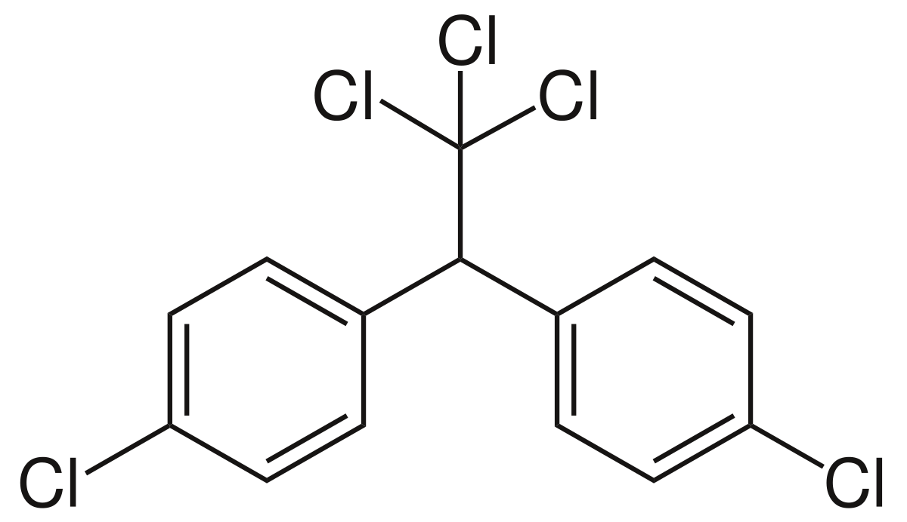
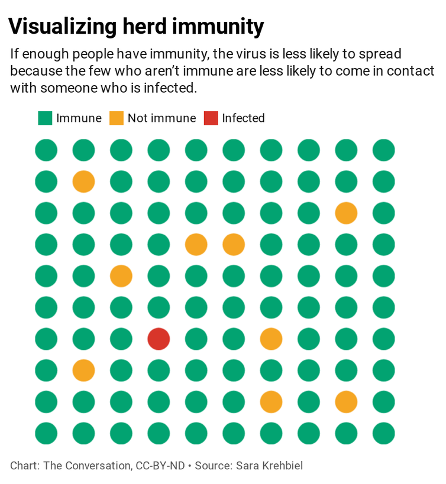

exclude: true
```{r setup}
if (!require("pacman")) install.packages("pacman")
pacman::p_load(
  tidyverse, xaringanExtra, rlang, patchwork, nycflights13, tweetrmd
)
source("R/video_helpers.R")
options(htmltools.dir.version = FALSE)
knitr::opts_hooks$set(fig.callout = function(options) {
  if (options$fig.callout) {
    options$echo <- FALSE
  }
knitr::opts_chunk$set(
  cache = TRUE,
  cache.extra = list(tools::md5sum("R/video_helpers.R")),
  echo = TRUE,
  fig.align = "center"
)
  options
})
```
```{r xaringanExtra, echo = FALSE}
xaringanExtra::use_xaringan_extra(c("tile_view", "panelset", "webcam"))

```
```{r echo=FALSE}
xaringanExtra::style_panelset(panel_tab_color_active = "red")
```

---

# Roadmap

- What are market failures?
- When do they happen?
- What are the consequences?

---

class: inverse, center, middle
name: what_is_enviro

# Market failures and the environment

<html><div style='float:left'></div><hr color='#EB811B' size=1px width=796px></html>


<!-- --- -->

<!-- # The ideal world: mathematical -->

<!-- In the best case scenario, a market equilibrium leads to the efficient allocation -->

<!-- -- -->

<!-- Example: bread -->

<!-- -- -->

<!-- Household gets utility $U(B,C)$ from consuming bread $B$ and electricity $C$ -->

<!-- -- -->

<!-- Price of bread is $p_b$, price of electricity is $p_e$, household has a budget $Y$ -->

<!-- -- -->

<!-- Household solves: -->
<!-- \begin{align} -->
<!--   &\max_{B,E} U(B,E) \quad \text{subject to: } \quad p_b B + p_e E = Y \\ -->
<!--   &\max_{B} U\left(B,\frac{Y - p_b B}{p_e}\right) -->
<!-- \end{align} -->

<!-- --- -->

<!-- # The ideal world: mathematical -->

<!-- \begin{align} -->
<!--   \max_{B} U\left(B,\frac{Y - p_b B}{p_e}\right) -->
<!-- \end{align} -->

<!-- The first-order condition gives us what defines the utility maximizing choice of bread: -->
<!-- $$\frac{\partial U\left(B,\frac{Y - p_b B}{p_e}\right)}{\partial B} + \frac{\partial U\left(B,\frac{Y - p_b B}{p_e}\right)}{\partial E}\left(- \frac{p_b}{p_e} \right) = 0$$ -->

<!-- $$\frac{\partial U\left(B,\frac{Y - p_b B}{p_e}\right)}{\partial B} \Bigg/\frac{\partial U\left(B,\frac{Y - p_b B}{p_e}\right)}{\partial E}= \frac{p_b}{p_e}$$ -->

<!-- --- -->

<!-- # The ideal world: mathematical -->


<!-- $$\frac{\partial U\left(B,\frac{Y - p_b B}{p_c}\right)}{\partial B} \Bigg/\frac{\partial U\left(B,\frac{Y - p_b B}{p_c}\right)}{\partial C}= \frac{p_b}{p_c}$$ -->
<!-- .hi[Left hand side:] marginal rate of substitution (slope of indifference curve between bread and electricity) -->

<!-- .hi[Right hand side:] relative prices (slope of budget constraint) -->

<!-- -- -->

<!-- Households consume the bundle of goods that makes their indifference curve tangent to the budget constraint -->

---

# The ideal world: graphical

In the best case scenario, a market equilibrium leads to the efficient allocation

--

Example: bread

--

We have a private bread supply curve (private MC)

--

We have a private bread demand curve (private MB)

--

In equilibrium: supply = demand so PMC = PMB = price

--

For bread, the private costs and benefits are very likely the social costs and benefits


---

# Market equilibrium

.pull-left[
```{r pmb-pmb, echo = FALSE, fig.show = 'hide', warning = F}
supply <- function(x) 5 + 0.5*x
demand <- function(x) 30 - x
cs_points <- tibble(x = c(0, 16.67, 0),
                     y = c(13.33, 13.33, 30))
ps_points <- tibble(x = c(0, 16.67, 0),
                     y = c(13.33, 13.33, 5))
ggplot() +
  geom_polygon(data = cs_points, aes(x = x, y = y), fill = "red", alpha = 0.2) +
  geom_polygon(data = ps_points, aes(x = x, y = y), fill = "blue", alpha = 0.2) +
  annotate("text", x = 26, y = 22, label = "PMC=SMC", size = 8) +
  annotate("text", x = 27, y = 10, label = "PMB=SMB", size = 8) +
  stat_function(fun = demand, color = "#ca5670", size = 1.5) +
  stat_function(fun = supply, color = "#638ccc", size = 1.5) +
  annotate("segment", x = 0, xend = 16.67, y = 13.33, yend = 13.33,
           linetype = "dashed", size = 1.5, color = "grey50") +
  annotate("segment", x = 16.67, xend = 16.67, y = 0, yend = 13.33,
           linetype = "dashed", size = 1.5, color = "grey50") +
  theme_minimal() +
  theme(
    legend.position = "none",
    title = element_text(size = 24),
    axis.text.x = element_text(size = 24), axis.text.y = element_text(size = 24),
    axis.title.x = element_text(size = 24), axis.title.y = element_text(size = 24),
    panel.grid.minor.x = element_blank(), panel.grid.major.y = element_blank(),
    panel.grid.minor.y = element_blank(), panel.grid.major.x = element_blank(),
    panel.background = element_rect(fill = "#ffffff",colour = NA),
    plot.background = element_rect(fill = "#ffffff",colour = NA),
    axis.line = element_line(colour = "black")
  ) +
  scale_x_continuous(labels = expression(Q^'*'), breaks = c(16.67), limits = c(0,30)) +
  scale_y_continuous(labels = expression(P^'*'), breaks = c(13.33), limits = c(0,30)) +
  labs(x = "Quantity",
       y = "Price") 

```

`)
]

.pull-right[

.hi-red[Consumer surplus] is the difference between willingness to pay (demand) and price

.hi-blue[Producer surplus] is the difference between price and marginal cost (supply)

.hi[Total surplus] is the sum of CS and PS

]

---

# Market equilibrium

.pull-left[
`)
]

.pull-right[
For bread, the private costs and benefits are very likely the social costs and benefits

What does this mean about the market allocation?
]

---

# Market equilibrium

.pull-left[
`)
]

.pull-right[
The market allocation is .hi-blue[efficient] because SMC = SMB

Why?

]

---

# Market equilibrium

.pull-left[
`)
]

.pull-right[
The market allocation is .hi-blue[efficient] because SMC = SMB

Why?

Consider deviating from $(P^*, Q^*)$
]


---

# Market equilibrium

.pull-left[
`)
]

.pull-right[
Cost of next unit after $Q^*$ > benefit

Benefit of last unit $\geq$ cost of last unit before $Q^*$

Competitive market allocations are efficient for private goods

]

---

class: inverse, center, middle
name: what_is_enviro

# Externalities

<html><div style='float:left'></div><hr color='#EB811B' size=1px width=796px></html>

---

# Externalities

If the world consisted only of competitive markets, private goods, and no third parties, there would be no reason to do anything after Econ 101

--

That's not the case in the real world

--

In the real world we have .hi-blue[externalities]

> An externality exists whenever an individual or firm undertakes an action that impacts another individual or firm in an unintended way for which the latter is not compensated (a negative externality), or for which the latter does not pay (a positive externality)

---

# Externalities

What is the problem with externalities for market outcomes and efficiency?

--

There is not a market for the externality

--

E.g. at Wegmans or Agway you will not find some important goods on sale:
--

- Cleaner air outside
--

- Biodiversity in the Amazon

--

The central problem is that there are goods that are .hi-red[not priced], why is this a problem?

--

Markets rely on prices to signal the social value of goods

---

# Arizona's water problems share a market-failure structure

.pull-left[
.hi[Colorado River]

- Arizona shares a limited river supply with other states, Tribal Nations, and Mexico
- Each user's withdrawal increases scarcity for other users
]

.pull-right[
.hi[Groundwater]

- Pumping from a shared aquifer lowers the water table and can cause land subsidence
- Pumpers do not bear all the costs imposed on nearby wells and future users
]

.hi[Both:] incomplete property rights + missing prices + high transaction costs

---

# Colorado River rules are being rewritten for 2027

```{r, echo = FALSE}
local_video("videos/02-market-failures-colorado-river-2026.mp4")
```

---

# The post-2026 Colorado River regime is not yet settled

As of August 26, 2026:

- Current operating guidelines and drought plans expire at the end of 2026
- The July 31 final environmental impact statement identifies an adaptive framework through 2036
- The Department of the Interior expects final guidelines before October 1

.hi[The economic question:] who bears shortages when river flows are uncertain?

<!-- Sources:
- Bureau of Reclamation, post-2026 operations: https://www.usbr.gov/ColoradoRiverBasin/post2026/index.html (accessed August 26, 2026)
-->

---

# Saudi farming exposed Arizona groundwater rules

```{r, echo = FALSE}
local_video("videos/02-market-failures-arizona-water.mp4")
```

<!-- Sources:
- CBS Mornings, "Arizona Water Controversy": https://www.youtube.com/watch?v=b78owYAd0iw
-->

---

# Arizona has begun regulating Ranegras groundwater

- Annual withdrawals have exceeded natural recharge by roughly .hi-red[900%]
- One monitored well has fallen more than .hi-red[240 feet] since the 1980s, and groundwater loss has caused land subsidence
- Arizona designated Ranegras Plain as its eighth Active Management Area in January 2026
- The new rules restrict irrigation on new acreage and require large users to measure and report pumping

.hi[The change:] an open-access aquifer is becoming a managed common-pool resource

<!-- Sources:
- Arizona Department of Water Resources, January 15, 2026: https://www.azwater.gov/news/articles/2026-01-14
-->

---

# Groundwater scarcity is also moving through the courts

- Arizona sued Fondomonte in December 2024, alleging that excessive pumping threatened nearby communities and infrastructure
- In February 2026, the attorney general argued that the new Active Management Area complements rather than replaces the lawsuit
- The state is seeking remedies targeted at the alleged harm, while the Active Management Area regulates pumping throughout the basin

.hi[Same externality, different tools:] basin-wide regulation and liability for alleged harm

<!-- Sources:
- Arizona Attorney General, February 3, 2026: https://www.azag.gov/press-release/attorney-general-mayes-continues-lawsuit-against-fondomonte-violating-public-nuisance
-->

---

# Groundwater enforcement now uses settlements as well as lawsuits

```{r, echo = FALSE}
local_video("videos/02-market-failures-groundwater-lawsuit-2026.mp4")
```

---

# Externalities: several classifications

We can classify externalities in a few ways:

--

.hi[Production externalities:] 
--
generated by a firm in the process of producing some output (e.g. pollution, innovation)

--

.hi[Consumption externalities:] 
--
generated by an individual in the process of consuming an output (e.g. congestion, vaccination)

--

.hi-red[Negative externalities:] 
--
imposes external **costs** (e.g. pollution)

--

.hi-blue[Positive externalities:] 
--
imposes external **benefits** (e.g. vaccination)

---

# Negative externalities: what is this?

<center>
```{r, out.width = "100%", fig.pos="c", echo = FALSE}

```
</center>

---

# Negative externalities: DDT, shockingly bad for you


.pull-left[
```{r, out.width = "100%", fig.pos="c", echo = FALSE}

```
]

.pull-right[
DDT is a chemical that was widely used as an insecticide in the early-to-mid 1900s

Widely used to eradicate Typhus and Malaria

Used to treat lice
]

---

# Negative externalities: DDT, gives you cancer


.pull-left[
```{r, out.width = "100%", fig.pos="c", echo = FALSE}

```
]

.pull-right[

> A relationship between DDT exposure and reproductive effects in humans is suspected, based on studies in animals. In addition, some animals exposed to DDT in studies developed liver tumors. As a result, today, DDT is classified as a probable human carcinogen.

]


---

# The birth of the environmental movement

```{r, echo = FALSE}
local_video("videos/02-market-failures-env-movement-birth.mp4", width = 800)
```


---

# Negative externalities: graphical

.pull-left[
```{r neg-ext0, echo = FALSE, fig.show = 'hide', warning = F}
pmc <- function(x) 5 + 0.5*x
smc <- function(x) 10 + 0.5*x
demand <- function(x) 30 - x
cs_points <- tibble(x = c(0, 16.67, 0),
                     y = c(13.33, 13.33, 30))
ps_points <- tibble(x = c(0, 16.67, 0),
                     y = c(13.33, 13.33, 5))
ggplot() +
  annotate("text", x = 26, y = 14, label = "PMC", size = 8) +
  annotate("text", x = 24, y = 1, label = "PMB=SMB", size = 8) +
  stat_function(fun = demand, color = "#ca5670", size = 1.5) +
  stat_function(fun = pmc, color = "#638ccc", size = 1.5) +
  annotate("segment", x = 0, xend = 16.67, y = 13.33, yend = 13.33,
           linetype = "dashed", size = 1.5, color = "grey50") +
  annotate("segment", x = 16.67, xend = 16.67, y = 0, yend = 13.33,
           linetype = "dashed", size = 1.5, color = "grey50") +
  theme_minimal() +
  theme(
    legend.position = "none",
    title = element_text(size = 24),
    axis.text.x = element_text(size = 24), axis.text.y = element_text(size = 24),
    axis.title.x = element_text(size = 24), axis.title.y = element_text(size = 24),
    panel.grid.minor.x = element_blank(), panel.grid.major.y = element_blank(),
    panel.grid.minor.y = element_blank(), panel.grid.major.x = element_blank(),
    panel.background = element_rect(fill = "#ffffff",colour = NA),
    plot.background = element_rect(fill = "#ffffff",colour = NA),
    axis.line = element_line(colour = "black")
  ) +
  scale_x_continuous(labels = c(expression(Q^'u')), breaks = c(16.67), limits = c(0,30)) +
  scale_y_continuous(labels = c(expression(P^'u')), breaks = c(13.33), limits = c(0,30)) +
  labs(x = "Quantity",
       y = "Price")

```

`)
]

.pull-right[

.hi-red[Social marginal cost (SMC)] is the sum of private marginal cost (PMC) and the external marginal cost (EMC)

Where is the SMC?

]

---

# Negative externalities: graphical

.pull-left[
```{r neg-ext, echo = FALSE, fig.show = 'hide', warning = F}
pmc <- function(x) 5 + 0.5*x
smc <- function(x) 10 + 0.5*x
demand <- function(x) 30 - x
cs_points <- tibble(x = c(0, 16.67, 0),
                     y = c(13.33, 13.33, 30))
ps_points <- tibble(x = c(0, 16.67, 0),
                     y = c(13.33, 13.33, 5))
ggplot() +
  annotate("text", x = 20, y = 26, label = "SMC = PMC + EMC", size = 8) +
  annotate("text", x = 26, y = 14, label = "PMC", size = 8) +
  annotate("text", x = 24, y = 1, label = "PMB=SMB", size = 8) +
  stat_function(fun = demand, color = "#ca5670", size = 1.5) +
  stat_function(fun = pmc, color = "#638ccc", size = 1.5) +
  stat_function(fun = smc, color = "#444444", size = 1.5) +
  annotate("segment", x = 0, xend = 16.67, y = 13.33, yend = 13.33,
           linetype = "dashed", size = 1.5, color = "grey50") +
  annotate("segment", x = 16.67, xend = 16.67, y = 0, yend = 13.33,
           linetype = "dashed", size = 1.5, color = "grey50") +
  annotate("segment", x = 0, xend = 13.33, y = 16.67, yend = 16.67,
           linetype = "dashed", size = 1.5, color = "grey50") +
  annotate("segment", x = 13.33, xend = 13.33, y = 0, yend = 16.67,
           linetype = "dashed", size = 1.5, color = "grey50") +
  theme_minimal() +
  theme(
    legend.position = "none",
    title = element_text(size = 24),
    axis.text.x = element_text(size = 24), axis.text.y = element_text(size = 24),
    axis.title.x = element_text(size = 24), axis.title.y = element_text(size = 24),
    panel.grid.minor.x = element_blank(), panel.grid.major.y = element_blank(),
    panel.grid.minor.y = element_blank(), panel.grid.major.x = element_blank(),
    panel.background = element_rect(fill = "#ffffff",colour = NA),
    plot.background = element_rect(fill = "#ffffff",colour = NA),
    axis.line = element_line(colour = "black")
  ) +
  scale_x_continuous(labels = c(expression(Q^'u'), expression(Q^'*')), breaks = c(16.67, 13.33), limits = c(0,30)) +
  scale_y_continuous(labels = c(expression(P^'u'), expression(P^'*')), breaks = c(13.33, 16.67), limits = c(0,30)) +
  labs(x = "Quantity",
       y = "Price")

```

`)
]

.pull-right[

.hi-red[Social marginal cost (SMC)] is the sum of private marginal cost (PMC) and the external marginal cost (EMC)

The PMC curve only reflects the **private costs** of making the DDT

It does not account for the external health and wildlife costs

]


---

# Negative externalities: graphical

.pull-left[
`)
]

.pull-right[

Adding the private and external marginal costs together gives us the SMC, what we care about from the social planner or regulator's perspective


]


---

# Negative externalities: graphical

.pull-left[
`)
]

.pull-right[

Adding the private and external marginal costs together gives us the SMC, what we care about from the social planner or regulator's perspective

The unregulated market gives us $(P^u,Q^u)$ as an outcome when we want $(P^*,Q^*)$


]


---

# Negative externalities: graphical

.pull-left[
`)
]

.pull-right[

Adding the private and external marginal costs together gives us the SMC, what we care about from the social planner or regulator's perspective

The unregulated market gives us $(P^u,Q^u)$ as an outcome when we want $(P^*,Q^*)$

What's the social cost of this market failure?

]

---

# Negative externalities: graphical

.pull-left[
`)
]

.pull-right[

Negative externalities generate deadweight loss equal to...

]

---

# Negative externalities: graphical

.pull-left[
```{r neg-ext-dwl, echo = FALSE, fig.show = 'hide', warning = F}
pmc <- function(x) 5 + 0.5*x
smc <- function(x) 10 + 0.5*x
demand <- function(x) 30 - x
dwl_points <- tibble(x = c(13.33, 16.67, 16.67),
                     y = c(16.67, 13.33, 18.335))
ggplot() +
  geom_polygon(data = dwl_points, aes(x = x, y = y), fill = "red", alpha = 0.5) +
  annotate("text", x = 20, y = 26, label = "SMC = PMC + EMC", size = 8) +
  annotate("text", x = 26, y = 14, label = "PMC", size = 8) +
  annotate("text", x = 24, y = 1, label = "PMB=SMB", size = 8) +
  stat_function(fun = demand, color = "#ca5670", size = 1.5) +
  stat_function(fun = pmc, color = "#638ccc", size = 1.5) +
  stat_function(fun = smc, color = "#444444", size = 1.5) +
  annotate("segment", x = 0, xend = 16.67, y = 13.33, yend = 13.33,
           linetype = "dashed", size = 1.5, color = "grey50") +
  annotate("segment", x = 16.67, xend = 16.67, y = 0, yend = 13.33,
           linetype = "dashed", size = 1.5, color = "grey50") +
  annotate("segment", x = 0, xend = 13.33, y = 16.67, yend = 16.67,
           linetype = "dashed", size = 1.5, color = "grey50") +
  annotate("segment", x = 13.33, xend = 13.33, y = 0, yend = 16.67,
           linetype = "dashed", size = 1.5, color = "grey50") +
  theme_minimal() +
  theme(
    legend.position = "none",
    title = element_text(size = 24),
    axis.text.x = element_text(size = 24), axis.text.y = element_text(size = 24),
    axis.title.x = element_text(size = 24), axis.title.y = element_text(size = 24),
    panel.grid.minor.x = element_blank(), panel.grid.major.y = element_blank(),
    panel.grid.minor.y = element_blank(), panel.grid.major.x = element_blank(),
    panel.background = element_rect(fill = "#ffffff",colour = NA),
    plot.background = element_rect(fill = "#ffffff",colour = NA),
    axis.line = element_line(colour = "black")
  ) +
  scale_x_continuous(labels = c(expression(Q^'u'), expression(Q^'*')), breaks = c(16.67, 13.33), limits = c(0,30)) +
  scale_y_continuous(labels = c(expression(P^'u'), expression(P^'*')), breaks = c(13.33, 16.67), limits = c(0,30)) +
  labs(x = "Quantity",
       y = "Price")

```

`)
]

.pull-right[

Negative externalities generate deadweight loss equal to the .hi-red[red] area

]

---

# Negative externalities: graphical

.pull-left[
`)
]

.pull-right[

Negative externalities generate deadweight loss equal to the .hi-red[red] area

This is the difference in SMC and SMB for units bought/sold where SMC > SMB:

Total SMC - SMB from $Q^*$ to $Q^u$

]

---

# Negative externalities: graphical

.pull-left[
`)
]

.pull-right[

Negative externalities generate deadweight loss equal to the .hi-red[red] area

This is the difference in SMC and SMB for units bought/sold where SMC > SMB

This is the loss to society caused by the externality in the unregulated private market

]

---

# Negative externalities: graphical

.pull-left[
`)
]

.pull-right[

Key takeaway:

]

---

# Negative externalities: graphical

.pull-left[
`)
]

.pull-right[

Key takeaway:

The private market produces too much DDT

]

---

# Negative externalities: graphical

.pull-left[
`)
]

.pull-right[

Key takeaway:

The private market produces too much DDT

The private actors are not accounting for the .hi[external costs] they are imposing on people who are not in the DDT transaction (e.g. third parties whose health is affected)

]


---

# Estimating marginal damages with EZ-Pass

```{r, echo = FALSE}
local_video("videos/02-market-failures-ezpass-damages.mp4")
```

---

# Positive externalities

<center>
```{r, out.width = "50%", fig.pos="c", echo = FALSE}

```
</center>

---

# Positive externalities

.pull-left[
```{r, out.width = "100%", fig.pos="c", echo = FALSE}

```
]

.pull-right[
Vaccines and masks are examples of goods with positive externalities

Getting a vaccine or wearing a mask can benefit people who are not involved in that decision
]


---

# Positive externalities: graphical

.pull-left[
```{r pos-ext0, echo = FALSE, fig.show = 'hide', warning = F}
pmc <- function(x) 5 + 0.5*x
smb <- function(x) 40 - x
pmb <- function(x) 30 - x
ggplot() +
  annotate("text", x = 26, y = 21, label = "SMC=PMC", size = 8) +
  annotate("text", x = 26, y = 1, label = "PMB", size = 8) +
  stat_function(fun = pmb, color = "#ca5670", size = 1.5) +
  stat_function(fun = pmc, color = "#638ccc", size = 1.5) +
  annotate("segment", x = 0, xend = 16.67, y = 13.33, yend = 13.33,
           linetype = "dashed", size = 1.5, color = "grey50") +
  annotate("segment", x = 16.67, xend = 16.67, y = 0, yend = 13.33,
           linetype = "dashed", size = 1.5, color = "grey50") +
  theme_minimal() +
  theme(
    legend.position = "none",
    title = element_text(size = 24),
    axis.text.x = element_text(size = 24), axis.text.y = element_text(size = 24),
    axis.title.x = element_text(size = 24), axis.title.y = element_text(size = 24),
    panel.grid.minor.x = element_blank(), panel.grid.major.y = element_blank(),
    panel.grid.minor.y = element_blank(), panel.grid.major.x = element_blank(),
    panel.background = element_rect(fill = "#ffffff",colour = NA),
    plot.background = element_rect(fill = "#ffffff",colour = NA),
    axis.line = element_line(colour = "black")
  ) +
  scale_x_continuous(labels = c(expression(Q^'u')), breaks = c(16.67), limits = c(0,30)) +
  scale_y_continuous(labels = c(expression(P^'u')), breaks = c(13.33), limits = c(0,30)) +
  labs(x = "Quantity",
       y = "Price")

```

`)
]

.pull-right[

.hi-red[Social marginal benefit (SMB)] is the sum of private marginal benefit (PMB) and the external marginal benefit (EMB)

Where does the SMB curve lie?

]

---

# Positive externalities: graphical

.pull-left[
```{r pos-ext, echo = FALSE, fig.show = 'hide', warning = F}
pmc <- function(x) 5 + 0.5*x
smb <- function(x) 40 - x
pmb <- function(x) 30 - x
ggplot() +
  annotate("text", x = 22, y = 28, label = "SMB = PMB + EMB", size = 8) +
  annotate("text", x = 26, y = 21, label = "SMC=PMC", size = 8) +
  annotate("text", x = 26, y = 1, label = "PMB", size = 8) +
  stat_function(fun = pmb, color = "#ca5670", size = 1.5) +
  stat_function(fun = pmc, color = "#638ccc", size = 1.5) +
  stat_function(fun = smb, color = "#444444", size = 1.5) +
  annotate("segment", x = 0, xend = 16.67, y = 13.33, yend = 13.33,
           linetype = "dashed", size = 1.5, color = "grey50") +
  annotate("segment", x = 16.67, xend = 16.67, y = 0, yend = 13.33,
           linetype = "dashed", size = 1.5, color = "grey50") +
  annotate("segment", x = 0, xend = 23.33, y = 16.67, yend = 16.67,
           linetype = "dashed", size = 1.5, color = "grey50") +
  annotate("segment", x = 23.33, xend = 23.33, y = 0, yend = 16.67,
           linetype = "dashed", size = 1.5, color = "grey50") +
  theme_minimal() +
  theme(
    legend.position = "none",
    title = element_text(size = 24),
    axis.text.x = element_text(size = 24), axis.text.y = element_text(size = 24),
    axis.title.x = element_text(size = 24), axis.title.y = element_text(size = 24),
    panel.grid.minor.x = element_blank(), panel.grid.major.y = element_blank(),
    panel.grid.minor.y = element_blank(), panel.grid.major.x = element_blank(),
    panel.background = element_rect(fill = "#ffffff",colour = NA),
    plot.background = element_rect(fill = "#ffffff",colour = NA),
    axis.line = element_line(colour = "black")
  ) +
  scale_x_continuous(labels = c(expression(Q^'u'), expression(Q^'*')), breaks = c(16.67, 23.33), limits = c(0,30)) +
  scale_y_continuous(labels = c(expression(P^'u'), expression(P^'*')), breaks = c(13.33, 16.67), limits = c(0,30)) +
  labs(x = "Quantity",
       y = "Price")

```

`)
]

.pull-right[

.hi-red[Social marginal benefit (SMB)] is the sum of private marginal benefit (PMB) and the external marginal benefit (EMB)

]

---

# Positive externalities: graphical

.pull-left[
`)
]

.pull-right[

.hi-red[Social marginal benefit (SMB)] is the sum of private marginal benefit (PMB) and the external marginal benefit (EMB)

The PMB curve only reflects the **private benefits** of getting a vaccine

]

---

# Positive externalities: graphical

.pull-left[
`)
]

.pull-right[

.hi-red[Social marginal benefit (SMB)] is the sum of private marginal benefit (PMB) and the external marginal benefit (EMB)

The PMB curve only reflects the **private benefits** of getting a vaccine

It does not account for the external herd immunity benefits

]

---

# Positive externalities: graphical

.pull-left[
`)
]

.pull-right[

Adding the private and external marginal benefits together gives us the SMB, what we care about from the social planner or regulator's perspective

]

---

# Positive externalities: graphical

.pull-left[
`)
]

.pull-right[

Adding the private and external marginal benefits together gives us the SMB, what we care about from the social planner or regulator's perspective

The unregulated market gives us $(P^u,Q^u)$ as an outcome when we want $(P^*,Q^*)$

]

---

# Positive externalities: graphical

.pull-left[
`)
]

.pull-right[

Adding the private and external marginal benefits together gives us the SMB, what we care about from the social planner or regulator's perspective

The unregulated market gives us $(P^u,Q^u)$ as an outcome when we want $(P^*,Q^*)$

What's the social cost of this market failure?

]

---

# Positive externalities: graphical

.pull-left[
`)
]

.pull-right[

Positive externalities generate deadweight loss equal to...

]

---

# Positive externalities: graphical

.pull-left[
```{r pos-ext-dwl, echo = FALSE, fig.show = 'hide', warning = F}
pmc <- function(x) 5 + 0.5*x
smb <- function(x) 40 - x
pmb <- function(x) 30 - x
dwl_points <- tibble(x = c(23.33, 16.67, 16.67),
                     y = c(16.67, 13.33, 23.335))
ggplot() +
  geom_polygon(data = dwl_points, aes(x = x, y = y), fill = "blue", alpha = 0.5) +
  annotate("text", x = 22, y = 28, label = "SMB = PMB + EMB", size = 8) +
  annotate("text", x = 26, y = 21, label = "SMC=PMC", size = 8) +
  annotate("text", x = 26, y = 1, label = "PMB", size = 8) +
  stat_function(fun = pmb, color = "#ca5670", size = 1.5) +
  stat_function(fun = pmc, color = "#638ccc", size = 1.5) +
  stat_function(fun = smb, color = "#444444", size = 1.5) +
  annotate("segment", x = 0, xend = 16.67, y = 13.33, yend = 13.33,
           linetype = "dashed", size = 1.5, color = "grey50") +
  annotate("segment", x = 16.67, xend = 16.67, y = 0, yend = 13.33,
           linetype = "dashed", size = 1.5, color = "grey50") +
  annotate("segment", x = 0, xend = 23.33, y = 16.67, yend = 16.67,
           linetype = "dashed", size = 1.5, color = "grey50") +
  annotate("segment", x = 23.33, xend = 23.33, y = 0, yend = 16.67,
           linetype = "dashed", size = 1.5, color = "grey50") +
  theme_minimal() +
  theme(
    legend.position = "none",
    title = element_text(size = 24),
    axis.text.x = element_text(size = 24), axis.text.y = element_text(size = 24),
    axis.title.x = element_text(size = 24), axis.title.y = element_text(size = 24),
    panel.grid.minor.x = element_blank(), panel.grid.major.y = element_blank(),
    panel.grid.minor.y = element_blank(), panel.grid.major.x = element_blank(),
    panel.background = element_rect(fill = "#ffffff",colour = NA),
    plot.background = element_rect(fill = "#ffffff",colour = NA),
    axis.line = element_line(colour = "black")
  ) +
  scale_x_continuous(labels = c(expression(Q^'u'), expression(Q^'*')), breaks = c(16.67, 23.33), limits = c(0,30)) +
  scale_y_continuous(labels = c(expression(P^'u'), expression(P^'*')), breaks = c(13.33, 16.67), limits = c(0,30)) +
  labs(x = "Quantity",
       y = "Price")

```

`)
]

.pull-right[

Positive externalities generate deadweight loss equal to the .hi-blue[blue] area

]

---

# Positive externalities: graphical

.pull-left[
`)
]

.pull-right[

Positive externalities generate deadweight loss equal to the .hi-blue[blue] area

This is the difference in SMB and SMC for units where SMC < SMB:

Total SMB - SMC from $Q^u$ to $Q^*$

]

---

# Positive externalities: graphical

.pull-left[
`)
]

.pull-right[

Positive externalities generate deadweight loss equal to the .hi-blue[blue] area

This is the difference in SMB and SMC for units where SMC < SMB

This is the loss to society caused by the externality in the unregulated private market
]

---

# Positive externalities: graphical

.pull-left[
`)
]

.pull-right[

The private market produces too few vaccines

The private actors are not accounting for the external benefits they confer on people who are not in the vaccine transaction (e.g. third parties whose health is affected)

]

---

# News report: the first U.S. measles deaths of 2026

```{r, echo = FALSE}
local_video("videos/02-market-failures-measles-deaths-2026.mp4")
```

---

# MMR coverage was near 95% before COVID

```{r mmr-coverage-trend, echo = FALSE, fig.show = "hide", warning = FALSE, fig.width = 11, fig.height = 5.6}
mmr_coverage = tibble(
  school_year = 2011:2025,
  school_year_label = c(
    "2011–12", "2012–13", "2013–14", "2014–15", "2015–16",
    "2016–17", "2017–18", "2018–19", "2019–20", "2020–21",
    "2021–22", "2022–23", "2023–24", "2024–25", "2025–26"
  ),
  coverage = c(
    94.8, 94.5, 94.7, 94.0, 94.6, 94.0, 94.3,
    94.7, 95.2, 93.9, 93.0, 93.1, 92.7, 92.5, 92.4
  )
)

# These checks keep the plotted national series within valid bounds and verify
# the current CDC endpoint before the slide is rendered.
stopifnot(
  all(dplyr::between(mmr_coverage$coverage, 0, 100)),
  mmr_coverage$coverage[mmr_coverage$school_year_label == "2025–26"] == 92.4,
  abs(
    mmr_coverage$coverage[mmr_coverage$school_year_label == "2019–20"] -
      mmr_coverage$coverage[mmr_coverage$school_year_label == "2025–26"] - 2.8
  ) < 1e-8
)

ggplot(mmr_coverage, aes(x = school_year, y = coverage)) +
  geom_hline(
    yintercept = 95, linetype = "dashed", color = "grey45", linewidth = 0.9
  ) +
  geom_line(color = "#ca5670", linewidth = 1.6) +
  geom_point(color = "#ca5670", size = 4) +
  annotate(
    "text", x = 2011.1, y = 95.08,
    label = "95% community-immunity benchmark",
    hjust = 0, vjust = 0, color = "grey35", size = 5.8
  ) +
  annotate(
    "text", x = 2019, y = 95.2,
    label = "95.2%", hjust = 0.5, vjust = -1.1,
    color = "#9f2241", fontface = "bold", size = 6.2
  ) +
  annotate(
    "text", x = 2025, y = 92.4,
    label = "92.4%", hjust = 0.5, vjust = 1.6,
    color = "#9f2241", fontface = "bold", size = 6.2
  ) +
  scale_x_continuous(
    breaks = mmr_coverage$school_year[c(TRUE, FALSE)],
    labels = mmr_coverage$school_year_label[c(TRUE, FALSE)],
    expand = expansion(mult = c(0.03, 0.03))
  ) +
  scale_y_continuous(
    breaks = 92:96,
    labels = function(x) paste0(x, "%"),
    limits = c(91.7, 95.7),
    expand = expansion(mult = c(0, 0))
  ) +
  labs(x = NULL, y = "Kindergartners with two MMR doses") +
  theme_minimal(base_size = 20) +
  theme(
    panel.grid.minor = element_blank(),
    panel.grid.major.x = element_blank(),
    axis.text.x = element_text(size = 15),
    axis.text.y = element_text(size = 17),
    axis.title.y = element_text(size = 18, margin = margin(r = 14)),
    plot.margin = margin(8, 18, 8, 8)
  )
```

`)

<!-- Sources:
- CDC, Measles Cases and Outbreaks: https://www.cdc.gov/measles/data-research/index.html
- CDC, SchoolVaxView: https://www.cdc.gov/schoolvaxview/data/index.html
- CDC, MMWR kindergarten vaccination coverage reports, 2011–12 through 2023–24: https://www.cdc.gov/schoolvaxview/pubs-resources/index.html
-->

---

# Measles returned as vaccination rates fell

On August 25, 2026, Pennsylvania confirmed:

- .hi-red[Two measles-associated deaths], both among unvaccinated people
- The state's first measles-associated deaths in 35 years
- 393 confirmed cases across 28 counties during 2026

Two doses of the MMR vaccine provide approximately .hi-blue[97% protection]

<!-- Sources:
- Pennsylvania Department of Health, August 25, 2026: https://www.pa.gov/agencies/health/newsroom/pennsylvania-department-of-health-confirms-two-measles-associate
-->

---

# Vaccination and infection create externalities

.hi-blue[Vaccination can create a positive externality:]

- It lowers an individual's probability of infection
- When it also lowers transmission, it protects other people

--

.hi-red[Infection can create a negative externality:]

- Exposure shifts uncompensated risk to other people
- Private choices omit some expected health costs

--

.hi[Efficiency:] private choices use PMB and PMC; social choices use SMB and SMC

---

# Why do externalities arise?

Typically one of two reasons:

--

1. Poorly defined property rights
  - Who owns the right to the air?
--

2. High transactions costs
  - Hard to bargain over desired air quality with millions of people


Let's conceptualize a model of efficient bargaining using an Edgeworth Box

---

# Why do externalities arise? Edgeworth Box

- Two individuals: A and B
- Two private goods: X and Y

Each individual begins with an initial endowment of each good:
- $A: w_X^A, w_Y^A$
- $B: w_X^B, w_Y^B$

This gives us a total endowment:
- $W_X = w_X^A + w_X^B$
- $W_Y = w_Y^A + w_Y^B$


---

# Why do externalities arise? Edgeworth Box

Each person starts with an ordinary consumption diagram

Rotate B's diagram 180 degrees and place it over A's so the endowment points coincide

The result is a box with width $W_X$ and height $W_Y$

<center>
```{r edgeworth1-panels, echo = FALSE, fig.show = 'hide', warning = F, fig.width = 9.5, fig.height = 5.2}
# Apply the deck's common figure style, with axes shown only for the two
# ordinary individual diagrams.
edgeworth_theme = function(base_size = 18, show_axes = FALSE) {
  theme_minimal(base_size = base_size) +
    theme(
      legend.position = "none",
      panel.grid = element_blank(),
      panel.background = element_rect(fill = "#ffffff", colour = NA),
      plot.background = element_rect(fill = "#ffffff", colour = NA),
      axis.line = if (show_axes) element_line(colour = "black") else element_blank(),
      axis.text = element_blank(),
      axis.ticks = element_blank(),
      axis.title = if (show_axes) element_text(size = 20) else element_blank(),
      plot.title = element_text(size = 21, hjust = 0.5),
      plot.margin = margin(28, 42, 34, 42)
    )
}

edgeworth1_total_x = 10
edgeworth1_total_y = 8
edgeworth1_endowment = c(x = 6.4, y = 2.4)
edgeworth1_optimum = c(x = 4.7, y = 3.76)

edgeworth1_utility_a = function(x, y) sqrt(x * y)
edgeworth1_utility_b = function(x, y) {
  sqrt((edgeworth1_total_x - x) * (edgeworth1_total_y - y))
}
edgeworth1_mrs_a = function(x, y) y / x
edgeworth1_mrs_b = function(x, y) {
  (edgeworth1_total_y - y) / (edgeworth1_total_x - x)
}
edgeworth1_contract_y = function(x) {
  edgeworth1_total_y / edgeworth1_total_x * x
}

edgeworth1_initial_utility_a = edgeworth1_utility_a(
  edgeworth1_endowment["x"], edgeworth1_endowment["y"]
)
edgeworth1_initial_utility_b = edgeworth1_utility_b(
  edgeworth1_endowment["x"], edgeworth1_endowment["y"]
)
edgeworth1_optimal_utility_a = edgeworth1_utility_a(
  edgeworth1_optimum["x"], edgeworth1_optimum["y"]
)
edgeworth1_optimal_utility_b = edgeworth1_utility_b(
  edgeworth1_optimum["x"], edgeworth1_optimum["y"]
)

edgeworth1_curve_x = seq(0.05, edgeworth1_total_x - 0.05, length.out = 1200)
edgeworth1_initial_curves = bind_rows(
  tibble(
    x = edgeworth1_curve_x,
    y = edgeworth1_initial_utility_a^2 / x,
    agent = "A"
  ),
  tibble(
    x = edgeworth1_curve_x,
    y = edgeworth1_total_y - edgeworth1_initial_utility_b^2 /
      (edgeworth1_total_x - x),
    agent = "B"
  )
) |>
  filter(dplyr::between(y, 0, edgeworth1_total_y))
edgeworth1_optimal_curves = bind_rows(
  tibble(
    x = edgeworth1_curve_x,
    y = edgeworth1_optimal_utility_a^2 / x,
    agent = "A"
  ),
  tibble(
    x = edgeworth1_curve_x,
    y = edgeworth1_total_y - edgeworth1_optimal_utility_b^2 /
      (edgeworth1_total_x - x),
    agent = "B"
  )
) |>
  filter(dplyr::between(y, 0, edgeworth1_total_y))
edgeworth1_lens = tibble(
  x = edgeworth1_curve_x,
  y_a = edgeworth1_initial_utility_a^2 / x,
  y_b = edgeworth1_total_y - edgeworth1_initial_utility_b^2 /
    (edgeworth1_total_x - x)
) |>
  filter(
    dplyr::between(y_a, 0, edgeworth1_total_y),
    dplyr::between(y_b, 0, edgeworth1_total_y),
    y_a <= y_b
  )
edgeworth1_contract_start = sqrt(
  edgeworth1_initial_utility_a^2 /
    (edgeworth1_total_y / edgeworth1_total_x)
)
edgeworth1_contract_end = edgeworth1_total_x - sqrt(
  edgeworth1_initial_utility_b^2 /
    (edgeworth1_total_y / edgeworth1_total_x)
)
edgeworth1_pareto_set = tibble(
  x = seq(
    edgeworth1_contract_start,
    edgeworth1_contract_end,
    length.out = 300
  )
) |>
  mutate(y = edgeworth1_contract_y(x))
edgeworth1_trace_points = tibble(
  point_id = 1:2,
  x = c(4.45, 4.92)
) |>
  mutate(y = edgeworth1_contract_y(x))
edgeworth1_trace_curves = purrr::pmap_dfr(
  edgeworth1_trace_points,
  function(point_id, x, y) {
    utility_a_squared = x * y
    utility_b_squared = (edgeworth1_total_x - x) *
      (edgeworth1_total_y - y)
    arc_x = seq(x - 1.15, x + 1.15, length.out = 220)

    bind_rows(
      tibble(
        point_id = point_id,
        x = arc_x,
        y = utility_a_squared / arc_x,
        agent = "A"
      ),
      tibble(
        point_id = point_id,
        x = arc_x,
        y = edgeworth1_total_y - utility_b_squared /
          (edgeworth1_total_x - arc_x),
        agent = "B"
      )
    ) |>
      filter(dplyr::between(y, 0, edgeworth1_total_y))
  }
)

# The efficient allocation is on the contract curve and strictly improves
# both agents' utility relative to the initial endowment. The thick Pareto-set
# segment contains exactly the efficient allocations that also improve on it.
stopifnot(
  edgeworth1_optimal_utility_a > edgeworth1_initial_utility_a,
  edgeworth1_optimal_utility_b > edgeworth1_initial_utility_b,
  abs(
    edgeworth1_mrs_a(edgeworth1_optimum["x"], edgeworth1_optimum["y"]) -
      edgeworth1_mrs_b(edgeworth1_optimum["x"], edgeworth1_optimum["y"])
  ) < 1e-10,
  edgeworth1_contract_start < edgeworth1_optimum["x"],
  edgeworth1_contract_end > edgeworth1_optimum["x"],
  all(dplyr::between(
    edgeworth1_trace_points$x,
    edgeworth1_contract_start,
    edgeworth1_contract_end
  )),
  max(abs(
    edgeworth1_mrs_a(edgeworth1_trace_points$x, edgeworth1_trace_points$y) -
      edgeworth1_mrs_b(edgeworth1_trace_points$x, edgeworth1_trace_points$y)
  )) < 1e-10,
  all(
    edgeworth1_utility_a(edgeworth1_trace_points$x, edgeworth1_trace_points$y) >=
      edgeworth1_initial_utility_a - 1e-10
  ),
  all(
    edgeworth1_utility_b(edgeworth1_trace_points$x, edgeworth1_trace_points$y) >=
      edgeworth1_initial_utility_b - 1e-10
  ),
  max(abs(
    edgeworth1_mrs_a(edgeworth1_pareto_set$x, edgeworth1_pareto_set$y) -
      edgeworth1_mrs_b(edgeworth1_pareto_set$x, edgeworth1_pareto_set$y)
  )) < 1e-10,
  all(
    edgeworth1_utility_a(edgeworth1_pareto_set$x, edgeworth1_pareto_set$y) >=
      edgeworth1_initial_utility_a - 1e-10
  ),
  all(
    edgeworth1_utility_b(edgeworth1_pareto_set$x, edgeworth1_pareto_set$y) >=
      edgeworth1_initial_utility_b - 1e-10
  )
)

# Draw the standard box. Each later option adds the next economic object while
# preserving the geometry shown in the earlier stage.
draw_edgeworth_box = function(
  show_panels = FALSE,
  show_lens = FALSE,
  show_optimum = FALSE,
  additional_tangencies = 0L,
  show_pareto_set = FALSE
) {
  if (show_panels) {
    panel_endowments = list(
      A = c(
        x = unname(edgeworth1_endowment["x"]),
        y = unname(edgeworth1_endowment["y"])
      ),
      B = c(
        x = unname(edgeworth1_total_x - edgeworth1_endowment["x"]),
        y = unname(edgeworth1_total_y - edgeworth1_endowment["y"])
      )
    )
    panel_colors = c(A = "#ca5670", B = "#638ccc")

    panel_plots = purrr::imap(
      panel_endowments,
      function(endowment, agent) {
        utility = sqrt(endowment["x"] * endowment["y"])
        curve = tibble(
          x = edgeworth1_curve_x,
          y = utility^2 / edgeworth1_curve_x
        ) |>
          filter(dplyr::between(y, 0, edgeworth1_total_y))

        ggplot(curve, aes(x = x, y = y)) +
          annotate(
            "segment", x = endowment["x"], xend = endowment["x"],
            y = 0, yend = edgeworth1_total_y,
            linetype = "dashed", linewidth = 1, color = "grey50"
          ) +
          annotate(
            "segment", x = 0, xend = edgeworth1_total_x,
            y = endowment["y"], yend = endowment["y"],
            linetype = "dashed", linewidth = 1, color = "grey50"
          ) +
          geom_line(color = panel_colors[agent], linewidth = 1.6) +
          annotate(
            "point", x = endowment["x"], y = endowment["y"],
            shape = 21, size = 5.2, stroke = 1.4,
            fill = "white", color = "black"
          ) +
          annotate(
            "text", x = endowment["x"] + 0.62,
            y = endowment["y"] + 0.52,
            label = paste0("w^", agent), parse = TRUE, size = 5.5
          ) +
          annotate(
            "text",
            x = if (agent == "A") 1.3 else 7.5,
            y = if (agent == "A") 5.8 else 3.6,
            label = paste0("U[", agent, "](0)"), parse = TRUE,
            color = panel_colors[agent], size = 5.5
          ) +
          annotate(
            "segment", x = edgeworth1_total_x, xend = edgeworth1_total_x,
            y = 0, yend = -0.2, linewidth = 0.7
          ) +
          annotate(
            "segment", x = 0, xend = -0.2,
            y = edgeworth1_total_y, yend = edgeworth1_total_y,
            linewidth = 0.7
          ) +
          annotate(
            "text", x = edgeworth1_total_x, y = -0.72,
            label = "W[X]", parse = TRUE, size = 5
          ) +
          annotate(
            "text", x = -0.55, y = edgeworth1_total_y,
            label = "W[Y]", parse = TRUE, size = 5, hjust = 1
          ) +
          annotate(
            "text", x = -0.62, y = -0.6, label = agent, size = 6.5
          ) +
          labs(
            x = if (agent == "A") expression(X[A]) else expression(X[B]),
            y = if (agent == "A") expression(Y[A]) else expression(Y[B]),
            title = paste0(agent, "'s diagram")
          ) +
          coord_fixed(
            ratio = 1,
            xlim = c(0, edgeworth1_total_x),
            ylim = c(0, edgeworth1_total_y),
            clip = "off"
          ) +
          edgeworth_theme(base_size = 17, show_axes = TRUE)
      }
    )

    return(panel_plots$A + panel_plots$B)
  }

  additional_tangencies = as.integer(additional_tangencies)
  stopifnot(dplyr::between(additional_tangencies, 0L, 2L))
  show_optimum = show_optimum || show_pareto_set
  additional_tangencies = if (show_pareto_set) {
    max(additional_tangencies, nrow(edgeworth1_trace_points))
  } else {
    additional_tangencies
  }
  show_lens = show_lens || show_optimum

  # Fade the curves introduced at earlier build stages so the newest
  # object stands out on each pause slide
  initial_curve_alpha = if (show_optimum) 0.35 else 1
  optimal_curve_alpha = if (additional_tangencies > 0L) 0.35 else 1

  box_plot = ggplot()
  if (show_lens) {
    box_plot = box_plot +
      geom_ribbon(
        data = edgeworth1_lens,
        aes(x = x, ymin = y_a, ymax = y_b),
        fill = "#8e72a8", alpha = 0.20
      )
  }

  box_plot = box_plot +
    geom_line(
      data = edgeworth1_initial_curves,
      aes(x = x, y = y, color = agent, group = agent),
      linewidth = 1.5, alpha = initial_curve_alpha
    ) +
    annotate(
    "segment", x = edgeworth1_endowment["x"],
    xend = edgeworth1_endowment["x"], y = 0, yend = edgeworth1_total_y,
    linetype = "dashed", linewidth = 1.2, color = "grey50"
    ) +
    annotate(
    "segment", x = 0, xend = edgeworth1_total_x,
    y = edgeworth1_endowment["y"], yend = edgeworth1_endowment["y"],
    linetype = "dashed", linewidth = 1.2, color = "grey50"
    ) +
    annotate(
    "rect", xmin = 0, xmax = edgeworth1_total_x,
    ymin = 0, ymax = edgeworth1_total_y,
    fill = NA, color = "black", linewidth = 1.1
    ) +
    annotate(
    "point", x = edgeworth1_endowment["x"], y = edgeworth1_endowment["y"],
    shape = 21, size = 5.5, stroke = 1.5, fill = "white", color = "black"
    ) +
    annotate("text", x = 1.65, y = 6.25, label = "U[A](0)",
             parse = TRUE, color = "#ca5670", size = 6,
             alpha = initial_curve_alpha) +
    annotate("text", x = 7.55, y = 1.7, label = "U[B](0)",
             parse = TRUE, color = "#638ccc", size = 6,
             alpha = initial_curve_alpha)

  if (show_optimum) {
    box_plot = box_plot +
      geom_line(
        data = edgeworth1_optimal_curves,
        aes(x = x, y = y, color = agent, group = agent),
        linewidth = 1.5, alpha = optimal_curve_alpha
      ) +
      annotate(
        "point", x = edgeworth1_optimum["x"], y = edgeworth1_optimum["y"],
        shape = 19, size = 4.5, color = "black"
      ) +
      annotate("text", x = 7.05, y = 3.2, label = "U[A]^'*'",
               parse = TRUE, color = "#ca5670", size = 6,
               alpha = optimal_curve_alpha) +
      annotate("text", x = 5.65, y = 1.45, label = "U[B]^'*'",
               parse = TRUE, color = "#638ccc", size = 6,
               alpha = optimal_curve_alpha)
  }

  if (additional_tangencies > 0L) {
    visible_trace_points = edgeworth1_trace_points |>
      slice_head(n = additional_tangencies)
    visible_trace_curves = edgeworth1_trace_curves |>
      filter(point_id <= additional_tangencies) |>
      mutate(
        arc_alpha = dplyr::if_else(
          !show_pareto_set & point_id == additional_tangencies, 1, 0.35
        )
      )
    box_plot = box_plot +
      geom_line(
        data = visible_trace_curves,
        aes(
          x = x, y = y, color = agent, alpha = arc_alpha,
          group = interaction(agent, point_id)
        ),
        linewidth = 1.25
      ) +
      scale_alpha_identity() +
      geom_point(
        data = visible_trace_points,
        aes(x = x, y = y),
        color = "black", size = 3.8
      )
  }

  if (show_pareto_set) {
    pareto_midpoint = edgeworth1_pareto_set |>
      slice(round(n() / 2))
    box_plot = box_plot +
      geom_line(
        data = edgeworth1_pareto_set,
        aes(x = x, y = y),
        color = "#262626", linewidth = 4.2, lineend = "round"
      ) +
      annotate(
        "point", x = edgeworth1_optimum["x"], y = edgeworth1_optimum["y"],
        shape = 19, size = 4.5, color = "black"
      ) +
      geom_point(
        data = edgeworth1_trace_points,
        aes(x = x, y = y),
        color = "black", size = 3.8
      ) +
      annotate(
        "text", x = 2.6, y = 1.55,
        label = "Pareto set", size = 6, fontface = "bold"
      ) +
      annotate(
        "curve", x = 3.3, y = 1.78,
        xend = pareto_midpoint$x - 0.12,
        yend = pareto_midpoint$y - 0.04,
        curvature = -0.16,
        arrow = grid::arrow(
          length = grid::unit(0.08, "inches"),
          angle = 20,
          type = "open"
        ),
        color = "grey25", linewidth = 0.4
      )
  }

  box_plot +
    annotate("text", x = -0.18, y = -0.18, label = "A", size = 7) +
    annotate("text", x = 10.18, y = 8.18, label = "B", size = 7) +
    annotate("text", x = 3.2, y = -0.38, label = "w[X]^A",
             parse = TRUE, size = 6) +
    annotate("text", x = 8.2, y = 8.38, label = "w[X]^B",
             parse = TRUE, size = 6) +
    annotate("text", x = -0.35, y = 1.2, label = "w[Y]^A",
             parse = TRUE, angle = 90, size = 6) +
    annotate("text", x = 10.35, y = 5.2, label = "w[Y]^B",
             parse = TRUE, angle = 90, size = 6) +
    annotate("text", x = 5.4, y = -0.52, label = "X[A]",
             parse = TRUE, size = 5.5) +
    annotate("text", x = 4.6, y = 8.48, label = "X[B]",
             parse = TRUE, size = 5.5) +
    annotate("text", x = -0.52, y = 4.4, label = "Y[A]",
             parse = TRUE, angle = 90, size = 5.5) +
    annotate("text", x = 10.52, y = 3.6, label = "Y[B]",
             parse = TRUE, angle = 90, size = 5.5) +
    scale_color_manual(values = c(A = "#ca5670", B = "#638ccc")) +
    coord_fixed(
      ratio = 1, xlim = c(0, edgeworth1_total_x),
      ylim = c(0, edgeworth1_total_y), clip = "off"
    ) +
    edgeworth_theme()
}

draw_edgeworth_box(show_panels = TRUE)
```

```{r, out.width = "56%", fig.pos="c", echo = FALSE}
knitr::include_graphics(knitr::fig_chunk("edgeworth1-panels", "png"))
```
</center>

---

# Why do externalities arise? Edgeworth Box

<center>
```{r edgeworth1-box, echo = FALSE, fig.show = 'hide', warning = F, fig.width = 9.5, fig.height = 6.4}
draw_edgeworth_box()
```

```{r, out.width = "80%", fig.pos="c", echo = FALSE}
knitr::include_graphics(knitr::fig_chunk("edgeworth1-box", "png"))
```
</center>

---

# Why do externalities arise? Edgeworth Box

.pull-left[
<center>
```{r, out.width = "100%", fig.pos="c", echo = FALSE}
knitr::include_graphics(knitr::fig_chunk("edgeworth1-box", "png"))
```
</center>
]

.pull-right[
Total vertical distance is $W_Y$

Total horizontal distance is $W_X$

Initial endowment is given by the empty circle

Initial indifference curves for A and B are $U_A(0)$ and $U_B(0)$
]

---

# Why do externalities arise? Edgeworth Box

.pull-left[
<center>
```{r, out.width = "100%", fig.pos="c", echo = FALSE}
knitr::include_graphics(knitr::fig_chunk("edgeworth1-box", "png"))
```
</center>
]

.pull-right[
Is there a possible Pareto improvement?

e.g. can we make both A and B better off?
]

---

# Why do externalities arise? Edgeworth Box

.pull-left[
<center>
```{r edgeworth1-lens, echo = FALSE, fig.show = 'hide', warning = F, fig.width = 9.5, fig.height = 6.4}
draw_edgeworth_box(show_lens = TRUE)
```

```{r, out.width = "100%", fig.pos="c", echo = FALSE}
knitr::include_graphics(knitr::fig_chunk("edgeworth1-lens", "png"))
```
</center>
]

.pull-right[
Yes!

The shaded lens is the set of Pareto improvements

If we move anywhere in the lens of their initial indifference curves we have a Pareto improvement
]

---

# Why do externalities arise? Edgeworth Box

.pull-left[
<center>
```{r edgeworth1-optimum, echo = FALSE, fig.show = 'hide', warning = F, fig.width = 9.5, fig.height = 6.4}
draw_edgeworth_box(show_optimum = TRUE)
```

```{r, out.width = "100%", fig.pos="c", echo = FALSE}
knitr::include_graphics(knitr::fig_chunk("edgeworth1-optimum", "png"))
```
</center>
]

.pull-right[
Only a subset of the lens is Pareto efficient

At these allocations no further Pareto improvement is possible

This is where the indifference curves are .hi[tangent] to one another, like the filled-in point
]

---

# Why do externalities arise? Edgeworth Box

.pull-left[
<center>
```{r edgeworth1-tangency2, echo = FALSE, fig.show = 'hide', warning = F, fig.width = 9.5, fig.height = 6.4}
draw_edgeworth_box(show_optimum = TRUE, additional_tangencies = 1)
```

```{r, out.width = "100%", fig.pos="c", echo = FALSE}
knitr::include_graphics(knitr::fig_chunk("edgeworth1-tangency2", "png"))
```
</center>
]

.pull-right[
Another tangency gives another Pareto-efficient allocation
]

---

# Why do externalities arise? Edgeworth Box

.pull-left[
<center>
```{r edgeworth1-tangency3, echo = FALSE, fig.show = 'hide', warning = F, fig.width = 9.5, fig.height = 6.4}
draw_edgeworth_box(show_optimum = TRUE, additional_tangencies = 2)
```

```{r, out.width = "100%", fig.pos="c", echo = FALSE}
knitr::include_graphics(knitr::fig_chunk("edgeworth1-tangency3", "png"))
```
</center>
]

.pull-right[
More tangencies trace out the Pareto-efficient subset of the lens
]

---

# Why do externalities arise? Edgeworth Box

.pull-left[
<center>
```{r edgeworth1-paretoset, echo = FALSE, fig.show = 'hide', warning = F, fig.width = 9.5, fig.height = 6.4}
draw_edgeworth_box(show_pareto_set = TRUE)
```

```{r, out.width = "100%", fig.pos="c", echo = FALSE}
knitr::include_graphics(knitr::fig_chunk("edgeworth1-paretoset", "png"))
```
</center>
]

.pull-right[
This segment is the set of Pareto-efficient allocations reachable by voluntary trade from the endowment
]

---

# Why do externalities arise? Edgeworth Box

In a properly functioning market:

- The endowment point is well-established
--

- A and B can trade X and Y to some Pareto improving point
--

- They continue trading until they achieve a Pareto optimal allocation
--

- This allocation lies on the .hi[contract curve]: the line consisting of all Pareto efficient allocations

---

# Why do externalities arise? Edgeworth Box

The contract curve collects every allocation where A's and B's indifference curves are tangent

.hi[Every point on it is Pareto efficient]

<center>
```{r edgeworth2-curve, echo = FALSE, fig.show = 'hide', warning = F, fig.width = 7.5, fig.height = 5.8}
edgeworth2_total_x = 10
edgeworth2_total_y = 8
edgeworth2_alpha = 0.35
edgeworth2_beta = 0.65
edgeworth2_mrs_weight_a = edgeworth2_alpha / (1 - edgeworth2_alpha)
edgeworth2_mrs_weight_b = edgeworth2_beta / (1 - edgeworth2_beta)

edgeworth2_contract_y = function(x) {
  edgeworth2_mrs_weight_b * x * edgeworth2_total_y /
    (
      edgeworth2_mrs_weight_a * edgeworth2_total_x +
        (edgeworth2_mrs_weight_b - edgeworth2_mrs_weight_a) * x
    )
}
edgeworth2_utility_a = function(x, y) {
  x^edgeworth2_alpha * y^(1 - edgeworth2_alpha)
}
edgeworth2_utility_b = function(x, y) {
  (edgeworth2_total_x - x)^edgeworth2_beta *
    (edgeworth2_total_y - y)^(1 - edgeworth2_beta)
}
edgeworth2_mrs_a = function(x, y) edgeworth2_mrs_weight_a * y / x
edgeworth2_mrs_b = function(x, y) {
  edgeworth2_mrs_weight_b * (edgeworth2_total_y - y) /
    (edgeworth2_total_x - x)
}

edgeworth2_contract_curve = tibble(
  x = seq(0, edgeworth2_total_x, length.out = 1000)
) |>
  mutate(y = edgeworth2_contract_y(x))

# Compute the two initial indifference curves, their improvement lens, and the
# achievable efficient segment for one endowment.
edgeworth2_make_endowment_data = function(endowment) {
  utility_a = edgeworth2_utility_a(endowment["x"], endowment["y"])
  utility_b = edgeworth2_utility_b(endowment["x"], endowment["y"])
  curve_x = seq(0.05, edgeworth2_total_x - 0.05, length.out = 1400)
  y_a = (utility_a / curve_x^edgeworth2_alpha)^(
    1 / (1 - edgeworth2_alpha)
  )
  y_b = edgeworth2_total_y -
    (
      utility_b /
        (edgeworth2_total_x - curve_x)^edgeworth2_beta
    )^(1 / (1 - edgeworth2_beta))
  core_start = uniroot(
    function(x) {
      edgeworth2_utility_a(x, edgeworth2_contract_y(x)) - utility_a
    },
    interval = c(0.001, edgeworth2_total_x - 0.001),
    tol = 1e-12
  )$root
  core_end = uniroot(
    function(x) {
      edgeworth2_utility_b(x, edgeworth2_contract_y(x)) - utility_b
    },
    interval = c(0.001, edgeworth2_total_x - 0.001),
    tol = 1e-12
  )$root

  list(
    endowment = endowment,
    utility_a = utility_a,
    utility_b = utility_b,
    curves = bind_rows(
      tibble(x = curve_x, y = y_a, agent = "A"),
      tibble(x = curve_x, y = y_b, agent = "B")
    ) |>
      filter(dplyr::between(y, 0, edgeworth2_total_y)),
    lens = tibble(x = curve_x, y_a = y_a, y_b = y_b) |>
      filter(
        dplyr::between(y_a, 0, edgeworth2_total_y),
        dplyr::between(y_b, 0, edgeworth2_total_y),
        y_a <= y_b
      ),
    core = tibble(x = seq(core_start, core_end, length.out = 300)) |>
      mutate(y = edgeworth2_contract_y(x)),
    core_start = core_start,
    core_end = core_end
  )
}

edgeworth2_core1 = edgeworth2_make_endowment_data(c(x = 7.4, y = 4.6))
edgeworth2_core2 = edgeworth2_make_endowment_data(c(x = 3, y = 1))

edgeworth2_tangency_x = c(1.5, 3.4, 5, 8.1)
edgeworth2_tangency_points = tibble(x = edgeworth2_tangency_x) |>
  mutate(y = edgeworth2_contract_y(x))
edgeworth2_tangency_arcs = purrr::map_dfr(
  seq_along(edgeworth2_tangency_x),
  function(point_index) {
    point_x = edgeworth2_tangency_x[point_index]
    point_y = edgeworth2_contract_y(point_x)
    utility_a = edgeworth2_utility_a(point_x, point_y)
    utility_b = edgeworth2_utility_b(point_x, point_y)
    arc_x = seq(max(0.05, point_x - 0.7),
                min(edgeworth2_total_x - 0.05, point_x + 0.7),
                length.out = 160)

    bind_rows(
      tibble(
        x = arc_x,
        y = (utility_a / x^edgeworth2_alpha)^(1 / (1 - edgeworth2_alpha)),
        agent = "A", point = point_index
      ),
      tibble(
        x = arc_x,
        y = edgeworth2_total_y -
          (utility_b / (edgeworth2_total_x - x)^edgeworth2_beta)^(
            1 / (1 - edgeworth2_beta)
          ),
        agent = "B", point = point_index
      )
    ) |>
      filter(dplyr::between(y, 0, edgeworth2_total_y))
  }
)

# The contract curve equates the two marginal rates. Each thick segment is
# the subset that makes both people at least as well off as at its endowment.
edgeworth2_check_x = seq(0.01, edgeworth2_total_x - 0.01, length.out = 500)
stopifnot(
  max(abs(
    edgeworth2_mrs_a(edgeworth2_check_x, edgeworth2_contract_y(edgeworth2_check_x)) -
      edgeworth2_mrs_b(edgeworth2_check_x, edgeworth2_contract_y(edgeworth2_check_x))
  )) < 1e-10,
  edgeworth2_core1$core_start < edgeworth2_core1$core_end,
  edgeworth2_core2$core_start < edgeworth2_core2$core_end,
  all(
    edgeworth2_utility_a(edgeworth2_core1$core$x, edgeworth2_core1$core$y) >=
      edgeworth2_core1$utility_a - 1e-8
  ),
  all(
    edgeworth2_utility_b(edgeworth2_core1$core$x, edgeworth2_core1$core$y) >=
      edgeworth2_core1$utility_b - 1e-8
  ),
  all(
    edgeworth2_utility_a(edgeworth2_core2$core$x, edgeworth2_core2$core$y) >=
      edgeworth2_core2$utility_a - 1e-8
  ),
  all(
    edgeworth2_utility_b(edgeworth2_core2$core$x, edgeworth2_core2$core$y) >=
      edgeworth2_core2$utility_b - 1e-8
  )
)

# Draw the common contract curve and add the achievable set for either
# endowment. The first endowment fades when the second is introduced.
draw_contract_curve = function(show_core1 = FALSE, show_core2 = FALSE) {
  show_core1 = show_core1 || show_core2
  fade_core1 = show_core2
  contract_plot = ggplot()

  if (show_core1) {
    contract_plot = contract_plot +
      geom_ribbon(
        data = edgeworth2_core1$lens,
        aes(x = x, ymin = y_a, ymax = y_b),
        fill = if (fade_core1) "grey70" else "#8e72a8",
        alpha = if (fade_core1) 0.16 else 0.20
      )
    if (fade_core1) {
      contract_plot = contract_plot +
        geom_line(
          data = edgeworth2_core1$curves,
          aes(x = x, y = y, group = agent),
          color = "grey68", linewidth = 1.4
        )
    } else {
      contract_plot = contract_plot +
        geom_line(
        data = edgeworth2_core1$curves,
        aes(x = x, y = y, color = agent, group = agent),
        linewidth = 1.4
        )
    }
  }

  if (show_core2) {
    contract_plot = contract_plot +
      geom_ribbon(
        data = edgeworth2_core2$lens,
        aes(x = x, ymin = y_a, ymax = y_b),
        fill = "#8e72a8", alpha = 0.20
      ) +
      geom_line(
        data = edgeworth2_core2$curves,
        aes(x = x, y = y, color = agent, group = agent),
        linewidth = 1.4
      )
  }

  contract_plot = contract_plot +
    geom_line(
      data = edgeworth2_contract_curve,
      aes(x = x, y = y),
      color = "black", linewidth = 1.5
    ) +
    geom_line(
      data = edgeworth2_tangency_arcs,
      aes(x = x, y = y, color = agent, group = interaction(agent, point)),
      linewidth = 1.5
    ) +
    geom_point(
      data = edgeworth2_tangency_points,
      aes(x = x, y = y),
      color = "black", size = 3.5
    )

  if (show_core1) {
    contract_plot = contract_plot +
      geom_line(
        data = edgeworth2_core1$core,
        aes(x = x, y = y),
        color = if (fade_core1) "grey48" else "#262626",
        linewidth = 4.2, lineend = "round"
      ) +
      annotate(
        "point",
        x = edgeworth2_core1$endowment["x"],
        y = edgeworth2_core1$endowment["y"],
        shape = 21, size = 5.2, stroke = 1.4, fill = "white",
        color = if (fade_core1) "grey52" else "black"
      ) +
      annotate(
        "text",
        x = edgeworth2_core1$endowment["x"] + 0.25,
        y = edgeworth2_core1$endowment["y"] + 0.3,
        label = "c", fontface = "italic", size = 6,
        color = if (fade_core1) "grey52" else "black"
      )
  }

  if (show_core2) {
    contract_plot = contract_plot +
      geom_line(
        data = edgeworth2_core2$core,
        aes(x = x, y = y),
        color = "#262626", linewidth = 4.2, lineend = "round"
      ) +
      annotate(
        "point",
        x = edgeworth2_core2$endowment["x"],
        y = edgeworth2_core2$endowment["y"],
        shape = 21, size = 5.2, stroke = 1.4,
        fill = "white", color = "black"
      ) +
      annotate(
        "text",
        x = edgeworth2_core2$endowment["x"] + 0.25,
        y = edgeworth2_core2$endowment["y"] + 0.3,
        label = "c'", fontface = "italic", size = 6
      )
  }

  contract_plot +
    annotate(
      "rect", xmin = 0, xmax = edgeworth2_total_x,
      ymin = 0, ymax = edgeworth2_total_y,
      fill = NA, color = "black", linewidth = 1.1
    ) +
    annotate("text", x = 5.1, y = 7.55, label = "Contract curve", size = 6) +
    annotate(
      "segment", x = 4.75, y = 7.3, xend = 4.3,
      yend = edgeworth2_contract_y(4.3) + 0.08,
      arrow = grid::arrow(length = grid::unit(0.11, "inches")),
      linewidth = 0.8
    ) +
    annotate("text", x = -0.17, y = -0.17, label = "A", size = 7) +
    annotate("text", x = 10.17, y = 8.17, label = "B", size = 7) +
    annotate(
      "text", x = 5, y = -0.5, label = "X[A]",
      parse = TRUE, size = 5.5
    ) +
    annotate(
      "text", x = 5, y = 8.5, label = "X[B]",
      parse = TRUE, size = 5.5
    ) +
    annotate(
      "text", x = -0.5, y = 4, label = "Y[A]",
      parse = TRUE, angle = 90, size = 5.5
    ) +
    annotate(
      "text", x = 10.5, y = 4, label = "Y[B]",
      parse = TRUE, angle = 90, size = 5.5
    ) +
    scale_color_manual(values = c(A = "#ca5670", B = "#638ccc")) +
    coord_fixed(
      ratio = 1, xlim = c(0, edgeworth2_total_x),
      ylim = c(0, edgeworth2_total_y), clip = "off"
    ) +
    edgeworth_theme(base_size = 17)
}

draw_contract_curve()
```

```{r, out.width = "45%", fig.pos="c", echo = FALSE}
knitr::include_graphics(knitr::fig_chunk("edgeworth2-curve", "png"))
```
</center>

---

# Why do externalities arise? Edgeworth Box

Starting from $c$, voluntary trade reaches only the thick segment

This is the achievable Pareto set for that endowment

<center>
```{r edgeworth2-core1, echo = FALSE, fig.show = 'hide', warning = F, fig.width = 7.5, fig.height = 5.8}
draw_contract_curve(show_core1 = TRUE)
```

```{r, out.width = "45%", fig.pos="c", echo = FALSE}
knitr::include_graphics(knitr::fig_chunk("edgeworth2-core1", "png"))
```
</center>

---

# Why do externalities arise? Edgeworth Box

A different initial allocation, $c'$, gives a different achievable Pareto set on the same contract curve

<center>
```{r edgeworth2-core2, echo = FALSE, fig.show = 'hide', warning = F, fig.width = 7.5, fig.height = 5.8}
draw_contract_curve(show_core2 = TRUE)
```

```{r, out.width = "45%", fig.pos="c", echo = FALSE}
knitr::include_graphics(knitr::fig_chunk("edgeworth2-core2", "png"))
```
</center>

---

# Why do externalities arise? Edgeworth Box

Now suppose Y is not a private good, but a public good/bad, e.g. smoke

--

This means that A and B consume the .hi[exact same level of Y]

--

Unlike our regular Edgeworth Box, now Y increases for .hi[both] A and B as we move to the top of the slide (before Y increased for B as we moved to the bottom)

--

Suppose that A likes Y, but B does not

--

Suppose both start off with the same quantity of X

---

# Why do externalities arise? Edgeworth Box


.pull-left[
<center>
```{r edgeworth3-endowments, echo = FALSE, fig.show = 'hide', warning = F, fig.width = 10, fig.height = 5.8}
edgeworth3_total_x = 12
edgeworth3_total_y = 6
edgeworth3_endowment_x = edgeworth3_total_x / 2
edgeworth3_w1 = c(x = edgeworth3_endowment_x, y = 0)
edgeworth3_w2 = c(x = edgeworth3_endowment_x, y = edgeworth3_total_y)
edgeworth3_weight_a = 4
edgeworth3_weight_b = 4
edgeworth3_public_good_offset = 1

# A values more of the public good. B values the remaining clean-air amount,
# so B's utility falls as the public bad rises. The offset keeps both sets of
# indifference curves well-defined at W1 and W2.
edgeworth3_utility_a = function(x, y) {
  x + edgeworth3_weight_a * log(y + edgeworth3_public_good_offset)
}
edgeworth3_utility_b = function(x, y) {
  edgeworth3_total_x - x + edgeworth3_weight_b * log(
    edgeworth3_total_y - y + edgeworth3_public_good_offset
  )
}
edgeworth3_slope_a = function(y) {
  -(y + edgeworth3_public_good_offset) / edgeworth3_weight_a
}
edgeworth3_slope_b = function(y) {
  -(edgeworth3_total_y - y + edgeworth3_public_good_offset) /
    edgeworth3_weight_b
}

edgeworth3_tangency_y = uniroot(
  function(y) edgeworth3_slope_a(y) - edgeworth3_slope_b(y),
  interval = c(0, edgeworth3_total_y),
  tol = 1e-12
)$root
edgeworth3_price_slope = edgeworth3_slope_a(edgeworth3_tangency_y)
edgeworth3_z1 = c(
  x = unname(
    edgeworth3_w1["x"] +
      (edgeworth3_tangency_y - edgeworth3_w1["y"]) /
        edgeworth3_price_slope
  ),
  y = edgeworth3_tangency_y
)
edgeworth3_z2 = c(
  x = unname(
    edgeworth3_w2["x"] +
      (edgeworth3_tangency_y - edgeworth3_w2["y"]) /
        edgeworth3_price_slope
  ),
  y = edgeworth3_tangency_y
)

# Compute A's and B's indifference curves through a given allocation.
edgeworth3_curve_through = function(point, curve_span = edgeworth3_total_x) {
  utility_a = edgeworth3_utility_a(point["x"], point["y"])
  utility_b = edgeworth3_utility_b(point["x"], point["y"])
  curve_x = sort(unique(c(
    seq(
      max(0.05, point["x"] - curve_span),
      min(edgeworth3_total_x - 0.05, point["x"] + curve_span),
      length.out = 400
    ),
    unname(point["x"])
  )))

  bind_rows(
    tibble(
      x = curve_x,
      y = exp((utility_a - x) / edgeworth3_weight_a) -
        edgeworth3_public_good_offset,
      agent = "A"
    ),
    tibble(
      x = curve_x,
      y = edgeworth3_total_y + edgeworth3_public_good_offset -
        exp(
          (utility_b - edgeworth3_total_x + x) /
            edgeworth3_weight_b
        ),
      agent = "B"
    )
  ) |>
    filter(dplyr::between(y, 0, edgeworth3_total_y))
}

edgeworth3_w1_conflict_curves = edgeworth3_curve_through(edgeworth3_w1)
edgeworth3_w2_conflict_curves = edgeworth3_curve_through(edgeworth3_w2)
edgeworth3_z1_curves = edgeworth3_curve_through(edgeworth3_z1, curve_span = 2.4)
edgeworth3_z2_curves = edgeworth3_curve_through(edgeworth3_z2, curve_span = 2.4)
edgeworth3_w1_price_line = tibble(
  x = seq(
    edgeworth3_w1["x"] +
      (edgeworth3_total_y - edgeworth3_w1["y"]) /
        edgeworth3_price_slope,
    edgeworth3_w1["x"],
    length.out = 250
  ),
  y = edgeworth3_w1["y"] +
    edgeworth3_price_slope * (x - edgeworth3_w1["x"])
)
edgeworth3_w2_price_line = tibble(
  x = seq(
    edgeworth3_w2["x"],
    edgeworth3_w2["x"] +
      (0 - edgeworth3_w2["y"]) / edgeworth3_price_slope,
    length.out = 250
  ),
  y = edgeworth3_w2["y"] +
    edgeworth3_price_slope * (x - edgeworth3_w2["x"])
)

# From either rights assignment, the payment line reaches a tangency that
# strictly improves both people's utility.
edgeworth3_tangency_checks = tibble(
  point = c("Z1", "Z2"),
  slope_a = edgeworth3_slope_a(c(edgeworth3_z1["y"], edgeworth3_z2["y"])),
  slope_b = edgeworth3_slope_b(c(edgeworth3_z1["y"], edgeworth3_z2["y"])),
  slope_price = edgeworth3_price_slope
)
stopifnot(
  edgeworth3_utility_a(edgeworth3_z1["x"], edgeworth3_z1["y"]) >
    edgeworth3_utility_a(edgeworth3_w1["x"], edgeworth3_w1["y"]),
  edgeworth3_utility_b(edgeworth3_z1["x"], edgeworth3_z1["y"]) >
    edgeworth3_utility_b(edgeworth3_w1["x"], edgeworth3_w1["y"]),
  edgeworth3_utility_a(edgeworth3_z2["x"], edgeworth3_z2["y"]) >
    edgeworth3_utility_a(edgeworth3_w2["x"], edgeworth3_w2["y"]),
  edgeworth3_utility_b(edgeworth3_z2["x"], edgeworth3_z2["y"]) >
    edgeworth3_utility_b(edgeworth3_w2["x"], edgeworth3_w2["y"]),
  max(abs(edgeworth3_tangency_checks$slope_a -
    edgeworth3_tangency_checks$slope_b)) < 1e-10,
  max(abs(edgeworth3_tangency_checks$slope_a -
    edgeworth3_tangency_checks$slope_price)) < 1e-10,
  abs(
    edgeworth3_z1["y"] -
      (
        edgeworth3_w1["y"] + edgeworth3_price_slope *
          (edgeworth3_z1["x"] - edgeworth3_w1["x"])
      )
  ) < 1e-10,
  abs(
    edgeworth3_z2["y"] -
      (
        edgeworth3_w2["y"] + edgeworth3_price_slope *
          (edgeworth3_z2["x"] - edgeworth3_w2["x"])
      )
  ) < 1e-10,
  all(
    edgeworth3_w1_conflict_curves |>
      group_by(agent) |>
      summarise(y_range = diff(range(y)), .groups = "drop") |>
      pull(y_range) > 0.5
  ),
  all(
    edgeworth3_w2_conflict_curves |>
      group_by(agent) |>
      summarise(y_range = diff(range(y)), .groups = "drop") |>
      pull(y_range) > 0.5
  )
)

# Draw the public-good bargaining sequence. Once W2 is emphasized, the
# completed W1 bargain remains visible in grey for comparison.
draw_public_good_box = function(
  show_w1_conflict = FALSE,
  show_w1_price = FALSE,
  show_w1_optimum = FALSE,
  emphasize_w2 = FALSE,
  show_w2_conflict = FALSE,
  show_w2_price = FALSE,
  show_w2_optimum = FALSE
) {
  show_w1_price = show_w1_price || show_w1_optimum
  show_w1_conflict = show_w1_conflict || show_w1_price
  show_w2_price = show_w2_price || show_w2_optimum
  show_w2_conflict = show_w2_conflict || show_w2_price
  show_completed_w1 = emphasize_w2
  focus_w1 = show_w1_conflict && !emphasize_w2
  fade_w1_initial = show_w1_optimum || show_completed_w1
  fade_w2_initial = show_w2_optimum

  public_good_plot = ggplot() +
    annotate(
      "rect", xmin = 0, xmax = edgeworth3_total_x,
      ymin = 0, ymax = edgeworth3_total_y,
      fill = NA, color = "black", linewidth = 1.1
    ) +
    annotate(
      "segment", x = edgeworth3_endowment_x, xend = edgeworth3_endowment_x,
      y = 0, yend = edgeworth3_total_y,
      linetype = "dotted", linewidth = 1.2, color = "grey50"
    )

  if (show_w1_conflict || show_completed_w1) {
    if (fade_w1_initial) {
      public_good_plot = public_good_plot +
        geom_line(
          data = edgeworth3_w1_conflict_curves,
          aes(x = x, y = y, group = agent),
          color = "grey70", linewidth = 1.5
        )
    } else {
      public_good_plot = public_good_plot +
        geom_line(
          data = edgeworth3_w1_conflict_curves,
          aes(x = x, y = y, color = agent, group = agent),
          linewidth = 1.5
        )
    }
  }

  if (show_w1_price || show_completed_w1) {
    public_good_plot = public_good_plot +
      geom_line(
        data = edgeworth3_w1_price_line,
        aes(x = x, y = y),
        color = if (show_completed_w1) "grey70" else "grey35",
        linewidth = 1.5
      )
  }

  if (show_w1_optimum || show_completed_w1) {
    if (show_completed_w1) {
      public_good_plot = public_good_plot +
        geom_line(
          data = edgeworth3_z1_curves,
          aes(x = x, y = y, group = agent),
          color = "grey70", linewidth = 1.5
        )
    } else {
      public_good_plot = public_good_plot +
        geom_line(
          data = edgeworth3_z1_curves,
          aes(x = x, y = y, color = agent, group = agent),
          linewidth = 1.5
        )
    }
    public_good_plot = public_good_plot +
      annotate(
        "point", x = edgeworth3_z1["x"], y = edgeworth3_z1["y"],
        shape = 19, size = 4.2,
        color = if (show_completed_w1) "grey62" else "black"
      ) +
      annotate(
        "text", x = 3.55, y = 2.05, label = "Z1", size = 6,
        color = if (show_completed_w1) "grey62" else "black"
      )
  }

  if (show_w2_conflict) {
    if (fade_w2_initial) {
      public_good_plot = public_good_plot +
        geom_line(
          data = edgeworth3_w2_conflict_curves,
          aes(x = x, y = y, group = agent),
          color = "grey70", linewidth = 1.5
        )
    } else {
      public_good_plot = public_good_plot +
        geom_line(
          data = edgeworth3_w2_conflict_curves,
          aes(x = x, y = y, color = agent, group = agent),
          linewidth = 1.5
        )
    }
  }

  if (show_w2_price) {
    public_good_plot = public_good_plot +
      geom_line(
        data = edgeworth3_w2_price_line,
        aes(x = x, y = y),
        color = "grey35", linewidth = 1.5
      )
  }

  if (show_w2_optimum) {
    public_good_plot = public_good_plot +
      geom_line(
        data = edgeworth3_z2_curves,
        aes(x = x, y = y, color = agent, group = agent),
        linewidth = 1.5
      ) +
      annotate(
        "point", x = edgeworth3_z2["x"], y = edgeworth3_z2["y"],
        shape = 19, size = 4.2, color = "black"
      ) +
      annotate("text", x = 8.4, y = 4.2, label = "Z2", size = 6)
  }

  if (show_w1_conflict || show_completed_w1) {
    if (fade_w1_initial) {
      public_good_plot = public_good_plot +
        annotate(
          "text", x = 1.6, y = 1.2, label = "U[A](W1)",
          parse = TRUE, color = "grey62", size = 5.2
        ) +
        annotate(
          "text", x = 2.6, y = 5.45, label = "U[B](W1)",
          parse = TRUE, color = "grey62", size = 5.2
        )
    } else {
      public_good_plot = public_good_plot +
        annotate(
          "text", x = 1.6, y = 1.2, label = "U[A](W1)",
          parse = TRUE, color = "#ca5670", size = 5.2
        ) +
        annotate(
          "text", x = 2.6, y = 5.45, label = "U[B](W1)",
          parse = TRUE, color = "#638ccc", size = 5.2
        )
    }
  }

  if (show_w2_conflict) {
    if (fade_w2_initial) {
      public_good_plot = public_good_plot +
        annotate(
          "text", x = 10.7, y = 2.25, label = "U[A](W2)",
          parse = TRUE, color = "grey62", size = 5.2
        ) +
        annotate(
          "text", x = 10.2, y = 4.55, label = "U[B](W2)",
          parse = TRUE, color = "grey62", size = 5.2
        )
    } else {
      public_good_plot = public_good_plot +
        annotate(
          "text", x = 10.7, y = 2.25, label = "U[A](W2)",
          parse = TRUE, color = "#ca5670", size = 5.2
        ) +
        annotate(
          "text", x = 10.2, y = 4.55, label = "U[B](W2)",
          parse = TRUE, color = "#638ccc", size = 5.2
        )
    }
  }

  w1_color = if (emphasize_w2) "grey62" else "black"
  w2_color = if (focus_w1) "grey62" else "black"

  public_good_plot +
    annotate(
      "point", x = edgeworth3_w1["x"], y = edgeworth3_w1["y"],
      shape = 21, size = 5.2, stroke = 1.4,
      fill = "white", color = w1_color
    ) +
    annotate(
      "point", x = edgeworth3_w2["x"], y = edgeworth3_w2["y"],
      shape = 21, size = 5.2, stroke = 1.4,
      fill = "white", color = w2_color
    ) +
    annotate("text", x = 6.38, y = 0.3, label = "W1", size = 6,
             color = w1_color) +
    annotate("text", x = 5.58, y = 5.7, label = "W2", size = 6,
             color = w2_color) +
    annotate("text", x = -0.2, y = -0.18, label = "A", size = 7) +
    annotate("text", x = 12.2, y = 6.18, label = "B", size = 7) +
    annotate("text", x = 3, y = -0.36, label = "w[X]^A",
             parse = TRUE, size = 6) +
    annotate("text", x = 9, y = 6.36, label = "w[X]^B",
             parse = TRUE, size = 6) +
    annotate(
      "text", x = 7.6, y = -0.48, label = "X[A]",
      parse = TRUE, size = 5.5
    ) +
    annotate(
      "text", x = 4.4, y = 6.42, label = "X[B]",
      parse = TRUE, size = 5.5
    ) +
    annotate("text", x = -0.48, y = 3.3, label = "Y", size = 5.5) +
    scale_color_manual(values = c(A = "#ca5670", B = "#638ccc")) +
    coord_fixed(
      ratio = 1, xlim = c(0, edgeworth3_total_x),
      ylim = c(0, edgeworth3_total_y), clip = "off"
    ) +
    edgeworth_theme()
}

draw_public_good_box()
```

```{r, out.width = "100%", fig.pos="c", echo = FALSE}
knitr::include_graphics(knitr::fig_chunk("edgeworth3-endowments", "png"))
```
</center>
]

.pull-right[
Depending on who has property rights, we either start at:

- W1 (B has property rights)
- W2 (A has property rights)

Think about why these are where we must start

]

---

# Why do externalities arise? Edgeworth Box


.pull-left[
<center>
```{r, out.width = "100%", fig.pos="c", echo = FALSE}
knitr::include_graphics(knitr::fig_chunk("edgeworth3-endowments", "png"))
```
</center>
]

.pull-right[
Suppose we start at W1, what happens?

]

---

# Why do externalities arise? Edgeworth Box


.pull-left[
<center>
```{r edgeworth3-w1-conflict, echo = FALSE, fig.show = 'hide', warning = F, fig.width = 10, fig.height = 5.8}
draw_public_good_box(show_w1_conflict = TRUE)
```

```{r, out.width = "100%", fig.pos="c", echo = FALSE}
knitr::include_graphics(knitr::fig_chunk("edgeworth3-w1-conflict", "png"))
```
</center>
]

.pull-right[
Suppose we start at W1, what happens?

A wants to have more Y, but this imposes a cost on B

]

---

# Why do externalities arise? Edgeworth Box


.pull-left[
<center>
```{r edgeworth3-w1-pay, echo = FALSE, fig.show = 'hide', warning = F, fig.width = 10, fig.height = 5.8}
draw_public_good_box(show_w1_price = TRUE)
```

```{r, out.width = "100%", fig.pos="c", echo = FALSE}
knitr::include_graphics(knitr::fig_chunk("edgeworth3-w1-pay", "png"))
```
</center>
]

.pull-right[
Suppose we start at W1, what happens?

A wants to have more Y, but this imposes a cost on B

Therefore, A has to .hi[pay] B to get more Y

]

---

# Why do externalities arise? Edgeworth Box


.pull-left[
<center>
```{r edgeworth3-w1-opt, echo = FALSE, fig.show = 'hide', warning = F, fig.width = 10, fig.height = 5.8}
draw_public_good_box(show_w1_optimum = TRUE)
```

```{r, out.width = "100%", fig.pos="c", echo = FALSE}
knitr::include_graphics(knitr::fig_chunk("edgeworth3-w1-opt", "png"))
```
</center>
]

.pull-right[
Suppose we start at W1, what happens?

A wants to have more Y, but this imposes a cost on B

Therefore, A has to .hi[pay] B to get more Y

A pays B in units of X, move to Z1, Pareto optimum

]


---

# Why do externalities arise? Edgeworth Box


.pull-left[
<center>
```{r edgeworth3-w2-start, echo = FALSE, fig.show = 'hide', warning = F, fig.width = 10, fig.height = 5.8}
draw_public_good_box(emphasize_w2 = TRUE)
```

```{r, out.width = "100%", fig.pos="c", echo = FALSE}
knitr::include_graphics(knitr::fig_chunk("edgeworth3-w2-start", "png"))
```
</center>
]

.pull-right[
Suppose we start at W2, what happens?

]

---

# Why do externalities arise? Edgeworth Box


.pull-left[
<center>
```{r edgeworth3-w2-conflict, echo = FALSE, fig.show = 'hide', warning = F, fig.width = 10, fig.height = 5.8}
draw_public_good_box(emphasize_w2 = TRUE, show_w2_conflict = TRUE)
```

```{r, out.width = "100%", fig.pos="c", echo = FALSE}
knitr::include_graphics(knitr::fig_chunk("edgeworth3-w2-conflict", "png"))
```
</center>
]

.pull-right[
Suppose we start at W2, what happens?

B wants to have less Y, but this imposes a cost on A
]

---

# Why do externalities arise? Edgeworth Box


.pull-left[
<center>
```{r edgeworth3-w2-pay, echo = FALSE, fig.show = 'hide', warning = F, fig.width = 10, fig.height = 5.8}
draw_public_good_box(emphasize_w2 = TRUE, show_w2_price = TRUE)
```

```{r, out.width = "100%", fig.pos="c", echo = FALSE}
knitr::include_graphics(knitr::fig_chunk("edgeworth3-w2-pay", "png"))
```
</center>
]

.pull-right[
Suppose we start at W2, what happens?

B wants to have less Y, but this imposes a cost on A

Therefore, B has to .hi[pay] A to get less Y


]

---

# Why do externalities arise? Edgeworth Box


.pull-left[
<center>
```{r edgeworth3-w2-opt, echo = FALSE, fig.show = 'hide', warning = F, fig.width = 10, fig.height = 5.8}
draw_public_good_box(emphasize_w2 = TRUE, show_w2_optimum = TRUE)
```

```{r, out.width = "100%", fig.pos="c", echo = FALSE}
knitr::include_graphics(knitr::fig_chunk("edgeworth3-w2-opt", "png"))
```
</center>
]

.pull-right[
Suppose we start at W2, what happens?

B wants to have less Y, but this imposes a cost on A

Therefore, B has to .hi[pay] A to get less Y

B pays A in units of X, move to Z2, Pareto optimum

]

---

# Why do externalities arise? Edgeworth Box

In the previous example we were able to achieve the Pareto optimum even with a public good / externality

--

Why?

--

1. Property rights were assigned to either A or B

2. Transactions costs were low (didn't have to pay a fee to trade X)

---

# Property rights and externalities

A solution to many externalities is to just assign property rights and let the market do its thing

--

We'll talk about a few ways that we can assign property rights

---

# Transactions costs and externalities

Now suppose there were many non-smokers

--

Even if they were assigned the property rights, it might be hard for them to bargain
  - Takes a lot of time to find something that works for everyone
  - Negotiating over how much X each person gets

--

The costs of bargaining may exceed the benefits and we end up stuck at W2

---

# Transactions costs and externalities

Road noise: drivers implicitly have property rights to make noise around roads

--

Even if you prefer quiet, you cannot negotiate a payment with every loud car that might pass

---

# The free-rider problem

Externalities and public goods/bads often exhibit many of the same features

Both are subject to the .hi[Free-Rider Problem]

> A type of market failure that occurs when those who benefit from resources, public goods (such as public roads or hospitals), or services of a communal nature do not pay for them or under-pay

e.g.

- people don't pay their taxes for publicly-provided services
- non-smokers will wait for others to pay in order to reduce smoke

---

class: inverse, center, middle
name: what_is_enviro

# The provision of public goods

<html><div style='float:left'></div><hr color='#EB811B' size=1px width=796px></html>

---

# Public goods

How do we efficiently provide public goods?

We know:

- Private goods: PMB = PMC $\leftrightarrow$ SMB = SMC
- Goods with negative externalities: PMB = SMC $\leftrightarrow$ SMB = SMC
- goods with positive externalities: SMB = PMC $\leftrightarrow$ SMB = SMC

--

Suppose we have a public good, e.g. depth of a river for public use

How do we decide the socially efficient depth?


---

# Public goods

Optimal provision is .hi-blue[always] given by: SMB = SMC

What are the SMB and SMC for a public good?

--

Public goods have two defining characteristics:

--

.hi[Non-rival:] one person's use does not reduce the amount available to others

--

.hi[Non-excludable:] it is difficult or costly to prevent nonpayers from using the good

--

.hi[Different roles:] non-rivalry shapes aggregation; non-excludability causes free riding

---

# Optimal provision of public goods

What does this mean?

--

When we count up the SMB, we need to add up .hi-blue[everyone's] PMB:

.hi[Optimality:] $SMB = \sum_i PMB_i =  PMC$

--

If we ignore the fact that public goods are non-rival, we get underprovision of the good

--

e.g. the free market underprovides clean air, national defense, etc

---

# Modeling the provision of public goods

How do we model public goods?

--

First: how do we aggregate marginal benefit or demand curves?

Here's how to think about it:

--

.hi-blue[For private goods:]

--

Private goods are rival, only one person can consume each unit

--

At each price, what is the total quantity that is demanded?

--

At each price, we need to add up quantities

--

Private goods: we add demand curves horizontally

---

# Modeling the provision of public goods


.hi-blue[For public goods:]

--

Public goods are non-rival, multiple people can consume each unit

--

At each quantity, what is the total marginal benefit?

--

At each quantity, we need to add up PMBs/prices

--

Public goods: we add demand curves vertically


---

# Public goods: graphical

.pull-left[
```{r pub-good, echo = FALSE, fig.show = 'hide', warning = F}
pmc <- function(x) x
d_b <- function(x) 12 - x
d_a <- function(x) 10 - x
d_h <- function(x) 6 - x
ggplot() +
  annotate("text", x = 1, y = 13, label = "B", size = 8) +
  annotate("text", x = 7.5, y = 1.5, label = "A", size = 8) +
  annotate("text", x = 4, y = 1, label = "H", size = 8) +
  annotate("text", x = 8, y = 11, label = "MC", size = 8) +
  stat_function(fun = pmc, color = "#638ccc", size = 1.5) +
  stat_function(fun = d_b, color = "#AAAAAA", size = 1.5) +
  stat_function(fun = d_a, color = "#AAAAAA", size = 1.5) +
  stat_function(fun = d_h, color = "#AAAAAA", size = 1.5) +
  annotate("segment", x = 0, xend = 16.67, y = 13.33, yend = 13.33, 
           linetype = "dashed", size = 1.5, color = "grey50") +
  annotate("segment", x = 16.67, xend = 16.67, y = 0, yend = 13.33, 
           linetype = "dashed", size = 1.5, color = "grey50") +
  annotate("segment", x = 0, xend = 23.33, y = 16.67, yend = 16.67, 
           linetype = "dashed", size = 1.5, color = "grey50") +
  annotate("segment", x = 23.33, xend = 23.33, y = 0, yend = 16.67, 
           linetype = "dashed", size = 1.5, color = "grey50") +
  theme_minimal() +
  theme(
    legend.position = "none",
    title = element_text(size = 24),
    axis.text.x = element_text(size = 24), axis.text.y = element_text(size = 24),
    axis.title.x = element_text(size = 24), axis.title.y = element_text(size = 24),
    panel.grid.minor.x = element_blank(), panel.grid.major.y = element_blank(),
    panel.grid.minor.y = element_blank(), panel.grid.major.x = element_blank(),
    panel.background = element_rect(fill = "#ffffff",colour = NA),
    plot.background = element_rect(fill = "#ffffff",colour = NA),
    axis.line = element_line(colour = "black")
  ) +
  scale_x_continuous(limits = c(0,13), expand = c(0,0), breaks = scales::breaks_pretty()) +
  scale_y_continuous(limits = c(0,31), expand = c(0,0), breaks = scales::breaks_pretty()) +
  labs(x = "Quantity",
       y = "Marginal Benefit/Marginal Cost")
  
```

`)
]

.pull-right[

3 different groups: boaters (B), anglers (A), and hikers (H)

Each has a different marginal benefit for water depth:
- Boaters: MB = 12-Q
- Anglers: MB = 10-Q
- Hikers: MB = 6-Q
- MC of provision: MC = Q

We assume MB can't go negative

]


---

# Public goods: graphical

.pull-left[
```{r pub-good-agg, echo = FALSE, fig.show = 'hide', warning = F}
pmc <- function(x) x
d_b <- function(x) 12 - x
d_a <- function(x) 10 - x
d_h <- function(x) 6 - x
ggplot() +
  annotate("text", x = 1, y = 13, label = "B", size = 8) +
  annotate("text", x = 7.5, y = 1.5, label = "A", size = 8) +
  annotate("text", x = 4, y = 1, label = "H", size = 8) +
  annotate("text", x = 4, y = 25, label = "SMB", size = 8) +
  annotate("text", x = 12, y = 15, label = "MC", size = 8) +
  annotate("segment", x = 6, xend = 6, y = 0, yend = 10, 
           linetype = "dotted", size = 1, color = "#AAAAAA") +
  annotate("segment", x = 10, xend = 10, y = 0, yend = 2, 
           linetype = "dotted", size = 1, color = "#AAAAAA") +
  stat_function(fun = pmc, color = "#638ccc", size = 1.5) +
  stat_function(fun = d_b, color = "#AAAAAA", size = 1.5) +
  stat_function(fun = d_a, color = "#AAAAAA", size = 1.5) +
  stat_function(fun = d_h, color = "#AAAAAA", size = 1.5) +
  annotate("segment", x = 0, xend = 6, y = 28, yend = 10, 
           linetype = "longdash", size = 1.5, color = "red") +
  annotate("segment", x = 6, xend = 10, y = 10, yend = 2, 
           linetype = "longdash", size = 1.5, color = "red") +
  annotate("segment", x = 10, xend = 12, y = 2, yend = 0, 
           linetype = "longdash", size = 1.5, color = "red") +
  theme_minimal() +
  theme(
    legend.position = "none",
    title = element_text(size = 24),
    axis.text.x = element_text(size = 24), axis.text.y = element_text(size = 24),
    axis.title.x = element_text(size = 24), axis.title.y = element_text(size = 24),
    panel.grid.minor.x = element_blank(), panel.grid.major.y = element_blank(),
    panel.grid.minor.y = element_blank(), panel.grid.major.x = element_blank(),
    panel.background = element_rect(fill = "#ffffff",colour = NA),
    plot.background = element_rect(fill = "#ffffff",colour = NA),
    axis.line = element_line(colour = "black")
  ) +
  scale_x_continuous(limits = c(0,13), expand = c(0,0), breaks = scales::breaks_pretty()) +
  scale_y_continuous(limits = c(0,31), expand = c(0,0), breaks = scales::breaks_pretty()) +
  labs(x = "Quantity",
       y = "Marginal Benefit/Marginal Cost")
  
```

`)
]

.pull-right[

Now we need to aggregate them to get the .hi[social marginal benefit]

We do so by adding up the demand curves vertically:

At each Q, sum the MBs

]

---

# Public goods: graphical

.pull-left[
`)
]

.pull-right[

Why is the aggregate demand curve kinked?

Because at each quantity/depth, only certain groups are willing to pay

Kinks are at the dotted lines, where PMBs hit zero

]


---

# Public goods: graphical

.pull-left[
`)
]

.pull-right[

At quantities > 10, only boaters are willing to pay

At quantities > 6 and <= 10, only boaters and anglers are willing to pay

At quantities $Q \leq 6$, all groups are willing to pay

]

---

# Public goods: graphical

.pull-left[
`)
]

.pull-right[

The SMB curve is:

28 - 3Q for Q <= 6

22 - 2Q for 6 < Q <= 10

12 - Q for 10 < Q <= 12

Summing the PMBs over the relevant range of Q

]


---

# Public goods: graphical

.pull-left[
```{r pub-good-optim, echo = FALSE, fig.show = 'hide', warning = F}
pmc <- function(x) x
d_b <- function(x) 12 - x
d_a <- function(x) 10 - x
d_h <- function(x) 6 - x
ggplot() +
  annotate("text", x = 4, y = 25, label = "SMB", size = 8) +
  annotate("text", x = 12, y = 15, label = "MC", size = 8) +
  stat_function(fun = pmc, color = "#638ccc", size = 1.5) +
  annotate("segment", x = 6, xend = 6, y = 0, yend = 10, 
           linetype = "dotted", size = 1, color = "#AAAAAA") +
  annotate("segment", x = 10, xend = 10, y = 0, yend = 2, 
           linetype = "dotted", size = 1, color = "#AAAAAA") +
  annotate("segment", x = 0, xend = 6, y = 28, yend = 10, 
           linetype = "longdash", size = 1.5, color = "red") +
  annotate("segment", x = 6, xend = 10, y = 10, yend = 2, 
           linetype = "longdash", size = 1.5, color = "red") +
  annotate("segment", x = 10, xend = 12, y = 2, yend = 0, 
           linetype = "longdash", size = 1.5, color = "red") +
  annotate("segment", x = 22/3, xend = 22/3, y = 0, yend = 22/3, 
           linetype = "dashed", size = 1.5, color = "grey50") +
  annotate("segment", x = 0, xend = 22/3, y = 22/3, yend = 22/3, 
           linetype = "dashed", size = 1.5, color = "grey50") +
  theme_minimal() +
  theme(
    legend.position = "none",
    title = element_text(size = 24),
    axis.text.x = element_text(size = 24), axis.text.y = element_text(size = 24),
    axis.title.x = element_text(size = 24), axis.title.y = element_text(size = 24),
    panel.grid.minor.x = element_blank(), panel.grid.major.y = element_blank(),
    panel.grid.minor.y = element_blank(), panel.grid.major.x = element_blank(),
    panel.background = element_rect(fill = "#ffffff",colour = NA),
    plot.background = element_rect(fill = "#ffffff",colour = NA),
    axis.line = element_line(colour = "black")
  ) +
  scale_x_continuous(limits = c(0,13), breaks = 22/3, labels = "22/3", expand = c(0,0)) +
  scale_y_continuous(limits = c(0,31), breaks = 22/3, labels = "22/3", expand = c(0,0)) +
  labs(x = "Quantity",
       y = "Marginal Benefit/Marginal Cost")
  
```

`)
]

.pull-right[

The optimal provision of the public good is where the MC curve crosses the SMB curve

This is across the middle segment

Q = 22 - 2Q $\Rightarrow$ Q = 22/3

The optimal quantity of Q = 22/3 is greater than the quantity any individual group would be willing to purchase

]


---

# Public goods financing

The socially optimal quantity is greater than the individual privately optimal quantities


--

This means that the MC of provision, MC = 22/3

--

Is this the price the groups pay?

--

.hi[No!] It is greater than any individual group is willing to pay

--

If the government is able to provide the good, how does it finance the cost raising the river depth above zero?

---

# Public goods financing

It can charge each group a constant share of this price

--

What share is everyone charged?

--

.hi[Lindahl pricing:] charge each group equal to their marginal benefit

--

Boaters pay: 14/3  
Anglers pay: 8/3  
Hikers: free

--

Notice that the prices sum to the marginal cost!

--

Since the good is non-rival, this is enough to finance the cost

---

# Public goods financing

What is a key problem with Lindahl pricing?

--

People can lie about which group they're in

--

Anglers might say they're hikers

--

It requires perfect information on behalf of the regulator
