exclude: true
```{r setup}
if (!require("pacman")) install.packages("pacman")
pacman::p_load(
  tidyverse, xaringanExtra, rlang, patchwork, nycflights13, tweetrmd, vembedr
)
options(htmltools.dir.version = FALSE)
knitr::opts_hooks$set(fig.callout = function(options) {
  if (options$fig.callout) {
    options$echo <- FALSE
  }
knitr::opts_chunk$set(echo = TRUE, fig.align="center")
  options
})
```
```{r xaringanExtra, echo = FALSE}
xaringanExtra::use_xaringan_extra(c("tile_view", "panelset", "webcam"))

```
```{r echo=FALSE}
xaringanExtra::style_panelset(panel_tab_color_active = "red")
```

---

# Roadmap

1. How do we model our problems going forward?
2. What are the different kinds of standards in theory and the real world?
3. What happens under a standard?


---

class: inverse, center, middle
name: what_is_enviro

# Pigouvian policy

<html><div style='float:left'></div><hr color='#EB811B' size=1px width=796px></html>

---

# Pigouvian policy

Much of what we will be looking at going forward are .hi[Pigouvian] policies

--

A Pigouvian policy aims to force polluters to realize the costs of their emissions (or forces the creator of a public good to  realize the external benefit) in the absence of a market to do the same

--

Next we will look at command and control and emission standard regulations

---

# Pigouvian policy: Arthur Pigou

.pull-left[
```{r, out.width = "100%", fig.pos="c", echo = FALSE}
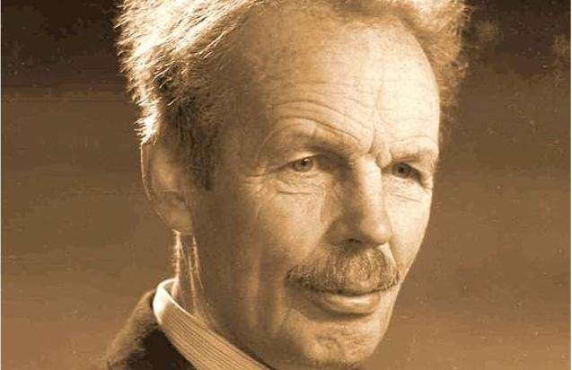
```
]

.pull-right[
Pigou is responsible for the famous distinction between private and  social marginal products and costs and the idea that governments can, via a mixture of taxes and subsidies, correct such market failures: "internalize the  externalities”

]

---

# Working example: pollution from coal

.pull-left[
```{r, out.width = "100%", fig.pos="c", echo = FALSE}
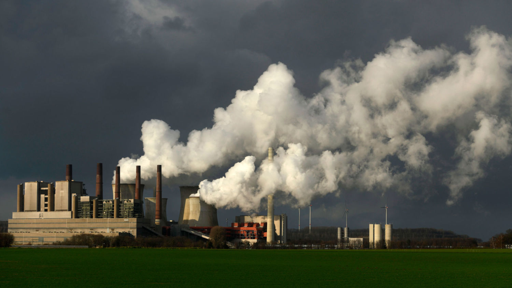
```
]

.pull-right[
When we're discussing these policies you can think about them as regulating emissions from coal-fired power plants

Coal power is one of the largest sources of several of the most harmful air pollutants

]

---

# Coal power: air pollutants

```{r, out.width = "100%", echo = FALSE}
embed_url("https://youtu.be/dlXptCSsdkQ") %>%
  use_align("center")
```

---

# Coal power: air pollutants

.hi[Sulfur dioxide:] Coal plants are the leading source of $SO_2$ pollution

--

- Forms small acidic particulates that can penetrate into human lungs and be  absorbed by the bloodstream
- Causes acid rain which damages crops, forests, soils

Typical plant can emit > 14,000 tons per year

Typical plant with control equipment (e.g. scrubbers) emits 7,000 tons

---

# Coal power: air pollutants

.hi[Nitrogen oxides:] $NO_x$ causes ground-level ozone which harms respiratory systems, damages crops

--

Typical plant can emit > 10,000 tons per year

Typical plant with control equipment (e.g. catalytic tech) emits > 3,000 tons

---

# Coal power: air pollutants

.hi[Particulate matter:] PM is a catch all for small stuff, causes respiratory, cardiovascular issues, death, haze, negative effects on cognition, etc, etc

--

PM is one of the most costly pollutants on the planet

Typical plant can emit > 500 tons per year

Typical plant with control equipment (e.g. baghouses) emits just a few tons a year

---

# Costs of particulate matter

```{r, out.width = "80%", fig.pos="c", echo = FALSE}
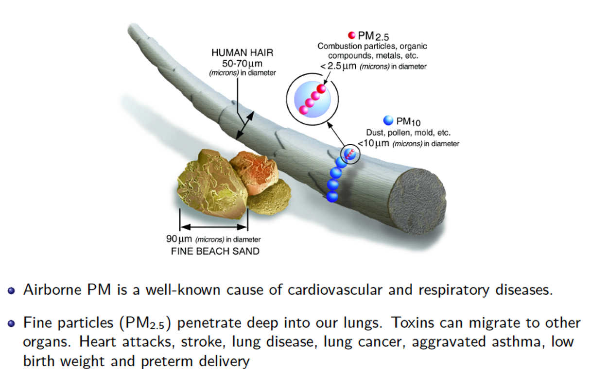
```

---

# Costs of particulate matter

```{r, out.width = "80%", fig.pos="c", echo = FALSE}
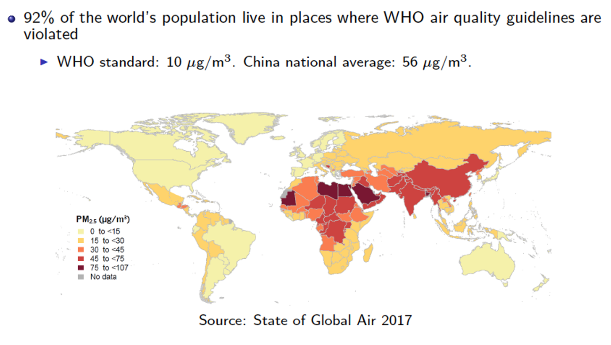
```

---

# Costs of particulate matter

```{r, out.width = "80%", fig.pos="c", echo = FALSE}
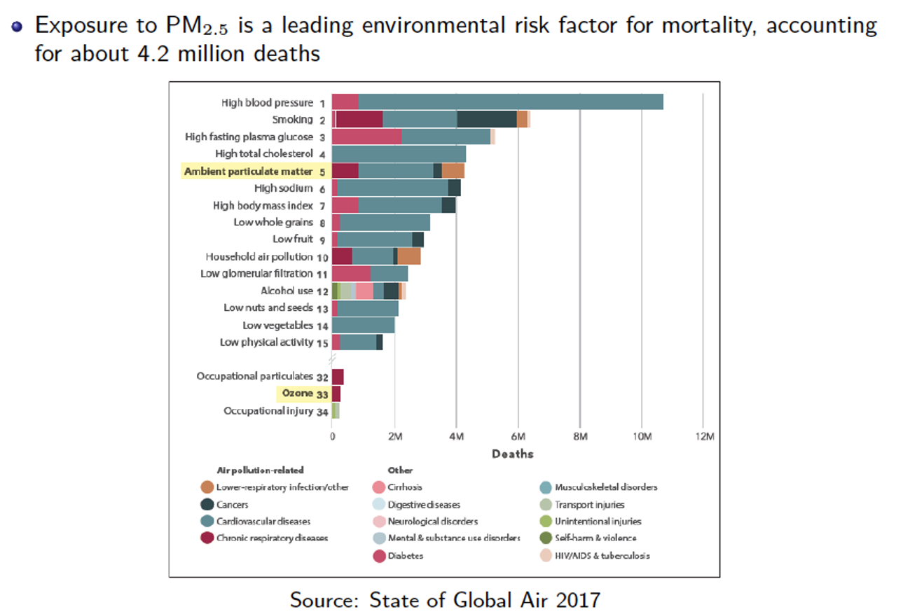
```

---

# Coal power: air pollutants

.hi[Mercury:] Coal plants are responsible for more than half of the U.S. human-caused emissions of mercury

--

Mercury causes brain and heart damage

Just 1/70th of a teaspoon of mercury deposited on a 25-acre lake can make the fish unsafe to eat

Typical plant can emit $>$ 170 pounds per year

Activated carbon injection technology can reduce mercury  emissions by up to 90 percent when combined with baghouses, but is only on 8% of the coal fleet

---

# Coal power: air pollutants 

```{r, echo = F}
embed_url("https://youtu.be/xajjmbJrfEM") %>%
  use_align("center")
```

---

# Coal and health in 1800s Britain

.pull-left[
```{r, out.width = "60%", fig.pos="c", echo = FALSE}
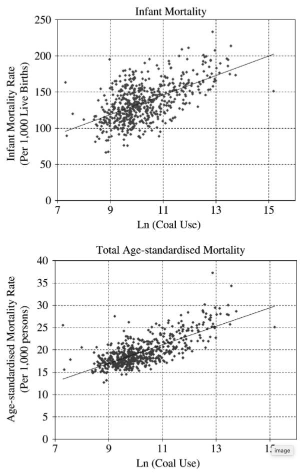
```


]

.pull-right[
Coal production in Britain was STRONGLY associated with mortality

Coal is super bad for your health

Beach and Hanlon (2018)
]

---

# Coal going forward

```{r, echo = F}
embed_url("https://youtu.be/yRcshaSK46M") %>%
  use_align("center")
```

---

# Coal production

Coal power requires a lot of inputs: capital, labor, materials, fuel, air

--

Clean air is the one input they don't have to buy

--

Coal plants avoid 'using' clean air by:
- fuel switching
- installing scrubbers

--

Repeated reductions in emissions require larger and larger increases in capital to hold electricity production fixed (i.e., movement along a convex isoquant)


---

# Setting up our model


.pull-left[
```{r mac, echo = FALSE, fig.show = 'hide', warning = F}
mac <- function(x) 2-2/3*x
ggplot() +
  annotate("text", x = 2, y = 1, label = "MAC", size = 8) +
  stat_function(fun = mac, color = "#ca5670", size = 1.5) +
  annotate("segment", x = 0, xend = 16.67, y = 13.33, yend = 13.33,
           linetype = "dashed", size = 1.5, color = "grey50") +
  annotate("segment", x = 16.67, xend = 16.67, y = 0, yend = 13.33,
           linetype = "dashed", size = 1.5, color = "grey50") +
  theme_minimal() +
  theme(
    legend.position = "none",
    title = element_text(size = 24),
    axis.text.x = element_text(size = 24, color = "#ffffff"), axis.text.y = element_text(size = 24, color = "#ffffff"),
    axis.title.x = element_text(size = 24), axis.title.y = element_text(size = 24),
    panel.grid.minor.x = element_blank(), panel.grid.major.y = element_blank(),
    panel.grid.minor.y = element_blank(), panel.grid.major.x = element_blank(),
    panel.background = element_rect(fill = "#ffffff",colour = NA),
    plot.background = element_rect(fill = "#ffffff",colour = NA),
    axis.line = element_line(colour = "black")
  ) +
  labs(x = "Emissions",
       y = "Capital/$") +
  lims(x = c(0,3), y = c(0,3))

```

`)
]

.pull-right[

We will be working with graphs where we have cost as a function of emissions

First we have the .hi[marginal abatement cost (MAC)] curve

This tells us the cost of abating the next unit of emissions

]


---

# Setting up our model


.pull-left[
`)
]

.pull-right[
The MAC curve is .hi-red[decreasing] in emissions

This means its .hi[increasing] in abatement: its costlier to reduce emissions as the level of emissions goes down

]


---

# Setting up our model


.pull-left[
```{r mac2, echo = FALSE, fig.show = 'hide', warning = F}
mac <- function(x) 2-2/3*x
ggplot() +
  annotate("text", x = 2, y = 1, label = "MAC", size = 8) +
  stat_function(fun = mac, color = "#ca5670", size = 1.5) +
  annotate("segment", x = 0, xend = 16.67, y = 13.33, yend = 13.33,
           linetype = "dashed", size = 1.5, color = "grey50") +
  annotate("segment", x = 16.67, xend = 16.67, y = 0, yend = 13.33,
           linetype = "dashed", size = 1.5, color = "grey50") +
  annotate("text", x = 1.5, y = 2.75, label = "More Abatement", size = 8) +
  geom_segment(aes(x = 2, xend = 1, y = 2.5, yend = 2.5),
    arrow = arrow(length = unit(0.5, "cm")), size = 1)+
  theme_minimal() +
  theme(
    legend.position = "none",
    title = element_text(size = 24),
    axis.text.x = element_text(size = 24, color = "#ffffff"), axis.text.y = element_text(size = 24, color = "#ffffff"),
    axis.title.x = element_text(size = 24), axis.title.y = element_text(size = 24),
    panel.grid.minor.x = element_blank(), panel.grid.major.y = element_blank(),
    panel.grid.minor.y = element_blank(), panel.grid.major.x = element_blank(),
    panel.background = element_rect(fill = "#ffffff",colour = NA),
    plot.background = element_rect(fill = "#ffffff",colour = NA),
    axis.line = element_line(colour = "black")
  ) +
  labs(x = "Emissions",
       y = "Capital/$") +
  lims(x = c(0,3), y = c(0,3))

```

`)
]

.pull-right[

Abatement increases as you move to the left on the graph

This raises marginal abatement cost

]


---

# Setting up our model


.pull-left[
```{r mac3, echo = FALSE, fig.show = 'hide', warning = F}
mac <- function(x) 2-2/3*x
ggplot() +
  annotate("text", x = 2, y = 1, label = "MAC/MEB", size = 8) +
  stat_function(fun = mac, color = "#ca5670", size = 1.5) +
  annotate("segment", x = 0, xend = 16.67, y = 13.33, yend = 13.33,
           linetype = "dashed", size = 1.5, color = "grey50") +
  annotate("segment", x = 16.67, xend = 16.67, y = 0, yend = 13.33,
           linetype = "dashed", size = 1.5, color = "grey50") +
  annotate("text", x = 1.5, y = 2.75, label = "More Emissions", size = 8) +
  geom_segment(aes(x = 1, xend = 2, y = 2.5, yend = 2.5),
    arrow = arrow(length = unit(0.5, "cm")), size = 1)+
  theme_minimal() +
  theme(
    legend.position = "none",
    title = element_text(size = 24),
    axis.text.x = element_text(size = 24, color = "#ffffff"), axis.text.y = element_text(size = 24, color = "#ffffff"),
    axis.title.x = element_text(size = 24), axis.title.y = element_text(size = 24),
    panel.grid.minor.x = element_blank(), panel.grid.major.y = element_blank(),
    panel.grid.minor.y = element_blank(), panel.grid.major.x = element_blank(),
    panel.background = element_rect(fill = "#ffffff",colour = NA),
    plot.background = element_rect(fill = "#ffffff",colour = NA),
    axis.line = element_line(colour = "black")
  ) +
  labs(x = "Emissions",
       y = "Capital/$") +
  lims(x = c(0,3), y = c(0,3))

```

`)
]

.pull-right[

Abatement decreases (emissions increase) as you move to the right on the graph

This decreases marginal abatement cost

You can think of this as alternatively the .hi[marginal emissions benefit (MEB)] from reduced abatement costs

]


---

# Setting up our model


.pull-left[

`)
]

.pull-right[

We can equivalently plot the MAC a different way

Now plot the MAC as a function of abatement

What will the MAC look like?

]


---

# Setting up our model


.pull-left[
```{r mac4, echo = FALSE, fig.show = 'hide', warning = F}
mac <- function(x) 1+2/3*x
ggplot() +
  annotate("text", x = 2, y = 1.75, label = "MAC", size = 8) +
  stat_function(fun = mac, color = "#638ccc", size = 1.5) +
  annotate("segment", x = 0, xend = 16.67, y = 13.33, yend = 13.33,
           linetype = "dashed", size = 1.5, color = "grey50") +
  annotate("segment", x = 16.67, xend = 16.67, y = 0, yend = 13.33,
           linetype = "dashed", size = 1.5, color = "grey50") +
  annotate("text", x = 1.5, y = 3.5, label = "More Abatement", size = 8) +
  geom_segment(aes(x = 1, xend = 2, y = 3.25, yend = 3.25),
    arrow = arrow(length = unit(0.5, "cm")), size = 1)+
  theme_minimal() +
  theme(
    legend.position = "none",
    title = element_text(size = 24),
    axis.text.x = element_text(size = 24, color = "#ffffff"), axis.text.y = element_text(size = 24, color = "#ffffff"),
    axis.title.x = element_text(size = 24), axis.title.y = element_text(size = 24),
    panel.grid.minor.x = element_blank(), panel.grid.major.y = element_blank(),
    panel.grid.minor.y = element_blank(), panel.grid.major.x = element_blank(),
    panel.background = element_rect(fill = "#ffffff",colour = NA),
    plot.background = element_rect(fill = "#ffffff",colour = NA),
    axis.line = element_line(colour = "black")
  ) +
  labs(x = "Abatement",
       y = "Capital/$",
       title = "MAC as a function of abatement") +
  lims(x = c(0,3), y = c(0,4))

```

`)
]

.pull-right[

Abatement decreases (emissions increase) as you move to the right on the graph

This decreases marginal abatement cost

You should eventually be comfortable with either representation of MACs

]

---

# Setting up our model

.pull-left[
```{r mac-md, echo = FALSE, fig.show = 'hide', warning = F}
mac <- function(x) 2 - 2/3*x
md <- function(x) 1
ggplot() +
  annotate("text", x = 2, y = 0.4, label = "MAC", size = 8) +
  annotate("text", x = 2.5, y = 1.2, label = "MD", size = 8) +
  stat_function(fun = mac, color = "#ca5670", size = 1.5) +
  stat_function(fun = md, color = "#638ccc", size = 1.5) +
  annotate("segment", x = 1.5, xend = 1.5, y = 0, yend = 1,
           linetype = "dashed", size = 1.5, color = "grey50") +
  theme_minimal() +
  theme(
    legend.position = "none",
    title = element_text(size = 24),
    axis.text.x = element_text(size = 24), axis.text.y = element_text(size = 24, color = "#ffffff"),
    axis.title.x = element_text(size = 24), axis.title.y = element_text(size = 24),
    panel.grid.minor.x = element_blank(), panel.grid.major.y = element_blank(),
    panel.grid.minor.y = element_blank(), panel.grid.major.x = element_blank(),
    panel.background = element_rect(fill = "#ffffff",colour = NA),
    plot.background = element_rect(fill = "#ffffff",colour = NA),
    axis.line = element_line(colour = "black")
  ) +
  labs(x = "Emissions",
       y = "Capital/$") +
  scale_x_continuous(expand = c(0,0), limits = c(0,3.1), breaks = c(1.5,3), labels = c(expression(E^'*'), expression(E[0]))) +
  scale_y_continuous(expand = c(0,0), limits = c(0,3.1))

```

`)
]

.pull-right[

Next we have the .hi[marginal damage (MD)] curve

This gives us the external cost of the next unit of emissions

It is also the social cost since we assume the private cost of emitting is zero

]


---

# Setting up our model


.pull-left[
`)
]

.pull-right[

How do we think about this? One of two ways

1. MAC is the social marginal benefit of emissions, MD is the social marginal cost of emissions
2. MAC is the social marginal cost of abatement, MD is the social marginal benefit of abatement

These are identical interpretations

]

---

# The unregulated/free market


.pull-left[
`)
]

.pull-right[

What is the unregulated / free market outcome?

]

---

# The unregulated/free market


.pull-left[
`)
]

.pull-right[

What is the unregulated / free market outcome?

Think about the firm's problem in terms of the marginal benefits and costs of emissions

]


---

# The unregulated/free market


.pull-left[
`)
]

.pull-right[

The PMB of emissions is given by the MAC (avoided abatement cost, an opportunity cost)

The PMC of emissions without regulation is....zero

So firms set emissions where: PMB=PMC $\rightarrow$ MAC = 0

Free market outcome is $E=E_0$

]


---

# The unregulated/free market


.pull-left[
`)
]

.pull-right[

But, if we could get all the victims of pollution together, they are willing to pay up to $MD$ in order to get the firm to abate the pollution

The MAC for eliminating the first unit of emissions is $\approx 0$


]


---

# The cost of no regulation

.pull-left[
```{r no-reg-dwl, echo = FALSE, fig.show = 'hide', warning = F}
mac <- function(x) 2 - 2/3*x
md <- function(x) 1
dwl <- tibble(x = c(1.5, 3, 3),
                     y = c(1, 1, 0))
ggplot() +
  geom_polygon(data = dwl, aes(x = x, y = y), fill = "red", alpha = 0.2) +
  annotate("text", x = 2, y = 0.4, label = "MAC", size = 8) +
  annotate("text", x = 2.5, y = 1.2, label = "MD", size = 8) +
  annotate("text", x = 2.5, y = 0.7, label = "DWL", size = 8) +
  stat_function(fun = mac, color = "#ca5670", size = 1.5) +
  stat_function(fun = md, color = "#638ccc", size = 1.5) +
  annotate("segment", x = 1.5, xend = 1.5, y = 0, yend = 1,
           linetype = "dashed", size = 1.5, color = "grey50") +
  theme_minimal() +
  theme(
    legend.position = "none",
    title = element_text(size = 24),
    axis.text.x = element_text(size = 24), axis.text.y = element_text(size = 24, color = "#ffffff"),
    axis.title.x = element_text(size = 24), axis.title.y = element_text(size = 24),
    panel.grid.minor.x = element_blank(), panel.grid.major.y = element_blank(),
    panel.grid.minor.y = element_blank(), panel.grid.major.x = element_blank(),
    panel.background = element_rect(fill = "#ffffff",colour = NA),
    plot.background = element_rect(fill = "#ffffff",colour = NA),
    axis.line = element_line(colour = "black")
  ) +
  labs(x = "Emissions",
       y = "Capital/$") +
  scale_x_continuous(expand = c(0,0), limits = c(0,3.1), breaks = c(1.5,3), labels = c(expression(E^'*'), expression(E[0]))) +
  scale_y_continuous(expand = c(0,0), limits = c(0,3.1))

```

`)
]

.pull-right[

People are willing to pay to eliminate emissions until $E=E^*$

If we add up all of these potential surpluses from Pareto improving trades, we get our DWL from the externality

]

---

class: inverse, center, middle
name: what_is_enviro

# Command and control

<html><div style='float:left'></div><hr color='#EB811B' size=1px width=796px></html>

---

# Command and control

How do we recover that surplus?

--

One way is to use .hi[command and control] policy (aka a technology standard)

--

Command and control requires firms all employ some particular abatement or emissions control technology (i.e., “scrubbers”—devices that  pull out bad emissions before they enter smokestack)

--

Common in the early days of implementing the Clean Air Act of 1970

--

Called “command and control” because a government agency  (e.g. the EPA) imposes (e.g. commands) a common control  technology standard on all firms

---

# Command and control

>> Thirty Years ago, the economists at Resources for the Future  were pushing the idea of pollution taxes. We lawyers at the  NRDC (Natural Resources Defense Council) thought they were  nuts, and feared that they would derail command-and-control  measures like the Clean Air Act, so we opposed them. Looking  back, I’d have to say this was the single biggest failure in  environmental management – not getting the prices right…”

> Gus Speth, 2002. Dean, Yale School of Forestry and Environmental  Studies. Former head of World Resources Institute and co-founder of  NRDC

---

# Brief aside

If you're interested in doing cool real world policy work on the environment, RFF hires paid interns every summer and RAs on a 1-2 year basis, RA positions there are basically a stepping stone into top graduate programs

Half of the environmental economists at Dyson have current/prior affiliations with RFF

```{r, out.width = "50%", fig.pos="c", echo = FALSE}
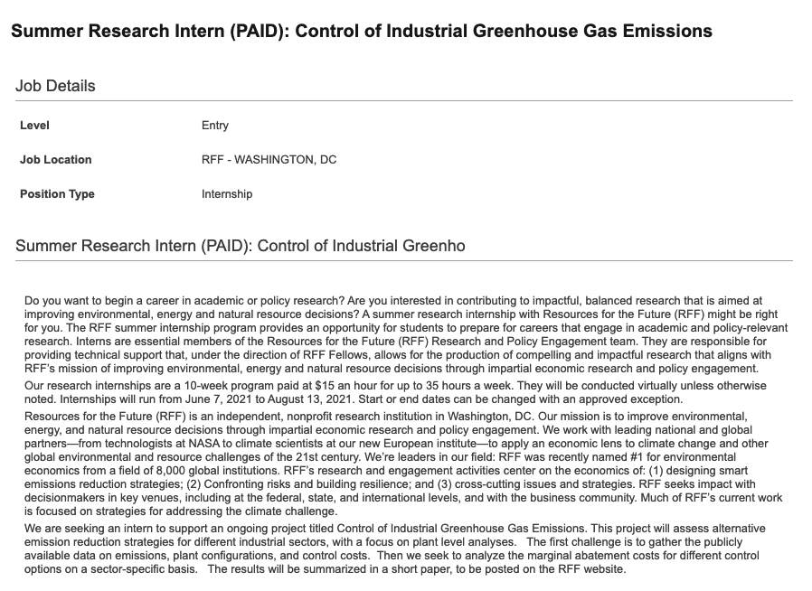
```

---

# Command and control

What are some CC policy examples?

--

1. Coal plants were required to install scrubbers with 90% efficiency ratings until 1990
--

2. In the 1970s the US mandated catalytic converters in cars
--

3. The Clean Air Act mandates that the 'Best Available Control Technology' be used by emission sources (often not clearly defined)

---

# Command and control

.pull-left[
```{r, out.width = "100%", fig.pos="c", echo = FALSE}
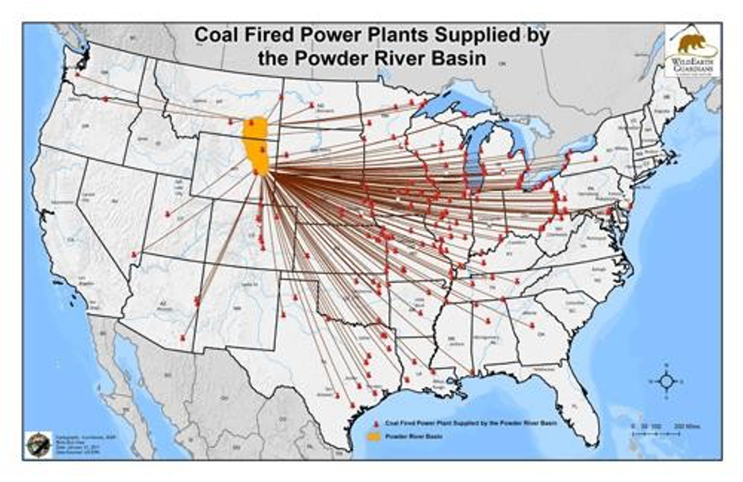
```
]

.pull-right[
CC policies are nice because they have low administrative costs (do you have this technology installed or not?)

They also have significant costs in that they lead to distortions
]

---

# Command and control

.pull-left[
```{r, out.width = "100%", fig.pos="c", echo = FALSE}

```
]

.pull-right[
Coal from WY has much lower sulfur content than coal from WV

Ideally, if we want to reduce sulfur dioxide emissions, we would like coal plants to use more low-sulfur WY coal

]

---

# Command and control

```{r, out.width = "100%", fig.pos="c", echo = FALSE}
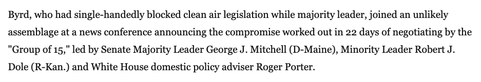
```

Senator Byrd from WV single-handledly blocked legislation for sulfur regulations and pushed for scrubber mandates so that high-sulfur WV coal could compete with low-sulfur WY coal

---

# Command and control

What other drawbacks are there to CC policies?

--

CC policies can discourage firms from investing in newer and better abatement technologies

If they are in compliance with the policy, why do any better?

--

The government is picking winners and losers in technology

--

Current firms can “capture” regulatory board and require  technologies that are easy to implement, or may serve as a barrier-to-entry to new competition 


---

class: inverse, center, middle
name: what_is_enviro

# Emission standards

<html><div style='float:left'></div><hr color='#EB811B' size=1px width=796px></html>

---

# Emission standards

An emission standard $\bar{E}$ mandates a maximum amount of emissions $E \leq \bar{E}$

--

You can think about it as a bubble over multiple plants/emission sources owned by each firm, the firm can decide how to allocate emissions across plants

--

Importantly: does .hi[not] mandate a specific technology

> On March 16, 2011 EPA proposes Mercury and Air Toxic Standards, the first nationwide limits on coal-fired power plant emissions of mercury. Specifically, the proposal aims to reduce emissions from new and existing coal and oil-fired EGUs by 91% from current levels through national quantity-based, numerical emission limits on mercury releases.


---

# Emission standards

What is the socially optimal standard?

--

The $\bar{E}$ that minimizes total social cost: abatement cost + damages

--

Let $C(E)$ be abatement cost of emissions level $E$ and $D(E)$ be damages at $E$

--

We assume that: $C'(E) < 0 \leftrightarrow \underbrace{-C'(E)}_{\text{MAC}} > 0$ and $\underbrace{D'(E)}_{\text{MD}} > 0$

---

# Emission standards

$-C'(E)$ is the MAC because we are decreasing emissions by 1, ${dE \over dA} = -1$:
$$\underbrace{\frac{d C(E)}{dA}}_{\text{MAC}} = \frac{d C(E)}{dE}{dE \over dA} = -\frac{d C(E)}{dE} = -C'(E)$$

--

We know abatement costs are decreasing in emissions and damages are increasing in emissions

--

Next: how do the firm and regulator make decisions?


---

# Emission standards: firm

The firm problem: minimize the cost of satisfying the policy:
$$ \min_E C(E)  \,\,\, \text{subject to: } \,\,\, E \leq \bar{E}$$


--

If $C(E)$ is decreasing in $E$, but $E$ is restricted to be below $\bar{E}$....

--

The firm optimally selects $E = \bar{E}$

--

Next we have the regulator's problem

---

# Emission standards: regulator

The regulator's problem is to minimize the social cost of emissions
$$\min_{\bar{E}} \left\{C(E) + D(E)\right\} \,\,\, \text{subject to: } \,\,\, \underbrace{E = \bar{E}}_{\text{firm's choice}}$$

--

The optimal choice of $\bar{E}$ is governed by the first-order condition:
$$-C'(\bar{E}) = D'(\bar{E})$$

The regulator chooses $\bar{E}$ to be the emission level where MAC = MD: $\bar{E} = E^*$


---

# Emission standards: graphical

.pull-left[
```{r standard, echo = FALSE, fig.show = 'hide', warning = F}
mac <- function(x) 2 - 2/3*x
md <- function(x) 1
ab_cost <- tibble(x = c(1.5, 1.5, 3),
                     y = c(1, 0, 0))
ggplot() +
  geom_polygon(data = ab_cost, aes(x = x, y = y), fill = "red", alpha = 0.2) +
  annotate("text", x = .3, y = 2, label = "MAC", size = 8) +
  annotate("text", x = 2.5, y = 1.2, label = "MD", size = 8) +
  annotate("text", x = 1.7, y = 2.5, label = expression(bar(E)), size = 8) +
  annotate("text", x = 2.15, y = .25, label = "B", size = 8) +
  stat_function(fun = mac, color = "#ca5670", size = 1.5) +
  stat_function(fun = md, color = "#638ccc", size = 1.5) +
  annotate("segment", x = 1.5, xend = 1.5, y = 0, yend = 1,
           linetype = "dashed", size = 1.5, color = "grey50") +
  annotate("segment", x = 1.5, xend = 1.5, y = 0, yend = 3,
           linetype = "solid", size = 1.5, color = "#000000") +
  theme_minimal() +
  theme(
    legend.position = "none",
    title = element_text(size = 24),
    axis.text.x = element_text(size = 24), axis.text.y = element_text(size = 24, color = "#ffffff"),
    axis.title.x = element_text(size = 24), axis.title.y = element_text(size = 24),
    panel.grid.minor.x = element_blank(), panel.grid.major.y = element_blank(),
    panel.grid.minor.y = element_blank(), panel.grid.major.x = element_blank(),
    panel.background = element_rect(fill = "#ffffff",colour = NA),
    plot.background = element_rect(fill = "#ffffff",colour = NA),
    axis.line = element_line(colour = "black")
  ) +
  labs(x = "Emissions",
       y = "Capital/$") +
  scale_x_continuous(expand = c(0,0), limits = c(0,3.1), breaks = c(1.5,3), labels = c(expression(E^'*'), expression(E[0]))) +
  scale_y_continuous(expand = c(0,0), limits = c(0,3.1))

```

`)
]

.pull-right[

The optimal standard restricts emissions to be $\bar{E} = E^*$

You can think of this as the regulator setting a tax equal to 0 on the first $\bar{E}$ units of emissions, and a tax of $\infty$ on each unit after


]


---

# Emission standards: graphical

.pull-left[
`)
]

.pull-right[


Firms will then only emit $\bar{E}$ since emitting any more has infinite cost, emitting any less incurs extra abatement cost

Firms total abatement cost under the standard is equal to the red area (B)

]


---

# Emission standards: graphical

.pull-left[
`)
]

.pull-right[

The previous example assumed firms couldn't lie/cheat and **not** abate at all

Suppose that they can, but they are inspected with probability $p$

If they are caught cheating, they pay a fine $F$

What determines whether the firm cheats?

]


---

# Emission standards: graphical

.pull-left[
`)
]

.pull-right[

Firm cheats if the benefits are greater than the expected costs

Benefits: $B$

Expected costs: $pF$

Cheat if $B \geq pF$

This tells us how big of a fine or how often inspections need to be to stop cheating

]

---

# Tailpipe emission standards

With the passage of the Clean Air Act (CAA) in 1970, the EPA began regulating nitrogen oxide (NOx) emissions from light duty vehicles

--

CAA was amended in 1990, and new emission standards (in grams/mile) were set for four additional smog pollutants
- Non-methane organic gases (NMOG)
- Carbon monoxide (CO)
- Particulate matter (PM)
- Formaldehyde (HCHO)

---

# Tailpipe emission standards

The amendments also gave California authority to pass its own stricter vehicle emission standards, due to its particularly worse air pollution issues

--

EPA must approve CA’s stricter standards

States may choose to follow either the federal or California standards

--

Smog pollution standards were initially different for cars and light duty trucks

--

In 2000, the Tier 2 program established one set of standards for both

--

Currently, Tier 3 standards are being phased in

---

# Tailpipe emission standards

<center>
```{r, out.width = "70%", fig.pos="c", echo = FALSE}
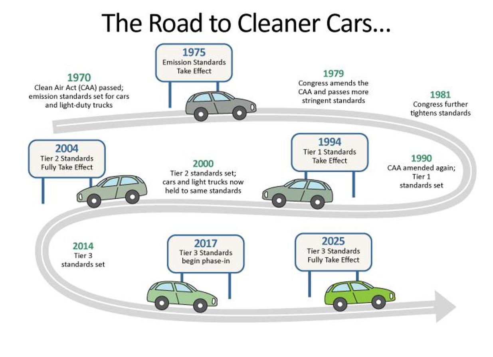
```
</center>

---

# Tailpipe emission standards

<center>
```{r, out.width = "90%", fig.pos="c", echo = FALSE}
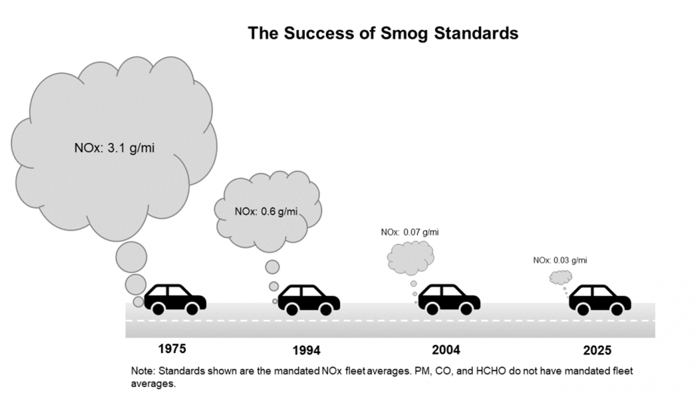
```
</center>
