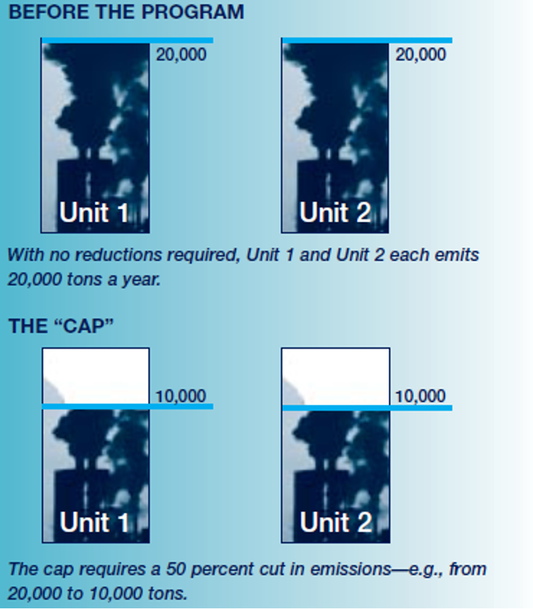
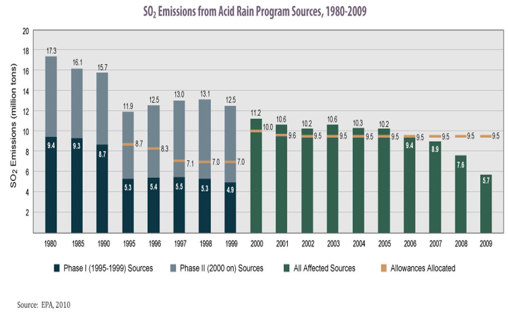
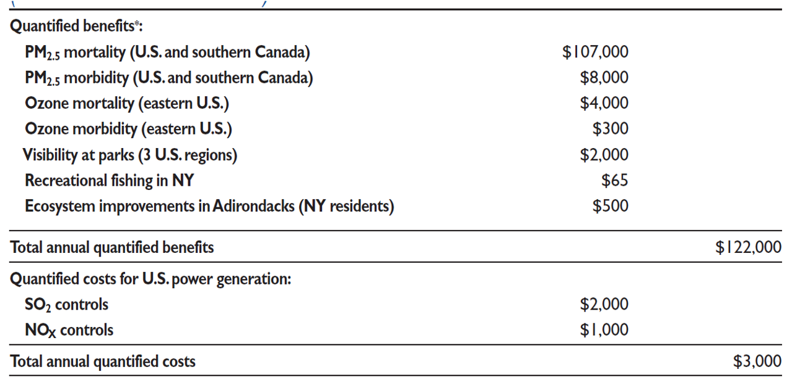

exclude: true
```{r setup}
if (!require("pacman")) install.packages("pacman")
pacman::p_load(
  tidyverse, xaringanExtra, rlang, patchwork, nycflights13, tweetrmd, vembedr
)
options(htmltools.dir.version = FALSE)
knitr::opts_hooks$set(fig.callout = function(options) {
  if (options$fig.callout) {
    options$echo <- FALSE
  }
knitr::opts_chunk$set(echo = TRUE, fig.align="center")
  options
})
```
```{r xaringanExtra, echo = FALSE}
xaringanExtra::use_xaringan_extra(c("tile_view", "panelset", "webcam"))

```
```{r echo=FALSE}
xaringanExtra::style_panelset(panel_tab_color_active = "red")
```

---

# Roadmap

1. How do tradable permit systems work in theory and in the real world?
2. What happens under a tradable permit system?


---

class: inverse, center, middle
name: tradable permits

# Tradable permits

<html><div style='float:left'></div><hr color='#EB811B' size=1px width=796px></html>

---

# Tradable permits

How do tradable permit systems work?<sup>1</sup>

.footnote[
<sup>1</sup> Tradable permit systems are also called cap and trade systems.
]

--

First, recall a regular emission standard: we set $\bar{E}$ at the point where MAC = MD

--

This is easy with one firm, but what if we have several, or hundreds?

---

# Optimal policy with multiple firms

.pull-left[
```{r multifirm, echo = FALSE, fig.show = 'hide', warning = F}
mac <- function(x) 2 - 2/3*x
mac2 <- function(x) 3 - x
md <- function(x) 1
ggplot() +
  annotate("text", x = .3, y = 2, label = expression(MAC[1]), size = 8) +
  annotate("text", x = .3, y = 3, label = expression(MAC[2]), size = 8) +
  annotate("text", x = 1.25, y = 2.5, label = "MD", size = 8) +
  stat_function(fun = mac2, color = "#000000", size = 1.5) +
  stat_function(fun = mac, color = "#ca5670", size = 1.5) +
  stat_function(fun = md, color = "#638ccc", size = 1.5) +
  annotate("segment", x = 1.5, xend = 1.5, y = 0, yend = 1,
           linetype = "dashed", size = 1.5, color = "grey50") +
  annotate("segment", x = 2, xend = 2, y = 0, yend = .99,
           linetype = "dashed", size = 1.5, color = "#000000") +
  theme_minimal() +
  theme(
    legend.position = "none",
    title = element_text(size = 24),
    axis.text.x = element_text(size = 24), axis.text.y = element_text(size = 24, color = "#eeeeee"),
    axis.title.x = element_text(size = 24), axis.title.y = element_text(size = 24),
    panel.grid.minor.x = element_blank(), panel.grid.major.y = element_blank(),
    panel.grid.minor.y = element_blank(), panel.grid.major.x = element_blank(),
    panel.background = element_rect(fill = "#eeeeee",colour = NA),
    plot.background = element_rect(fill = "#eeeeee",colour = NA),
    axis.line = element_line(colour = "black")
  ) +
  labs(x = "Emissions",
       y = "Capital/$") +
  scale_x_continuous(expand = c(0,0), limits = c(0,3.1), breaks = c(1.5,2,3), labels = c(expression(E[1]^'*'), expression(E[2]^'*'), expression(E[0]))) +
  scale_y_continuous(expand = c(0,0), limits = c(0,3.1))

```

`)
]

.pull-right[

Firm #2 is 'dirty': has higher MAC

Firm #1 is 'clean': has lower MAC

If we use a regular emission standard: it has to be firm-specific!

Mandate $E^*_1$ for 1 and $E^*_2$ for 2

This requires .hi[a lot] of info and political capital on behalf of the regulator

]


---

# Optimal policy with multiple firms

.pull-left[
```{r multi-tax, echo = FALSE, fig.show = 'hide', warning = F}
mac <- function(x) 2 - 2/3*x
mac2 <- function(x) 3 - x
md <- function(x) 1
ggplot() +
  annotate("text", x = .3, y = 2, label = expression(MAC[1]), size = 8) +
  annotate("text", x = .3, y = 3, label = expression(MAC[2]), size = 8) +
  annotate("text", x = 1.25, y = 2.5, label = "MD", size = 8) +
  stat_function(fun = mac2, color = "#000000", size = 1.5) +
  stat_function(fun = mac, color = "#ca5670", size = 1.5) +
  stat_function(fun = md, color = "#638ccc", size = 1.5) +
  annotate("text", x = 2.5, y = 1.15, label = expression(tau), size = 8) +
  annotate("segment", x = 1.5, xend = 1.5, y = 0, yend = 1,
           linetype = "dashed", size = 1.5, color = "grey50") +
  annotate("segment", x = 2, xend = 2, y = 0, yend = .99,
           linetype = "dashed", size = 1.5, color = "#000000") +
  annotate("segment", x = 0, xend = 3, y = 1.05, yend = 1.05,
           linetype = "longdash", size = 1.5, color = "red") +
  theme_minimal() +
  theme(
    legend.position = "none",
    title = element_text(size = 24),
    axis.text.x = element_text(size = 24), axis.text.y = element_text(size = 24, color = "#eeeeee"),
    axis.title.x = element_text(size = 24), axis.title.y = element_text(size = 24),
    panel.grid.minor.x = element_blank(), panel.grid.major.y = element_blank(),
    panel.grid.minor.y = element_blank(), panel.grid.major.x = element_blank(),
    panel.background = element_rect(fill = "#eeeeee",colour = NA),
    plot.background = element_rect(fill = "#eeeeee",colour = NA),
    axis.line = element_line(colour = "black")
  ) +
  labs(x = "Emissions",
       y = "Capital/$") +
  scale_x_continuous(expand = c(0,0), limits = c(0,3.1), breaks = c(1.5,2,3), labels = c(expression(E[1]^'*'), expression(E[2]^'*'), expression(E[0]))) +
  scale_y_continuous(expand = c(0,0), limits = c(0,3.1))

```

`)
]

.pull-right[

Regulating multiple heterogeneous firms with a tax is easy:

Since firms select MAC = $\tau$, as long as we set $\tau = MD$ we can achieve the efficient outcome (MAC = MD) without knowing anything about the firms!

]


---

# Optimal policy with multiple firms

.pull-left[
`)
]

.pull-right[

The big problem is political feasibility

Firms resist taxation because they have to pay a fine for each unit of emissions

Tradable permit systems are a way to make emission standards flexible enough to handle heterogeneous firms

]


---

# Tradable permit systems

So how do these systems make standards more flexible?

--

They allow firms to trade their emission allowances

--

E.g. if firms are restricted to $\bar{E}_1$ and $\bar{E}_2$, we can allow the firms to trade

--

If firm 1 sells an allowance/permit to firm 2, their new restrictions are: $\bar{E}_1 - 1$ and $\bar{E}_2 + 1$

---

# Tradable permit systems: example

The US Acid Rain Program is the classic example

--

Permit = license to create 1 ton of SO2

--

Phase I (1995-2000):  
- 6.3 million permits issued per year
- affected 263 generating units at 110 dirtiest power plants

Phase II (2000+):  
- 9 million permits issued per year
- affects all power plants over some minimum size

---

# Tradable permit systems: example

<center>
```{r, out.width = "40%", fig.pos="c", echo = FALSE}

```
</center>

---

# Tradable permit systems: example

<center>
```{r, out.width = "70%", fig.pos="c", echo = FALSE}
knitr::include_graphics("files/05-cnp2.png")
```
</center>

---

# Tradable permit systems: example

<center>
```{r, out.width = "80%", fig.pos="c", echo = FALSE}

```
</center>

---

# Tradable permit systems: example

<center>
```{r, out.width = "80%", fig.pos="c", echo = FALSE}
knitr::include_graphics("files/05-arp2.png")
```
</center>

---

# Tradable permit systems: example

<center>
```{r, out.width = "100%", fig.pos="c", echo = FALSE}

```
</center>


---

# Tradable permits: graphical

.pull-left[
```{r permits, echo = FALSE, fig.show = 'hide', warning = F}
mac <- function(x) 2 - 2/3*x
mac2 <- function(x) 3 - x
ggplot() +
  annotate("text", x = .3, y = 2, label = expression(MAC[1]), size = 8) +
  annotate("text", x = .3, y = 3, label = expression(MAC[2]), size = 8) +
  stat_function(fun = mac2, color = "#000000", size = 1.5) +
  stat_function(fun = mac, color = "#ca5670", size = 1.5) +
  annotate("segment", x = 1.5, xend = 1.5, y = 0, yend = 3,
           linetype = "longdash", size = 1.5, color = "black") +
  theme_minimal() +
  theme(
    legend.position = "none",
    title = element_text(size = 24),
    axis.text.x = element_text(size = 24), axis.text.y = element_text(size = 24, color = "#eeeeee"),
    axis.title.x = element_text(size = 24), axis.title.y = element_text(size = 24),
    panel.grid.minor.x = element_blank(), panel.grid.major.y = element_blank(),
    panel.grid.minor.y = element_blank(), panel.grid.major.x = element_blank(),
    panel.background = element_rect(fill = "#eeeeee",colour = NA),
    plot.background = element_rect(fill = "#eeeeee",colour = NA),
    axis.line = element_line(colour = "black")
  ) +
  labs(x = "Emissions",
       y = "Capital/$") +
  scale_x_continuous(expand = c(0,0), limits = c(0,3.1), breaks = c(1.5), labels = c(expression(bar(E)/2))) +
  scale_y_continuous(expand = c(0,0), limits = c(0,3.1))

```

`)
]

.pull-right[

Suppose we want to limit to $\bar{E}$ total emissions so each firm gets $\bar{E}/2$ permits

.hi[This can't be efficient] (i.e. maximize social welfare given some MD curve)

.hi-red[It also can't be cost-effective:] it doesn't minimize the cost of achieving $\bar{E}$ total emissions

]

---

# Tradable permits: cost-effectiveness

For cost-effectiveness, we need total costs to be minimized for achieving a given level of emissions:
$$\min_{E_1, E_2} C(E_1) + C(E_2) \,\,\, \text{subject to: } E_1 + E_2 = \bar{E}$$

This is the same problem as:
$$\min_{E_1, E_2} C(E_1) + C(\bar{E} - E_1)$$

which has a solution where:
$$-C'(E_1^*) = -C'(\bar{E} - E^*_1)$$

---

# Tradable permits: cost-effectiveness

Cost-effectiveness requires:
$$-C'(E_1^*) = -C'(\bar{E} - E^*_1) \leftrightarrow MAC_1 = MAC_2$$

That marginal abatement costs are equal across all 

--

If firms have different MAC curves, giving them the same amount of emissions/permits cannot be optimal

--

How do we fix this?

--

Let them trade the permits


---

# Tradable permits: graphical

.pull-left[
```{r permits-dwl, echo = FALSE, fig.show = 'hide', warning = F}
mac <- function(x) 2 - 2/3*x
mac2 <- function(x) 3 - x
dwl <- tibble(x = c(1.5, 3.5/2, 3.5/2),
                     y = c(1, 1, 2-2/3*(3.5/2)))
dwl2 <- tibble(x = c(3.5/2, 2, 3.5/2),
                     y = c(1, 1, 3-3.5/2))
ggplot() +
  geom_polygon(data = dwl, aes(x = x, y = y), fill = "red", alpha = 0.5) +
  geom_polygon(data = dwl2, aes(x = x, y = y), fill = "red", alpha = 0.5) +
  annotate("text", x = .3, y = 2, label = expression(MAC[1]), size = 8) +
  annotate("text", x = .3, y = 3, label = expression(MAC[2]), size = 8) +
  stat_function(fun = mac2, color = "#638ccc", size = 1.5) +
  stat_function(fun = mac, color = "#ca5670", size = 1.5) +
  annotate("segment", x = 3.5/2, xend = 3.5/2, y = 0, yend = 3,
           linetype = "longdash", size = 1.5, color = "black") +
  annotate("segment", x = 1.5, xend = 1.5, y = 0, yend = 1,
           linetype = "dashed", size = 1.5, color = "grey50") +
  annotate("segment", x = 2, xend = 2, y = 0, yend = 1,
           linetype = "dashed", size = 1.5, color = "grey50") +
  annotate("segment", x = 0, xend = 3, y = 1, yend = 1,
           linetype = "dotted", size = 1.5, color = "black") +
  theme_minimal() +
  theme(
    legend.position = "none",
    title = element_text(size = 24),
    axis.text.x = element_text(size = 24), axis.text.y = element_text(size = 24, color = "#eeeeee"),
    axis.title.x = element_text(size = 24), axis.title.y = element_text(size = 24),
    panel.grid.minor.x = element_blank(), panel.grid.major.y = element_blank(),
    panel.grid.minor.y = element_blank(), panel.grid.major.x = element_blank(),
    panel.background = element_rect(fill = "#eeeeee",colour = NA),
    plot.background = element_rect(fill = "#eeeeee",colour = NA),
    axis.line = element_line(colour = "black")
  ) +
  labs(x = "Emissions",
       y = "Capital/$") +
  scale_x_continuous(expand = c(0,0), limits = c(0,3.1), breaks = c(1.5, 3.5/2,2 ), labels = c(expression(E[1]), expression(bar(E)/2), expression(E[2]))) +
  scale_y_continuous(expand = c(0,0), limits = c(0,3.1))

```

`)
]

.pull-right[

We can reduce costs by increasing emissions at high MAC firm 2 and decreasing emissions at low MAC firm 1 until they are equal

This allows us to recover DWL equal to the red area

The red area is the difference in areas under MAC2 and MAC1 over the range of emissions changes

]


---

# Tradable permits: graphical

.pull-left[
```{r permits-reallo, echo = FALSE, fig.show = 'hide', warning = F}
mac <- function(x) 2 - 2/3*x
mac2 <- function(x) 3 - x
ggplot() +
  annotate("text", x = .3, y = 2, label = expression(MAC[1]), size = 8) +
  annotate("text", x = .3, y = 3, label = expression(MAC[2]), size = 8) +
  stat_function(fun = mac2, color = "#638ccc", size = 1.5) +
  stat_function(fun = mac, color = "#ca5670", size = 1.5) +
  annotate("segment", x = 3.5/2, xend = 3.5/2, y = 0, yend = 3,
           linetype = "longdash", size = 1.5, color = "black") +
  annotate("segment", x = 0, xend = 3, y = 1, yend = 1,
           linetype = "dotted", size = 1.5, color = "black") +
  annotate("segment", x = 0, xend = 3.5/2, y = 2 - 2/3*3.5/2, yend = 2 - 2/3*3.5/2,
           linetype = "dashed", size = 1.5, color = "grey50") +
  annotate("segment", x = 0, xend = 3.5/2, y = 3-3.5/2, yend = 3-3.5/2,
           linetype = "dashed", size = 1.5, color = "grey50") +
  annotate("point", x = 3.5/2, y = 3-3.5/2, size = 8, color = "#638ccc") +
  annotate("point", x = 3.5/2, y = 2 - 2/3*3.5/2, size = 8, color = "#ca5670") +
  annotate("segment", x = 0, xend = 3, y = 1, yend = 1,
           linetype = "dotted", size = 1.5, color = "black") +
  theme_minimal() +
  theme(
    legend.position = "none",
    title = element_text(size = 24),
    axis.text.x = element_text(size = 24), axis.text.y = element_text(size = 24),
    axis.title.x = element_text(size = 24), axis.title.y = element_text(size = 24),
    panel.grid.minor.x = element_blank(), panel.grid.major.y = element_blank(),
    panel.grid.minor.y = element_blank(), panel.grid.major.x = element_blank(),
    panel.background = element_rect(fill = "#eeeeee",colour = NA),
    plot.background = element_rect(fill = "#eeeeee",colour = NA),
    axis.line = element_line(colour = "black")
  ) +
  labs(x = "Emissions",
       y = "Capital/$") +
  scale_x_continuous(expand = c(0,0), limits = c(0,3.1), breaks = c(3.5/2), labels = c(expression(bar(E)/2))) +
  scale_y_continuous(expand = c(0,0), limits = c(0,3.1), breaks = c(2 - 2/3*3.5/2, 1, 3 - 3.5/2), labels = c("5/6", "1", "5/4"))

```
`)
]

.pull-right[

We want to equalize MACs for cost-effectiveness, but does the permit market cause this to happen?

Firm 2 is willing to pay a price up to the blue point (5/4) to be able to emit 1 more unit

Firm 1 can abate 1 more unit at cost equal to the red point (5/6)

]


---

# Tradable permits: graphical

.pull-left[
`)
]

.pull-right[

Firm 2 can buy the right to emit 1 unit of pollution from firm 1 for anywhere between 5/6 - 5/4 and .hi[both will be better off]

These trades can be done until the MACs are equal at a value of 1

This would be the prevailing permit price in a tradable permit system

]

---

# Tradable permits: firm

We can also see this result mathematically

--

Suppose there is a permit price $p$ in the competitive tradable permit market

--

Firms are price-takers

--

First lets set up the firm problem: they want to minimize the cost of satisfying the policy

---

# Tradable permits: firm

The firm's problem is then:
$$ \min_E C(E) + p E$$

The firm's first-order condition to minimize costs is:
$$-C'(E^*) = p$$

--

The firm minimizes costs by choosing emissions $E^*$ so that its MAC equals the permit price

---

# Tradable permits: cost-effectiveness

This makes sense!

--

The permit price is the MC of emitting, the MAC is the marginal benefit of emitting (reduced abatement cost)

--

Costs are minimized when these two things are equal

--

What else does this do?

--

If firms all set their MACs equal to $p$ then all their MACs are equal to one another, .hi[we have cost-effectiveness:]
$$-C_1'(E^*_1) = -C_2'(E^*_2) = \dots = -C_N'(E^*_N) = p$$


---

# Tradable permits: cost-effectiveness

Tradable permit systems are .hi[always] cost-effective: whatever emissions limit you set, it will be achieved at least-cost<sup>1</sup>
.footnote[
<sup>1</sup> Try to see if you can use the same mathematical derivation to show that taxes are also always cost-effective.
]

--

This does not mean that it is necessarily efficient!

---

# Tradable permits: efficiency

For efficiency, we also need MAC = MD

--

To keep things simple suppose MD is constant: $MD = d$<sup>1</sup>
.footnote[
<sup>1</sup> Everything still works if it isn't, but constant MD allows us to work through the intuition without worrying about adding up everyone's emissions.
]

--

If we set $\bar{E}$ such that $p = d$, then we also have efficiency


--

Let's see why

---

# Tradable permits: efficiency

Suppose we set $\bar{E}$ to be the sum of the efficient level of emissions across all firms $\sum_i E^*_i$, where $E^*_i$ is where $MAC_i = d$

--

Firms will trade until their MACs are all equal

--

Since there's only $\bar{E} = E^*$ permits, we already know MACs are equal at $\{E^*_1, \dots, E^*_N\}$ where $\sum_i E^*_i = E^*_i$ 

This is where their MACs all equal $d$ and each other

--

We also know in the permit market equilibrium we have $MAC = p$, so this means that we must have $p = d = MD$!

---

# Tradable permits in practice

Knowing MD is often difficult in practice

--

Tradable permit systems are nice because we can just let politicians choose a $\bar{E}$ that is politically feasible, and then the permit market ensures that we get the associated emissions reductions at least-cost

--

What often happens in practice is $\bar{E}$ starts high, giving us a low $p$, and then $\bar{E}$ gets ratcheted down over time

---

# Political economy of permits

Firms are often more willing to accept a higher $p$ than $\tau$ because they are often endowed with (some) permits for free

--

This means that *in practice*, we might expect to get greater emissions reductions under a permit system than a tax because of these political economy reasons

--

This is one of the key reasons the 1990 CAA amendments were able to be passed


---

# Permit systems and heterogeneous MDs

So far we assumed all firms faced the same MD

--

This is true for things like climate change, less true for things like $SO_2$ or $NO_x$

--

How well do permit systems perform with heterogeneous MD?