exclude: true
```{r setup, include = FALSE}
if (!require("pacman")) install.packages("pacman")
pacman::p_load(
  tidyverse, xaringanExtra, rlang, patchwork, nycflights13
)
source("R/video_helpers.R")
options(htmltools.dir.version = FALSE)
# Keep R diagnostics out of the projected slides.
knitr::opts_chunk$set(warning = FALSE, message = FALSE)
knitr::opts_hooks$set(fig.callout = function(options) {
  if (options$fig.callout) {
    options$echo <- FALSE
  }
knitr::opts_chunk$set(
  cache = TRUE,
  cache.extra = list(tools::md5sum("R/video_helpers.R")),
  echo = TRUE,
  fig.align = "center"
)
  options
})
```
```{r xaringanExtra, echo = FALSE}
xaringanExtra::use_xaringan_extra(c("panelset", "webcam"))

```
```{r echo=FALSE}
xaringanExtra::style_panelset_tabs(active_foreground = "red")
```

---

# Roadmap

1. What are the different kinds of price instruments in theory and the real world?
2. What happens under a tax?
3. Why cost-effectiveness requires equimarginal abatement when firms have heterogeneous MACs


---

class: inverse, center, middle
name: taxes

# Taxes

<html><div style='float:left'></div><hr color='#EB811B' size=1px width=796px></html>

---

# Emission taxes

```{r, echo = FALSE}
local_video("videos/05-taxes-emission-taxes-intro.mp4")
```

---

# Emission taxes

The main tax we will focus on is an .hi[emission tax]

--

When a polluter faces an emission tax, it must pay a fee $\tau$ to the regulator for each unit of emissions $E$

--

It is as if the government claimed the property rights to the air on behalf of the citizens, and then sold the rights to pollute back to the firm at price $\tau$

--

Solves the two big problems with externalities:

1. Poorly defined property rights (assigned to the regulator)
2. High transactions costs (pay a flat fee)


---

# Emission taxes

What is the socially optimal tax?

--

The $\tau$ that minimizes total social cost: abatement cost + damages (ignore tax payments since they're just a transfer from firms to the regulator)

--

Let $C(E)$ be abatement cost of emissions level $E$ and $D(E)$ be damages at $E$

--

We know abatement costs are decreasing in emissions and damages are increasing in emissions


---

# Emission taxes

To figure out the socially optimal tax we need to know how the firm and regulator make decisions

--

First lets set up the firm problem: they want to minimize the cost of satisfying the policy


---

# Emission taxes: firm

The firm's problem is then:
$$ \min_E C(E) + \tau E$$

--

The firm's first-order condition to minimize costs is:
$$\underbrace{-C'(E^*)}_{\text{MAC}} = \tau$$

--

The firm minimizes costs by choosing emissions $E^*$ so that its MAC equals the tax

---

# Emission standards: firm

The firm minimizes costs by choosing emissions so that its MAC equals the tax

--

This makes sense!

--

The tax is the PMC of emitting, the MAC is the PMB of emitting (reduced abatement cost)

--

Costs are minimized when these two things are equal

---

# Emission taxes: regulator

The regulator's problem is to maximize social welfare / minimize total costs of abatement and damages

--

We already know this occurs when:
$$-C'(E^*) = D'(E^*)$$
--

but we know that firms select $E^*$ so that:
$$-C'(E^*) = \tau$$

--

This means that the regulator's optimal tax is given by:
$$\tau^* = D'(E^*)$$

---

# Emission taxes: regulator

The optimal tax is equal to the MD .hi[at the optimal emission level]

--

This also makes a lot of sense

--

We want the firm to act as if they are bearing the damage costs on the margin

--

The tax actually makes them bear a cost exactly equal to marginal damage

---

# Emission taxes: graphical

.pull-left[
```{r tax, echo = FALSE, fig.show = 'hide', warning = F}
mac <- function(x) 2 - 2/3*x
md <- function(x) x - 0.5
ab_cost <- tibble(x = c(1.5, 1.5, 3),
                     y = c(1, 0, 0))
tax_payment <- tibble(x = c(1.5, 1.5, 0, 0),
                     y = c(1, 0, 0, 1))
ggplot() +
  geom_polygon(data = tax_payment, aes(x = x, y = y), fill = "blue", alpha = 0.2) +
  geom_polygon(data = ab_cost, aes(x = x, y = y), fill = "red", alpha = 0.2) +
  annotate("text", x = .3, y = 2, label = "MAC", size = 8) +
  annotate("text", x = 2.5, y = 2.5, label = "MD", size = 8) +
  annotate("text", x = 2.5, y = 0.9, label = expression(tau), size = 8) +
  annotate("text", x = 2.15, y = .25, label = "B", size = 8) +
  annotate("text", x = .5, y = .5, label = "F", size = 8) +
  annotate("text", x = 1, y = .25, label = "G", size = 8) +
  stat_function(fun = mac, color = "#ca5670", size = 1.5) +
  stat_function(fun = md, color = "#638ccc", size = 1.5) +
  annotate("segment", x = 1.5, xend = 1.5, y = 0, yend = 1,
           linetype = "dashed", size = 1.5, color = "grey50") +
  annotate("segment", x = 0, xend = 3, y = .99, yend = .99,
           linetype = "dashed", size = 1.5, color = "#000000") +
  theme_minimal() +
  theme(
    legend.position = "none",
    title = element_text(size = 24),
    axis.text.x = element_text(size = 24), axis.text.y = element_text(size = 24, color = "#ffffff"),
    axis.title.x = element_text(size = 24), axis.title.y = element_text(size = 24),
    panel.grid.minor.x = element_blank(), panel.grid.major.y = element_blank(),
    panel.grid.minor.y = element_blank(), panel.grid.major.x = element_blank(),
    panel.background = element_rect(fill = "#ffffff",colour = NA),
    plot.background = element_rect(fill = "#ffffff",colour = NA),
    axis.line = element_line(colour = "black")
  ) +
  labs(x = "Emissions",
       y = "Capital/$") +
  scale_x_continuous(expand = c(0,0), limits = c(0,3.1), breaks = c(1.5,3), labels = c(expression(E^'*'), expression(E[0]))) +
  scale_y_continuous(expand = c(0,0), limits = c(0,3.1))

```

`)
]

.pull-right[

The optimal tax equals MD at $E^*$

You can think of this as the firm being forced to pay for damages equal to the cost of the last unit of emissions

In addition to paying abatement cost equal to the red area $B$, the firm also has a tax payment equal to the blue area $F+G$

]


---

# Emission taxes: real world

Australia started carbon tax on July 1, 2012

$23 AUD per ton of carbon emitted for large emitters as a response to the Copenhagen Accord of 2009

Australia hopes to reduce carbon emissions by 80% below 2000 levels by 2050

Started by Julia Gillard government and revoked by Tony Abbott government in July 2014

---

# Emission taxes: real world

In 2008, the province of British Columbia implemented North America’s first broad-based carbon tax

The carbon tax applies to the purchase and use of fossil fuels and covers approximately 70% of provincial greenhouse gas emissions

Beginning April 1, 2018, B.C.'s carbon tax rate is $35 per tonne of carbon dioxide equivalent emissions

To improve affordability, government increased the Climate Action Tax Credit

---

class: inverse, center, middle
name: subsidies

# Subsidies

<html><div style='float:left'></div><hr color='#EB811B' size=1px width=796px></html>


---

# Abatement subsidies

What is the socially optimal abatement subsidy $s$?

--

The $s$ that minimizes total social cost: abatement cost + damages (ignore tax payments since they're just a transfer from firms to the regulator)

--

Let $C(E)$ be abatement cost of emissions level $E$ and $D(E)$ be damages at $E$

--

First lets set up the firm problem: they want to minimize the cost of satisfying the policy


---

# Abatement subsidies: firm

The firm's problem is then:
$$ \min_E C(E) - s(E_0-E)$$
where we are substituting in $E_0-E$ for $A$

--

The firm's first-order condition to minimize costs is:
$$-C'(E^*) = s$$

--

The firm minimizes costs by choosing emissions $E^*$ so that its MAC equals the subsidy rate!

---

# Abatement subsidies: firm

The firm minimizes costs by choosing emissions so that its MAC equals the subsidy rate

--

This makes sense!

--

The subsidy is the MC of emitting: the forgone abatement subsidy

The MAC is the marginal benefit of emitting (reduced abatement cost)

--

Costs are minimized when these two things are equal

---

# Abatement subsidies: firm

The regulator's problem is to minimize the social cost of emissions, we know they want to set:
$$-C'(E^*) = D'(E^*)$$
--

but we know that firms set:
$$-C'(E^*) = s$$

--

This means that the regulator wants to set:
$$s^* = D'(E^*)$$

---

# Emission taxes: regulator

The optimal subsidy is equal to the MD at the optimal emission level

--

This also makes a lot of sense

--

We want the firm to act as if they are bearing the damage costs on the marginal

--

The subsidy actually makes them bear a cost exactly equal to marginal damage


---

# Abatement subsidies: graphical

.pull-left[
```{r subsidies, echo = FALSE, fig.show = 'hide', warning = F}
mac <- function(x) 2 - 2/3*x
md <- function(x) x - 0.5
ab_cost <- tibble(x = c(1.5, 1.5, 3),
                     y = c(1, 0, 0))
tax_payment <- tibble(x = c(1.5, 3, 3),
                     y = c(1, 1, 0))
ggplot() +
  geom_polygon(data = tax_payment, aes(x = x, y = y), fill = "blue", alpha = 0.2) +
  geom_polygon(data = ab_cost, aes(x = x, y = y), fill = "red", alpha = 0.2) +
  annotate("text", x = .3, y = 2, label = "MAC", size = 8) +
  annotate("text", x = 2.5, y = 2.5, label = "MD", size = 8) +
  annotate("text", x = 2.5, y = 0.9, label = "s", size = 8) +
  annotate("text", x = 2.15, y = .25, label = "B", size = 8) +
  annotate("text", x = 2.5, y = .5, label = "F", size = 8) +
  stat_function(fun = mac, color = "#ca5670", size = 1.5) +
  stat_function(fun = md, color = "#638ccc", size = 1.5) +
  annotate("segment", x = 1.5, xend = 1.5, y = 0, yend = 1,
           linetype = "dashed", size = 1.5, color = "grey50") +
  annotate("segment", x = 0, xend = 3, y = .99, yend = .99,
           linetype = "dashed", size = 1.5, color = "#000000") +
  theme_minimal() +
  theme(
    legend.position = "none",
    title = element_text(size = 24),
    axis.text.x = element_text(size = 24), axis.text.y = element_text(size = 24, color = "#ffffff"),
    axis.title.x = element_text(size = 24), axis.title.y = element_text(size = 24),
    panel.grid.minor.x = element_blank(), panel.grid.major.y = element_blank(),
    panel.grid.minor.y = element_blank(), panel.grid.major.x = element_blank(),
    panel.background = element_rect(fill = "#ffffff",colour = NA),
    plot.background = element_rect(fill = "#ffffff",colour = NA),
    axis.line = element_line(colour = "black")
  ) +
  labs(x = "Emissions",
       y = "Capital/$") +
  scale_x_continuous(expand = c(0,0), limits = c(0,3.1), breaks = c(1.5,3), labels = c(expression(E^'*'), expression(E[0]))) +
  scale_y_continuous(expand = c(0,0), limits = c(0,3.1))

```

`)
]

.pull-right[

The optimal subsidy equals MD at $E^*$

You can think of this as the firm being forced to pay for damages equal to the cost of the last unit of emissions

In addition to paying abatement cost equal to the red area $B$, the firm also has subsidy **revenues** equal to the red+blue area $B+F$

]


---

# Abatement subsidies

It is as if the government claimed the property rights to the air on behalf of the firm, and then pays the firm for the right to clean air on behalf of the citizens

---

class: inverse, center, middle
name: congestion

# Congestion Pricing

<html><div style='float:left'></div><hr color='#EB811B' size=1px width=796px></html>

---

# Congestion pricing

.hi[Congestion pricing] is a Pigouvian tax on driving in high-traffic areas

--

Drivers impose external costs on others:
- Traffic delays
- Air pollution
- Noise
- Accident risk

--

A toll internalizes these externalities by making drivers pay the social cost of their trips

---

# NYC congestion pricing

In January 2025, NYC became the first US city to implement congestion pricing

--

.hi[How it works:]
- $9 toll for cars entering Manhattan south of 60th Street (peak hours)
- $2.25 for motorcycles, $14.40 for small trucks, $21.60 for large trucks
- Off-peak and overnight discounts
- Exemptions for emergency vehicles, buses, residents below income threshold

---

# NYC congestion pricing

.hi[Goals:]
- Reduce traffic by 10-15%
- Raise $1 billion annually for MTA public transit improvements
- Faster bus and emergency vehicle travel times
- Improved air quality in Manhattan

---

# NYC congestion pricing explained

```{r, echo = FALSE}
local_video("videos/05-taxes-nyc-congestion-explained.mp4")
```

---

# NYC congestion pricing: one year later

```{r, echo = FALSE}
local_video("videos/05-taxes-nyc-congestion-one-year.mp4")
```

---

# NYC congestion pricing: one year later

<center>
```{r, out.width = "70%", fig.pos="c", echo = FALSE}
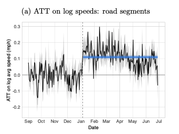
```
</center>

---

# NYC congestion pricing: one year later

<center>
```{r, out.width = "70%", fig.pos="c", echo = FALSE}
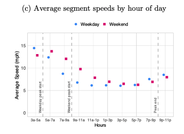
```
</center>

---

# NYC congestion pricing: one year later

<center>
```{r, out.width = "70%", fig.pos="c", echo = FALSE}
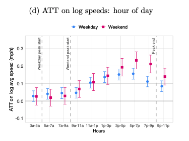
```
</center>

---

# NYC congestion pricing: one year later

<center>
```{r, out.width = "70%", fig.pos="c", echo = FALSE}
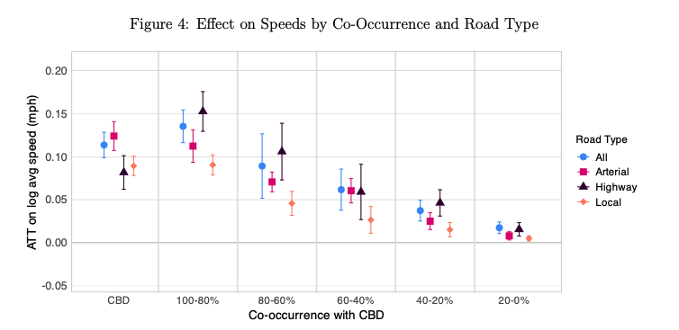
```
</center>

---

# NYC congestion pricing: one year later

<center>
```{r, out.width = "70%", fig.pos="c", echo = FALSE}
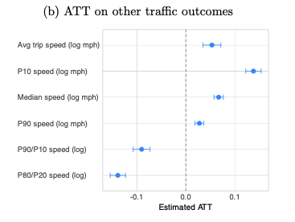
```
</center>

---

# NYC congestion pricing: one year later

<center>
```{r, out.width = "70%", fig.pos="c", echo = FALSE}
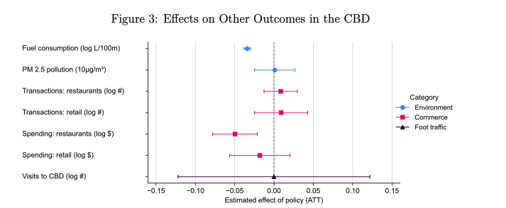
```
</center>

---

# Taxes don't always go smoothly

Pigouvian taxes are economically efficient, but can face .hi[political backlash]

--

In 2018, France proposed a fuel tax increase to reduce carbon emissions
- 6.5 cents/liter on diesel
- 2.9 cents/liter on gasoline

--

The response: .hi-red[Yellow Vest protests] (Gilets Jaunes)

---

# France's Yellow Vest protests

.hi[What happened:]
- 300,000+ protesters across France
- Blocked roads, occupied roundabouts
- Violent clashes in Paris
- 10 deaths, thousands injured over months of protests

--

.hi[Why?]
- Rural and suburban households depend on cars
- Tax seen as burden on working class while wealthy unaffected
- "End of the world vs end of the month"

---

# France's Yellow Vest protests

```{r, echo = FALSE}
local_video("videos/05-taxes-france-yellow-vests.mp4")
```

---

# Lessons for environmental taxes

The Yellow Vests show that .hi[distributional concerns matter]

--

Successful environmental taxes often include:
- Revenue recycling to affected households
- Exemptions for low-income groups
- Gradual phase-in periods
- Clear communication of benefits

--

NYC's congestion pricing includes income-based exemptions for this reason

---

# Optimal policy with multiple firms

.pull-left[
```{r multifirm, echo = FALSE, fig.show = 'hide', warning = F}
mac <- function(x) 2 - 2/3*x
mac2 <- function(x) 3 - x
md <- function(x) 1
ggplot() +
  annotate("text", x = .3, y = 2, label = expression(MAC[1]), size = 8) +
  annotate("text", x = .3, y = 3, label = expression(MAC[2]), size = 8) +
  annotate("text", x = 2.5, y = .9, label = "MD", size = 8) +
  stat_function(fun = mac2, color = "#000000", size = 1.5) +
  stat_function(fun = mac, color = "#ca5670", size = 1.5) +
  stat_function(fun = md, color = "#638ccc", size = 1.5) +
  annotate("segment", x = 1.5, xend = 1.5, y = 0, yend = 1,
           linetype = "dashed", size = 1.5, color = "grey50") +
  annotate("segment", x = 2, xend = 2, y = 0, yend = .99,
           linetype = "dashed", size = 1.5, color = "grey50") +
  theme_minimal() +
  theme(
    legend.position = "none",
    title = element_text(size = 24),
    axis.text.x = element_text(size = 24), axis.text.y = element_text(size = 24, color = "#ffffff"),
    axis.title.x = element_text(size = 24), axis.title.y = element_text(size = 24),
    panel.grid.minor.x = element_blank(), panel.grid.major.y = element_blank(),
    panel.grid.minor.y = element_blank(), panel.grid.major.x = element_blank(),
    panel.background = element_rect(fill = "#ffffff",colour = NA),
    plot.background = element_rect(fill = "#ffffff",colour = NA),
    axis.line = element_line(colour = "black")
  ) +
  labs(x = "Emissions",
       y = "Capital/$") +
  scale_x_continuous(expand = c(0,0), limits = c(0,3.1), breaks = c(1.5,2,3), labels = c(expression(E[1]^'*'), expression(E[2]^'*'), expression(E[0]))) +
  scale_y_continuous(expand = c(0,0), limits = c(0,3.1))

```

`)
]

.pull-right[

Firm #2 is 'dirty': has higher MAC

Firm #1 is 'clean': has lower MAC

If we use a regular emission standard: it has to be firm-specific!

Mandate $E^*_1$ for 1 and $E^*_2$ for 2

This requires .hi[a lot] of info and political capital on behalf of the regulator

]


---

# Optimal policy with multiple firms

.pull-left[
```{r multi-tax, echo = FALSE, fig.show = 'hide', warning = F}
mac <- function(x) 2 - 2/3*x
mac2 <- function(x) 3 - x
md <- function(x) 1
ggplot() +
  annotate("text", x = .3, y = 2, label = expression(MAC[1]), size = 8) +
  annotate("text", x = .3, y = 3, label = expression(MAC[2]), size = 8) +
  annotate("text", x = 2.5, y = .9, label = "MD", size = 8) +
  stat_function(fun = mac2, color = "#000000", size = 1.5) +
  stat_function(fun = mac, color = "#ca5670", size = 1.5) +
  stat_function(fun = md, color = "#638ccc", size = 1.5) +
  annotate("text", x = 2.5, y = 1.15, label = expression(tau), size = 8) +
  annotate("segment", x = 1.5, xend = 1.5, y = 0, yend = 1,
           linetype = "dashed", size = 1.5, color = "grey50") +
  annotate("segment", x = 2, xend = 2, y = 0, yend = .99,
           linetype = "dashed", size = 1.5, color = "grey50") +
  annotate("segment", x = 0, xend = 3, y = 1.05, yend = 1.05,
           linetype = "longdash", size = 1.5, color = "red") +
  theme_minimal() +
  theme(
    legend.position = "none",
    title = element_text(size = 24),
    axis.text.x = element_text(size = 24), axis.text.y = element_text(size = 24, color = "#ffffff"),
    axis.title.x = element_text(size = 24), axis.title.y = element_text(size = 24),
    panel.grid.minor.x = element_blank(), panel.grid.major.y = element_blank(),
    panel.grid.minor.y = element_blank(), panel.grid.major.x = element_blank(),
    panel.background = element_rect(fill = "#ffffff",colour = NA),
    plot.background = element_rect(fill = "#ffffff",colour = NA),
    axis.line = element_line(colour = "black")
  ) +
  labs(x = "Emissions",
       y = "Capital/$") +
  scale_x_continuous(expand = c(0,0), limits = c(0,3.1), breaks = c(1.5,2,3), labels = c(expression(E[1]^'*'), expression(E[2]^'*'), expression(E[0]))) +
  scale_y_continuous(expand = c(0,0), limits = c(0,3.1))

```

`)
]

.pull-right[

Regulating multiple heterogeneous firms with a tax can be easy:

If MD is constant, then since firms select MAC = $\tau$, as long as we set $\tau = MD$, we can achieve the efficient outcome (MAC = MD) without knowing anything about the firms!

]


---

# Optimal policy with multiple firms

Taxes also achieve the .hi[cost-effective] outcome: achieving a given emission level at least-cost

Let's see why

--

Suppose we want to minimize the total cost of achieving emission level $\bar{E}$ by abating across two different sources, plant 1 and plant 2

--

The plants have abatement cost functions: $C_1(E_1)$ and $C_2(E_2)$

--

Write down the regulator's problem

---

# Optimal policy with multiple firms

$$\min_{E_1,E_2} C_1(E_1) + C_2(E_2) \,\,\,\, \text{subject to:} \, E_1 + E_2 = \bar{E}$$

--

Solve the constraint for $E_2 = \bar{E} - E_1$ so we have a simpler problem:
$$\min_{E_1} C_1(E_1) + C_2(\bar{E} - E_1)$$

--

Take the first-order condition to find what is necessary for a cost minimum:
$$C'_1(E_1) + C'_2(\bar{E} - E_1) \times (-1) = 0$$

---

# Optimal policy with multiple firms

This gives us:
$$\underbrace{-C'_1(E_1)}_{\text{MAC}_1} = \underbrace{-C'_2(\overbrace{\bar{E} - E_1}^{E_2})}_{\text{MAC}_2}$$

The marginal abatement costs across the sources must be equal at the cost-effective pollution level

--

This is called the .hi-blue[equimarginal principle]

---

# Optimal policy with multiple firms

Taxes .hi[always] achieve the equimarginal principle and get us the given amount of emission reductions at least-cost

--

Why?

--

We know firms optimally select MAC equal to the emission tax

--

This means all firms' MACs are equal!

--

Even if we don't set the tax equal to MD, whatever emission reduction we get will be as cheap as possible

---

```{r equimarginal-setup, include = FALSE}
# Holding total emissions fixed, unequal marginal abatement costs imply
# extra abatement cost relative to the cost-minimizing allocation.
equimarginal_mac1 = function(emissions) 2 - 2 / 3 * emissions
equimarginal_mac2 = function(emissions) 3 - emissions
equimarginal_total = 3.5
equimarginal_optimum = 1.5

# Keep the two firms on the same emissions axis as the preceding tax figure.
# The areas around the common MAC sum to excess total abatement cost.
equimarginal_figure = function(shift = 0, shade = FALSE) {
  emissions1 = 1.5 + shift
  emissions2 = 2 - shift
  figure = ggplot()
  if (shade) {
    firm1_area = tibble(x = c(1.5, emissions1, emissions1),
                        y = c(1, 1, equimarginal_mac1(emissions1)))
    firm2_area = tibble(x = c(2, emissions2, emissions2),
                        y = c(1, 1, equimarginal_mac2(emissions2)))
    figure = figure +
      geom_polygon(data = firm1_area, aes(x = x, y = y), fill = "red", alpha = 0.5) +
      geom_polygon(data = firm2_area, aes(x = x, y = y), fill = "red", alpha = 0.5)
  }
  figure = figure +
    annotate("text", x = .3, y = 2, label = expression(MAC[1]), size = 8) +
    annotate("text", x = .3, y = 3, label = expression(MAC[2]), size = 8) +
    stat_function(fun = equimarginal_mac2, xlim = c(0, 3), color = "#000000", linewidth = 1.5) +
    stat_function(fun = equimarginal_mac1, xlim = c(0, 3), color = "#ca5670", linewidth = 1.5) +
    annotate("text", x = 2.5, y = 1.15, label = expression(tau), size = 8) +
    annotate("segment", x = 1.5, xend = 1.5, y = 0, yend = 1,
             linetype = "dashed", linewidth = 1.5, color = "grey50") +
    annotate("segment", x = 2, xend = 2, y = 0, yend = .99,
             linetype = "dashed", linewidth = 1.5, color = "grey50") +
    annotate("segment", x = 0, xend = 3, y = 1, yend = 1,
             linetype = "longdash", linewidth = 1.5, color = "red") +
    theme_minimal() +
    theme(legend.position = "none", title = element_text(size = 24),
          axis.text.x = element_text(size = 24),
          axis.text.y = element_text(size = 24, color = "#ffffff"),
          axis.title.x = element_text(size = 24), axis.title.y = element_text(size = 24),
          panel.grid = element_blank(),
          panel.background = element_rect(fill = "#ffffff", colour = NA),
          plot.background = element_rect(fill = "#ffffff", colour = NA),
          axis.line = element_line(colour = "black")) +
    labs(x = "Emissions", y = "Capital/$") +
    scale_y_continuous(expand = c(0, 0), limits = c(0, 3.1))
  emission_breaks = c(1.5, 2, 3)
  emission_labels = c("E[1]^'*'", "E[2]^'*'", "E[0]")
  if (shift != 0) {
    emission_breaks = c(emission_breaks, emissions1, emissions2)
    emission_labels = c(emission_labels, "E[1]", "E[2]")
    figure = figure +
      annotate("segment", x = emissions1, xend = emissions1, y = 0,
               yend = max(1, equimarginal_mac1(emissions1)),
               linetype = "dashed", color = "#EB811B", linewidth = 1.2) +
      annotate("segment", x = emissions2, xend = emissions2, y = 0,
               yend = max(1, equimarginal_mac2(emissions2)),
               linetype = "dashed", color = "#EB811B", linewidth = 1.2) +
      annotate("segment", x = 1.5, xend = emissions1, y = .15, yend = .15,
               arrow = grid::arrow(length = grid::unit(.12, "inches")),
               color = "#ca5670", linewidth = 1.2) +
      annotate("segment", x = 2, xend = emissions2, y = .3, yend = .3,
               arrow = grid::arrow(length = grid::unit(.12, "inches")),
               color = "black", linewidth = 1.2) +
      annotate("point", x = c(emissions1, emissions2),
               y = c(equimarginal_mac1(emissions1), equimarginal_mac2(emissions2)), size = 3)
  }
  figure + scale_x_continuous(expand = c(0, 0), limits = c(0, 3.1),
                              breaks = emission_breaks, labels = parse(text = emission_labels),
                              guide = guide_axis(n.dodge = if (shift > 0) 2 else 1))
}

# Check that both reallocations preserve emissions and raise total costs by
# exactly the shaded area between the two marginal abatement cost curves.
equimarginal_cost = function(emissions1) {
  (3 - emissions1)^2 / 3 + (3 - (3.5 - emissions1))^2 / 2
}
stopifnot(abs(equimarginal_mac1(1.5) - equimarginal_mac2(2)) < 1e-12)
for (shift in c(-0.75, 0.15)) {
  emissions1 = 1.5 + shift
  emissions2 = 2 - shift
  if (shift > 0) stopifnot(1.5 < emissions1, emissions1 < emissions2, emissions2 < 2)
  shaded_area = integrate(function(emissions) {
    abs(equimarginal_mac1(emissions) - equimarginal_mac2(3.5 - emissions))
  }, min(1.5, emissions1), max(1.5, emissions1))$value
  extra_cost = equimarginal_cost(emissions1) - equimarginal_cost(1.5)
  triangle_layers = ggplot_build(equimarginal_figure(shift, shade = TRUE))$data[1:2]
  plotted_area = sum(vapply(triangle_layers, function(vertices) {
    # The shoelace formula measures each plotted triangle directly.
    next_vertex = c(2:nrow(vertices), 1)
    abs(sum(vertices$x * vertices$y[next_vertex] -
              vertices$y * vertices$x[next_vertex])) / 2
  }, numeric(1)))
  stopifnot(abs(plotted_area - extra_cost) < 1e-12)
  stopifnot(abs(emissions1 + emissions2 - 3.5) < 1e-12,
            extra_cost > 0, abs(shaded_area - extra_cost) < 1e-12,
            abs(0.5 * abs(shift) * (abs(equimarginal_mac1(emissions1) - 1) +
                abs(equimarginal_mac2(emissions2) - 1)) - extra_cost) < 1e-12)
}
```

# Optimal policy with multiple firms

.pull-left[
```{r equimarginal-slide45, echo = FALSE, fig.width = 7, fig.height = 7, out.width = '100%'}
equimarginal_figure()
```
]

.pull-right[

If standards are applied uniformly across heterogeneous firms, costs are not minimized

If firms face a common emissions price, abatement is reallocated toward low-MAC sources

]

---


# Deviating from the equimarginal principle


.pull-left[
```{r equimarginal-efficient, echo = FALSE, fig.width = 7, fig.height = 7, out.width = '100%'}
equimarginal_figure()
```
]

.pull-right[
Holding total emissions constant

Costs are minimized when $MAC_1 = MAC_2$
]

---
count: false

# Deviating from the equimarginal principle

.pull-left[
```{r equimarginal-more-firm1, echo = FALSE, fig.width = 7, fig.height = 7, out.width = '100%'}
equimarginal_figure(shift = 0.15)
```
]

.pull-right[
Firm 1 emits more; firm 2 emits less

Now $MAC_1 < MAC_2$
]

---
count: false

# Deviating from the equimarginal principle

.pull-left[
```{r equimarginal-dwl-firm1, echo = FALSE, fig.width = 7, fig.height = 7, out.width = '100%'}
equimarginal_figure(shift = 0.15, shade = TRUE)
```
]

.pull-right[
The .hi-red[red area] is DWL relative to the cost-minimizing allocation

Shift emissions back toward firm 2 to equalize MACs
]

---

# Deviating in the other direction

.pull-left[
```{r equimarginal-reset, echo = FALSE, fig.width = 7, fig.height = 7, out.width = '100%'}
equimarginal_figure()
```
]

.pull-right[
Start again where $MAC_1 = MAC_2$

Holding total emissions constant
]

---
count: false

# Deviating in the other direction

.pull-left[
```{r equimarginal-more-firm2, echo = FALSE, fig.width = 7, fig.height = 7, out.width = '100%'}
equimarginal_figure(shift = -0.75)
```
]

.pull-right[
Firm 1 emits less; firm 2 emits more

Now $MAC_1 > MAC_2$
]

---
count: false

# Deviating in the other direction

.pull-left[
```{r equimarginal-dwl-firm2, echo = FALSE, fig.width = 7, fig.height = 7, out.width = '100%'}
equimarginal_figure(shift = -0.75, shade = TRUE)
```
]

.pull-right[
The .hi-red[red area] is DWL relative to the cost-minimizing allocation

Shift emissions back toward firm 1 to equalize MACs
]

---

# Taxes vs Standards
<center>
```{r, out.width = "80%", fig.pos="c", echo = FALSE}
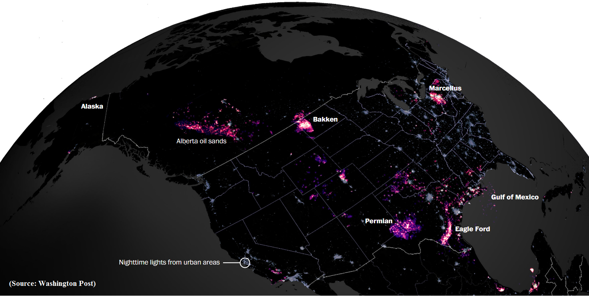
```
</center>

---

# Taxes vs Standards

<center>
```{r, out.width = "80%", fig.pos="c", echo = FALSE}

```
</center>

---

# Emission taxes

```{r, echo = FALSE}
local_video("videos/05-taxes-emission-taxes-2.mp4")
```

---

# Unconventional oil

<center>
```{r, out.width = "80%", fig.pos="c", echo = FALSE}
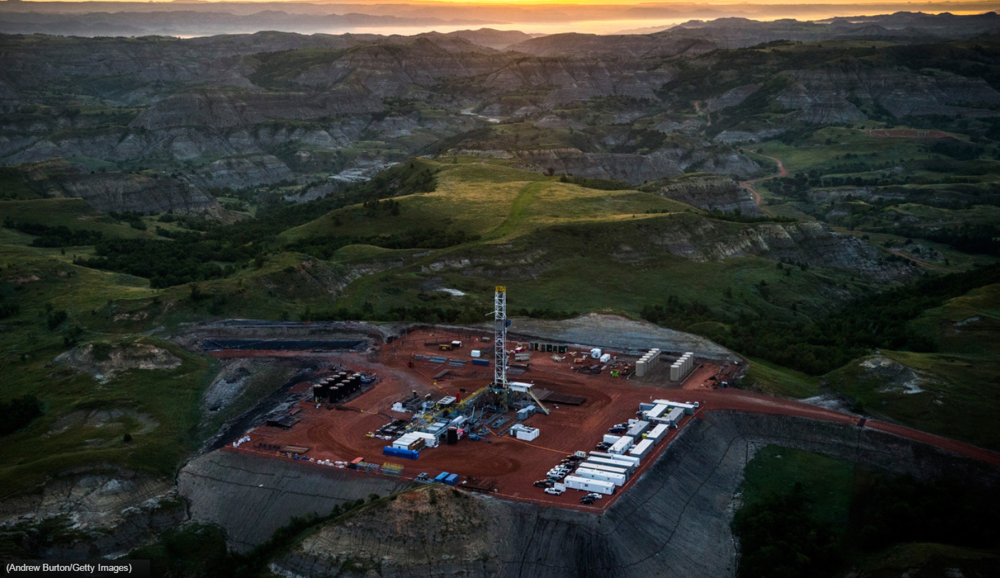
```
</center>


---

# Unconventional oil

<center>
```{r, out.width = "80%", fig.pos="c", echo = FALSE}
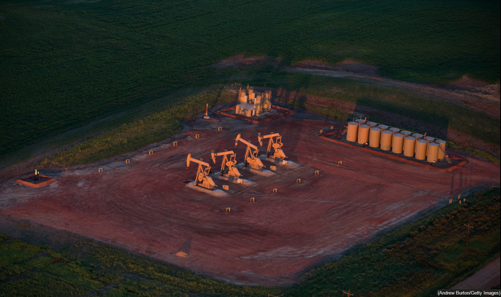
```
</center>

---

# Unconventional oil

<center>
```{r, out.width = "80%", fig.pos="c", echo = FALSE}
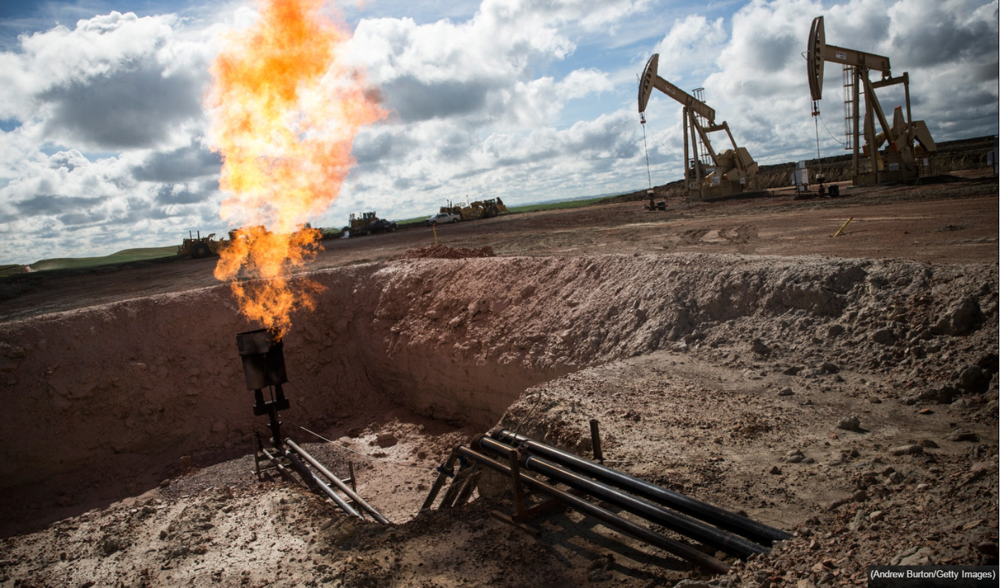
```
</center>

---

# Flaring regulations in North Dakota

North Dakota Industrial Commission established firm-level flaring limits beginning in October 2014

<center>
```{r, out.width = "80%", fig.pos="c", echo = FALSE}
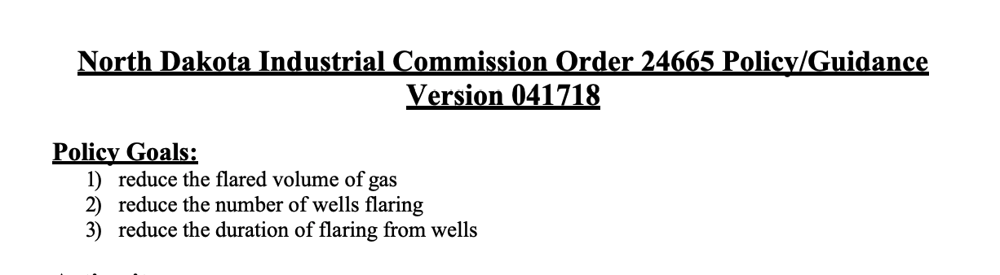
```
</center>

<center>
```{r, out.width = "80%", fig.pos="c", echo = FALSE}
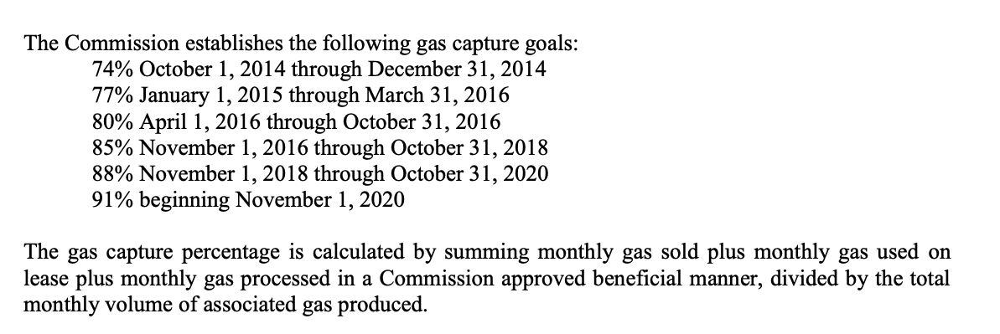
```
</center>

---

# Flaring regulations in North Dakota

This is a .hi-blue[standard]: a mandate on the quantity of gas captured

--

It was applied uniformly across firms

--

So with heterogeneous MACs, this generally violates the equimarginal principle and is not cost-effective

---

# Real world MACs

Firms appear to be cost-minimizing to comply

<center>
```{r, out.width = "60%", fig.pos="c", echo = FALSE}
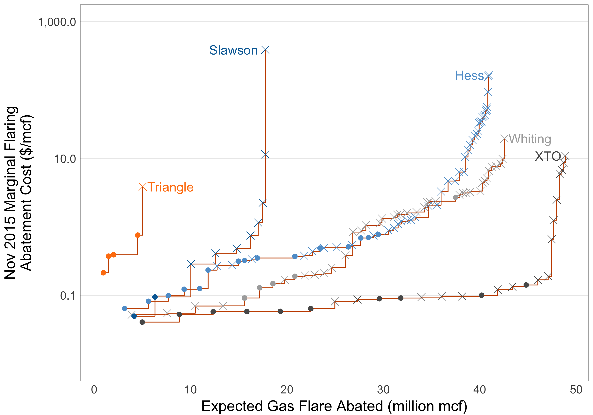
```
</center>

---

# Real world MACs

If we add up the MACs to the market-wide MAC, we aren't always abating at the cheapest wells (because the standard is uniform across firms)

<center>
```{r, out.width = "50%", fig.pos="c", echo = FALSE}
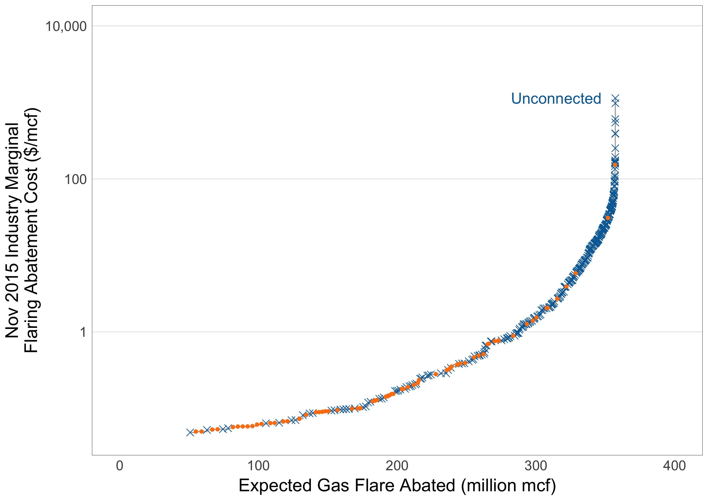
```
</center>

---

# What if we used a tax?

What if we set a tax instead of a standard?

--

Suppose we just used the existing *public* lands royalty rate

--

We could capture 99% of the gas as the regulation, but 50% of the cost

---

# Almost everyone is better off

The majority of firms are better off with a tax

<center>
```{r, out.width = "60%", fig.pos="c", echo = FALSE}
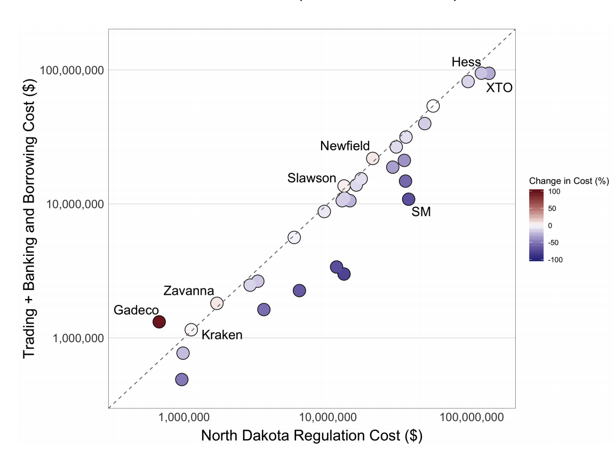
```
</center>
