exclude: true
```{r setup}
if (!require("pacman")) install.packages("pacman")
pacman::p_load(
  tidyverse, xaringanExtra, rlang, patchwork, nycflights13, tweetrmd, vembedr
)
options(htmltools.dir.version = FALSE)
knitr::opts_hooks$set(fig.callout = function(options) {
  if (options$fig.callout) {
    options$echo <- FALSE
  }
knitr::opts_chunk$set(echo = TRUE, fig.align="center")
  options
})
```
```{r xaringanExtra, echo = FALSE}
xaringanExtra::use_xaringan_extra(c("tile_view", "panelset", "webcam"))

```
```{r echo=FALSE}
xaringanExtra::style_panelset(panel_tab_color_active = "red")
```

---

# Roadmap

1. How do tradable permit systems work in theory and in the real world?
2. What happens under a tradable permit system?


---

class: inverse, center, middle
name: tradable permits

# Tradable permits

<html><div style='float:left'></div><hr color='#EB811B' size=1px width=796px></html>

---

# Tradable permits

How do tradable permit systems work?<sup>1</sup>

.footnote[
<sup>1</sup> Tradable permit systems are also called cap and trade systems.
]

--

First, recall a regular emission standard: we set $\bar{E}$ at the point where MAC = MD

--

This is easy with one firm, but what if we have several, or hundreds?

---

# Optimal policy with multiple firms

.pull-left[
```{r multifirm, echo = FALSE, fig.show = 'hide', warning = F}
mac <- function(x) 2 - 2/3*x
mac2 <- function(x) 3 - x
md <- function(x) 1
ggplot() +
  annotate("text", x = .3, y = 2, label = expression(MAC[1]), size = 8) +
  annotate("text", x = .3, y = 3, label = expression(MAC[2]), size = 8) +
  annotate("text", x = 1.25, y = 2.5, label = "MD", size = 8) +
  stat_function(fun = mac2, color = "#000000", size = 1.5) +
  stat_function(fun = mac, color = "#ca5670", size = 1.5) +
  stat_function(fun = md, color = "#638ccc", size = 1.5) +
  annotate("segment", x = 1.5, xend = 1.5, y = 0, yend = 1,
           linetype = "dashed", size = 1.5, color = "grey50") +
  annotate("segment", x = 2, xend = 2, y = 0, yend = .99,
           linetype = "dashed", size = 1.5, color = "#000000") +
  theme_minimal() +
  theme(
    legend.position = "none",
    title = element_text(size = 24),
    axis.text.x = element_text(size = 24), axis.text.y = element_text(size = 24, color = "#eeeeee"),
    axis.title.x = element_text(size = 24), axis.title.y = element_text(size = 24),
    panel.grid.minor.x = element_blank(), panel.grid.major.y = element_blank(),
    panel.grid.minor.y = element_blank(), panel.grid.major.x = element_blank(),
    panel.background = element_rect(fill = "#eeeeee",colour = NA),
    plot.background = element_rect(fill = "#eeeeee",colour = NA),
    axis.line = element_line(colour = "black")
  ) +
  labs(x = "Emissions",
       y = "Capital/$") +
  scale_x_continuous(expand = c(0,0), limits = c(0,3.1), breaks = c(1.5,2,3), labels = c(expression(E[1]^'*'), expression(E[2]^'*'), expression(E[0]))) +
  scale_y_continuous(expand = c(0,0), limits = c(0,3.1))

```

`)
]

.pull-right[

Firm #2 is 'dirty': has higher MAC

Firm #1 is 'clean': has lower MAC

If we use a regular emission standard: it has to be firm-specific!

Mandate $E^*_1$ for 1 and $E^*_2$ for 2

This requires .hi[a lot] of info and political capital on behalf of the regulator

]


---

# Optimal policy with multiple firms

.pull-left[
```{r multi-tax, echo = FALSE, fig.show = 'hide', warning = F}
mac <- function(x) 2 - 2/3*x
mac2 <- function(x) 3 - x
md <- function(x) 1
ggplot() +
  annotate("text", x = .3, y = 2, label = expression(MAC[1]), size = 8) +
  annotate("text", x = .3, y = 3, label = expression(MAC[2]), size = 8) +
  annotate("text", x = 1.25, y = 2.5, label = "MD", size = 8) +
  stat_function(fun = mac2, color = "#000000", size = 1.5) +
  stat_function(fun = mac, color = "#ca5670", size = 1.5) +
  stat_function(fun = md, color = "#638ccc", size = 1.5) +
  annotate("text", x = 2.5, y = 1.15, label = expression(tau), size = 8) +
  annotate("segment", x = 1.5, xend = 1.5, y = 0, yend = 1,
           linetype = "dashed", size = 1.5, color = "grey50") +
  annotate("segment", x = 2, xend = 2, y = 0, yend = .99,
           linetype = "dashed", size = 1.5, color = "#000000") +
  annotate("segment", x = 0, xend = 3, y = 1.05, yend = 1.05,
           linetype = "longdash", size = 1.5, color = "red") +
  theme_minimal() +
  theme(
    legend.position = "none",
    title = element_text(size = 24),
    axis.text.x = element_text(size = 24), axis.text.y = element_text(size = 24, color = "#eeeeee"),
    axis.title.x = element_text(size = 24), axis.title.y = element_text(size = 24),
    panel.grid.minor.x = element_blank(), panel.grid.major.y = element_blank(),
    panel.grid.minor.y = element_blank(), panel.grid.major.x = element_blank(),
    panel.background = element_rect(fill = "#eeeeee",colour = NA),
    plot.background = element_rect(fill = "#eeeeee",colour = NA),
    axis.line = element_line(colour = "black")
  ) +
  labs(x = "Emissions",
       y = "Capital/$") +
  scale_x_continuous(expand = c(0,0), limits = c(0,3.1), breaks = c(1.5,2,3), labels = c(expression(E[1]^'*'), expression(E[2]^'*'), expression(E[0]))) +
  scale_y_continuous(expand = c(0,0), limits = c(0,3.1))

```

`)
]

.pull-right[

Regulating multiple heterogeneous firms with a tax is easy:

Since firms select MAC = $\tau$, as long as we set $\tau = MD$ we can achieve the efficient outcome (MAC = MD) without knowing anything about the firms!

]


---

# Optimal policy with multiple firms

Taxes also achieve the .hi[cost-effective] outcome: achieving a given emission level at least-cost

Let's see why

--

Suppose we want to minimize the total cost of achieving emission level $\bar{E}$ by abating across two different sources, plant 1 and plant 2

--

The plants have abatement cost functions: $C_1(E_1)$ and $C_2(E_2)$

--

Write down the regulator's problem

---

# Optimal policy with multiple firms

$$\min_{E_1,E_2} C_1(E_1) + C_2(E_2) \,\,\,\, \text{subject to:} \, E_1 + E_2 = \bar{E}$$

Solve the constraint for $E_2 = \bar{E} - E_1$ so we have a simpler problem:
$$\min_{E_1} C_1(E_1) + C_2(\bar{E} - E_1)$$

--

Take the first-order condition to find what is necessary for a cost minimum:
$$\frac{dC_1(E_1)}{d E_1} + \frac{dC_2(\bar{E} - E_1)}{d E_1} \times (-1) = 0$$

---

# Optimal policy with multiple firms

This gives us:
$$\underbrace{-\frac{dC_1(E_1)}{d E_1}}_{\text{MAC}_1} = \underbrace{-\frac{dC_2(\bar{E} - E_1)}{d E_1}}_{\text{MAC}_2}$$

The marginal abatement costs across the sources must be equal at the cost-effective pollution level

--

This is often called the .hi-blue[equimarginal principle]

---

# Optimal policy with multiple firms

Taxes .hi[always] achieve the equimarginal principle and get us the given amount of emission reductions at least-cost

--

Why?

--

We know firms optimally select MAC equal to the emission tax

--

This means all firms' MACs are equal!

--

Even if we don't set the tax equal to MD, whatever emission reduction we get will be as cheap as possible

---

# Optimal policy with multiple firms

.pull-left[
`)
]

.pull-right[

The big problem is political feasibility

Firms resist taxation because they have to pay a fine for each unit of emissions

Tradable permit systems are a way to make emission standards flexible enough to handle heterogeneous firms

]


---

# Tradable permit systems

So how do these systems make standards more flexible?

--

They allow firms to trade their emission allowances

--

E.g. if firms are restricted to $\bar{E}_1$ and $\bar{E}_2$, we can allow the firms to trade

--

If firm 1 sells an allowance/permit to firm 2, their new restrictions are: $\bar{E}_1 - 1$ and $\bar{E}_2 + 1$

---

# Tradable permit systems: example

The US Acid Rain Program is the classic example

--

Permit = license to create 1 ton of SO2

--

Phase I (1995-2000):  
- 6.3 million permits issued per year
- affected 263 generating units at 110 dirtiest power plants

Phase II (2000+):  
- 9 million permits issued per year
- affects all power plants over some minimum size

---

# Tradable permit systems: example

<center>
```{r, out.width = "40%", fig.pos="c", echo = FALSE}
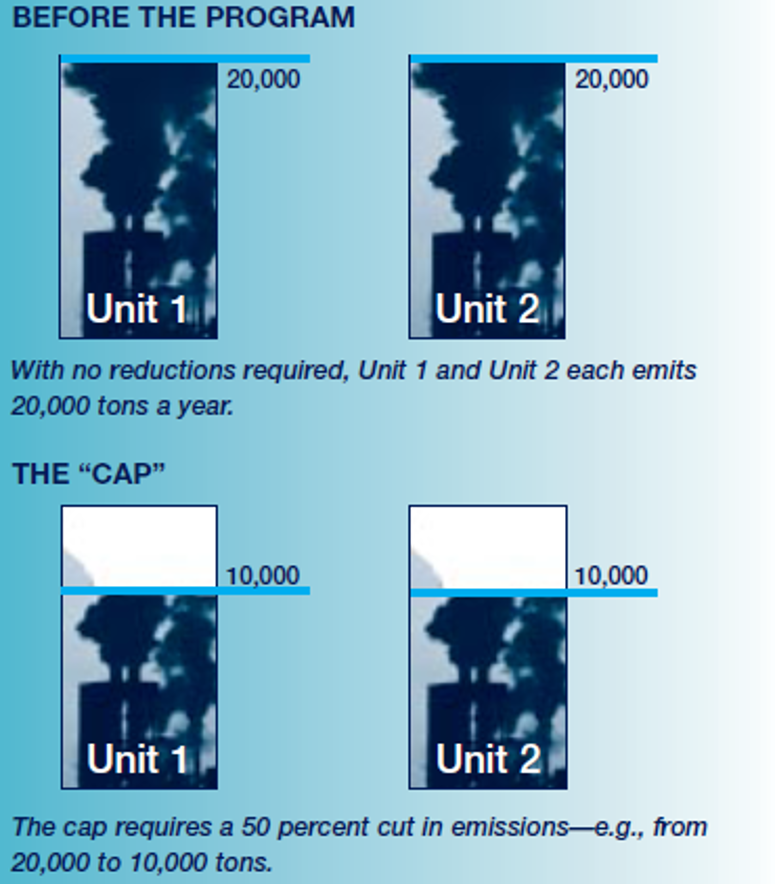
```
</center>

---

# Tradable permit systems: example

<center>
```{r, out.width = "70%", fig.pos="c", echo = FALSE}
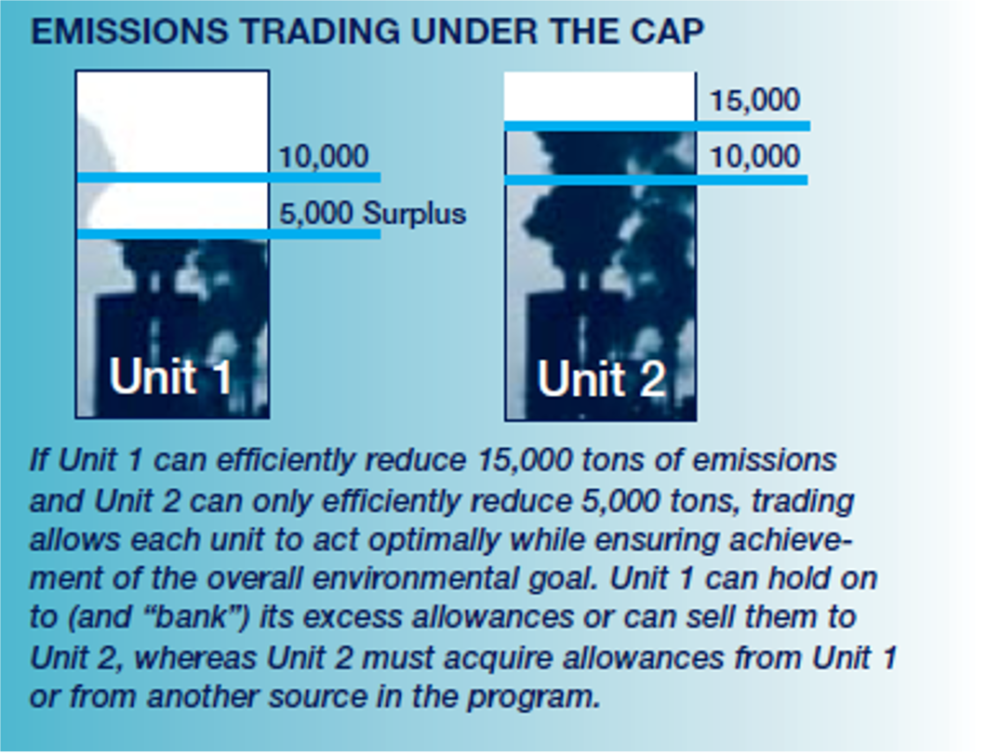
```
</center>

---

# Tradable permit systems: example

<center>
```{r, out.width = "80%", fig.pos="c", echo = FALSE}
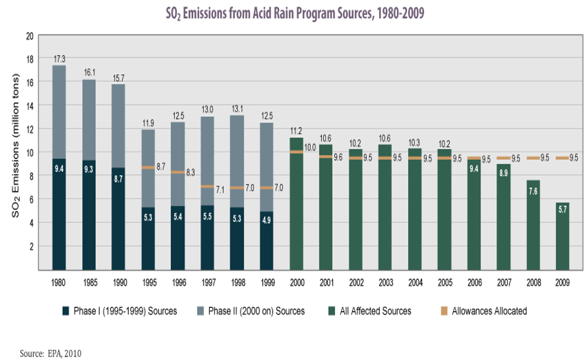
```
</center>

---

# Tradable permit systems: example

<center>
```{r, out.width = "80%", fig.pos="c", echo = FALSE}
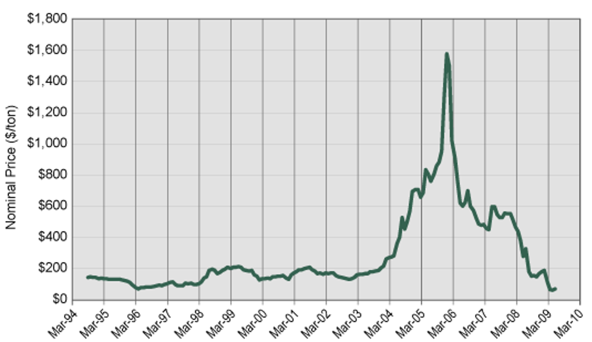
```
</center>

---

# Tradable permit systems: example

<center>
```{r, out.width = "100%", fig.pos="c", echo = FALSE}
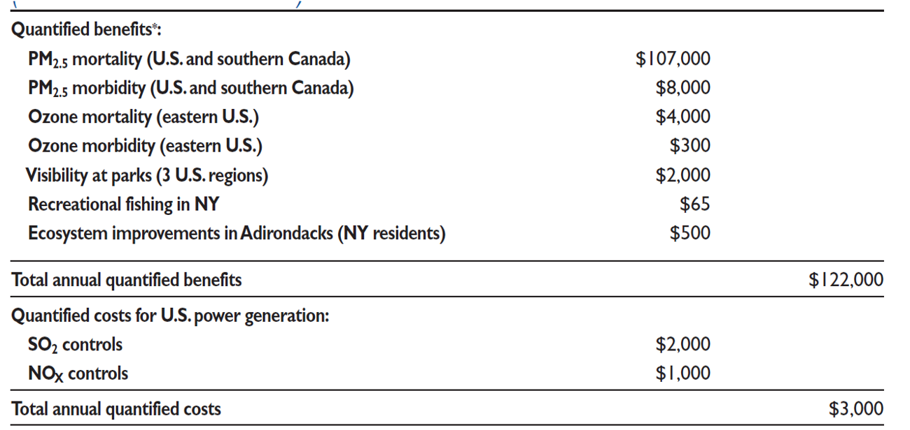
```
</center>


---

# Tradable permits: graphical

.pull-left[
```{r permits, echo = FALSE, fig.show = 'hide', warning = F}
mac <- function(x) 2 - 2/3*x
mac2 <- function(x) 3 - x
ggplot() +
  annotate("text", x = .3, y = 2, label = expression(MAC[1]), size = 8) +
  annotate("text", x = .3, y = 3, label = expression(MAC[2]), size = 8) +
  stat_function(fun = mac2, color = "#000000", size = 1.5) +
  stat_function(fun = mac, color = "#ca5670", size = 1.5) +
  annotate("segment", x = 1.5, xend = 1.5, y = 0, yend = 3,
           linetype = "longdash", size = 1.5, color = "black") +
  theme_minimal() +
  theme(
    legend.position = "none",
    title = element_text(size = 24),
    axis.text.x = element_text(size = 24), axis.text.y = element_text(size = 24, color = "#eeeeee"),
    axis.title.x = element_text(size = 24), axis.title.y = element_text(size = 24),
    panel.grid.minor.x = element_blank(), panel.grid.major.y = element_blank(),
    panel.grid.minor.y = element_blank(), panel.grid.major.x = element_blank(),
    panel.background = element_rect(fill = "#eeeeee",colour = NA),
    plot.background = element_rect(fill = "#eeeeee",colour = NA),
    axis.line = element_line(colour = "black")
  ) +
  labs(x = "Emissions",
       y = "Capital/$") +
  scale_x_continuous(expand = c(0,0), limits = c(0,3.1), breaks = c(1.5), labels = c(expression(bar(E)/2))) +
  scale_y_continuous(expand = c(0,0), limits = c(0,3.1))

```

`)
]

.pull-right[

Suppose we want to limit to $\bar{E}$ total emissions so each firm gets $\bar{E}/2$ permits

.hi[This can't be efficient] (i.e. maximize social welfare given some MD curve)

.hi-red[It also can't be cost-effective:] it doesn't minimize the cost of achieving $\bar{E}$ total emissions

]

---

# Tradable permits: cost-effectiveness

For cost-effectiveness, we need total costs to be minimized for achieving a given level of emissions:
$$\min_{E_1, E_2} C(E_1) + C(E_2) \,\,\, \text{subject to: } E_1 + E_2 = \bar{E}$$

This is the same problem as:
$$\min_{E_1, E_2} C(E_1) + C(\bar{E} - E_1)$$

which has a solution where:
$$-C'(E_1^*) = -C'(\bar{E} - E^*_1)$$

---

# Tradable permits: cost-effectiveness

Cost-effectiveness requires:
$$-C'(E_1^*) = -C'(\bar{E} - E^*_1) \leftrightarrow MAC_1 = MAC_2$$

That marginal abatement costs are equal across all 

--

If firms have different MAC curves, giving them the same amount of emissions/permits cannot be optimal

--

How do we fix this?

--

Let them trade the permits


---

# Tradable permits: graphical

.pull-left[
```{r permits-dwl, echo = FALSE, fig.show = 'hide', warning = F}
mac <- function(x) 2 - 2/3*x
mac2 <- function(x) 3 - x
dwl <- tibble(x = c(1.5, 3.5/2, 3.5/2),
                     y = c(1, 1, 2-2/3*(3.5/2)))
dwl2 <- tibble(x = c(3.5/2, 2, 3.5/2),
                     y = c(1, 1, 3-3.5/2))
ggplot() +
  geom_polygon(data = dwl, aes(x = x, y = y), fill = "red", alpha = 0.5) +
  geom_polygon(data = dwl2, aes(x = x, y = y), fill = "red", alpha = 0.5) +
  annotate("text", x = .3, y = 2, label = expression(MAC[1]), size = 8) +
  annotate("text", x = .3, y = 3, label = expression(MAC[2]), size = 8) +
  stat_function(fun = mac2, color = "#638ccc", size = 1.5) +
  stat_function(fun = mac, color = "#ca5670", size = 1.5) +
  annotate("segment", x = 3.5/2, xend = 3.5/2, y = 0, yend = 3,
           linetype = "longdash", size = 1.5, color = "black") +
  annotate("segment", x = 1.5, xend = 1.5, y = 0, yend = 1,
           linetype = "dashed", size = 1.5, color = "grey50") +
  annotate("segment", x = 2, xend = 2, y = 0, yend = 1,
           linetype = "dashed", size = 1.5, color = "grey50") +
  annotate("segment", x = 0, xend = 3, y = 1, yend = 1,
           linetype = "dotted", size = 1.5, color = "black") +
  theme_minimal() +
  theme(
    legend.position = "none",
    title = element_text(size = 24),
    axis.text.x = element_text(size = 24), axis.text.y = element_text(size = 24, color = "#eeeeee"),
    axis.title.x = element_text(size = 24), axis.title.y = element_text(size = 24),
    panel.grid.minor.x = element_blank(), panel.grid.major.y = element_blank(),
    panel.grid.minor.y = element_blank(), panel.grid.major.x = element_blank(),
    panel.background = element_rect(fill = "#eeeeee",colour = NA),
    plot.background = element_rect(fill = "#eeeeee",colour = NA),
    axis.line = element_line(colour = "black")
  ) +
  labs(x = "Emissions",
       y = "Capital/$") +
  scale_x_continuous(expand = c(0,0), limits = c(0,3.1), breaks = c(1.5, 3.5/2,2 ), labels = c(expression(E[1]), expression(bar(E)/2), expression(E[2]))) +
  scale_y_continuous(expand = c(0,0), limits = c(0,3.1))

```

`)
]

.pull-right[

We can reduce costs by increasing emissions at high MAC firm 2 and decreasing emissions at low MAC firm 1 until they are equal

This allows us to recover DWL equal to the red area

The red area is the difference in areas under MAC2 and MAC1 over the range of emissions changes

]


---

# Tradable permits: graphical

.pull-left[
```{r permits-reallo, echo = FALSE, fig.show = 'hide', warning = F}
mac <- function(x) 2 - 2/3*x
mac2 <- function(x) 3 - x
ggplot() +
  annotate("text", x = .3, y = 2, label = expression(MAC[1]), size = 8) +
  annotate("text", x = .3, y = 3, label = expression(MAC[2]), size = 8) +
  stat_function(fun = mac2, color = "#638ccc", size = 1.5) +
  stat_function(fun = mac, color = "#ca5670", size = 1.5) +
  annotate("segment", x = 3.5/2, xend = 3.5/2, y = 0, yend = 3,
           linetype = "longdash", size = 1.5, color = "black") +
  annotate("segment", x = 0, xend = 3, y = 1, yend = 1,
           linetype = "dotted", size = 1.5, color = "black") +
  annotate("segment", x = 0, xend = 3.5/2, y = 2 - 2/3*3.5/2, yend = 2 - 2/3*3.5/2,
           linetype = "dashed", size = 1.5, color = "grey50") +
  annotate("segment", x = 0, xend = 3.5/2, y = 3-3.5/2, yend = 3-3.5/2,
           linetype = "dashed", size = 1.5, color = "grey50") +
  annotate("point", x = 3.5/2, y = 3-3.5/2, size = 8, color = "#638ccc") +
  annotate("point", x = 3.5/2, y = 2 - 2/3*3.5/2, size = 8, color = "#ca5670") +
  annotate("segment", x = 0, xend = 3, y = 1, yend = 1,
           linetype = "dotted", size = 1.5, color = "black") +
  theme_minimal() +
  theme(
    legend.position = "none",
    title = element_text(size = 24),
    axis.text.x = element_text(size = 24), axis.text.y = element_text(size = 24),
    axis.title.x = element_text(size = 24), axis.title.y = element_text(size = 24),
    panel.grid.minor.x = element_blank(), panel.grid.major.y = element_blank(),
    panel.grid.minor.y = element_blank(), panel.grid.major.x = element_blank(),
    panel.background = element_rect(fill = "#eeeeee",colour = NA),
    plot.background = element_rect(fill = "#eeeeee",colour = NA),
    axis.line = element_line(colour = "black")
  ) +
  labs(x = "Emissions",
       y = "Capital/$") +
  scale_x_continuous(expand = c(0,0), limits = c(0,3.1), breaks = c(3.5/2), labels = c(expression(bar(E)/2))) +
  scale_y_continuous(expand = c(0,0), limits = c(0,3.1), breaks = c(2 - 2/3*3.5/2, 1, 3 - 3.5/2), labels = c("5/6", "1", "5/4"))

```
`)
]

.pull-right[

We want to equalize MACs for cost-effectiveness, but does the permit market cause this to happen?

Firm 2 is willing to pay a price up to the blue point (5/4) to be able to emit 1 more unit

Firm 1 can abate 1 more unit at cost equal to the red point (5/6)

]


---

# Tradable permits: graphical

.pull-left[
`)
]

.pull-right[

Firm 2 can buy the right to emit 1 unit of pollution from firm 1 for anywhere between 5/6 - 5/4 and .hi[both will be better off]

These trades can be done until the MACs are equal at a value of 1

This would be the prevailing permit price in a tradable permit system

]

---

# Tradable permits: firm

We can also see this result mathematically

--

Suppose there is a permit price $p$ in the competitive tradable permit market

--

Firms are price-takers

--

First lets set up the firm problem: they want to minimize the cost of satisfying the policy

---

# Tradable permits: firm

The firm's problem is then:
$$ \min_E C(E) + p E$$

The firm's first-order condition to minimize costs is:
$$-C'(E^*) = p$$

--

The firm minimizes costs by choosing emissions $E^*$ so that its MAC equals the permit price

---

# Tradable permits: cost-effectiveness

This makes sense!

--

The permit price is the MC of emitting, the MAC is the marginal benefit of emitting (reduced abatement cost)

--

Costs are minimized when these two things are equal

--

What else does this do?

--

If firms all set their MACs equal to $p$ then all their MACs are equal to one another, .hi[we have cost-effectiveness:]
$$-C_1'(E^*_1) = -C_2'(E^*_2) = \dots = -C_N'(E^*_N) = p$$


---

# Tradable permits: cost-effectiveness

Tradable permit systems are .hi[always] cost-effective: whatever emissions limit you set, it will be achieved at least-cost<sup>1</sup>
.footnote[
<sup>1</sup> Try to see if you can use the same mathematical derivation to show that taxes are also always cost-effective.
]

--

This does not mean that it is necessarily efficient!

---

# Tradable permits: efficiency

For efficiency, we also need MAC = MD

--

To keep things simple suppose MD is constant: $MD = d$<sup>1</sup>
.footnote[
<sup>1</sup> Everything still works if it isn't, but constant MD allows us to work through the intuition without worrying about adding up everyone's emissions.
]

--

If we set $\bar{E}$ such that $p = d$, then we also have efficiency


--

Let's see why

---

# Tradable permits: efficiency

Suppose we set $\bar{E}$ to be the sum of the efficient level of emissions across all firms $\sum_i E^*_i$, where $E^*_i$ is where $MAC_i = d$

--

Firms will trade until their MACs are all equal

--

Since there's only $\bar{E} = E^*$ permits, we already know MACs are equal at $\{E^*_1, \dots, E^*_N\}$ where $\sum_i E^*_i = E^*_i$ 

This is where their MACs all equal $d$ and each other

--

We also know in the permit market equilibrium we have $MAC = p$, so this means that we must have $p = d = MD$!

---

# Tradable permits in practice

Knowing MD is often difficult in practice

--

Tradable permit systems are nice because we can just let politicians choose a $\bar{E}$ that is politically feasible, and then the permit market ensures that we get the associated emissions reductions at least-cost

--

What often happens in practice is $\bar{E}$ starts high, giving us a low $p$, and then $\bar{E}$ gets ratcheted down over time

---

# Political economy of permits

Firms are often more willing to accept a higher $p$ than $\tau$ because they are often endowed with (some) permits for free

--

This means that *in practice*, we might expect to get greater emissions reductions under a permit system than a tax because of these political economy reasons

--

This is one of the key reasons the 1990 CAA amendments were able to be passed


---

# Permit systems and heterogeneous MDs

So far we assumed all firms faced the same MD

--

This is true for things like climate change, less true for things like $SO_2$ or $NO_x$

--

How well do permit systems perform with heterogeneous MD?

---

# Permit systems and heterogeneous MDs

Let's think about a setting with two firms: 1 and 2

--

The firms have different MACs: $C_1(E) > C_2(E)$ for all $E$

--

And the firms have different marginal damages as well: $MD_1 > MD_2$ for all $E$

--

How well does a permit system work?

---

# Permit systems and heterogeneous MDs

Well we know the following:

--

Firms set $MAC = p$ so we will have $MAC_1 = MAC_2 = p$

--

But for efficiency we also want $MAC = MD$: $MAC_1 = MD_1$ and $MAC_2 = MD_2$

--

If $MD_1 \neq MD_2$ then the permit system does .hi-red[not] deliver efficiency!

---

# Permit systems and heterogeneous MDs: graphical


.pull-left[
```{r permits-hetero, echo = FALSE, fig.show = 'hide', warning = F}
mac <- function(x) 200 - x
mac2 <- function(x) 300 - x
d1 <- function(x) 100
d2 <- function(x) 150
ggplot() +
  annotate("text", x = 30, y = 200, label = expression(MAC[1]), size = 8) +
  annotate("text", x = 30, y = 300, label = expression(MAC[2]), size = 8) +
  annotate("text", x = 280, y = 80, label = expression(MD[1]), size = 8) +
  annotate("text", x = 280, y = 160, label = expression(MD[2]), size = 8) +
  stat_function(fun = mac2, color = "#638ccc", size = 1.5) +
  stat_function(fun = mac, color = "#ca5670", size = 1.5) +
  stat_function(fun = d1, color = "#000000", size = 1.5) +
  stat_function(fun = d2, color = "darkslateblue", size = 1.5) +
  theme_minimal() +
  theme(
    legend.position = "none",
    title = element_text(size = 24),
    axis.text.x = element_text(size = 24), axis.text.y = element_text(size = 24),
    axis.title.x = element_text(size = 24), axis.title.y = element_text(size = 24),
    panel.grid.minor.x = element_blank(), panel.grid.major.y = element_blank(),
    panel.grid.minor.y = element_blank(), panel.grid.major.x = element_blank(),
    panel.background = element_rect(fill = "#eeeeee",colour = NA),
    plot.background = element_rect(fill = "#eeeeee",colour = NA),
    axis.line = element_line(colour = "black")
  ) +
  labs(x = "Emissions",
       y = "Capital/$") +
  scale_x_continuous(expand = c(0,0), limits = c(0,310)) +
  scale_y_continuous(expand = c(0,0), limits = c(0,310))

```

`)
]

.pull-right[

Suppose we have the two firms with different MACs and MDs:
- $MAC_1 = 200-E_1$
- $MAC_2 = 300-E_2$
- $MD_1 = 100$
- $MD_2 = 150$

The efficient emissions allocation is: $E^* = 250: E_1^* = 100, E_2^* = 150$

The regulator sets $\bar{E} = 250$

]


---

# Permit systems and heterogeneous MDs: graphical


.pull-left[
```{r permits-hetero2, echo = FALSE, fig.show = 'hide', warning = F}
mac <- function(x) 200 - x
mac2 <- function(x) 300 - x
d1 <- function(x) 100
d2 <- function(x) 150
p <- function(x) 125
dwl <- tibble(
  x = c(75, 75, 100),
  y = c(125, 100, 100)
)
dwl2 <- tibble(
  x = c(150, 175, 175),
  y = c(150, 125, 150)
  )
ggplot() +
  geom_polygon(data = dwl, aes(x = x, y = y), fill = "red", alpha = 0.75) +
  geom_polygon(data = dwl2, aes(x = x, y = y), fill = "red", alpha = 0.75) +
  annotate("text", x = 30, y = 200, label = expression(MAC[1]), size = 8) +
  annotate("text", x = 30, y = 300, label = expression(MAC[2]), size = 8) +
  annotate("text", x = 280, y = 80, label = expression(MD[1]), size = 8) +
  annotate("text", x = 280, y = 160, label = expression(MD[2]), size = 8) +
  annotate("segment", x = 75, xend = 75, y = 0, yend = 125,
           linetype = "dashed", size = 1.5, color = "grey50") +
  annotate("segment", x = 175, xend = 175, y = 0, yend = 125,
           linetype = "dashed", size = 1.5, color = "grey50") +
  annotate("segment", x = 100, xend = 100, y = 0, yend = 100,
           linetype = "dashed", size = 1.5, color = "grey50") +
  annotate("segment", x = 150, xend = 150, y = 0, yend = 150,
           linetype = "dashed", size = 1.5, color = "grey50") +
  stat_function(fun = mac2, color = "#638ccc", size = 1.5) +
  stat_function(fun = mac, color = "#ca5670", size = 1.5) +
  stat_function(fun = d1, color = "#000000", size = 1.5) +
  stat_function(fun = d2, color = "darkslateblue", size = 1.5) +
  stat_function(fun = p, color = "orange", linetype = "dotted", size = 1.5) +
  annotate("text", x = 280, y = 135, label = "p", size = 8) +
  theme_minimal() +
  theme(
    legend.position = "none",
    title = element_text(size = 24),
    axis.text.x = element_text(size = 18), axis.text.y = element_text(size = 24),
    axis.title.x = element_text(size = 24), axis.title.y = element_text(size = 24),
    panel.grid.minor.x = element_blank(), panel.grid.major.y = element_blank(),
    panel.grid.minor.y = element_blank(), panel.grid.major.x = element_blank(),
    panel.background = element_rect(fill = "#eeeeee",colour = NA),
    plot.background = element_rect(fill = "#eeeeee",colour = NA),
    axis.line = element_line(colour = "black")
  ) +
  labs(x = "Emissions",
       y = "Capital/$") +
  scale_x_continuous(expand = c(0,0), limits = c(0,310), 
                     breaks = c(75, 100, 150, 175), 
                     labels =c(expression(E[1]^'p'), expression(E[1]^'*'),
                               expression(E[2]^'*'), expression(E[2]^'p'))) +
  scale_y_continuous(expand = c(0,0), limits = c(0,310))

```

`)
]

.pull-right[

We can solve for the permit market allocation and price using:
$MAC_1 = MAC_2$ and $E_1 + E_2 = 250$

These two conditions tell us:

$E^p_1 = 75, E^p_2 = 175, p = 125$

but efficiency is at:

$E^*_1 = 100, E^*_2 = 150$

]


---

# Permit systems and heterogeneous MDs: graphical


.pull-left[
`)
]

.pull-right[

Relative to the optimal allocation, the permit system has DWL equal to the .hi-red[red area]

The permit allocation is not an .hi[efficient] allocation, but is it a .hi[Pareto improvement] over:

1. No policy?
2. A uniform standard of $\bar{E}/2$?

]


---

# Permit systems and heterogeneous MDs: graphical


.pull-left[
```{r permits-hetero3, echo = FALSE, fig.show = 'hide', warning = F}
mac <- function(x) 200 - x
mac2 <- function(x) 300 - x
d1 <- function(x) 100
d2 <- function(x) 150
p <- function(x) 125
dwl <- tibble(
  x = c(75, 75, 100),
  y = c(125, 100, 100)
)
dwl2 <- tibble(
  x = c(150, 175, 175),
  y = c(150, 125, 150)
  )
dwl_split_1 <- tibble(
  x = c(125, 125, 100),
  y = c(75, 100, 100)
)
dwl_split_2 <- tibble(
  x = c(150, 125, 125),
  y = c(150, 175, 150)
  )
ggplot() +
  geom_polygon(data = dwl, aes(x = x, y = y), fill = "red", alpha = 0.75) +
  geom_polygon(data = dwl2, aes(x = x, y = y), fill = "red", alpha = 0.75) +
  geom_polygon(data = dwl_split_1, aes(x = x, y = y), fill = "blue", alpha = 0.75) +
  geom_polygon(data = dwl_split_2, aes(x = x, y = y), fill = "blue", alpha = 0.75) +
  annotate("text", x = 30, y = 200, label = expression(MAC[1]), size = 8) +
  annotate("text", x = 30, y = 300, label = expression(MAC[2]), size = 8) +
  annotate("text", x = 280, y = 80, label = expression(MD[1]), size = 8) +
  annotate("text", x = 280, y = 160, label = expression(MD[2]), size = 8) +
  annotate("segment", x = 75, xend = 75, y = 0, yend = 125,
           linetype = "dashed", size = 1.5, color = "grey50") +
  annotate("segment", x = 175, xend = 175, y = 0, yend = 125,
           linetype = "dashed", size = 1.5, color = "grey50") +
  annotate("segment", x = 125, xend = 125, y = 0, yend = 175,
           linetype = "dashed", size = 1.5, color = "grey50") +
  stat_function(fun = mac2, color = "#638ccc", size = 1.5) +
  stat_function(fun = mac, color = "#ca5670", size = 1.5) +
  stat_function(fun = d1, color = "#000000", size = 1.5) +
  stat_function(fun = d2, color = "darkslateblue", size = 1.5) +
  stat_function(fun = p, color = "orange", linetype = "dotted", size = 1.5) +
  annotate("text", x = 280, y = 135, label = "p", size = 8) +
  theme_minimal() +
  theme(
    legend.position = "none",
    title = element_text(size = 24),
    axis.text.x = element_text(size = 18), axis.text.y = element_text(size = 24),
    axis.title.x = element_text(size = 24), axis.title.y = element_text(size = 24),
    panel.grid.minor.x = element_blank(), panel.grid.major.y = element_blank(),
    panel.grid.minor.y = element_blank(), panel.grid.major.x = element_blank(),
    panel.background = element_rect(fill = "#eeeeee",colour = NA),
    plot.background = element_rect(fill = "#eeeeee",colour = NA),
    axis.line = element_line(colour = "black")
  ) +
  labs(x = "Emissions",
       y = "Capital/$") +
  scale_x_continuous(expand = c(0,0), limits = c(0,310), 
                     breaks = c(75, 125, 175), 
                     labels =c(expression(E[1]^'p'), expression(frac(bar(E), 2)), expression(E[2]^'p'))) +
  scale_y_continuous(expand = c(0,0), limits = c(0,310))

```

`)
]

.pull-right[

The blue area is the DWL under the uniform standard

.hi[In this specific case,] a uniform standard and the permit system have the same efficiency since the red and blue areas are equal

The only difference is what kind of welfare loss is occurring where

]


---

# Permit systems and heterogeneous MDs: graphical


.pull-left[
```{r permits-hetero4, echo = FALSE, fig.show = 'hide', warning = F}
mac <- function(x) 200 - x
mac2 <- function(x) 300 - x
d1 <- function(x) 100
d2 <- function(x) 150
p <- function(x) 125
dwl <- tibble(
  x = c(75, 75, 100),
  y = c(125, 100, 100)
)
dwl2 <- tibble(
  x = c(150, 175, 175),
  y = c(150, 125, 150)
  )
dwl_orig_1 <- tibble(
  x = c(200, 200, 100),
  y = c(0, 100, 100)
)
dwl_orig_2 <- tibble(
  x = c(150, 300, 300),
  y = c(150, 150, 0)
  )
ggplot() +
  geom_polygon(data = dwl_orig_1, aes(x = x, y = y), fill = "darkgreen", alpha = 0.5) +
  geom_polygon(data = dwl_orig_2, aes(x = x, y = y), fill = "darkgreen", alpha = 0.5) +
  geom_polygon(data = dwl, aes(x = x, y = y), fill = "red", alpha = 0.5) +
  geom_polygon(data = dwl2, aes(x = x, y = y), fill = "red", alpha = 0.5) +
  annotate("text", x = 30, y = 200, label = expression(MAC[1]), size = 8) +
  annotate("text", x = 30, y = 300, label = expression(MAC[2]), size = 8) +
  annotate("text", x = 280, y = 80, label = expression(MD[1]), size = 8) +
  annotate("text", x = 280, y = 160, label = expression(MD[2]), size = 8) +
  annotate("segment", x = 75, xend = 75, y = 0, yend = 125,
           linetype = "dashed", size = 1.5, color = "grey50") +
  annotate("segment", x = 175, xend = 175, y = 0, yend = 125,
           linetype = "dashed", size = 1.5, color = "grey50") +
  annotate("segment", x = 125, xend = 125, y = 0, yend = 175,
           linetype = "dashed", size = 1.5, color = "grey50") +
  stat_function(fun = mac2, color = "#638ccc", size = 1.5) +
  stat_function(fun = mac, color = "#ca5670", size = 1.5) +
  stat_function(fun = d1, color = "#000000", size = 1.5) +
  stat_function(fun = d2, color = "darkslateblue", size = 1.5) +
  stat_function(fun = p, color = "orange", linetype = "dotted", size = 1.5) +
  annotate("text", x = 280, y = 135, label = "p", size = 8) +
  theme_minimal() +
  theme(
    legend.position = "none",
    title = element_text(size = 24),
    axis.text.x = element_text(size = 18), axis.text.y = element_text(size = 24),
    axis.title.x = element_text(size = 24), axis.title.y = element_text(size = 24),
    panel.grid.minor.x = element_blank(), panel.grid.major.y = element_blank(),
    panel.grid.minor.y = element_blank(), panel.grid.major.x = element_blank(),
    panel.background = element_rect(fill = "#eeeeee",colour = NA),
    plot.background = element_rect(fill = "#eeeeee",colour = NA),
    axis.line = element_line(colour = "black")
  ) +
  labs(x = "Emissions",
       y = "Capital/$") +
  scale_x_continuous(expand = c(0,0), limits = c(0,310), 
                     breaks = c(75, 125, 175), 
                     labels =c(expression(E[1]^'p'), expression(frac(bar(E), 2)), expression(E[2]^'p'))) +
  scale_y_continuous(expand = c(0,0), limits = c(0,310))

```

`)
]

.pull-right[

The DWL without any policy is the two large green triangles

These are clearly larger than the DWL under the permit system

The permit system can deliver a welfare improvement

]

---

# Permit systems and heterogeneous MDs: graphical


.pull-left[
`)
]

.pull-right[

What if the high MAC firm was the low MD firm?

i.e: what if the correlation between MAC and MD was .hi-red[negative] instead of .hi-blue[positive]?

What might we expect the correlation to be?

]

---

# Permit systems and heterogeneous MDs

What is the problem with permit systems and heterogeneous MD?

--

We want to have firms pay a price equal to their MD

--

Firms have different MDs 
--
but there's only one common permit price

--

This means we can't make all firms correctly account for their externalities

--

One way around this is to use .hi[trading ratios]: firms in high damage areas need to procure more permits for the same amount of emissions

--

Another way is .hi[zonal trading]: firms can only trade in similar MD areas

---

# Trading ratios: Acid Rain Program

Below are estimates of efficient trading ratios for the Acid Rain Program

<center>
```{r, out.width = "80%", fig.pos="c", echo = FALSE}
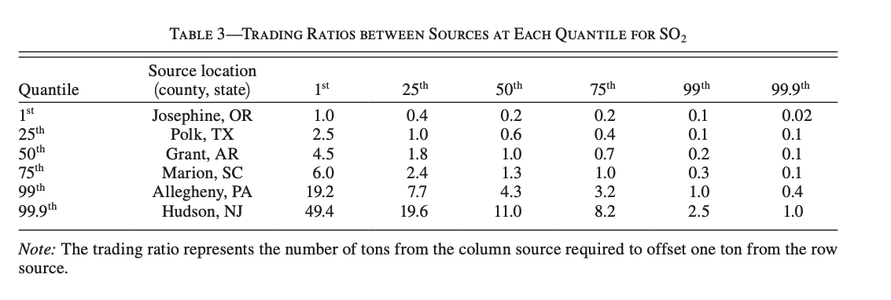
```
</center>

Muller and Mendelsohn (2009)

---

# PM2.5 damages

Trading ratios are required because damages are heterogeneous across space

<center>
```{r, out.width = "60%", fig.pos="c", echo = FALSE}
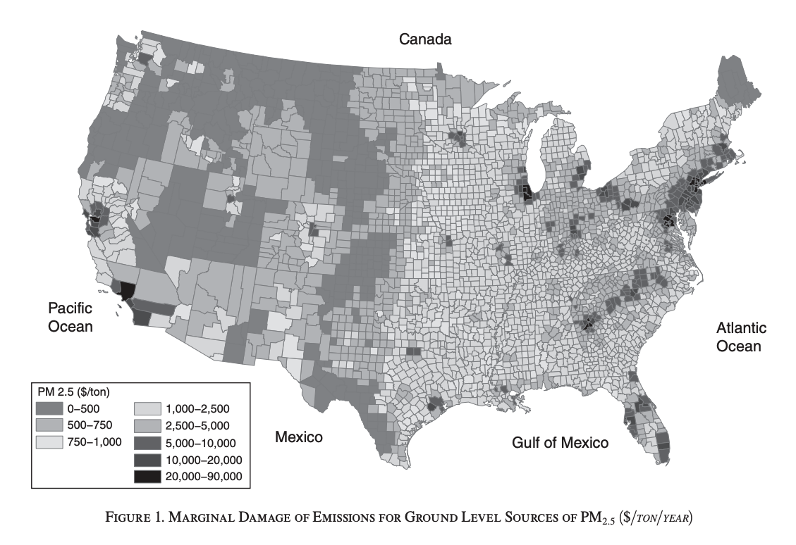
```
</center>

Muller and Mendelsohn (2009)

---

# Damages caused by ARP

The Acid Rain Program .hi-red[increased] damages in the eastern US

<center>
```{r, out.width = "50%", fig.pos="c", echo = FALSE}
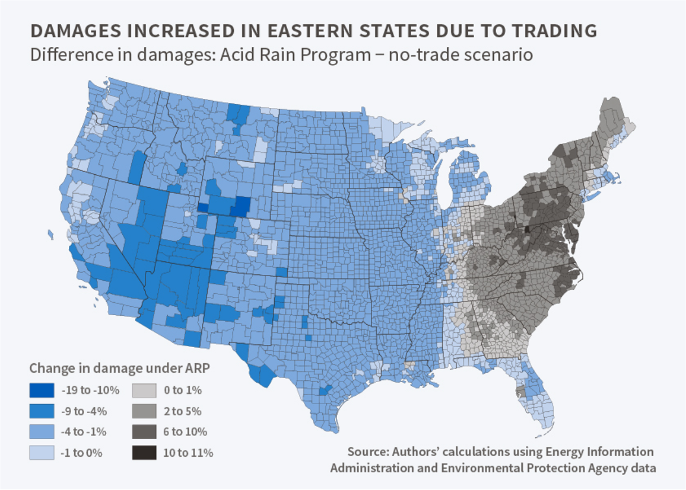
```
</center>

Chan et al. (2018)

---

# Damages caused by ARP

Chan et al. (2018) JEEM:

> We also compare health damages associated with observed SO2 emissions from all ARP units in 2002 with damages from a no-trade counterfactual. Damages under the ARP are $2.1 billion (1995$) higher than under the no-trade scenario, reflecting allowance transfers from units in the western US to units in the eastern US with larger exposed populations.

---

# Damages caused by ARP

.hi-red[Redder:] trading lead to greater emissions vs no trading

<center>
```{r, out.width = "70%", fig.pos="c", echo = FALSE}
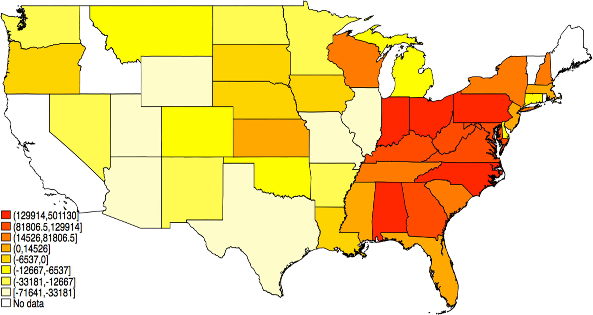
```
</center>


---

# Zonal trading: RECLAIM

Regional Clean Air Management (RECLAIM) Program

--

California South Coast Air Quality Management District (SCAQMD)

--

Started in 1994, goal of cutting NOx and SOx  emissions by 80% by 2003

--

RECLAIM is a facility-level tradable permit system

---

# Zonal trading: RECLAIM

14% of permits allocated to power generators

--

Permit prices driven by electricity sector

--

During 2000 electricity price spikes, lots of very dirty plants brought on-line to meet demand

--

Permit prices rose dramatically for everyone else

--

$4,284 per ton of NOx in 1999

--

$39,000 per ton of NOx in 2000

---

# Zonal trading: RECLAIM

.pull-left[
<center>
```{r, out.width = "100%", fig.pos="c", echo = FALSE}

```
</center>
]

.pull-right[

LA Basin has two distinct zones with very different SMCE’s

1. Old heavy industry (high MAC) and mountains trap NOx emissions and heat them up $\rightarrow$ smog (high MD)

2. Newer firms (low MAC) close to the ocean, breezes dissipate pollution before it can turn into smog (low MD)


]

---

# Other permit market examples

Tradble permit systems are increasingly common:

1. Acid Rain Program
2. NOx Budget Program
3. Regional Greenhouse Gas initative
4. California AB32
5. EU Emission Trading System
6. China's National Carbon Cap and Trade

---

# RGGI

<center>
```{r, out.width = "100%", fig.pos="c", echo = FALSE}
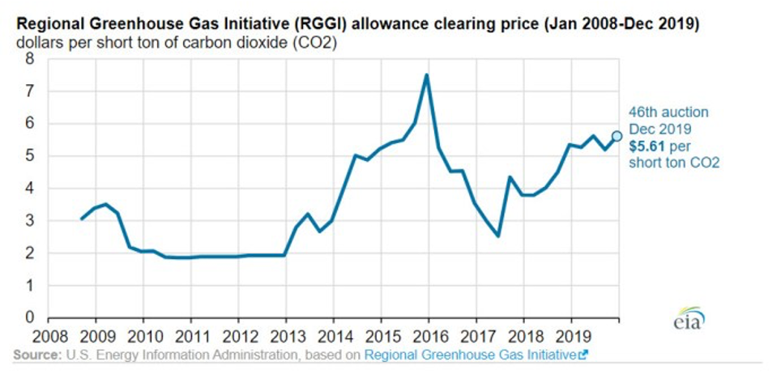
```
</center>

---

# RGGI

<center>
```{r, out.width = "70%", fig.pos="c", echo = FALSE}
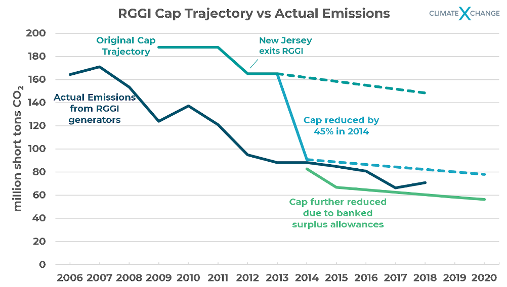
```
</center>

---

# AB32

<center>
```{r, out.width = "70%", fig.pos="c", echo = FALSE}
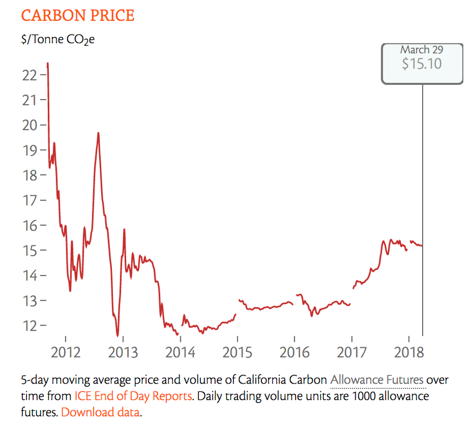
```
</center>

---

# EU-ETS

<center>
```{r, out.width = "70%", fig.pos="c", echo = FALSE}
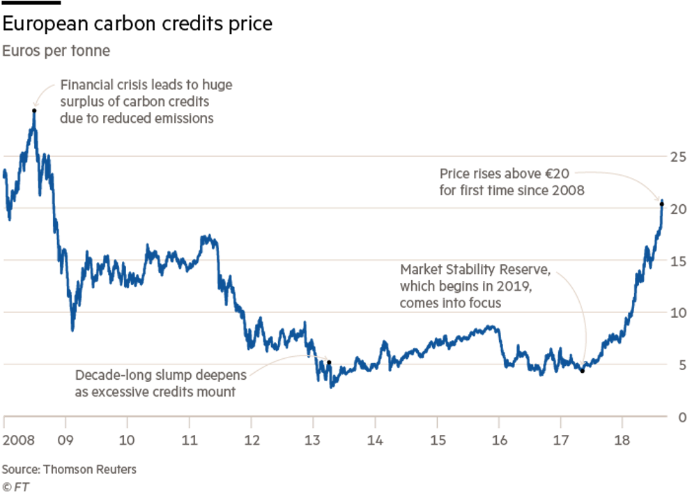
```
</center>

---

# AB32

<center>
```{r, out.width = "100%", fig.pos="c", echo = FALSE}
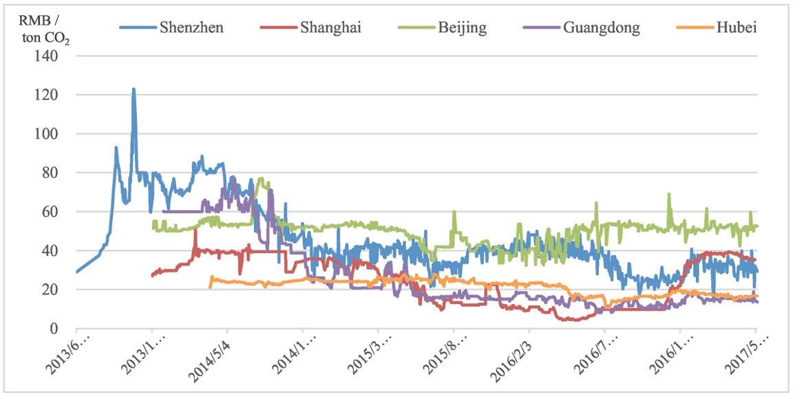
```
</center>


---

class: inverse, center, middle
name: policy comparison

# Comparison of standards, taxes, permits

<html><div style='float:left'></div><hr color='#EB811B' size=1px width=796px></html>

---

# What do we know so far

So far we have seen that:

1. Standards, taxes, and tradable permits can all achieve the efficient allocation
2. Taxes and tradable permits are cost-effective .hi[no matter what]
  - (all firms set MAC = $\tau$ and MAC = p)
  
--

This still leaves a few questions to answer:


1. What are the equity effects?
2. What are the output effects?
3. What are the administrative burdens?
4. What are the .hi[dynamic] incentives under these policies?

---

# The equity set up

.pull-left[
```{r base, echo = FALSE, fig.show = 'hide', warning = F}
mac <- function(x) 2 - 2/3*x
md <- function(x) x - 0.5

ggplot() +
  annotate("text", x = .3, y = 2, label = "MAC", size = 8) +
  annotate("text", x = 2.5, y = 2.5, label = "MD", size = 8) +
  annotate("text", x = 2.5, y = 0.9, label = "s, p", size = 8) +
  annotate("text", x = 2.5, y = 1.1, label = expression(tau), size = 8) +
  annotate("text", x = 2.15, y = .25, label = "A", size = 10, color = "black") +
  annotate("text", x = .5, y = .5, label = "B", size = 10, color = "black") +
  annotate("text", x = 1, y = .25, label = "C", size = 10, color = "black") +
  annotate("text", x = 2.65, y = 1.5, label = "D", size = 10, color = "black") +
  annotate("text", x = 2.15, y = .75, label = "E", size = 10, color = "black") +
  stat_function(fun = mac, color = "#ca5670", size = 1.5) +
  stat_function(fun = md, color = "#638ccc", size = 1.5) +
  annotate("segment", x = 1.5, xend = 1.5, y = 0, yend = 1,
           linetype = "dashed", size = 1.5, color = "grey50") +
  annotate("segment", x = 0, xend = 3, y = .99, yend = .99,
           linetype = "dashed", size = 1.5, color = "#000000") +
  theme_minimal() +
  theme(
    legend.position = "none",
    title = element_text(size = 24),
    axis.text.x = element_text(size = 24), axis.text.y = element_text(size = 24, color = "#eeeeee"),
    axis.title.x = element_text(size = 24), axis.title.y = element_text(size = 24),
    panel.grid.minor.x = element_blank(), panel.grid.major.y = element_blank(),
    panel.grid.minor.y = element_blank(), panel.grid.major.x = element_blank(),
    panel.background = element_rect(fill = "#eeeeee",colour = NA),
    plot.background = element_rect(fill = "#eeeeee",colour = NA),
    axis.line = element_line(colour = "black")
  ) +
  labs(x = "Emissions",
       y = "Capital/$") +
  scale_x_continuous(expand = c(0,0), limits = c(0,3.1), breaks = c(1.5,3), labels = c(expression(E^'*'), expression(E[0]))) +
  scale_y_continuous(expand = c(0,0), limits = c(0,3.1))

```

`)
]

.pull-right[

Lets consider this our base set up for 1 firm

The regulator can achieve $E^*$ through:

- an emission standard of $E^*$
- a tax of $\tau$
- an abatement subsidy of $s$
- "tradable permit" cap of $E^*$

]


---

# The equity set up

.pull-left[
`)
]

.pull-right[

First let's look at .hi[equity]

How do the costs and benefits of the policies fall on different groups?

From here on we will roll the tax and permit system into 1: they are actually identical in terms of their impacts

]


---

# The distributional outcomes

.pull-left[
`)
]

.pull-right[

|            	| Tax      	| Standard 	| Subsidy 	| Ranking         	|
|------------	|----------	|----------	|---------	|-----------------	|
| Firm       	| -(A+B+C) 	| -A       	| B+C-A   	| Sub > Std > Tax 	|
| Households 	| A+D+E    	| A+D+E    	| A+D+E   	| Indifferent     	|
| Government 	| B+C      	| 0        	| -(B+C)  	| Tax > Std > Sub 	|
| Total      	| D+E      	| D+E      	| D+E     	|                 	|

The total welfare gain is the same for all policies

The difference is in the .hi[distribution]

The standard strikes a middle ground out of the three

]

---

# Output effects

So far we have assumed that actual firm output is not affected by abatement/emission decisions

--

This won't always be true in the real world

--

Different policies have different implications for total cost and can thus affect production

--

To keep things simple lets suppose the firm has constant returns to scale technology and chooses the emissions rate / emissions per unit of output: $E/q$, this means that if they cut back on emissions it raises the MC of output


---

# Output effects

The policy requires the firm

---

# The output set up

.pull-left[
```{r output1, echo = FALSE, fig.show = 'hide', warning = F}
mac <- function(x) 2 - 2/3*x
md <- function(x) x - 0.5

ggplot() +
  annotate("text", x = .3, y = 2, label = "MAC", size = 8) +
  annotate("text", x = 2.5, y = 2.5, label = "MD", size = 8) +
  annotate("text", x = 2.15, y = .25, label = "A", size = 10, color = "black") +
  annotate("text", x = .5, y = .5, label = "B", size = 10, color = "black") +
  annotate("text", x = 1, y = .25, label = "C", size = 10, color = "black") +
  annotate("text", x = 2.65, y = 1.5, label = "D", size = 10, color = "black") +
  annotate("text", x = 2.15, y = .75, label = "E", size = 10, color = "black") +
  stat_function(fun = mac, color = "#ca5670", size = 1.5) +
  stat_function(fun = md, color = "#638ccc", size = 1.5) +
  annotate("segment", x = 1.5, xend = 1.5, y = 0, yend = 1,
           linetype = "dashed", size = 1.5, color = "grey50") +
  annotate("segment", x = 0, xend = 3, y = .99, yend = .99,
           linetype = "dashed", size = 1.5, color = "#000000") +
  theme_minimal() +
  theme(
    legend.position = "none",
    title = element_text(size = 24),
    axis.text.x = element_text(size = 24), axis.text.y = element_text(size = 24, color = "#eeeeee"),
    axis.title.x = element_text(size = 24), axis.title.y = element_text(size = 24),
    panel.grid.minor.x = element_blank(), panel.grid.major.y = element_blank(),
    panel.grid.minor.y = element_blank(), panel.grid.major.x = element_blank(),
    panel.background = element_rect(fill = "#eeeeee",colour = NA),
    plot.background = element_rect(fill = "#eeeeee",colour = NA),
    axis.line = element_line(colour = "black")
  ) +
  labs(x = "Emissions",
       y = "Capital/$") +
  scale_x_continuous(expand = c(0,0), limits = c(0,3.2), breaks = c(1.5,3), labels = c(expression(E^'*'/q^'*'), expression(E[0]/q[0]))) +
  scale_y_continuous(expand = c(0,0), limits = c(0,3.1))

```

`)
]

.pull-right[

```{r output2, echo = FALSE, fig.show = 'hide', warning = F}
mc1 <- function(x) 1
mc2 <- function(x) 1.5
md <- function(x) 2.5 - x

ggplot() +
  annotate("text", x = .3, y = 2, label = "D", size = 8) +
  annotate("text", x = 2.5, y = 1.6, label = expression(MC^'*'), size = 8) +
  annotate("text", x = 2.5, y = 1.1, label = expression(MC[0]), size = 8) +
  stat_function(fun = mc2, color = "#000000", size = 1.5) +
  stat_function(fun = mc1, color = "#ca5670", size = 1.5) +
  stat_function(fun = md, color = "#638ccc", size = 1.5) +
  annotate("segment", x = 1.5, xend = 1.5, y = 0, yend = 1,
           linetype = "dashed", size = 1.5, color = "grey50") +
  annotate("segment", x = 1, xend = 1, y = 0, yend = 1.5,
           linetype = "dashed", size = 1.5, color = "grey50") +
  theme_minimal() +
  theme(
    legend.position = "none",
    title = element_text(size = 24),
    axis.text.x = element_text(size = 24), axis.text.y = element_text(size = 24, color = "#eeeeee"),
    axis.title.x = element_text(size = 24), axis.title.y = element_text(size = 24),
    panel.grid.minor.x = element_blank(), panel.grid.major.y = element_blank(),
    panel.grid.minor.y = element_blank(), panel.grid.major.x = element_blank(),
    panel.background = element_rect(fill = "#eeeeee",colour = NA),
    plot.background = element_rect(fill = "#eeeeee",colour = NA),
    axis.line = element_line(colour = "black")
  ) +
  labs(x = "Emissions",
       y = "Capital/$") +
  scale_x_continuous(expand = c(0,0), limits = c(0,3.2), breaks = c(1,1.5), labels = c(expression(q^'*'), expression(q[0]))) +
  scale_y_continuous(expand = c(0,0), limits = c(0,3.1))

```

`)
]

]

---

# The output results

Emission tax:
- Firm chooses $E^*/q^*$
- Firm pays A+B+C in tax and abatement cost
- Costs rise, output falls
- Pollution $(E^*/q^*)*q^*$ falls even more since $q^*$ falls

---

# The output results

Emission standard:
- Firm pays A in abatement cost
- Costs rise and output falls (but not as much as under the tax!)
- Output and $E

---

# The output results

Abatement subsidy:
- Reduces firm costs
- This raises output
- Even though $E/q$ goes down, total emissions may go up because $q$ will rise

--

Cliffnotes:

- Output falls under taxes and standards
- This raises output prices
- Can have regressive effects through necessities like electricity or gas

---

# Administration

These policies are not equivalent in their cost of implementation

--

Enforcing a technology standard is very easy: you can inspect to see if they have installed the tech or not

--

Emission standards, taxes, subsidies require monitoring of emissions

--

Monitoring systems cost money

--

Firms have incentives to try to cheat!

---

# Administration

Pigouvian policies will not work as well for .hi[non-point sources] like cars or farms

--

With non-point sources we observe total emissions but not who emitted it

--

With non-point sources it often makes sense to use technology standards

--

Point sources like power plants are much easier to handle with Pigouvian policies like taxes


---

# Administration

Technology and emission standards typically guarantee some amount of emissions reductions

--

Taxes and subsidies guarantee firms pay a certain price but doesn't deliver us a guaranteed quantity

--

This might make things more politically difficult to pass

---

# Administration

When does C&C / technology standards make sense?

1. If there's a dominant technology where there's cost benefits to coordination or scale economies from production of the technology
2. High costs of monitoring/enforcement
3. High admin costs and little heterogeneity across firms

---

# Dynamic incentives


.pull-left[
```{r dynamic, echo = FALSE, fig.show = 'hide', warning = F}
mac <- function(x) 2 - 2/3*x
mac2 <- function(x) 3 - x
md <- function(x) 1
ggplot() +
  annotate("text", x = .3, y = 2, label = expression(MAC[2]), size = 8) +
  annotate("text", x = .3, y = 3, label = expression(MAC[1]), size = 8) +
  annotate("text", x = 2.75, y = 1.1, label = expression(tau), size = 8) +
  annotate("text", x = 2.75, y = 0.9, label = "s", size = 8) +
  stat_function(fun = mac2, color = "#000000", size = 1.5) +
  stat_function(fun = mac, color = "#ca5670", size = 1.5) +
  stat_function(fun = md, color = "#638ccc", size = 1.5) +
  annotate("segment", x = 1.5, xend = 1.5, y = 0, yend = 1,
           linetype = "dashed", size = 1.5, color = "grey50") +
  annotate("segment", x = 2, xend = 2, y = 0, yend = .99,
           linetype = "dashed", size = 1.5, color = "grey50") +
  annotate("text", x = 2.15, y = .25, label = "A", size = 8, color = "black") +
  annotate("text", x = 1.75, y = .25, label = "B", size = 8, color = "black") +
  annotate("text", x = 1, y = .25, label = "C", size = 8, color = "black") +
  annotate("text", x = 1.85, y = .9, label = "D", size = 8, color = "black") +
  annotate("text", x = 2.15, y = .75, label = "F", size = 8, color = "black") +
  theme_minimal() +
  theme(
    legend.position = "none",
    title = element_text(size = 24),
    axis.text.x = element_text(size = 24), axis.text.y = element_text(size = 24, color = "#eeeeee"),
    axis.title.x = element_text(size = 24), axis.title.y = element_text(size = 24),
    panel.grid.minor.x = element_blank(), panel.grid.major.y = element_blank(),
    panel.grid.minor.y = element_blank(), panel.grid.major.x = element_blank(),
    panel.background = element_rect(fill = "#eeeeee",colour = NA),
    plot.background = element_rect(fill = "#eeeeee",colour = NA),
    axis.line = element_line(colour = "black")
  ) +
  labs(x = "Emissions",
       y = "Capital/$") +
  scale_x_continuous(expand = c(0,0), limits = c(0,3.1), breaks = c(1.5,2,3), labels = c(expression(E[2]^'*'), expression(E[1]^'*'), expression(E[0]))) +
  scale_y_continuous(expand = c(0,0), limits = c(0,3.1))

```

`)
]

.pull-right[

What are the gains to the firm from moving to $MAC_2$?

.hi[Standard:] F (abatement cost reduction)

.hi[Emission Tax:] F + D (abatement cost and tax payment reduction)

.hi[Abatement Subsidy:] F + D (abatement cost reduction and abatement subsidy increase)

]


---

# Dynamic incentives


.pull-left[
`)
]

.pull-right[

What are the gains to the firm from moving to $MAC_2$?

Taxes and subsidies give greater incentives to innovate!

Once a firm meets a standard, there's no additional incentive beyond reducing abatement costs

Taxes and subsidies give the firm extra benefits for further reductions

]