exclude: true
```{r setup}
if (!require("pacman")) install.packages("pacman")
pacman::p_load(
  tidyverse, xaringanExtra, rlang, patchwork, nycflights13
)
source("R/video_helpers.R")
options(htmltools.dir.version = FALSE)
knitr::opts_hooks$set(fig.callout = function(options) {
  if (options$fig.callout) {
    options$echo <- FALSE
  }
knitr::opts_chunk$set(
  cache = TRUE,
  cache.extra = list(tools::md5sum("R/video_helpers.R")),
  echo = TRUE,
  fig.align = "center"
)
  options
})
```
```{r xaringanExtra, echo = FALSE}
xaringanExtra::use_xaringan_extra(c("panelset", "webcam"))

```
```{r echo=FALSE}
xaringanExtra::style_panelset(panel_tab_color_active = "red")
```

---

# Roadmap

1. How do tradable permit systems work in theory and in the real world?
2. What happens under a tradable permit system?


---

class: inverse, center, middle
name: tradable permits
 
# Tradable permits

<html><div style='float:left'></div><hr color='#EB811B' size=1px width=796px></html>

---

# Tradable permits

How do tradable permit systems work?<sup>1</sup>

.footnote[
<sup>1</sup> Tradable permit systems are also called cap and trade systems.
]

--

First, recall a regular emission standard: we set $\bar{E}$ at the point where MAC = MD

--

This is easy with one firm, but what if we have several, or hundreds?

---

# Optimal policy with multiple firms

Suppose the regulator chooses emissions for $N$ firms: $E_1,\dots,E_N$

--

Let firm $i$'s abatement cost be $C_i(E_i)$

--

Let total damages depend on aggregate emissions:
$$D = D\!\left(\sum_{i=1}^N E_i\right)$$

--

Regulator problem:
$$\min_{E_1,\dots,E_N}\;\sum_{i=1}^N C_i(E_i) + D\!\left(\sum_{i=1}^N E_i\right)$$

---

# Optimal policy with multiple firms

Take one FOC for each firm $i=1,\dots,N$:
$$\frac{\partial}{\partial E_i}\left[\sum_{j=1}^N C_j(E_j) + D\!\left(\sum_{j=1}^N E_j\right)\right] = 0$$
$$C_i'(E_i) + D'\!\left(\sum_{j=1}^N E_j\right) = 0$$

--

$$\underbrace{-C_i'(E_i)}_{MAC_i} = \underbrace{D'\!\left(\sum_{j=1}^N E_j\right)}_{MD}$$

---

# Optimal policy with multiple firms

$$\underbrace{-C_i'(E_i)}_{MAC_i} = \underbrace{D'\!\left(\sum_{j=1}^N E_j\right)}_{MD}$$

--

At the optimum:
$$MAC_1 = MAC_2 = \cdots = MAC_N = MD$$

This gives the target condition that we try to achieve through a decentralized permit market

---

# Optimal policy with multiple firms

.pull-left[
```{r multifirm, echo = FALSE, fig.show = 'hide', warning = F}
mac <- function(x) 2 - 2/3*x
mac2 <- function(x) 3 - x
md <- function(x) 1
ggplot() +
  annotate("text", x = .3, y = 2, label = expression(MAC[1]), size = 8) +
  annotate("text", x = .3, y = 3, label = expression(MAC[2]), size = 8) +
  annotate("text", x = 2.5, y = .9, label = "MD", size = 8) +
  stat_function(fun = mac2, color = "#000000", size = 1.5) +
  stat_function(fun = mac, color = "#ca5670", size = 1.5) +
  stat_function(fun = md, color = "#638ccc", size = 1.5) +
  annotate("segment", x = 1.5, xend = 1.5, y = 0, yend = 1,
           linetype = "dashed", size = 1.5, color = "grey50") +
  annotate("segment", x = 2, xend = 2, y = 0, yend = .99,
           linetype = "dashed", size = 1.5, color = "grey50") +
  theme_minimal() +
  theme(
    legend.position = "none",
    title = element_text(size = 24),
    axis.text.x = element_text(size = 24), axis.text.y = element_text(size = 24, color = "#ffffff"),
    axis.title.x = element_text(size = 24), axis.title.y = element_text(size = 24),
    panel.grid.minor.x = element_blank(), panel.grid.major.y = element_blank(),
    panel.grid.minor.y = element_blank(), panel.grid.major.x = element_blank(),
    panel.background = element_rect(fill = "#ffffff",colour = NA),
    plot.background = element_rect(fill = "#ffffff",colour = NA),
    axis.line = element_line(colour = "black")
  ) +
  labs(x = "Emissions",
       y = "Capital/$") +
  scale_x_continuous(expand = c(0,0), limits = c(0,3.1), breaks = c(1.5,2,3), labels = c(expression(E[1]^'*'), expression(E[2]^'*'), expression(E[0]))) +
  scale_y_continuous(expand = c(0,0), limits = c(0,3.1))

```

`)
]

.pull-right[

Firm #2 is 'dirty': has higher MAC

Firm #1 is 'clean': has lower MAC

If we use a regular emission standard: it has to be firm-specific!

Mandate $E^*_1$ for 1 and $E^*_2$ for 2

This requires .hi[a lot] of info and political capital on behalf of the regulator

]


---

# Tradable permit systems

So how do these systems make standards more flexible?

--

They allow firms to trade their emission allowances

--

E.g. if firms are restricted to $\bar{E}_1$ and $\bar{E}_2$, we can allow the firms to trade

--

If firm 1 sells an allowance/permit to firm 2, their new restrictions are: $\bar{E}_1 - 1$ and $\bar{E}_2 + 1$

--

Total emissions didn't change, but how much each firm gets to emit does through voluntary trade

---

# Tradable permit systems: example

The US Acid Rain Program is the classic example

--

Permit = license to create 1 ton of SO2

--

Phase I (1995-2000):  
- 6.3 million permits issued per year
- affected 263 generating units at 110 dirtiest power plants

Phase II (2000+):  
- 9 million permits issued per year
- affects all power plants over some minimum size

---

# Tradable permit systems: example

<center>
```{r, out.width = "40%", fig.pos="c", echo = FALSE}
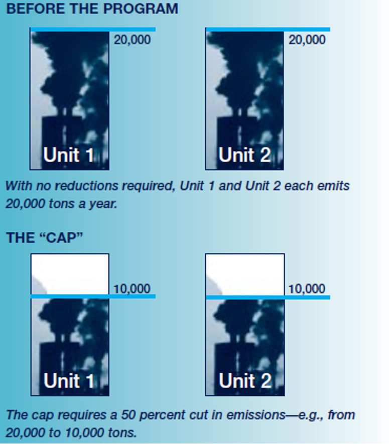
```
</center>

---

# Tradable permit systems: example

<center>
```{r, out.width = "70%", fig.pos="c", echo = FALSE}
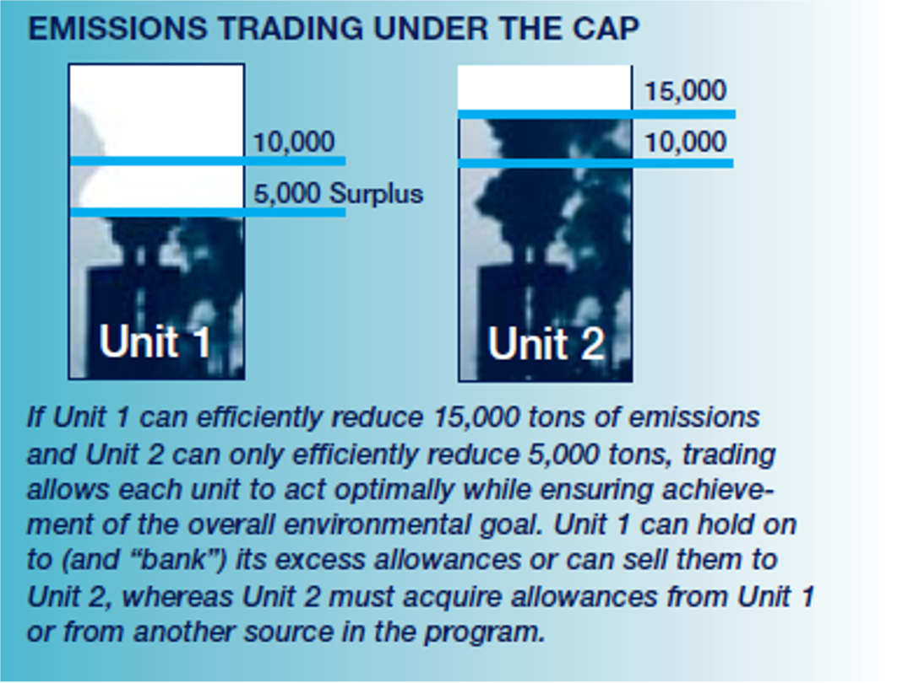
```
</center>

---

# Tradable permit systems: example

<center>
```{r, out.width = "80%", fig.pos="c", echo = FALSE}
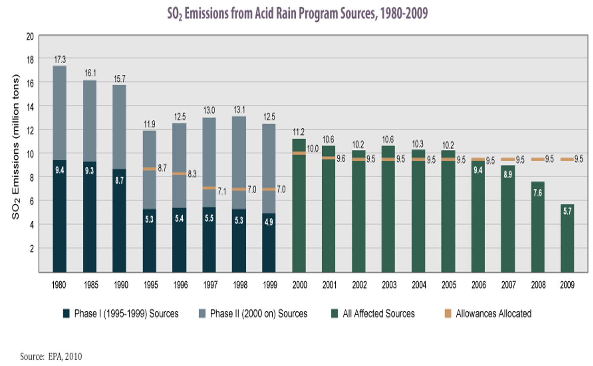
```
</center>

---

# Tradable permit systems: example

<center>
```{r, out.width = "80%", fig.pos="c", echo = FALSE}
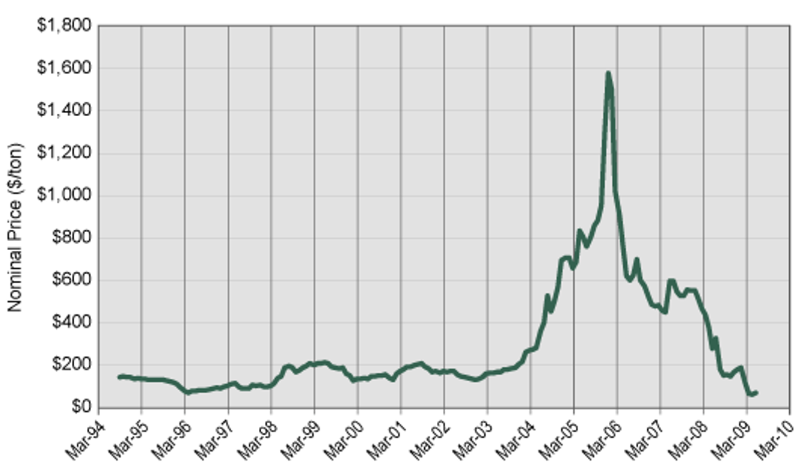
```
</center>

---

# Tradable permit systems: example

<center>
```{r, out.width = "100%", fig.pos="c", echo = FALSE}
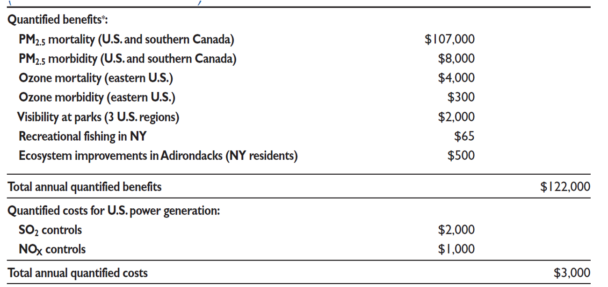
```
</center>


---

# Tradable permits: graphical

.pull-left[
```{r permits, echo = FALSE, fig.show = 'hide', warning = F}
mac <- function(x) 2 - 2/3*x
mac2 <- function(x) 3 - x
ggplot() +
  annotate("text", x = .3, y = 2, label = expression(MAC[1]), size = 8) +
  annotate("text", x = .3, y = 3, label = expression(MAC[2]), size = 8) +
  stat_function(fun = mac2, color = "#000000", size = 1.5) +
  stat_function(fun = mac, color = "#ca5670", size = 1.5) +
  annotate("segment", x = 1.5, xend = 1.5, y = 0, yend = 3,
           linetype = "longdash", size = 1.5, color = "black") +
  theme_minimal() +
  theme(
    legend.position = "none",
    title = element_text(size = 24),
    axis.text.x = element_text(size = 24), axis.text.y = element_text(size = 24, color = "#ffffff"),
    axis.title.x = element_text(size = 24), axis.title.y = element_text(size = 24),
    panel.grid.minor.x = element_blank(), panel.grid.major.y = element_blank(),
    panel.grid.minor.y = element_blank(), panel.grid.major.x = element_blank(),
    panel.background = element_rect(fill = "#ffffff",colour = NA),
    plot.background = element_rect(fill = "#ffffff",colour = NA),
    axis.line = element_line(colour = "black")
  ) +
  labs(x = "Emissions",
       y = "Capital/$") +
  scale_x_continuous(expand = c(0,0), limits = c(0,3.1), breaks = c(1.5), labels = c(expression(bar(E)/2))) +
  scale_y_continuous(expand = c(0,0), limits = c(0,3.1))

```

`)
]

.pull-right[

Suppose we want to limit to $\bar{E}$ total emissions so each firm gets $\bar{E}/2$ permits, but cant trade them

.hi[Is it efficient?]

]

---
count: false

# Tradable permits: graphical

.pull-left[
`)
]

.pull-right[

Suppose we want to limit to $\bar{E}$ total emissions so each firm gets $\bar{E}/2$ permits, but cant trade them

.hi[This can't be efficient] (i.e. maximize social welfare given some MD curve)

]

---
count: false

# Tradable permits: graphical

.pull-left[
`)
]

.pull-right[

Suppose we want to limit to $\bar{E}$ total emissions so each firm gets $\bar{E}/2$ permits, but cant trade them

.hi[This can't be efficient] (i.e. maximize social welfare given some MD curve)

.hi-red[Is it cost-effective?]

]

---
count: false

# Tradable permits: graphical

.pull-left[
`)
]

.pull-right[

Suppose we want to limit to $\bar{E}$ total emissions so each firm gets $\bar{E}/2$ permits, but cant trade them

.hi[This can't be efficient] (i.e. maximize social welfare given some MD curve)

.hi-red[It also can't be cost-effective:] it doesn't minimize the cost of achieving $\bar{E}$ total emissions

]

---

# Tradable permits: cost-effectiveness

For cost-effectiveness, we need total costs to be minimized for achieving a given level of emissions:
$$\min_{E_1, E_2} C_1(E_1) + C_2(E_2) \,\,\, \text{subject to: } E_1 + E_2 = \bar{E}$$

This is the same problem as:
$$\min_{E_1, E_2} C_1(E_1) + C_2(\bar{E} - E_1)$$

which has a solution where:
$$-C_1'(E_1^*) = -C_2'(\bar{E} - E^*_1)$$

---

# Tradable permits: cost-effectiveness

Cost-effectiveness requires:
$$-C_1'(E_1^*) = -C_2'(\bar{E} - E^*_1) \leftrightarrow MAC_1 = MAC_2$$

That marginal abatement costs are equal across all emitters

--

If firms have different MAC curves, giving them the same amount of emissions/permits cannot be optimal

--

How do we fix this?

--

Let them trade the permits


---

# Tradable permits: graphical

.pull-left[
```{r permits-dwl0, echo = FALSE, fig.show = 'hide', warning = F}
mac <- function(x) 2 - 2/3*x
mac2 <- function(x) 3 - x
dwl <- tibble(x = c(1.5, 3.5/2, 3.5/2),
                     y = c(1, 1, 2-2/3*(3.5/2)))
dwl2 <- tibble(x = c(3.5/2, 2, 3.5/2),
                     y = c(1, 1, 3-3.5/2))
ggplot() +
  annotate("text", x = .3, y = 2, label = expression(MAC[1]), size = 8) +
  annotate("text", x = .3, y = 3, label = expression(MAC[2]), size = 8) +
  stat_function(fun = mac2, color = "#638ccc", size = 1.5) +
  stat_function(fun = mac, color = "#ca5670", size = 1.5) +
  annotate("segment", x = 3.5/2, xend = 3.5/2, y = 0, yend = 3,
           linetype = "longdash", size = 1.5, color = "black") +
  theme_minimal() +
  theme(
    legend.position = "none",
    title = element_text(size = 24),
    axis.text.x = element_text(size = 24), axis.text.y = element_text(size = 24, color = "#ffffff"),
    axis.title.x = element_text(size = 24), axis.title.y = element_text(size = 24),
    panel.grid.minor.x = element_blank(), panel.grid.major.y = element_blank(),
    panel.grid.minor.y = element_blank(), panel.grid.major.x = element_blank(),
    panel.background = element_rect(fill = "#ffffff",colour = NA),
    plot.background = element_rect(fill = "#ffffff",colour = NA),
    axis.line = element_line(colour = "black")
  ) +
  labs(x = "Emissions",
       y = "Capital/$") +
  scale_x_continuous(expand = c(0,0), limits = c(0,3.1), breaks = c(3.5/2), labels = c(expression(bar(E)/2))) +
  scale_y_continuous(expand = c(0,0), limits = c(0,3.1))

```

`)
]

.pull-right[

We can reduce costs by increasing abatement at which firm, and decreasing abatement at which firm?

]

---

# Tradable permits: graphical

.pull-left[
```{r permits-dwl1, echo = FALSE, fig.show = 'hide', warning = F}
mac <- function(x) 2 - 2/3*x
mac2 <- function(x) 3 - x
dwl <- tibble(x = c(1.5, 3.5/2, 3.5/2),
                     y = c(1, 1, 2-2/3*(3.5/2)))
dwl2 <- tibble(x = c(3.5/2, 2, 3.5/2),
                     y = c(1, 1, 3-3.5/2))
ggplot() +
  annotate("text", x = .3, y = 2, label = expression(MAC[1]), size = 8) +
  annotate("text", x = .3, y = 3, label = expression(MAC[2]), size = 8) +
  stat_function(fun = mac2, color = "#638ccc", size = 1.5) +
  stat_function(fun = mac, color = "#ca5670", size = 1.5) +
  annotate("segment", x = 3.5/2, xend = 3.5/2, y = 0, yend = 3,
           linetype = "longdash", size = 1.5, color = "black") +
  annotate("segment", x = 1.5, xend = 1.5, y = 0, yend = 1,
           linetype = "dashed", size = 1.5, color = "grey50") +
  annotate("segment", x = 2, xend = 2, y = 0, yend = 1,
           linetype = "dashed", size = 1.5, color = "grey50") +
  annotate("segment", x = 0, xend = 3, y = 1, yend = 1,
           linetype = "dotted", size = 1.5, color = "black") +
  theme_minimal() +
  theme(
    legend.position = "none",
    title = element_text(size = 24),
    axis.text.x = element_text(size = 24), axis.text.y = element_text(size = 24, color = "#ffffff"),
    axis.title.x = element_text(size = 24), axis.title.y = element_text(size = 24),
    panel.grid.minor.x = element_blank(), panel.grid.major.y = element_blank(),
    panel.grid.minor.y = element_blank(), panel.grid.major.x = element_blank(),
    panel.background = element_rect(fill = "#ffffff",colour = NA),
    plot.background = element_rect(fill = "#ffffff",colour = NA),
    axis.line = element_line(colour = "black")
  ) +
  labs(x = "Emissions",
       y = "Capital/$") +
  scale_x_continuous(expand = c(0,0), limits = c(0,3.1), breaks = c(1.5, 3.5/2,2 ), labels = c(expression(E[1]), expression(bar(E)/2), expression(E[2]))) +
  scale_y_continuous(expand = c(0,0), limits = c(0,3.1))

```

`)
]

.pull-right[

We can reduce costs by increasing emissions at high MAC firm 2 and decreasing emissions at low MAC firm 1 until they are equal

]


---

# Tradable permits: graphical

.pull-left[
```{r permits-dwl-save2, echo = FALSE, fig.show = 'hide', warning = F}
mac = function(x) 2 - 2/3*x
mac2 = function(x) 3 - x
x_l = 1.5
x_m = 3.5/2
x_r = 2
p = 1
savings2 = tibble(
  x = c(x_m, x_r, x_r, x_m),
  y = c(0, 0, mac2(x_r), mac2(x_m))
)
ggplot() +
  geom_polygon(data = savings2, aes(x = x, y = y), fill = "#638ccc", alpha = 0.35) +
  annotate("text", x = .3, y = 2, label = expression(MAC[1]), size = 8) +
  annotate("text", x = .3, y = 3, label = expression(MAC[2]), size = 8) +
  stat_function(fun = mac2, color = "#638ccc", size = 1.5) +
  stat_function(fun = mac, color = "#ca5670", size = 1.5) +
  annotate("segment", x = x_m, xend = x_m, y = 0, yend = 3,
           linetype = "longdash", size = 1.5, color = "black") +
  annotate("segment", x = x_r, xend = x_r, y = 0, yend = p,
           linetype = "dashed", size = 1.5, color = "grey50") +
  annotate("segment", x = 0, xend = 3, y = p, yend = p,
           linetype = "dotted", size = 1.5, color = "black") +
  theme_minimal() +
  theme(
    legend.position = "none",
    title = element_text(size = 24),
    axis.text.x = element_text(size = 24), axis.text.y = element_text(size = 24, color = "#ffffff"),
    axis.title.x = element_text(size = 24), axis.title.y = element_text(size = 24),
    panel.grid.minor.x = element_blank(), panel.grid.major.y = element_blank(),
    panel.grid.minor.y = element_blank(), panel.grid.major.x = element_blank(),
    panel.background = element_rect(fill = "#ffffff",colour = NA),
    plot.background = element_rect(fill = "#ffffff",colour = NA),
    axis.line = element_line(colour = "black")
  ) +
  labs(x = "Emissions",
       y = "Capital/$") +
  scale_x_continuous(expand = c(0,0), limits = c(0,3.1),
                     breaks = c(x_m, x_r),
                     labels = c(expression(bar(E)/2), expression(E[2]))) +
  scale_y_continuous(expand = c(0,0), limits = c(0,3.1))

```

`)
]

.pull-right[

Step 1: allow firm 2 (high MAC) to emit more, from $\bar{E}/2$ to $E_2$

The blue shaded area is firm 2's cost saving

]

---

# Tradable permits: graphical

.pull-left[
```{r permits-dwl-cost1, echo = FALSE, fig.show = 'hide', warning = F}
mac = function(x) 2 - 2/3*x
mac2 = function(x) 3 - x
x_l = 1.5
x_m = 3.5/2
x_r = 2
p = 1
cost1 = tibble(
  x = c(x_l, x_m, x_m, x_l),
  y = c(0, 0, mac(x_m), mac(x_l))
)
ggplot() +
  geom_polygon(data = cost1, aes(x = x, y = y), fill = "#EB811B", alpha = 0.35) +
  annotate("text", x = .3, y = 2, label = expression(MAC[1]), size = 8) +
  annotate("text", x = .3, y = 3, label = expression(MAC[2]), size = 8) +
  stat_function(fun = mac2, color = "#638ccc", size = 1.5) +
  stat_function(fun = mac, color = "#ca5670", size = 1.5) +
  annotate("segment", x = x_l, xend = x_l, y = 0, yend = p,
           linetype = "dashed", size = 1.5, color = "grey50") +
  annotate("segment", x = x_m, xend = x_m, y = 0, yend = 3,
           linetype = "longdash", size = 1.5, color = "black") +
  annotate("segment", x = 0, xend = 3, y = p, yend = p,
           linetype = "dotted", size = 1.5, color = "black") +
  theme_minimal() +
  theme(
    legend.position = "none",
    title = element_text(size = 24),
    axis.text.x = element_text(size = 24), axis.text.y = element_text(size = 24, color = "#ffffff"),
    axis.title.x = element_text(size = 24), axis.title.y = element_text(size = 24),
    panel.grid.minor.x = element_blank(), panel.grid.major.y = element_blank(),
    panel.grid.minor.y = element_blank(), panel.grid.major.x = element_blank(),
    panel.background = element_rect(fill = "#ffffff",colour = NA),
    plot.background = element_rect(fill = "#ffffff",colour = NA),
    axis.line = element_line(colour = "black")
  ) +
  labs(x = "Emissions",
       y = "Capital/$") +
  scale_x_continuous(expand = c(0,0), limits = c(0,3.1),
                     breaks = c(x_l, x_m),
                     labels = c(expression(E[1]), expression(bar(E)/2))) +
  scale_y_continuous(expand = c(0,0), limits = c(0,3.1))

```

`)
]

.pull-right[

Step 2: firm 1 (low MAC) emits less, from $\bar{E}/2$ to $E_1$

The orange shaded area is firm 1's cost increase

]

---

# Tradable permits: graphical

.pull-left[
```{r permits-dwl-net, echo = FALSE, fig.show = 'hide', warning = F}
mac = function(x) 2 - 2/3*x
mac2 = function(x) 3 - x
x_l = 1.5
x_m = 3.5/2
x_r = 2
p = 1
rect1 = tibble(x = c(x_l, x_m, x_m, x_l), y = c(0, 0, p, p))
rect2 = tibble(x = c(x_m, x_r, x_r, x_m), y = c(0, 0, p, p))
tri1 = tibble(x = c(x_l, x_m, x_m), y = c(p, p, mac(x_m)))
tri2 = tibble(x = c(x_m, x_r, x_m), y = c(p, p, mac2(x_m)))
ggplot() +
  geom_polygon(data = rect1, aes(x = x, y = y), fill = "grey70", alpha = 0.3) +
  geom_polygon(data = rect2, aes(x = x, y = y), fill = "grey70", alpha = 0.3) +
  geom_polygon(data = tri1, aes(x = x, y = y), fill = "red", alpha = 0.5) +
  geom_polygon(data = tri2, aes(x = x, y = y), fill = "red", alpha = 0.5) +
  annotate("text", x = .3, y = 2, label = expression(MAC[1]), size = 8) +
  annotate("text", x = .3, y = 3, label = expression(MAC[2]), size = 8) +
  stat_function(fun = mac2, color = "#638ccc", size = 1.5) +
  stat_function(fun = mac, color = "#ca5670", size = 1.5) +
  annotate("segment", x = x_l, xend = x_l, y = 0, yend = p,
           linetype = "dashed", size = 1.5, color = "grey50") +
  annotate("segment", x = x_m, xend = x_m, y = 0, yend = 3,
           linetype = "longdash", size = 1.5, color = "black") +
  annotate("segment", x = x_r, xend = x_r, y = 0, yend = p,
           linetype = "dashed", size = 1.5, color = "grey50") +
  annotate("segment", x = 0, xend = 3, y = p, yend = p,
           linetype = "dotted", size = 1.5, color = "black") +
  theme_minimal() +
  theme(
    legend.position = "none",
    title = element_text(size = 24),
    axis.text.x = element_text(size = 24), axis.text.y = element_text(size = 24, color = "#ffffff"),
    axis.title.x = element_text(size = 24), axis.title.y = element_text(size = 24),
    panel.grid.minor.x = element_blank(), panel.grid.major.y = element_blank(),
    panel.grid.minor.y = element_blank(), panel.grid.major.x = element_blank(),
    panel.background = element_rect(fill = "#ffffff",colour = NA),
    plot.background = element_rect(fill = "#ffffff",colour = NA),
    axis.line = element_line(colour = "black")
  ) +
  labs(x = "Emissions",
       y = "Capital/$") +
  scale_x_continuous(expand = c(0,0), limits = c(0,3.1),
                     breaks = c(x_l, x_m, x_r),
                     labels = c(expression(E[1]), expression(bar(E)/2), expression(E[2]))) +
  scale_y_continuous(expand = c(0,0), limits = c(0,3.1))

```

`)
]

.pull-right[

Step 3: net cost change from trading

The grey rectangles are equal (same height and same width $\Delta E$), so they cancel out

What remains is the two red triangles: the net cost reduction from reallocation

]

---

# Tradable permits: graphical

.pull-left[
```{r permits-dwl, echo = FALSE, fig.show = 'hide', warning = F}
mac <- function(x) 2 - 2/3*x
mac2 <- function(x) 3 - x
dwl <- tibble(x = c(1.5, 3.5/2, 3.5/2),
                     y = c(1, 1, 2-2/3*(3.5/2)))
dwl2 <- tibble(x = c(3.5/2, 2, 3.5/2),
                     y = c(1, 1, 3-3.5/2))
ggplot() +
  geom_polygon(data = dwl, aes(x = x, y = y), fill = "red", alpha = 0.5) +
  geom_polygon(data = dwl2, aes(x = x, y = y), fill = "red", alpha = 0.5) +
  annotate("text", x = .3, y = 2, label = expression(MAC[1]), size = 8) +
  annotate("text", x = .3, y = 3, label = expression(MAC[2]), size = 8) +
  stat_function(fun = mac2, color = "#638ccc", size = 1.5) +
  stat_function(fun = mac, color = "#ca5670", size = 1.5) +
  annotate("segment", x = 3.5/2, xend = 3.5/2, y = 0, yend = 3,
           linetype = "longdash", size = 1.5, color = "black") +
  annotate("segment", x = 1.5, xend = 1.5, y = 0, yend = 1,
           linetype = "dashed", size = 1.5, color = "grey50") +
  annotate("segment", x = 2, xend = 2, y = 0, yend = 1,
           linetype = "dashed", size = 1.5, color = "grey50") +
  annotate("segment", x = 0, xend = 3, y = 1, yend = 1,
           linetype = "dotted", size = 1.5, color = "black") +
  theme_minimal() +
  theme(
    legend.position = "none",
    title = element_text(size = 24),
    axis.text.x = element_text(size = 24), axis.text.y = element_text(size = 24, color = "#ffffff"),
    axis.title.x = element_text(size = 24), axis.title.y = element_text(size = 24),
    panel.grid.minor.x = element_blank(), panel.grid.major.y = element_blank(),
    panel.grid.minor.y = element_blank(), panel.grid.major.x = element_blank(),
    panel.background = element_rect(fill = "#ffffff",colour = NA),
    plot.background = element_rect(fill = "#ffffff",colour = NA),
    axis.line = element_line(colour = "black")
  ) +
  labs(x = "Emissions",
       y = "Capital/$") +
  scale_x_continuous(expand = c(0,0), limits = c(0,3.1), breaks = c(1.5, 3.5/2,2 ), labels = c(expression(E[1]), expression(bar(E)/2), expression(E[2]))) +
  scale_y_continuous(expand = c(0,0), limits = c(0,3.1))

```

`)
]

.pull-right[

We can reduce costs by increasing emissions at high MAC firm 2 and decreasing emissions at low MAC firm 1 until they are equal

This allows us to recover DWL equal to the red area

The red area is the difference in areas under MAC2 and MAC1 over the range of emissions changes

]

---

# Tradable permits: graphical

.pull-left[
```{r permits-reallo, echo = FALSE, fig.show = 'hide', warning = F}
mac <- function(x) 2 - 2/3*x
mac2 <- function(x) 3 - x
ggplot() +
  annotate("text", x = .3, y = 2, label = expression(MAC[1]), size = 8) +
  annotate("text", x = .3, y = 3, label = expression(MAC[2]), size = 8) +
  stat_function(fun = mac2, color = "#638ccc", size = 1.5) +
  stat_function(fun = mac, color = "#ca5670", size = 1.5) +
  annotate("segment", x = 3.5/2, xend = 3.5/2, y = 0, yend = 3,
           linetype = "longdash", size = 1.5, color = "black") +
  annotate("segment", x = 0, xend = 3, y = 1, yend = 1,
           linetype = "dotted", size = 1.5, color = "black") +
  annotate("segment", x = 0, xend = 3.5/2, y = 2 - 2/3*3.5/2, yend = 2 - 2/3*3.5/2,
           linetype = "dashed", size = 1.5, color = "grey50") +
  annotate("segment", x = 0, xend = 3.5/2, y = 3-3.5/2, yend = 3-3.5/2,
           linetype = "dashed", size = 1.5, color = "grey50") +
  annotate("point", x = 3.5/2, y = 3-3.5/2, size = 8, color = "#638ccc") +
  annotate("point", x = 3.5/2, y = 2 - 2/3*3.5/2, size = 8, color = "#ca5670") +
  annotate("segment", x = 0, xend = 3, y = 1, yend = 1,
           linetype = "dotted", size = 1.5, color = "black") +
  theme_minimal() +
  theme(
    legend.position = "none",
    title = element_text(size = 24),
    axis.text.x = element_text(size = 24), axis.text.y = element_text(size = 24),
    axis.title.x = element_text(size = 24), axis.title.y = element_text(size = 24),
    panel.grid.minor.x = element_blank(), panel.grid.major.y = element_blank(),
    panel.grid.minor.y = element_blank(), panel.grid.major.x = element_blank(),
    panel.background = element_rect(fill = "#ffffff",colour = NA),
    plot.background = element_rect(fill = "#ffffff",colour = NA),
    axis.line = element_line(colour = "black")
  ) +
  labs(x = "Emissions",
       y = "Capital/$") +
  scale_x_continuous(expand = c(0,0), limits = c(0,3.1), breaks = c(3.5/2), labels = c(expression(bar(E)/2))) +
  scale_y_continuous(expand = c(0,0), limits = c(0,3.1), breaks = c(2 - 2/3*3.5/2, 1, 3 - 3.5/2), labels = c(".83", "1", "1.25"))

```
`)
]

.pull-right[

We want to equalize MACs for cost-effectiveness, but does the permit market cause this to happen?

]


---

# Tradable permits: graphical

.pull-left[
`)
]

.pull-right[

We want to equalize MACs for cost-effectiveness, but does the permit market cause this to happen?

Firm 2 is willing to pay a price up to the blue point (1.25) to be able to emit 1 more unit

Firm 1 can abate 1 more unit at cost equal to the red point (0.83)

]


---

# Tradable permits: graphical

.pull-left[
`)
]

.pull-right[

Firm 2 can buy the right to emit 1 unit of pollution from firm 1 for anywhere between 1.25 and 0.83 and .hi[both will be better off] [very Coasean!]

These trades can be done until the MACs are equal at a value of 1

This would be the prevailing permit price in a tradable permit system

]


---

# Tradable permits: graphical

.pull-left[
`)
]

.pull-right[

An alternative way to think about it:

the prevailing permit price is the MC of freeing up one more permit, the MAC of the selling firm

or it is the MB of freeing up one more permit (avoided MAC), the MAC of the buying firm

]

---

# Tradable permits: firm

We can also see this result mathematically

--

Suppose there is a permit price $p$ in the competitive tradable permit market

--

Firms are price-takers in the permit market

--

Let's set up the firm problem: they want to minimize the cost of satisfying the policy

---

# Tradable permits: firm

The firm's problem is then:
$$ \min_E C(E) + p E$$

The firm's first-order condition to minimize costs is:
$$-C'(E^*) = p$$

--

The firm minimizes costs by choosing emissions $E^*$ so that its MAC equals the permit price

---

# Tradable permits: cost-effectiveness

This makes sense!

--

The permit price is the MC of emitting, the MAC is the MB of emitting (reduced abatement cost)

--

Alternatively: the permit price is the MB of abating, the MAC is the MC of abating

--

Costs are minimized when these two things are equal


---

# Tradable permits: cost-effectiveness

What else does firm behavior tell us about permits?

--

If firms all set their MACs equal to $p$ then all their MACs are equal to one another, .hi[we have cost-effectiveness:]
$$-C_1'(E^*_1) = -C_2'(E^*_2) = \dots = -C_N'(E^*_N) = p$$

--

Taxes and permits both achieve cost-effectiveness

--

Why?

--

Because firms treat permit prices and a tax identically in decisionmaking


---

# Tradable permits: cost-effectiveness

Tradable permit systems are .hi[always] cost-effective: whatever emissions limit you set, it will be achieved at least-cost

--

This does not mean that it is necessarily efficient!

---

# Tradable permits: efficiency

For efficiency, we also need MAC = MD

--

To keep things simple suppose MD is constant and the same across all firms: $MD = d$

--

If we can set $\bar{E}$ such that the equilibrium permit price $p = d$, then we also have efficiency


<!-- --- -->

<!-- # Tradable permits: efficiency -->

<!-- Suppose we set $\bar{E}$ to be the sum of the efficient level of emissions across all firms $\sum_i E^*_i$, where $E^*_i$ is where $MAC_i = d$ -->

<!-- -- -->

<!-- Firms will trade until their MACs are all equal -->

<!-- -- -->

<!-- Since there's only $\bar{E} = E^*$ permits, we already know MACs are equal at $\{E^*_1, \dots, E^*_N\}$ where $\sum_i E^*_i = E^*_i$  -->

<!-- This is where their MACs all equal $d$ and each other -->

<!-- -- -->

<!-- We also know in the permit market equilibrium we have $MAC = p$, so this means that we must have $p = d = MD$! -->

---

# Tradable permits in practice

Knowing MD is often difficult in practice

--

Tradable permit systems are nice because we can just let politicians choose a $\bar{E}$ that is politically feasible, and then the permit market ensures that we get the associated emissions reductions at least-cost

--

What often happens in practice is $\bar{E}$ starts high, giving us a low $p$, and then $\bar{E}$ gets ratcheted down over time

---

# Tradable permits: numerical example

Suppose two firms trade permits with total cap:
$$E_1 + E_2 = \bar{E} = 90$$

--

Abatement cost functions:
$$C_1(E_1) = \frac{1}{2}(90-E_1)^2,\qquad C_2(E_2) = \frac{1}{4}(150-2E_2)^2$$

--

So marginal abatement costs are:
$$MAC_1(E_1) = -C_1'(E_1) = 90 - E_1$$
$$MAC_2(E_2) = -C_2'(E_2) = 150 - 2E_2$$

---

# Tradable permits: numerical example

In a competitive permit market:
$$MAC_1(E_1^*) = p,\qquad MAC_2(E_2^*) = p,\qquad E_1^*+E_2^* = \bar{E} = 90$$

--

Plug in the MAC expressions:
$$90-E_1^* = p,\qquad 150-2E_2^* = p,\qquad E_1^*+E_2^* = 90$$

--

Solve:
$$E_1^* = 40,\qquad E_2^* = 50,\qquad p^* = 50$$

--

Firm 2 has higher MAC at an equal split, so it buys permits and emits more in equilibrium.

---

# Tradable permits: numerical example

.pull-left[
```{r permits-numeric-eq, echo = FALSE, fig.show = 'hide', warning = F}
mac1 = function(x) 90 - x
mac2 = function(x) 150 - 2*x
e1_star = 40
e2_star = 50
e_bar = 90
p_star = 50

ggplot() +
  annotate("text", x = 16, y = 86, label = expression(MAC[1]), color = "#ca5670", size = 8) +
  annotate("text", x = 16, y = 136, label = expression(MAC[2]), color = "#638ccc", size = 8) +
  stat_function(fun = mac1, color = "#ca5670", size = 1.5) +
  stat_function(fun = mac2, color = "#638ccc", size = 1.5) +
  annotate("segment", x = e_bar/2, xend = e_bar/2, y = 0, yend = 150,
           linetype = "longdash", size = 1.3, color = "black") +
  annotate("segment", x = e1_star, xend = e1_star, y = 0, yend = p_star,
           linetype = "dashed", size = 1.3, color = "grey50") +
  annotate("segment", x = e2_star, xend = e2_star, y = 0, yend = p_star,
           linetype = "dashed", size = 1.3, color = "grey50") +
  annotate("segment", x = 0, xend = 60, y = p_star, yend = p_star,
           linetype = "dotted", size = 1.3, color = "black") +
  annotate("text", x = 56, y = p_star + 4, label = expression(p^"*"), size = 7) +
  theme_minimal() +
  theme(
    legend.position = "none",
    axis.text.x = element_text(size = 22),
    axis.text.y = element_text(size = 18),
    axis.title.x = element_text(size = 24),
    axis.title.y = element_text(size = 24),
    panel.grid.minor = element_blank(),
    panel.grid.major = element_blank(),
    panel.background = element_rect(fill = "#ffffff", colour = NA),
    plot.background = element_rect(fill = "#ffffff", colour = NA),
    axis.line = element_line(colour = "black")
  ) +
  labs(x = "Emissions", y = "Capital/$") +
  scale_x_continuous(expand = c(0,0), limits = c(0,60),
                     breaks = c(e1_star, e_bar/2, e2_star),
                     labels = c(expression(E[1]^"*"), expression(frac(bar(E),2)), expression(E[2]^"*"))) +
  scale_y_continuous(expand = c(0,0), limits = c(0,150))

```

`)
]

.pull-right[

Numerical solution:
$$E_1^* = 40,\quad E_2^* = 50,\quad p^* = 50$$

Starting from equal allocation ($\frac{\bar{E}}{2} = 45$ each):

- firm 1 sells permits and emits less
- firm 2 buys permits and emits more

]

---

# Political economy of permits

Firms are often more willing to accept a higher $p$ than $\tau$ because they are often endowed with (some) permits for free

--

This means that *in practice*, we might expect to get greater emissions reductions under a permit system than a tax because of these political economy reasons

--

This is one of the key reasons the 1990 CAA amendments were able to be passed

---

# Permit market challenges

.hi-red[How we do initially allocate permits?]

--

.hi-blue[Auction] charge firms for each permit they hold, let price be set by marketplace, revenues can be used in other ways by the government, auction price will be the same as a Pigouvian tax

--

.hi-blue[Lottery]: Randomly assign permits

--

.hi-blue[Grandfathering]: give permits to existing firms based on historical emissions

---

# Permit auctions

Recall the firm's problem when a permit costs $p$:
$$\min_E\; C(E) + pE \quad\Rightarrow\quad MAC(E) = p$$

--

Flip it around: at price $p$, the firm wants permits up to where $MAC(E) = p$

--

.hi[The MAC curve is the firm's demand curve for permits]

--

Each permit lets the firm emit one more unit, so it is worth the abatement cost it avoids

---

# Permit auctions: MAC is permit demand

.pull-left[
```{r permits-auction-demand, echo = FALSE, fig.show = 'hide', warning = F}
# Theme shared by the permit-auction figures, matching the other permit figures.
permit_auction_theme <-
  theme_minimal() +
  theme(
    legend.position = "none",
    axis.text.x = element_text(size = 22),
    axis.text.y = element_text(size = 18),
    axis.title.x = element_text(size = 24),
    axis.title.y = element_text(size = 24),
    panel.grid.minor = element_blank(),
    panel.grid.major = element_blank(),
    panel.background = element_rect(fill = "#ffffff", colour = NA),
    plot.background = element_rect(fill = "#ffffff", colour = NA),
    axis.line = element_line(colour = "black")
  )

# Firm 1 from the numerical example: at price p it wants permits until MAC = p.
mac1 = function(x) 90 - x
high_price = 70
low_price = 50

ggplot() +
  stat_function(fun = mac1, xlim = c(0, 90), color = "#ca5670", linewidth = 1.5) +
  annotate("text", x = 12, y = 86, label = "MAC[1] == permit~demand", parse = TRUE,
           color = "#ca5670", size = 8, hjust = 0) +
  annotate("segment", x = 0, xend = 90 - high_price, y = high_price, yend = high_price,
           linetype = "dotted", linewidth = 1.3) +
  annotate("segment", x = 90 - high_price, xend = 90 - high_price, y = 0, yend = high_price,
           linetype = "dashed", linewidth = 1.3, color = "grey50") +
  annotate("segment", x = 0, xend = 90 - low_price, y = low_price, yend = low_price,
           linetype = "dotted", linewidth = 1.3) +
  annotate("segment", x = 90 - low_price, xend = 90 - low_price, y = 0, yend = low_price,
           linetype = "dashed", linewidth = 1.3, color = "grey50") +
  permit_auction_theme +
  labs(x = "Permits held = emissions", y = "$ per permit") +
  scale_x_continuous(expand = c(0, 0), limits = c(0, 95), breaks = c(20, 40, 90)) +
  scale_y_continuous(expand = c(0, 0), limits = c(0, 100), breaks = c(low_price, high_price, 90))
```

`)
]

.pull-right[
Firm 1: $MAC_1 = 90 - E_1$

At $p = 70$: wants 20 permits

At $p = 50$: wants 40 permits

Lower price, more permits: an ordinary demand curve
]

---

# Permit auctions: supply meets demand

.pull-left[
```{r permits-auction-supply-demand, echo = FALSE, fig.show = 'hide', warning = F}
# Horizontal sum of the two MACs is the class's demand for permits; the cap is supply.
# Firm 1 demands 90 - p (for p <= 90) and firm 2 demands 75 - p/2 (for p <= 150).
mac1 = function(x) 90 - x
mac2 = function(x) 150 - 2*x
aggregate_demand = function(q) ifelse(q <= 30, 150 - 2*q, 110 - q/1.5)
e_bar = 90
p_star = 50

# Total demand is drawn first so the firm curves stay visible where they coincide.
ggplot() +
  stat_function(fun = aggregate_demand, xlim = c(0, 165), color = "black", linewidth = 1.8) +
  stat_function(fun = mac1, xlim = c(0, 90), color = "#ca5670", linewidth = 1.2) +
  stat_function(fun = mac2, xlim = c(0, 75), color = "#638ccc", linewidth = 1.2) +
  annotate("segment", x = e_bar, xend = e_bar, y = 0, yend = 150,
           linewidth = 1.8, color = "#EB811B") +
  annotate("segment", x = 0, xend = e_bar, y = p_star, yend = p_star,
           linetype = "dotted", linewidth = 1.3) +
  annotate("text", x = 8, y = 142, label = "MAC[2]", parse = TRUE, color = "#638ccc", size = 7, hjust = 0) +
  annotate("text", x = 8, y = 78, label = "MAC[1]", parse = TRUE, color = "#ca5670", size = 7, hjust = 0) +
  annotate("point", x = c(40, 50, e_bar), y = p_star, size = 4) +
  annotate("text", x = 40, y = p_star - 9, label = "E[1] == 40", parse = TRUE, size = 6) +
  annotate("text", x = 58, y = p_star + 9, label = "E[2] == 50", parse = TRUE, size = 6) +
  annotate("text", x = 100, y = 62, label = "Total demand", size = 7, hjust = 0) +
  annotate("text", x = e_bar + 3, y = 140, label = "Supply = cap", color = "#EB811B", size = 7, hjust = 0) +
  permit_auction_theme +
  labs(x = "Permits", y = "$ per permit") +
  scale_x_continuous(expand = c(0, 0), limits = c(0, 170), breaks = c(e_bar)) +
  scale_y_continuous(expand = c(0, 0), limits = c(0, 155), breaks = c(p_star, 90, 150))
```

`)
]

.pull-right[
.hi-blue[Supply]: the cap, $\bar{E} = 90$

.hi-blue[Demand]: add up the firms' demands<sup>1</sup>
$$(90 - p) + (75 - p/2)$$
]

.footnote[
<sup>1</sup> For $p \leq 90$; above that, firm 1 wants no permits.
]

---

# Permit auctions: supply meets demand

.pull-left[
`)
]

.pull-right[
.hi-blue[Supply]: the cap, $\bar{E} = 90$

.hi-blue[Demand]: add up the firms' demands<sup>1</sup>
$$(90 - p) + (75 - p/2)$$

Set equal: $165 - 1.5p = 90$, so $p = 50$

$E_1 = 40$, $E_2 = 50$: .hi[the trading equilibrium]
]

.footnote[
<sup>1</sup> For $p \leq 90$; above that, firm 1 wants no permits.
]

---

# Permit auctions: the rules

Major permit auctions (RGGI, California-Quebec, EU ETS) are .hi[uniform-price sealed-bid] auctions. The rules in our game:<sup>1</sup>

--

1. Each firm privately bids the most it would pay for each permit

--

2. The regulator ranks all bids from highest to lowest

--

3. The top $\bar{E}$ bids win

--

4. .hi[Every] winner pays the same price: the lowest winning bid

.footnote[
<sup>1</sup> The EU ETS and California-Quebec also charge the lowest winning bid; RGGI charges the highest losing bid; EPA's Acid Rain Program auctions charged each winner its own bid.
]

---

# Permit auctions: example

Three firms bid their MACs for .hi[5 permits]:

|        | Permit 1 | Permit 2 | Permit 3 | Permit 4 |
|--------|---------:|---------:|---------:|---------:|
| Firm A | 12       | 9        | 6        | 3        |
| Firm B | 10       | 7        | 4        | 1        |
| Firm C | 8        | 5        | 2        |          |

--

Which bids win? What is the price? What does each firm pay?

---

# Permit auctions: example

.pull-left[
```{r permits-auction-clearing, echo = FALSE, fig.show = 'hide', warning = F}
# Three firms bid their MAC for each permit; 5 permits are for sale.
example_bids <- tibble::tribble(
  ~firm, ~bid,
  "A", 12, "A", 9, "A", 6, "A", 3,
  "B", 10, "B", 7, "B", 4, "B", 1,
  "C", 8, "C", 5, "C", 2
)
permits_for_sale = 5

ranked_bids <- example_bids |>
  dplyr::arrange(dplyr::desc(bid)) |>
  dplyr::mutate(
    rank = dplyr::row_number(),
    wins = rank <= permits_for_sale
  )
clearing_price <- min(ranked_bids$bid[ranked_bids$wins])

ggplot(ranked_bids, aes(x = rank, y = bid, fill = firm, alpha = wins)) +
  geom_col(width = 0.85) +
  geom_text(aes(label = firm), vjust = -0.4, size = 8, alpha = 1) +
  annotate("segment", x = permits_for_sale + 0.5, xend = permits_for_sale + 0.5, y = 0, yend = 14,
           linewidth = 1.6, color = "#EB811B") +
  annotate("text", x = permits_for_sale + 0.65, y = 13.5, label = "5 permits for sale",
           color = "#EB811B", size = 7, hjust = 0) +
  annotate("segment", x = 0.4, xend = 11.6, y = clearing_price, yend = clearing_price,
           linetype = "dashed", linewidth = 1.2) +
  annotate("text", x = 11.6, y = clearing_price + 0.7, label = "Price = 7",
           size = 7, hjust = 1) +
  scale_fill_manual(values = c(A = "#ca5670", B = "#638ccc", C = "#6aa05b")) +
  scale_alpha_manual(values = c(`TRUE` = 1, `FALSE` = 0.3)) +
  permit_auction_theme +
  labs(x = "Bids, ranked from highest", y = "Bid ($ per permit)") +
  scale_x_continuous(expand = c(0, 0), limits = c(0.4, 11.6), breaks = 1:11) +
  scale_y_continuous(expand = c(0, 0), limits = c(0, 14.5), breaks = c(0, 4, 7, 10, 14))
```

`)
]

.pull-right[
Top 5 bids win: 12, 10, 9, 8, 7

Price = lowest winning bid = .hi[7]

A: 2 permits for 14<br>B: 2 permits for 14<br>C: 1 permit for 7

A bid 12 but pays only 7
]

---

# Permit auctions: why bid close to your MAC?

Your bid mostly decides .hi[whether] you win a permit; the price is the lowest winning bid, usually someone else's

--

.hi-red[Bid far below MAC]: C bids 5 instead of 8 for its first permit. It wins nothing, and its surplus falls from 1 to 0

--

.hi-red[Bid above MAC]: C bids 7.5 for its second permit, worth only 5. Its bid becomes the price: C pays 15 for permits worth 13, and its surplus falls from 1 to -2

---

# Permit auctions: bidding and cost-effectiveness

With many bidders, your bid rarely sets the price, so bidding close to your MAC is close to the best you can do

--

Then every firm buys permits until its MAC is about equal to $p$

--

.hi[The auction is cost-effective, like a Pigouvian tax]

--

Shading your bid pays only when your bid ends up setting the price, and you cannot know that in advance

---

# Permit market challenges

.hi-red[How do we set up trading rules?]

--

We can decentralize trading market to cut down on transaction costs

--

Do trades need to be validated by central authority to ensure permit validity?


---

# Permit market challenges

.hi-red[What about transactions costs?]

--

Transactions costs create a wedge that prevents otherwise surplus-increasing trades from being made

--

Examples?

--

Search, information, bargaining, monitoring/enforcement

--

Lots of these costs are fixed, prohibit small trades


---

# Permit systems and heterogeneous MDs

So far we assumed all firms faced the same MD

--

This is true for things like climate change, less true for things like $SO_2$ or $NO_x$

--

How well do permit systems perform with heterogeneous MD?

---

# Permit systems and heterogeneous MDs

Let's think about a setting with two firms: 1 and 2

--

The firms have different MACs: $MAC_1 < MAC_2$ for all $E$

--

And the firms have different marginal damages as well: $MD_1 < MD_2$ for all $E$

--

How well does a permit system work?

---

# Permit systems and heterogeneous MDs

Well we know the following:

--

Firms set $MAC = p$ so we will have $MAC_1 = MAC_2 = p$

--

But for efficiency we also want $MAC = MD$: $MAC_1 = MD_1$ and $MAC_2 = MD_2$

--

If $MD_1 \neq MD_2$ then the permit system does .hi-red[not] deliver efficiency!

---

# Permit systems and heterogeneous MDs: graphical


.pull-left[
```{r permits-hetero, echo = FALSE, fig.show = 'hide', warning = F}
mac <- function(x) 200 - x
mac2 <- function(x) 300 - x
d1 <- function(x) 100
d2 <- function(x) 150
ggplot() +
  annotate("text", x = 30, y = 200, label = expression(MAC[1]), size = 8) +
  annotate("text", x = 30, y = 300, label = expression(MAC[2]), size = 8) +
  annotate("text", x = 280, y = 80, label = expression(MD[1]), size = 8) +
  annotate("text", x = 280, y = 160, label = expression(MD[2]), size = 8) +
  stat_function(fun = mac2, color = "#638ccc", size = 1.5) +
  stat_function(fun = mac, color = "#ca5670", size = 1.5) +
  stat_function(fun = d1, color = "#000000", size = 1.5) +
  stat_function(fun = d2, color = "darkslateblue", size = 1.5) +
  theme_minimal() +
  theme(
    legend.position = "none",
    title = element_text(size = 24),
    axis.text.x = element_text(size = 24), axis.text.y = element_text(size = 24),
    axis.title.x = element_text(size = 24), axis.title.y = element_text(size = 24),
    panel.grid.minor.x = element_blank(), panel.grid.major.y = element_blank(),
    panel.grid.minor.y = element_blank(), panel.grid.major.x = element_blank(),
    panel.background = element_rect(fill = "#ffffff",colour = NA),
    plot.background = element_rect(fill = "#ffffff",colour = NA),
    axis.line = element_line(colour = "black")
  ) +
  labs(x = "Emissions",
       y = "Capital/$") +
  scale_x_continuous(expand = c(0,0), limits = c(0,310)) +
  scale_y_continuous(expand = c(0,0), limits = c(0,310))

```

`)
]

.pull-right[

Suppose we have the two firms with different MACs and MDs:
- $MAC_1 = 200-E_1$
- $MAC_2 = 300-E_2$
- $MD_1 = 100$
- $MD_2 = 150$

]


---

# Permit systems and heterogeneous MDs: graphical


.pull-left[
`)
]

.pull-right[

Suppose we have the two firms with different MACs and MDs:
- $MAC_1 = 200-E_1$
- $MAC_2 = 300-E_2$
- $MD_1 = 100$
- $MD_2 = 150$

The efficient emissions allocation is: $E^* = 250: E_1^* = 100, E_2^* = 150$

The regulator sets $\bar{E} = 250$

]


---

# Permit systems and heterogeneous MDs: graphical

.pull-left[
`)
]

.pull-right[

We can solve for the permit market allocation and price using:
$MAC_1 = MAC_2$ and $E_1 + E_2 = 250$

These two conditions tell us:

]

---

# Permit systems and heterogeneous MDs: graphical

.pull-left[
`)
]

.pull-right[

We can solve for the permit market allocation and price using:
$MAC_1 = MAC_2$ and $E_1 + E_2 = 250$

These two conditions tell us:

$E^p_1 = 75, E^p_2 = 175, p = 125$

but efficiency is at:

]

---

# Permit systems and heterogeneous MDs: graphical

.pull-left[
`)
]

.pull-right[

We can solve for the permit market allocation and price using:
$MAC_1 = MAC_2$ and $E_1 + E_2 = 250$

These two conditions tell us:

$E^p_1 = 75, E^p_2 = 175, p = 125$

but efficiency is at:

$E^*_1 = 100, E^*_2 = 150$

]


---

# Permit systems and heterogeneous MDs: graphical


.pull-left[
```{r permits-hetero2, echo = FALSE, fig.show = 'hide', warning = F}
mac <- function(x) 200 - x
mac2 <- function(x) 300 - x
d1 <- function(x) 100
d2 <- function(x) 150
p <- function(x) 125
dwl <- tibble(
  x = c(75, 75, 100),
  y = c(125, 100, 100)
)
dwl2 <- tibble(
  x = c(150, 175, 175),
  y = c(150, 125, 150)
  )
ggplot() +
  geom_polygon(data = dwl, aes(x = x, y = y), fill = "red", alpha = 0.75) +
  geom_polygon(data = dwl2, aes(x = x, y = y), fill = "red", alpha = 0.75) +
  annotate("text", x = 30, y = 200, label = expression(MAC[1]), size = 8) +
  annotate("text", x = 30, y = 300, label = expression(MAC[2]), size = 8) +
  annotate("text", x = 280, y = 80, label = expression(MD[1]), size = 8) +
  annotate("text", x = 280, y = 160, label = expression(MD[2]), size = 8) +
  annotate("segment", x = 75, xend = 75, y = 0, yend = 125,
           linetype = "dashed", size = 1.5, color = "grey50") +
  annotate("segment", x = 175, xend = 175, y = 0, yend = 125,
           linetype = "dashed", size = 1.5, color = "grey50") +
  annotate("segment", x = 100, xend = 100, y = 0, yend = 100,
           linetype = "dashed", size = 1.5, color = "grey50") +
  annotate("segment", x = 150, xend = 150, y = 0, yend = 150,
           linetype = "dashed", size = 1.5, color = "grey50") +
  stat_function(fun = mac2, color = "#638ccc", size = 1.5) +
  stat_function(fun = mac, color = "#ca5670", size = 1.5) +
  stat_function(fun = d1, color = "#000000", size = 1.5) +
  stat_function(fun = d2, color = "darkslateblue", size = 1.5) +
  stat_function(fun = p, color = "orange", linetype = "dotted", size = 1.5) +
  annotate("text", x = 280, y = 135, label = "p", size = 8) +
  theme_minimal() +
  theme(
    legend.position = "none",
    title = element_text(size = 24),
    axis.text.x = element_text(size = 18), axis.text.y = element_text(size = 24),
    axis.title.x = element_text(size = 24), axis.title.y = element_text(size = 24),
    panel.grid.minor.x = element_blank(), panel.grid.major.y = element_blank(),
    panel.grid.minor.y = element_blank(), panel.grid.major.x = element_blank(),
    panel.background = element_rect(fill = "#ffffff",colour = NA),
    plot.background = element_rect(fill = "#ffffff",colour = NA),
    axis.line = element_line(colour = "black")
  ) +
  labs(x = "Emissions",
       y = "Capital/$") +
  scale_x_continuous(expand = c(0,0), limits = c(0,310), 
                     breaks = c(75, 100, 150, 175), 
                     labels =c(expression(E[1]^'p'), expression(E[1]^'*'),
                               expression(E[2]^'*'), expression(E[2]^'p'))) +
  scale_y_continuous(expand = c(0,0), limits = c(0,310))

```

`)
]

.pull-right[

We can solve for the permit market allocation and price using:
$MAC_1 = MAC_2$ and $E_1 + E_2 = 250$

These two conditions tell us:

$E^p_1 = 75, E^p_2 = 175, p = 125$

but efficiency is at:

$E^*_1 = 100, E^*_2 = 150$

]


---

# Permit systems and heterogeneous MDs: graphical


.pull-left[
`)
]

.pull-right[

Relative to the optimal allocation, the permit system has DWL equal to the .hi-red[red area]

The permit allocation is not an .hi[efficient] allocation, but is it a .hi[Pareto improvement] over:

1. No policy?
2. A uniform standard of $\bar{E}/2$?

]


---

# Permit systems and heterogeneous MDs: graphical


.pull-left[
```{r permits-hetero3, echo = FALSE, fig.show = 'hide', warning = F}
mac <- function(x) 200 - x
mac2 <- function(x) 300 - x
d1 <- function(x) 100
d2 <- function(x) 150
p <- function(x) 125
dwl <- tibble(
  x = c(75, 75, 100),
  y = c(125, 100, 100)
)
dwl2 <- tibble(
  x = c(150, 175, 175),
  y = c(150, 125, 150)
  )
dwl_split_1 <- tibble(
  x = c(125, 125, 100),
  y = c(75, 100, 100)
)
dwl_split_2 <- tibble(
  x = c(150, 125, 125),
  y = c(150, 175, 150)
  )
ggplot() +
  geom_polygon(data = dwl, aes(x = x, y = y), fill = "red", alpha = 0.75) +
  geom_polygon(data = dwl2, aes(x = x, y = y), fill = "red", alpha = 0.75) +
  geom_polygon(data = dwl_split_1, aes(x = x, y = y), fill = "blue", alpha = 0.75) +
  geom_polygon(data = dwl_split_2, aes(x = x, y = y), fill = "blue", alpha = 0.75) +
  annotate("text", x = 30, y = 200, label = expression(MAC[1]), size = 8) +
  annotate("text", x = 30, y = 300, label = expression(MAC[2]), size = 8) +
  annotate("text", x = 280, y = 80, label = expression(MD[1]), size = 8) +
  annotate("text", x = 280, y = 160, label = expression(MD[2]), size = 8) +
  annotate("segment", x = 75, xend = 75, y = 0, yend = 125,
           linetype = "dashed", size = 1.5, color = "grey50") +
  annotate("segment", x = 175, xend = 175, y = 0, yend = 125,
           linetype = "dashed", size = 1.5, color = "grey50") +
  annotate("segment", x = 125, xend = 125, y = 0, yend = 175,
           linetype = "dashed", size = 1.5, color = "grey50") +
  stat_function(fun = mac2, color = "#638ccc", size = 1.5) +
  stat_function(fun = mac, color = "#ca5670", size = 1.5) +
  stat_function(fun = d1, color = "#000000", size = 1.5) +
  stat_function(fun = d2, color = "darkslateblue", size = 1.5) +
  stat_function(fun = p, color = "orange", linetype = "dotted", size = 1.5) +
  annotate("text", x = 280, y = 135, label = "p", size = 8) +
  theme_minimal() +
  theme(
    legend.position = "none",
    title = element_text(size = 24),
    axis.text.x = element_text(size = 18), axis.text.y = element_text(size = 24),
    axis.title.x = element_text(size = 24), axis.title.y = element_text(size = 24),
    panel.grid.minor.x = element_blank(), panel.grid.major.y = element_blank(),
    panel.grid.minor.y = element_blank(), panel.grid.major.x = element_blank(),
    panel.background = element_rect(fill = "#ffffff",colour = NA),
    plot.background = element_rect(fill = "#ffffff",colour = NA),
    axis.line = element_line(colour = "black")
  ) +
  labs(x = "Emissions",
       y = "Capital/$") +
  scale_x_continuous(expand = c(0,0), limits = c(0,310), 
                     breaks = c(75, 125, 175), 
                     labels =c(expression(E[1]^'p'), expression(frac(bar(E), 2)), expression(E[2]^'p'))) +
  scale_y_continuous(expand = c(0,0), limits = c(0,310))

```

`)
]

.pull-right[

The blue area is the DWL under the uniform standard

.hi[In this specific case,] a uniform standard and the permit system have the same efficiency since the red and blue areas are equal

The only difference is what kind of welfare loss is occurring where

]


---

# Permit systems and heterogeneous MDs: graphical


.pull-left[
```{r permits-hetero4, echo = FALSE, fig.show = 'hide', warning = F}
mac <- function(x) 200 - x
mac2 <- function(x) 300 - x
d1 <- function(x) 100
d2 <- function(x) 150
p <- function(x) 125
dwl <- tibble(
  x = c(75, 75, 100),
  y = c(125, 100, 100)
)
dwl2 <- tibble(
  x = c(150, 175, 175),
  y = c(150, 125, 150)
  )
dwl_orig_1 <- tibble(
  x = c(200, 200, 100),
  y = c(0, 100, 100)
)
dwl_orig_2 <- tibble(
  x = c(150, 300, 300),
  y = c(150, 150, 0)
  )
ggplot() +
  geom_polygon(data = dwl_orig_1, aes(x = x, y = y), fill = "darkgreen", alpha = 0.5) +
  geom_polygon(data = dwl_orig_2, aes(x = x, y = y), fill = "darkgreen", alpha = 0.5) +
  geom_polygon(data = dwl, aes(x = x, y = y), fill = "red", alpha = 0.5) +
  geom_polygon(data = dwl2, aes(x = x, y = y), fill = "red", alpha = 0.5) +
  annotate("text", x = 30, y = 200, label = expression(MAC[1]), size = 8) +
  annotate("text", x = 30, y = 300, label = expression(MAC[2]), size = 8) +
  annotate("text", x = 280, y = 80, label = expression(MD[1]), size = 8) +
  annotate("text", x = 280, y = 160, label = expression(MD[2]), size = 8) +
  annotate("segment", x = 75, xend = 75, y = 0, yend = 125,
           linetype = "dashed", size = 1.5, color = "grey50") +
  annotate("segment", x = 175, xend = 175, y = 0, yend = 125,
           linetype = "dashed", size = 1.5, color = "grey50") +
  annotate("segment", x = 125, xend = 125, y = 0, yend = 175,
           linetype = "dashed", size = 1.5, color = "grey50") +
  stat_function(fun = mac2, color = "#638ccc", size = 1.5) +
  stat_function(fun = mac, color = "#ca5670", size = 1.5) +
  stat_function(fun = d1, color = "#000000", size = 1.5) +
  stat_function(fun = d2, color = "darkslateblue", size = 1.5) +
  stat_function(fun = p, color = "orange", linetype = "dotted", size = 1.5) +
  annotate("text", x = 280, y = 135, label = "p", size = 8) +
  theme_minimal() +
  theme(
    legend.position = "none",
    title = element_text(size = 24),
    axis.text.x = element_text(size = 18), axis.text.y = element_text(size = 24),
    axis.title.x = element_text(size = 24), axis.title.y = element_text(size = 24),
    panel.grid.minor.x = element_blank(), panel.grid.major.y = element_blank(),
    panel.grid.minor.y = element_blank(), panel.grid.major.x = element_blank(),
    panel.background = element_rect(fill = "#ffffff",colour = NA),
    plot.background = element_rect(fill = "#ffffff",colour = NA),
    axis.line = element_line(colour = "black")
  ) +
  labs(x = "Emissions",
       y = "Capital/$") +
  scale_x_continuous(expand = c(0,0), limits = c(0,310), 
                     breaks = c(75, 125, 175), 
                     labels =c(expression(E[1]^'p'), expression(frac(bar(E), 2)), expression(E[2]^'p'))) +
  scale_y_continuous(expand = c(0,0), limits = c(0,310))

```

`)
]

.pull-right[

The DWL without any policy is the two large green triangles

These are clearly larger than the DWL under the permit system

The permit system can deliver a welfare improvement

]

---

# Permit systems and heterogeneous MDs: graphical


.pull-left[
`)
]

.pull-right[

What if the high MAC firm was the low MD firm?

i.e: what if the correlation between MAC and MD was .hi-red[negative] instead of .hi-blue[positive]?

What might we expect the correlation to be?

]

---

# Permit systems and heterogeneous MDs

What is the problem with permit systems and heterogeneous MD?

--

We want to have firms pay a price equal to their MD

--

Firms have different MDs 
--
but there's only one common permit price

--

This means we can't make all firms correctly account for their externalities

--

One way around this is to use .hi[trading ratios]: firms in high damage areas need to procure more permits for the same amount of emissions

--

Another way is .hi[zonal trading]: firms can only trade in similar MD areas

---

# Trading ratios: Acid Rain Program

Below are estimates of efficient trading ratios for the Acid Rain Program

<center>
```{r, out.width = "80%", fig.pos="c", echo = FALSE}
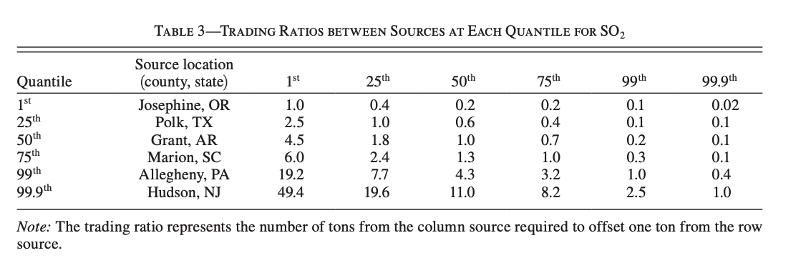
```
</center>

Muller and Mendelsohn (2009)

---

# PM2.5 damages

Trading ratios are required because damages are heterogeneous across space

<center>
```{r, out.width = "60%", fig.pos="c", echo = FALSE}
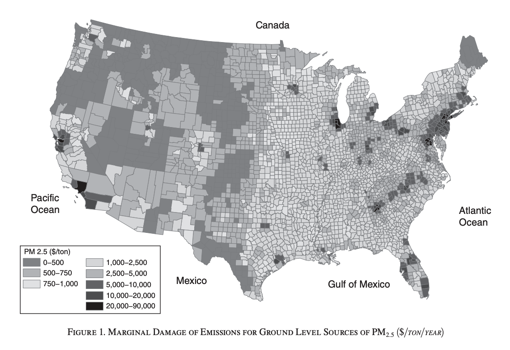
```
</center>

Muller and Mendelsohn (2009)

---

# Damages caused by ARP

The Acid Rain Program .hi-red[increased] damages in the eastern US

<center>
```{r, out.width = "50%", fig.pos="c", echo = FALSE}
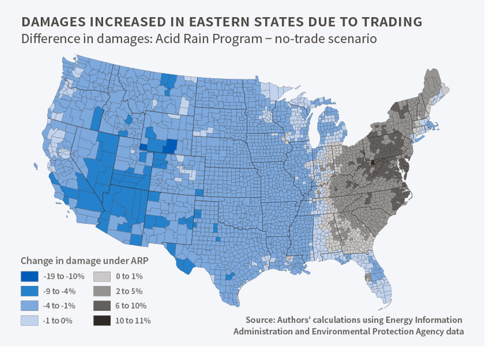
```
</center>

Chan et al. (2018)

---

# Damages caused by ARP

Chan et al. (2018) JEEM:

> We also compare health damages associated with observed SO2 emissions from all ARP units in 2002 with damages from a no-trade counterfactual. Damages under the ARP are $2.1 billion (1995$) higher than under the no-trade scenario, reflecting allowance transfers from units in the western US to units in the eastern US with larger exposed populations.

---

# Damages caused by ARP

.hi-red[Redder:] trading lead to greater emissions vs no trading

<center>
```{r, out.width = "70%", fig.pos="c", echo = FALSE}
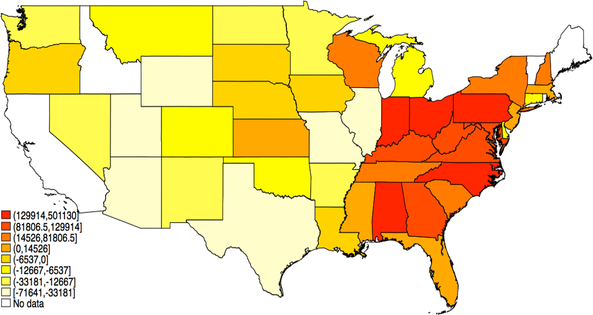
```
</center>


---

# Zonal trading: RECLAIM

Regional Clean Air Management (RECLAIM) Program

--

California South Coast Air Quality Management District (SCAQMD)

--

Started in 1994, goal of cutting NOx and SOx  emissions by 80% by 2003

--

RECLAIM is a facility-level tradable permit system

---

# Zonal trading: RECLAIM

14% of permits allocated to power generators

--

Permit prices driven by electricity sector

--

During 2000 electricity price spikes, lots of very dirty plants brought on-line to meet demand

--

Permit prices rose dramatically for everyone else

--

$4,284 per ton of NOx in 1999

--

$39,000 per ton of NOx in 2000

---

# Zonal trading: RECLAIM

.pull-left[
<center>
```{r, out.width = "100%", fig.pos="c", echo = FALSE}

```
</center>
]

.pull-right[

LA Basin has two distinct zones with very different MD’s

1. Old heavy industry (high MAC) and mountains trap NOx emissions and heat them up $\rightarrow$ smog (high MD)

2. Newer firms (low MAC) close to the ocean, breezes dissipate pollution before it can turn into smog (low MD)


]

---

# Other permit market examples

Tradble permit systems are increasingly common:

1. Acid Rain Program
2. NOx Budget Program
3. Regional Greenhouse Gas initative
4. California AB32
5. EU Emission Trading System
6. China's National Carbon Cap and Trade

---

# RGGI

<center>
```{r, out.width = "100%", fig.pos="c", echo = FALSE}
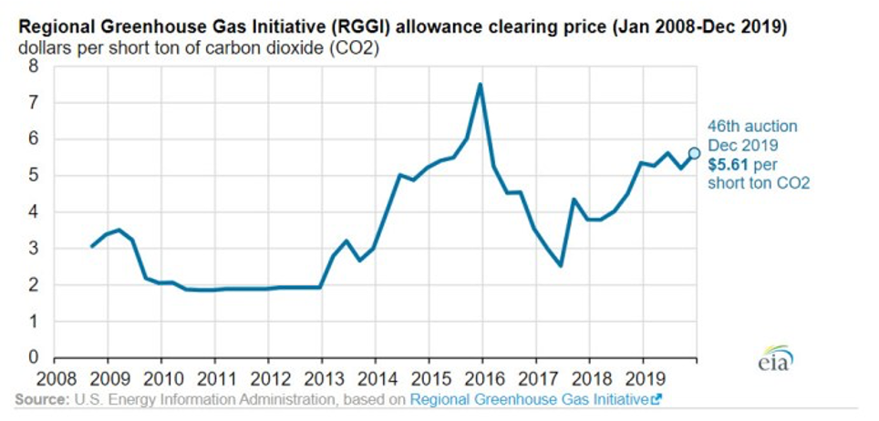
```
</center>

---

# RGGI

<center>
```{r, out.width = "70%", fig.pos="c", echo = FALSE}
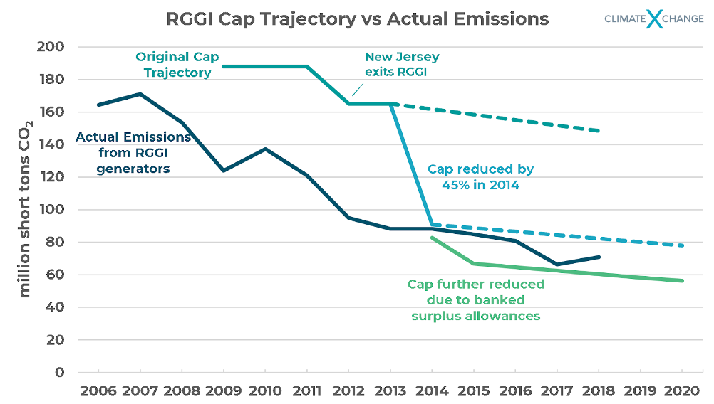
```
</center>

---

# AB32

<center>
```{r, out.width = "70%", fig.pos="c", echo = FALSE}
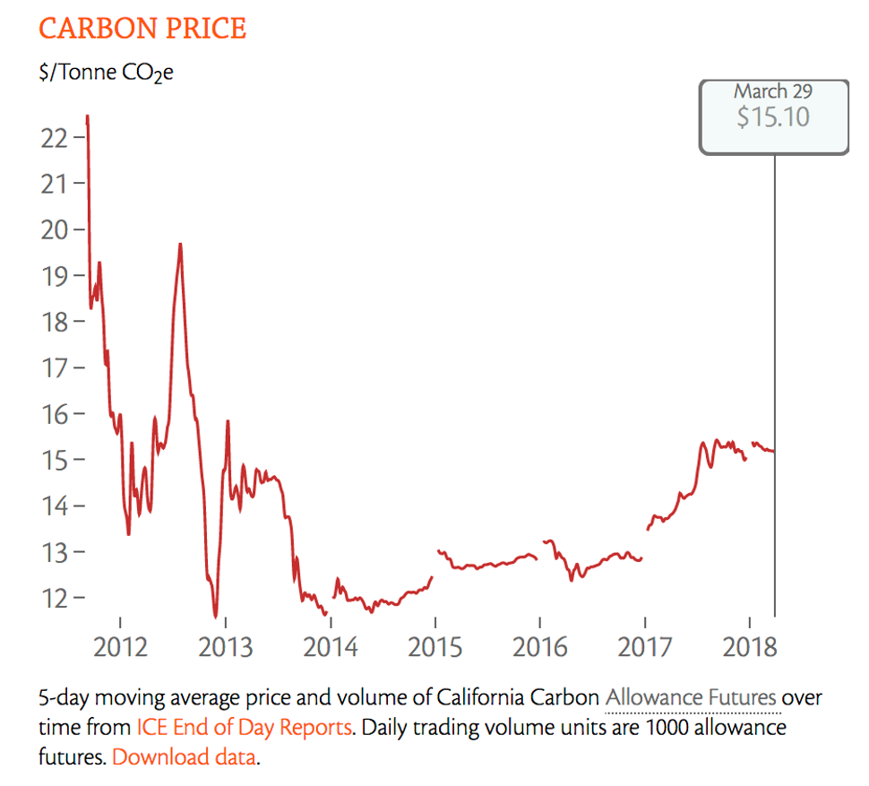
```
</center>

---

# EU-ETS

<center>
```{r, out.width = "70%", fig.pos="c", echo = FALSE}
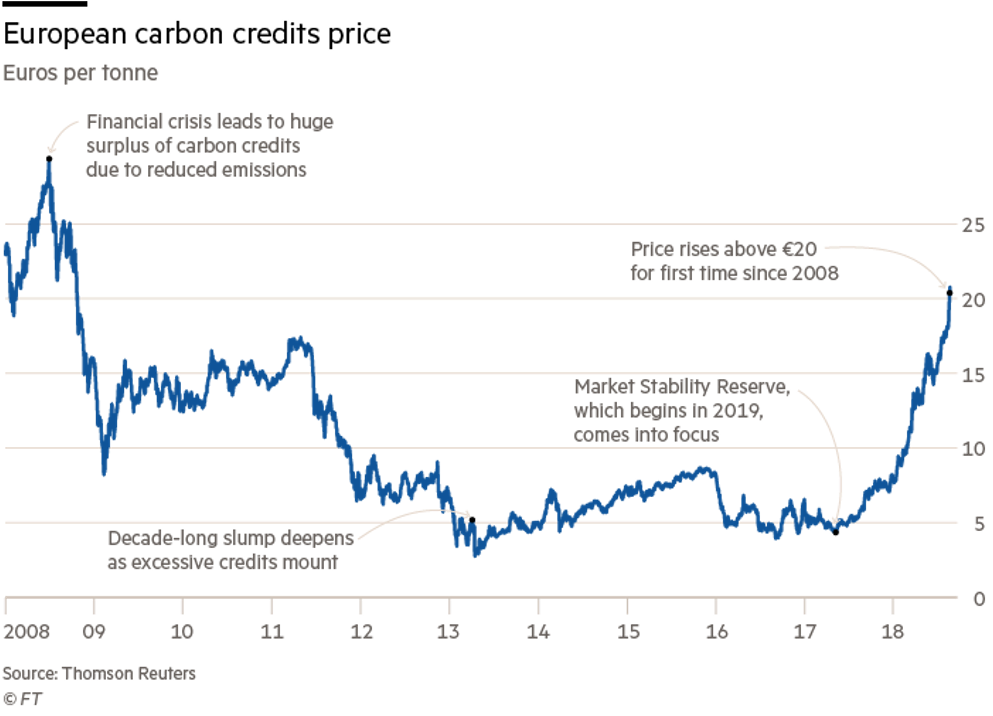
```
</center>

---

# China ETS

<center>
```{r, out.width = "100%", fig.pos="c", echo = FALSE}
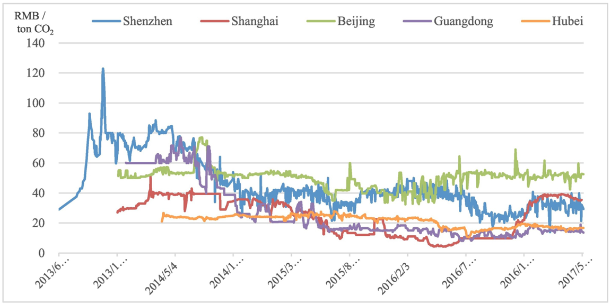
```
</center>


---

class: inverse, center, middle

# Banking and borrowing in permit markets

<html><div style='float:left'></div><hr color='#EB811B' size=1px width=796px></html>

---

# Banking and borrowing in permits

In cap-and-trade, permits may be shifted across time if we allow for banking and borrowing:

--

.hi-blue[Banking]: save unused permits for future compliance

--

.hi-blue[Borrowing]: use future permits early, then make up the shortfall later

--

Let $\bar{E}_t$ be permits issued in period $t$, $E_t$ emissions, and $B_t$ the end-of-period bank:
$$B_t = B_{t-1} + \bar{E}_t - E_t$$

--

Banking only: $B_t \geq 0$  
Borrowing allowed: $B_t$ can be negative (typically with limits/penalties)

---

# Banking and borrowing in permits

Two-period cost-minimization benchmark:

$$\min_{E_1,E_2} C_1(E_1) + C_2(E_2)$$
$$\text{subject to: }E_1 + E_2 = \bar{E}_1 + \bar{E}_2$$

--

FOC:
$$-C_1'(E_1^*) = -C_2'(E_2^*)$$

--

In MAC terms:
$$MAC_1(E_1^*) = MAC_2(E_2^*)$$

--

A firm equalizes its MAC over time!

---

# Banking and borrowing in permits

Intuition:

Standard cap-and-trade allows .hi-blue[within-period trade across firms]

--

Banking and borrowing add .hi-blue[across-period trade within a firm]

--

So a firm can effectively "trade with itself over time"

--

This shifts abatement away from high-MAC periods and toward low-MAC periods

---

# Banking and borrowing in permits

Why might a firm's MAC change over time?

--

1. Fuel and input prices move (e.g., coal vs natural gas prices)

--

2. Output demand changes (business cycle, weather-driven load)

--

3. Abatement equipment has temporary outages or maintenance

--

4. New technology adoption lowers future abatement cost

--

5. Learning-by-doing improves operational efficiency

--

With these shocks, banking/borrowing lowers compliance cost relative to a rigid period-by-period cap

---

# Banking and borrowing in permits

.pull-left[
```{r permits-time-rule, echo = FALSE, fig.show = 'hide', warning = F}
mac1 = function(x) 2 - 2/3*x
mac2 = function(x) 3 - x
e_cap = 3.5/2
e1_star = 1.5
e2_star = 2
p_star = 1

ggplot() +
  annotate("text", x = .58, y = 2.05, label = "MAC1 (period 1)", color = "#ca5670", size = 7) +
  annotate("text", x = .58, y = 2.95, label = "MAC2 (period 2)", color = "#638ccc", size = 7) +
  stat_function(fun = mac2, color = "#638ccc", size = 1.5) +
  stat_function(fun = mac1, color = "#ca5670", size = 1.5) +
  annotate("segment", x = e_cap, xend = e_cap, y = 0, yend = 3.1,
           linetype = "longdash", size = 1.4, color = "black") +
  annotate("segment", x = e1_star, xend = e1_star, y = 0, yend = p_star,
           linetype = "dashed", size = 1.3, color = "grey50") +
  annotate("segment", x = e2_star, xend = e2_star, y = 0, yend = p_star,
           linetype = "dashed", size = 1.3, color = "grey50") +
  annotate("segment", x = 0, xend = 3, y = p_star, yend = p_star,
           linetype = "dotted", size = 1.3, color = "black") +
  annotate("curve", x = e_cap, y = 0.38, xend = e1_star, yend = 0.38,
           curvature = .35, arrow = arrow(length = unit(0.16, "cm")),
           color = "#ca5670", size = 1.1) +
  annotate("curve", x = e_cap, y = 0.60, xend = e2_star, yend = 0.60,
           curvature = -.35, arrow = arrow(length = unit(0.16, "cm")),
           color = "#638ccc", size = 1.1) +
  annotate("text", x = 1.00, y = 0.88, label = "Bank permits", color = "#638ccc", size = 6.5) +
  theme_minimal() +
  theme(
    legend.position = "none",
    axis.text.x = element_text(size = 22),
    axis.text.y = element_text(size = 22, color = "#ffffff"),
    axis.title.x = element_text(size = 24),
    axis.title.y = element_text(size = 24),
    panel.grid.minor = element_blank(),
    panel.grid.major = element_blank(),
    panel.background = element_rect(fill = "#ffffff", colour = NA),
    plot.background = element_rect(fill = "#ffffff", colour = NA),
    axis.line = element_line(colour = "black")
  ) +
  labs(x = "Emissions in each period", y = "Capital/$") +
  scale_x_continuous(expand = c(0,0), limits = c(0,3.1),
                     breaks = c(e1_star, e_cap, e2_star),
                     labels = c(expression(E[1]^"*"), expression(bar(E)), expression(E[2]^"*"))) +
  scale_y_continuous(expand = c(0,0), limits = c(0,3.1))

```

`)
]

.pull-right[

Decision rule at the no-flex caps:

If $MAC_2(\bar{E}_2) > MAC_1(\bar{E}_1)$, period 2 abatement is more expensive

Banking is optimal: $E_1^* < \bar{E}_1$ and $E_2^* > \bar{E}_2$

If $MAC_1(\bar{E}_1) > MAC_2(\bar{E}_2)$, borrowing is optimal

]

---

# Banking and borrowing in permits

.pull-left[
```{r permits-time-borrowing, echo = FALSE, fig.show = 'hide', warning = F}
mac1 = function(x) 3 - x
mac2 = function(x) 2 - 2/3*x
e_cap = 3.5/2
e1_star = 2
e2_star = 1.5
p_star = 1

ggplot() +
  annotate("text", x = .58, y = 2.95, label = "MAC1 (period 1)", color = "#ca5670", size = 7) +
  annotate("text", x = .58, y = 2.05, label = "MAC2 (period 2)", color = "#638ccc", size = 7) +
  stat_function(fun = mac1, color = "#ca5670", size = 1.5) +
  stat_function(fun = mac2, color = "#638ccc", size = 1.5) +
  annotate("segment", x = e_cap, xend = e_cap, y = 0, yend = 3.1,
           linetype = "longdash", size = 1.4, color = "black") +
  annotate("segment", x = e2_star, xend = e2_star, y = 0, yend = p_star,
           linetype = "dashed", size = 1.3, color = "grey50") +
  annotate("segment", x = e1_star, xend = e1_star, y = 0, yend = p_star,
           linetype = "dashed", size = 1.3, color = "grey50") +
  annotate("segment", x = 0, xend = 3, y = p_star, yend = p_star,
           linetype = "dotted", size = 1.3, color = "black") +
  annotate("curve", x = e_cap, y = 0.42, xend = e1_star, yend = 0.42,
           curvature = -.35, arrow = arrow(length = unit(0.16, "cm")),
           color = "#ca5670", size = 1.1) +
  annotate("curve", x = e_cap, y = 0.62, xend = e2_star, yend = 0.62,
           curvature = .35, arrow = arrow(length = unit(0.16, "cm")),
           color = "#638ccc", size = 1.1) +
  annotate("text", x = 0.95, y = 0.90, label = "Borrow permits", color = "#ca5670", size = 6.5) +
  theme_minimal() +
  theme(
    legend.position = "none",
    axis.text.x = element_text(size = 22),
    axis.text.y = element_text(size = 22, color = "#ffffff"),
    axis.title.x = element_text(size = 24),
    axis.title.y = element_text(size = 24),
    panel.grid.minor = element_blank(),
    panel.grid.major = element_blank(),
    panel.background = element_rect(fill = "#ffffff", colour = NA),
    plot.background = element_rect(fill = "#ffffff", colour = NA),
    axis.line = element_line(colour = "black")
  ) +
  labs(x = "Emissions in each period", y = "Capital/$") +
  scale_x_continuous(expand = c(0,0), limits = c(0,3.1),
                     breaks = c(e2_star, e_cap, e1_star),
                     labels = c(expression(E[2]^"*"), expression(bar(E)), expression(E[1]^"*"))) +
  scale_y_continuous(expand = c(0,0), limits = c(0,3.1))

```

`)
]

.pull-right[

Borrowing case: period 1 starts with the higher MAC at cap

Cost minimization shifts emissions toward period 1 and away from period 2

$E_1^* > \bar{E}_1$ and $E_2^* < \bar{E}_2$

Both banking and borrowing are intertemporal permit trade that aligns MACs across time

]

---

# Banking and borrowing in practice: Acid Rain Program

.pull-left[
<center>
```{r, out.width = "95%", fig.pos="c", echo = FALSE}

```
</center>
]

.pull-right[

U.S. $SO_2$ trading (Acid Rain Program) allowed banking across years

Firms over-complied in the 1990s and built an allowance bank before tighter caps

]

---

# Banking and borrowing in practice: EU-ETS

.pull-left[
<center>
```{r, out.width = "85%", fig.pos="c", echo = FALSE}
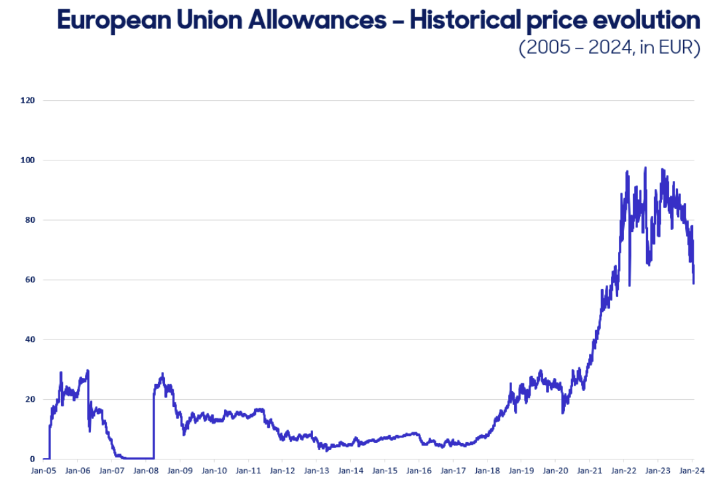
```
</center>
]

.pull-right[

Phase I (2005-2007): limited inter-phase banking; surplus allowances led to a price collapse near phase end

From Phase II onward, banking became a key margin for compliance planning

Large cumulative surplus carried forward across phases and affected prices

Borrowing is limited in practice; EU design relies much more on banking than borrowing

]

---

# Banking and borrowing: design lessons

1. Banking is widely used because it lowers costs while preserving a cumulative cap
2. Borrowing is often constrained because of default, enforcement, and credibility concerns
3. Rules on banking/borrowing strongly affect allowance price dynamics
4. Without banking across phase boundaries, end-of-phase price volatility can be severe

---

class: inverse, center, middle
name: permit-game

# Let's trade: the permit market game

<html><div style='float:left'></div><hr color='#EB811B' size=1px width=796px></html>

---

# The permit market game

Each team runs a firm with its own baseline emissions and MAC curve: keep yours private

--

Two rounds, each with a cap (tighter in Round 2): permits are .hi[auctioned] or .hi[given away], then teams .hi[trade] in a live market

--

Emissions your permits do not cover are abated at your MAC; the leaderboard compares you with an efficient benchmark

--

.hi[Join now:] course website $\rightarrow$ Content $\rightarrow$ Games 2: Permits

---

# The permit market game: options we may turn on

.hi[Cost shocks:] when the market opens, your MAC slope becomes 0.5, 1, or 1.5 times what it was

--

.hi[Free permits:] a round gives permits away in proportion to baseline emissions

--

.hi[Pay as you bid:] an auction charges each winner its own bid

--

.hi[Bank and borrow:] in Round 1, emit less to bank permits for Round 2, or emit more to borrow from Round 2; unrepaid borrowing pays a penalty

---

# The permit market game: what should happen?

If the market works, what do we expect to see in the data?

--

- Auction prices near where total demand, the sum of MACs, meets the cap
- Trades from low-MAC to high-MAC firms, especially after a cost shock
- Free and auctioned rounds ending with similar allocations but different payments
- A higher Round 2 price, and banking in Round 1 if teams expect it

--

We will check the class results against these predictions after we play

---

class: inverse, center, middle
name: after-the-game

# After the permit game

<html><div style='float:left'></div><hr color='#EB811B' size=1px width=796px></html>

---

# Debrief: should big firms bid their MAC?

If your bid might be the lowest winning bid, it sets the price you pay on .hi[all] your permits

--

For example, A cuts its second bid from 9 to 6. The price falls to 6, and A still wins 2 permits, paying 12 instead of 14

--

This is .hi[demand reduction]: bidders who might set the price, especially large buyers, shade their bids below MAC

--

Here only revenue falls (35 to 30). In general, shading can misallocate permits, which later trading can fix

---

# Debrief: why trade after an auction?

If every firm bids its MAC and nothing changes, the auction already equalizes MACs: there is nothing left to trade

--

In the game, costs changed after the auction: real MACs move with fuel prices, demand, outages, and new technology

--

The permit market lets firms whose MAC rose buy from firms whose MAC fell, until MACs are equal again

--

Banking and borrowing do the same across time: each firm equalizes its own MAC across rounds

---

# Debrief: pay as you bid

EPA's Acid Rain Program auctions (from 1993) were .hi[pay-as-bid]; they sold about 2.8% of allowances, and the rest were given away

--

Bidding your MAC then earns nothing on the permits you win, so bidders shade toward the price they expect

--

Bids stop revealing MACs, and bidders who guess the price wrong end up with too few or too many permits

--

Svendsen and Christensen (1999): a uniform-price design "would probably have generated better price signals"

---

class: inverse, center, middle
name: policy comparison

# Comparison of standards, taxes, permits

<html><div style='float:left'></div><hr color='#EB811B' size=1px width=796px></html>

---

# What do we know so far

So far we have seen that:

1. Standards, taxes, and tradable permits can all achieve the efficient allocation
2. Taxes and tradable permits are cost-effective .hi[no matter what]
  - (all firms set MAC = $\tau$ and MAC = p)
  
--

This still leaves a few questions to answer:


1. What are the equity effects?
2. What are the output effects?
3. What are the administrative burdens?
4. What are the .hi[dynamic] incentives under these policies?

---

# The equity set up

.pull-left[
```{r base, echo = FALSE, fig.show = 'hide', warning = F}
mac <- function(x) 2 - 2/3*x
md <- function(x) x - 0.5

ggplot() +
  annotate("text", x = .3, y = 2, label = "MAC", size = 8) +
  annotate("text", x = 2.5, y = 2.5, label = "MD", size = 8) +
  annotate("text", x = 2.5, y = 0.9, label = "s, p", size = 8) +
  annotate("text", x = 2.5, y = 1.1, label = expression(tau), size = 8) +
  annotate("text", x = 2.15, y = .25, label = "A", size = 10, color = "black") +
  annotate("text", x = .5, y = .5, label = "B", size = 10, color = "black") +
  annotate("text", x = 1, y = .25, label = "C", size = 10, color = "black") +
  annotate("text", x = 2.65, y = 1.5, label = "D", size = 10, color = "black") +
  annotate("text", x = 2.15, y = .75, label = "E", size = 10, color = "black") +
  stat_function(fun = mac, color = "#ca5670", size = 1.5) +
  stat_function(fun = md, color = "#638ccc", size = 1.5) +
  annotate("segment", x = 1.5, xend = 1.5, y = 0, yend = 1,
           linetype = "dashed", size = 1.5, color = "grey50") +
  annotate("segment", x = 0, xend = 3, y = .99, yend = .99,
           linetype = "dashed", size = 1.5, color = "#000000") +
  theme_minimal() +
  theme(
    legend.position = "none",
    title = element_text(size = 24),
    axis.text.x = element_text(size = 24), axis.text.y = element_text(size = 24, color = "#ffffff"),
    axis.title.x = element_text(size = 24), axis.title.y = element_text(size = 24),
    panel.grid.minor.x = element_blank(), panel.grid.major.y = element_blank(),
    panel.grid.minor.y = element_blank(), panel.grid.major.x = element_blank(),
    panel.background = element_rect(fill = "#ffffff",colour = NA),
    plot.background = element_rect(fill = "#ffffff",colour = NA),
    axis.line = element_line(colour = "black")
  ) +
  labs(x = "Emissions",
       y = "Capital/$") +
  scale_x_continuous(expand = c(0,0), limits = c(0,3.1), breaks = c(1.5,3), labels = c(expression(E^'*'), expression(E[0]))) +
  scale_y_continuous(expand = c(0,0), limits = c(0,3.1))

```

`)
]

.pull-right[

Lets consider this our base set up for 1 firm

The regulator can achieve $E^*$ through:

- an emission standard of $E^*$
- a tax of $\tau$
- an abatement subsidy of $s$
- "tradable permit" cap of $E^*$ with auctioned permits at price $p$

]


---

# The equity set up

.pull-left[
`)
]

.pull-right[

First let's look at .hi[equity]

How do the costs and benefits of the policies fall on different groups?

From here on we will roll the tax and permit system into 1: they are actually identical in terms of their impacts if all permits are auctioned

]


---

# The distributional outcomes

.pull-left[
`)
]

.pull-right[

|            	| Tax/Permits      	| Standard 	| Subsidy 	| Ranking         	|
|------------	|----------	|----------	|---------	|-----------------	|
| Firm       	| -(A+B+C) 	| -A       	| E       	| Sub > Std > Tax 	|
| Households 	| A+D+E    	| A+D+E    	| A+D+E   	| Indifferent     	|
| Government 	| B+C      	| 0        	| -(E+A)  	| Tax > Std > Sub 	|
| Total      	| D+E      	| D+E      	| D+E     	|                 	|

The total welfare gain is the same for all policies

The difference is in the .hi[distribution]

The standard strikes a middle ground out of the three

]

---

# Output effects

So far we have assumed that actual firm output is not affected by abatement/emission decisions

--

This won't always be true in the real world

--

Key identity:
$$E = \left(\frac{E}{q}\right)\times q$$

Firms can reduce total emissions either by lowering emissions intensity per unit of output $q$: $\left(\frac{E}{q}\right)$, or by lowering output $q$

---

# Output effects

Why can emissions policy reduce output?

1. Taxes and standards make cleaner production more costly per unit of output
2. That increases marginal cost of supplying output
3. With downward-sloping demand, higher MC implies lower profit-maximizing output

Even when the policy directly targets emissions, output can move as an indirect equilibrium response


---

# The output set up

.pull-left[
```{r output1, echo = FALSE, fig.show = 'hide', warning = F}
mac = function(x) 2 - 2/3*x
policy_price = function(x) 1

ggplot() +
  annotate("text", x = .3, y = 2, label = "MAC", size = 8) +
  annotate("text", x = 2.55, y = 1.18, label = "Tax (t)", size = 7, color = "#638ccc") +
  annotate("text", x = 2.55, y = .84, label = "Subsidy (s)", size = 7, color = "#638ccc") +
  annotate("text", x = 1.62, y = 2.55, label = "Standard", angle = 90, size = 6.5, color = "grey35") +
  annotate("text", x = 2.15, y = .25, label = "A", size = 10, color = "black") +
  annotate("text", x = .5, y = .5, label = "B", size = 10, color = "black") +
  annotate("text", x = 2.15, y = .75, label = "C", size = 10, color = "black") +
  stat_function(fun = mac, color = "#ca5670", size = 1.5) +
  stat_function(fun = policy_price, color = "#638ccc", size = 1.5) +
  annotate("segment", x = 1.5, xend = 1.5, y = 0, yend = 3,
           linetype = "dashed", size = 1.5, color = "grey50") +
  annotate("segment", x = 3, xend = 3, y = 0, yend = 1,
           linetype = "dashed", size = 1.5, color = "grey50") +
  theme_minimal() +
  theme(
    legend.position = "none",
    title = element_text(size = 24),
    axis.text.x = element_text(size = 24), axis.text.y = element_text(size = 24, color = "#ffffff"),
    axis.title.x = element_text(size = 24), axis.title.y = element_text(size = 24),
    panel.grid.minor.x = element_blank(), panel.grid.major.y = element_blank(),
    panel.grid.minor.y = element_blank(), panel.grid.major.x = element_blank(),
    panel.background = element_rect(fill = "#ffffff",colour = NA),
    plot.background = element_rect(fill = "#ffffff",colour = NA),
    axis.line = element_line(colour = "black")
  ) +
  labs(x = "Emissions/Output",
       y = "Capital/$") +
  scale_x_continuous(expand = c(0,0), limits = c(0,3.2), breaks = c(1.5,3), labels = c(expression(E^'*'/q^'*'), expression(E[0]/q[0]))) +
  scale_y_continuous(expand = c(0,0), limits = c(0,3.1))

```

`)
]

.pull-right[

```{r output2, echo = FALSE, fig.show = 'hide', warning = F}
mc1 <- function(x) 1
mc2 <- function(x) 1.5
md <- function(x) 2.5 - x

ggplot() +
  annotate("text", x = .3, y = 2, label = "D", size = 8) +
  annotate("text", x = 2.5, y = 1.6, label = expression(MC^'*'), size = 8) +
  annotate("text", x = 2.5, y = 1.1, label = expression(MC[0]), size = 8) +
  annotate("segment", x = .7, xend = .7, y = 1, yend = 1.5,
           arrow = arrow(length = unit(0.16, "cm"), ends = "both"),
           size = 1.2, color = "black") +
  annotate("text", x = .45, y = 1.27, label = "A+B", size = 8) +
  stat_function(fun = mc2, color = "#000000", size = 1.5) +
  stat_function(fun = mc1, color = "#ca5670", size = 1.5) +
  stat_function(fun = md, color = "#638ccc", size = 1.5) +
  annotate("segment", x = 1.5, xend = 1.5, y = 0, yend = 1,
           linetype = "dashed", size = 1.5, color = "grey50") +
  annotate("segment", x = 1, xend = 1, y = 0, yend = 1.5,
           linetype = "dashed", size = 1.5, color = "grey50") +
  theme_minimal() +
  theme(
    legend.position = "none",
    title = element_text(size = 24),
    axis.text.x = element_text(size = 24), axis.text.y = element_text(size = 24, color = "#ffffff"),
    axis.title.x = element_text(size = 24), axis.title.y = element_text(size = 24),
    panel.grid.minor.x = element_blank(), panel.grid.major.y = element_blank(),
    panel.grid.minor.y = element_blank(), panel.grid.major.x = element_blank(),
    panel.background = element_rect(fill = "#ffffff",colour = NA),
    plot.background = element_rect(fill = "#ffffff",colour = NA),
    axis.line = element_line(colour = "black")
  ) +
  labs(x = "Output",
       y = "Capital/$") +
  scale_x_continuous(expand = c(0,0), limits = c(0,3.2), breaks = c(1,1.5), labels = c(expression(q^'*'), expression(q[0]))) +
  scale_y_continuous(expand = c(0,0), limits = c(0,3.1))

```

`)
]

---

# The output results

Emission tax:
- Firm chooses $E^*/q^*$
- Firm pays A+B in tax and abatement cost .hi[per unit of output]
- This raises the MC of production by A+B to MC<sup>*</sup>
- Output $q^*$ falls
- Pollution $(E^*/q^*)*q^*$ falls even more since the tax lowers the optimal $E^*/q^*$, and increased MC lowers $q^*$

---

# The output results

.pull-left[

Emission standard:
- Firm pays A in abatement cost per unit of output
- This raises the MC of production by A
- Output and $(E^*/q^*)*q^*$ fall, but not by as much as under the tax

]

.pull-right[

```{r output2_standard, echo = FALSE, fig.show = 'hide', warning = F}
mc0 = function(x) 1
mc_std = function(x) 1.25
demand = function(x) 2.5 - x

ggplot() +
  annotate("text", x = .3, y = 2, label = "D", size = 8) +
  annotate("text", x = 2.5, y = 1.35, label = expression(MC^'*'), size = 8) +
  annotate("text", x = 2.5, y = 1.05, label = expression(MC[0]), size = 8) +
  annotate("segment", x = .7, xend = .7, y = 1, yend = 1.25,
           arrow = arrow(length = unit(0.16, "cm"), ends = "both"),
           size = 1.2, color = "black") +
  annotate("text", x = .45, y = 1.125, label = "A", size = 8) +
  stat_function(fun = mc_std, color = "#000000", size = 1.5) +
  stat_function(fun = mc0, color = "#ca5670", size = 1.5) +
  stat_function(fun = demand, color = "#638ccc", size = 1.5) +
  annotate("segment", x = 1.5, xend = 1.5, y = 0, yend = 1,
           linetype = "dashed", size = 1.5, color = "grey50") +
  annotate("segment", x = 1.25, xend = 1.25, y = 0, yend = 1.25,
           linetype = "dashed", size = 1.5, color = "grey50") +
  theme_minimal() +
  theme(
    legend.position = "none",
    title = element_text(size = 24),
    axis.text.x = element_text(size = 24), axis.text.y = element_text(size = 24, color = "#ffffff"),
    axis.title.x = element_text(size = 24), axis.title.y = element_text(size = 24),
    panel.grid.minor.x = element_blank(), panel.grid.major.y = element_blank(),
    panel.grid.minor.y = element_blank(), panel.grid.major.x = element_blank(),
    panel.background = element_rect(fill = "#ffffff", colour = NA),
    plot.background = element_rect(fill = "#ffffff", colour = NA),
    axis.line = element_line(colour = "black")
  ) +
  labs(x = "Output",
       y = "Capital/$") +
  scale_x_continuous(
    expand = c(0, 0), limits = c(0, 3.2),
    breaks = c(1.25, 1.5),
    labels = c(expression(q[std]^"*"), expression(q[0]))
  ) +
  scale_y_continuous(expand = c(0, 0), limits = c(0, 3.1))
```

`)
]

---

# The output results

.pull-left[

Abatement subsidy:
- Reduces firm costs per unit of output by C
- This reduces the MC of production by C
- This .hi[raises] output
- Even though $E/q$ goes down because the subsidy induces a lower emission intensity, total emissions may go up because $q$ will rise

]

.pull-right[

```{r output2_subsidy, echo = FALSE, fig.show = 'hide', warning = F}
mc0 = function(x) 1
mc_sub = function(x) 0.8
demand = function(x) 2.5 - x

ggplot() +
  annotate("text", x = .3, y = 2, label = "D", size = 8) +
  annotate("text", x = 2.5, y = 1.12, label = expression(MC[0]), size = 8) +
  annotate("text", x = 2.5, y = .85, label = expression(MC^'*'), size = 8) +
  annotate("segment", x = .7, xend = .7, y = .8, yend = 1,
           arrow = arrow(length = unit(0.16, "cm"), ends = "both"),
           size = 1.2, color = "black") +
  annotate("text", x = .45, y = .9, label = "C", size = 8) +
  stat_function(fun = mc0, color = "#ca5670", size = 1.5) +
  stat_function(fun = mc_sub, color = "#000000", size = 1.5) +
  stat_function(fun = demand, color = "#638ccc", size = 1.5) +
  annotate("segment", x = 1.5, xend = 1.5, y = 0, yend = 1,
           linetype = "dashed", size = 1.5, color = "grey50") +
  annotate("segment", x = 1.7, xend = 1.7, y = 0, yend = .8,
           linetype = "dashed", size = 1.5, color = "grey50") +
  theme_minimal() +
  theme(
    legend.position = "none",
    title = element_text(size = 24),
    axis.text.x = element_text(size = 24), axis.text.y = element_text(size = 24, color = "#ffffff"),
    axis.title.x = element_text(size = 24), axis.title.y = element_text(size = 24),
    panel.grid.minor.x = element_blank(), panel.grid.major.y = element_blank(),
    panel.grid.minor.y = element_blank(), panel.grid.major.x = element_blank(),
    panel.background = element_rect(fill = "#ffffff", colour = NA),
    plot.background = element_rect(fill = "#ffffff", colour = NA),
    axis.line = element_line(colour = "black")
  ) +
  labs(x = "Output",
       y = "Capital/$") +
  scale_x_continuous(
    expand = c(0, 0), limits = c(0, 3.2),
    breaks = c(1.5, 1.7),
    labels = c(expression(q[0]), expression(q[sub]^"*"))
  ) +
  scale_y_continuous(expand = c(0, 0), limits = c(0, 3.1))
```

`)
]

--

Cliffnotes:

- Output falls under taxes and standards
- This raises output prices
- Can have regressive effects through necessities like electricity or gas

---

# Administration

These policies are not equivalent in their cost of implementation

--

Enforcing a technology standard is very easy: you can inspect to see if they have installed the tech or not

--

Emission standards, taxes, subsidies require monitoring of emissions

--

Monitoring systems cost money

--

Firms have incentives to try to cheat!

---

# Administration

Pigouvian policies will not work as well for .hi[non-point sources] like cars or farms

--

With non-point sources we observe total emissions but not who emitted it

--

With non-point sources it often makes sense to use technology standards

--

Point sources like power plants are much easier to handle with Pigouvian policies like taxes


---

# Administration

Technology and emission standards typically guarantee some amount of emissions reductions

--

Taxes and subsidies guarantee firms pay a certain price but doesn't deliver us a guaranteed quantity

--

This might make things more politically difficult to pass

---

# Administration

When does C&C / technology standards make sense?

1. If there's a dominant technology where there's benefits to coordination or scale economies from production of the technology
2. High costs of monitoring/enforcement
3. High admin costs and little heterogeneity across firms

---

# Dynamic incentives


.pull-left[
```{r dynamic, echo = FALSE, fig.show = 'hide', warning = F}
mac <- function(x) 2 - 2/3*x
mac2 <- function(x) 3 - x
md <- function(x) 1
ggplot() +
  annotate("text", x = .3, y = 2, label = expression(MAC[2]), size = 8) +
  annotate("text", x = .3, y = 3, label = expression(MAC[1]), size = 8) +
  annotate("text", x = 2.75, y = 1.1, label = expression(tau), size = 8) +
  annotate("text", x = 2.75, y = 0.9, label = "s", size = 8) +
  stat_function(fun = mac2, color = "#000000", size = 1.5) +
  stat_function(fun = mac, color = "#ca5670", size = 1.5) +
  stat_function(fun = md, color = "#638ccc", size = 1.5) +
  annotate("segment", x = 1.5, xend = 1.5, y = 0, yend = 1,
           linetype = "dashed", size = 1.5, color = "grey50") +
  annotate("segment", x = 2, xend = 2, y = 0, yend = .99,
           linetype = "dashed", size = 1.5, color = "grey50") +
  annotate("text", x = 2.15, y = .25, label = "A", size = 8, color = "black") +
  annotate("text", x = 1.75, y = .25, label = "B", size = 8, color = "black") +
  annotate("text", x = 1, y = .25, label = "C", size = 8, color = "black") +
  annotate("text", x = 1.85, y = .9, label = "D", size = 8, color = "black") +
  annotate("text", x = 2.15, y = .75, label = "F", size = 8, color = "black") +
  theme_minimal() +
  theme(
    legend.position = "none",
    title = element_text(size = 24),
    axis.text.x = element_text(size = 24), axis.text.y = element_text(size = 24, color = "#ffffff"),
    axis.title.x = element_text(size = 24), axis.title.y = element_text(size = 24),
    panel.grid.minor.x = element_blank(), panel.grid.major.y = element_blank(),
    panel.grid.minor.y = element_blank(), panel.grid.major.x = element_blank(),
    panel.background = element_rect(fill = "#ffffff",colour = NA),
    plot.background = element_rect(fill = "#ffffff",colour = NA),
    axis.line = element_line(colour = "black")
  ) +
  labs(x = "Emissions",
       y = "Capital/$") +
  scale_x_continuous(expand = c(0,0), limits = c(0,3.1), breaks = c(1.5,2,3), labels = c(expression(E[2]^'*'), expression(E[1]^'*'), expression(E[0]))) +
  scale_y_continuous(expand = c(0,0), limits = c(0,3.1))

```

`)
]

.pull-right[

What are the gains to the firm from moving from $MAC_1$ to $MAC_2$?


]


---

# Dynamic incentives


.pull-left[
`)
]

.pull-right[

What are the gains to the firm from moving from $MAC_1$  to $MAC_2$?

.hi[Standard:] F (abatement cost reduction)

.hi[Emission Tax:] F + D (abatement cost and tax payment reduction)

.hi[Abatement Subsidy:] F + D (abatement cost reduction and abatement subsidy increase)

]

---

# Dynamic incentives


.pull-left[
`)
]

.pull-right[

What are the gains to the firm from moving to $MAC_2$?

Taxes and subsidies give greater incentives to innovate!

Once a firm meets a standard, there's no additional incentive beyond reducing abatement costs

Taxes and subsidies give the firm extra benefits for further reductions

]

---

# How do carbon markets work?

```{r, echo = FALSE}
local_video("videos/06-permits-cap-and-trade.mp4")
```
