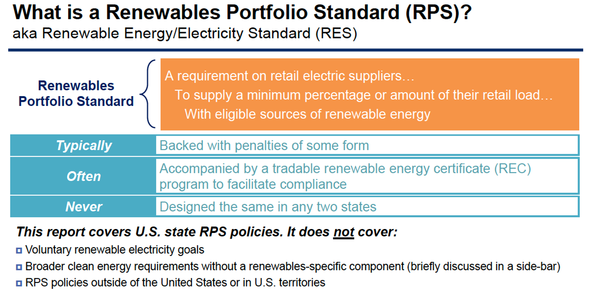
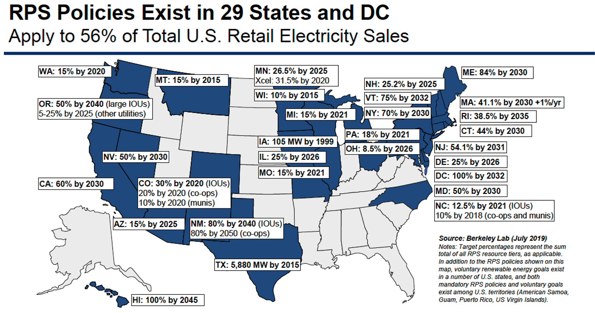
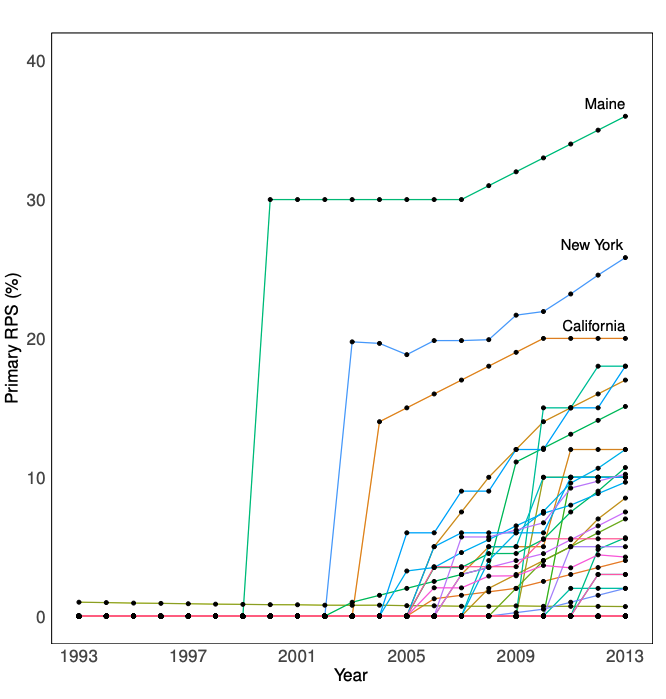
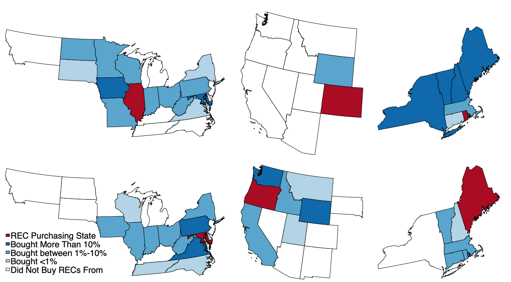
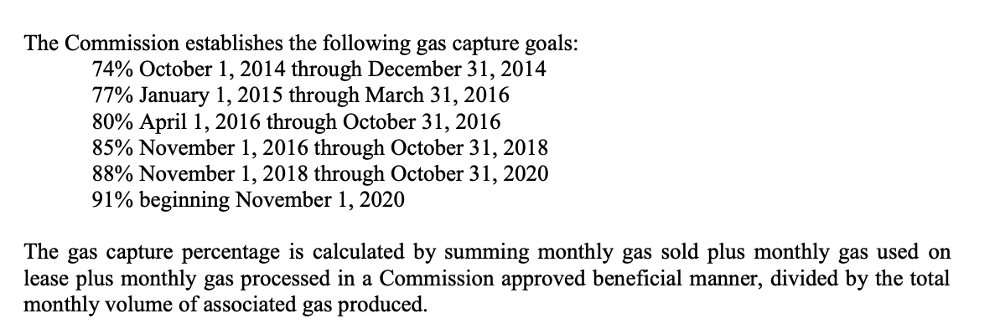
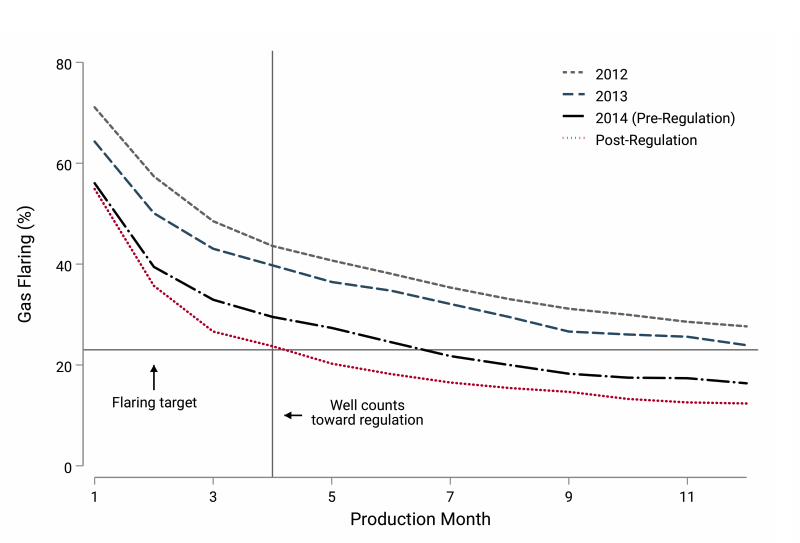
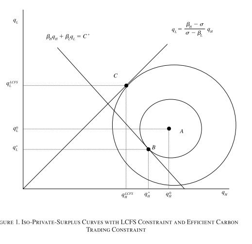
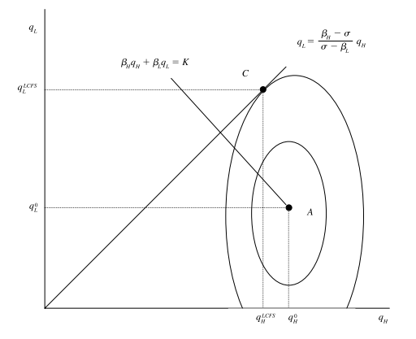
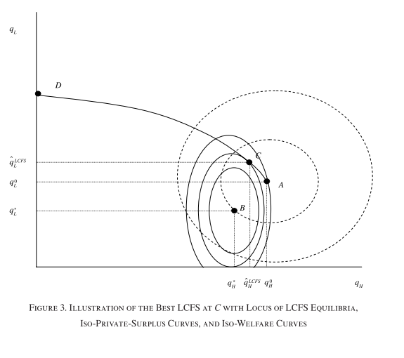

exclude: true
```{r setup}
if (!require("pacman")) install.packages("pacman")
pacman::p_load(
  tidyverse, xaringanExtra, rlang, patchwork, nycflights13, tweetrmd, vembedr
)
options(htmltools.dir.version = FALSE)
knitr::opts_hooks$set(fig.callout = function(options) {
  if (options$fig.callout) {
    options$echo <- FALSE
  }
knitr::opts_chunk$set(echo = TRUE, fig.align="center")
  options
})
```
```{r xaringanExtra, echo = FALSE}
xaringanExtra::use_xaringan_extra(c("tile_view", "panelset", "webcam"))

```
```{r echo=FALSE}
xaringanExtra::style_panelset(panel_tab_color_active = "red")
```

---

# Roadmap

1. What happens when we have another distortion like market power?
3. How do second-best policies like output taxes or intensity standards work?


---

class: inverse, center, middle
name: tradable permits

# Market power and pollution

<html><div style='float:left'></div><hr color='#EB811B' size=1px width=796px></html>

---

# Market power

Lets consider two extreme cases to understand whether and how market power matters

1. Perfect competition
2. Monopoly

--

In both cases we assume that:

1. Marginal costs of production are constant $MC$
2. The marginal damage from a unit of output is constant giving us constant social marginal costs $SMC = MC + MD$

---

# Perfect competition


.pull-left[

```{r perf-comp, echo = FALSE, fig.show = 'hide', warning = F}
mc1 <- function(x) 1
mc2 <- function(x) 1.5
d <- function(x) 2.5 - x

ggplot() +
  annotate("text", x = .5, y = 2.5, label = "Demand", size = 8) +
  annotate("text", x = 2.5, y = 1.6, label = "SMC", size = 8) +
  annotate("text", x = 2.5, y = 1.1, label = "MC", size = 8) +
  stat_function(fun = mc2, color = "#000000", size = 1.5) +
  stat_function(fun = mc1, color = "#ca5670", size = 1.5) +
  stat_function(fun = d, color = "#638ccc", size = 1.5) +
  annotate("segment", x = 1.5, xend = 1.5, y = 0, yend = 1.5,
           linetype = "dashed", size = 1.5, color = "grey50") +
  annotate("segment", x = 1, xend = 1, y = 0, yend = 1.5,
           linetype = "dashed", size = 1.5, color = "grey50") +
  annotate("text", x = 0.5, y = 1.25, label = "A", size = 8, color = "black") +
  annotate("text", x = 1.15, y = 1.15, label = "B", size = 8, color = "black") +
  annotate("text", x = 1.35, y = 1.35, label = "C", size = 8, color = "black") +
  theme_minimal() +
  theme(
    legend.position = "none",
    title = element_text(size = 24),
    axis.text.x = element_text(size = 24), axis.text.y = element_text(size = 24, color = "#ffffff"),
    axis.title.x = element_text(size = 24), axis.title.y = element_text(size = 24),
    panel.grid.minor.x = element_blank(), panel.grid.major.y = element_blank(),
    panel.grid.minor.y = element_blank(), panel.grid.major.x = element_blank(),
    panel.background = element_rect(fill = "#ffffff",colour = NA),
    plot.background = element_rect(fill = "#ffffff",colour = NA),
    axis.line = element_line(colour = "black")
  ) +
  labs(x = "Emissions",
       y = "Capital/$") +
  scale_x_continuous(expand = c(0,0), limits = c(0,3.2), breaks = c(1,1.5), labels = c(expression(q^'*'), expression(q[0]))) +
  scale_y_continuous(expand = c(0,0), limits = c(0,3.1))

```

`)
]

.pull-right[

The effect of moving from $q_0 \rightarrow q^*$ using a tax equal to marginal damage (SMC - MC):

]


---

# Perfect competition


.pull-left[
`)
]

.pull-right[

The effect of moving from $q_0 \rightarrow q^*$ using a tax equal to marginal damage (SMC - MC):

Loss in CS: -(A+B)

]


---

# Perfect competition


.pull-left[
`)
]

.pull-right[

The effect of moving from $q_0 \rightarrow q^*$ using a tax equal to marginal damage (SMC - MC):

Loss in CS: -(A+B)

Avoided damages: B+C

]


---

# Perfect competition


.pull-left[
`)
]

.pull-right[

The effect of moving from $q_0 \rightarrow q^*$ using a tax equal to marginal damage (SMC - MC):

Loss in CS: -(A+B)

Avoided damages: B+C

Tax revenue: A

]


---

# Perfect competition


.pull-left[
`)
]

.pull-right[

The effect of moving from $q_0 \rightarrow q^*$ using a tax equal to marginal damage (SMC - MC):

Loss in CS: -(A+B)

Avoided damages: B+C

Tax revenue: A

.hi-blue[Net gain: -(A+B) + (B+C) + A = C]

]

---

# Monopoly

Now consider a monopolist with the same marginal cost and marginal damage structure

--

What is the difference with a monopolist?

--

The monopolist can set the price

--

This means that the MR curve lies beneath the demand curve

--

Why?

--

The monopolist accounts for how additional output lowers the market price on inframarginal units


---

# Monopoly


.pull-left[

```{r monopoly, echo = FALSE, fig.show = 'hide', warning = F}
mc1 <- function(x) 1
mc2 <- function(x) 1.5
d <- function(x) 2.5 - x
mr <- function(x) 2.5 - 2*x

ggplot() +
  annotate("text", x = .5, y = 2.5, label = "Demand", size = 8) +
  annotate("text", x = 1.35, y = .2, label = "MR", size = 8) +
  annotate("text", x = 2.5, y = 1.6, label = "SMC", size = 8) +
  annotate("text", x = 2.5, y = 1.1, label = "MC", size = 8) +
  stat_function(fun = mc2, color = "#000000", size = 1.5) +
  stat_function(fun = mc1, color = "#ca5670", size = 1.5) +
  stat_function(fun = d, color = "#638ccc", size = 1.5) +
  stat_function(fun = mr, color = "darkslateblue", size = 1.5) +
  annotate("segment", x = 1.5/2, xend = 1.5/2, y = 0, yend = 2.5-1.5/2,
           linetype = "dashed", size = 1.5, color = "grey50") +
  annotate("segment", x = 0, xend = 1.5/2, y = 2.5-1.5/2, yend = 2.5-1.5/2,
           linetype = "dashed", size = 1.5, color = "grey50") +
  annotate("segment", x = 0, xend = 1/2, y = 2.5-1/2, yend = 2.5-1/2,
           linetype = "dashed", size = 1.5, color = "grey50") +
  annotate("segment", x = 1/2, xend = 1/2, y = 0, yend = 2.5-1/2,
           linetype = "dashed", size = 1.5, color = "grey50") +
  annotate("segment", x = 1, xend = 1, y = 0, yend = 1.5,
           linetype = "dashed", size = 1.5, color = "grey50") +
  # annotate("text", x = 0.5, y = 1.25, label = "A", size = 8, color = "black") +
  # annotate("text", x = 1.15, y = 1.15, label = "B", size = 8, color = "black") +
  # annotate("text", x = 1.35, y = 1.35, label = "C", size = 8, color = "black") +
  theme_minimal() +
  theme(
    legend.position = "none",
    title = element_text(size = 24),
    axis.text.x = element_text(size = 24), axis.text.y = element_text(size = 24),
    axis.title.x = element_text(size = 24), axis.title.y = element_text(size = 24),
    panel.grid.minor.x = element_blank(), panel.grid.major.y = element_blank(),
    panel.grid.minor.y = element_blank(), panel.grid.major.x = element_blank(),
    panel.background = element_rect(fill = "#ffffff",colour = NA),
    plot.background = element_rect(fill = "#ffffff",colour = NA),
    axis.line = element_line(colour = "black")
  ) +
  labs(x = "Emissions",
       y = "Capital/$") +
  scale_x_continuous(expand = c(0,0), limits = c(0,3.2), breaks = c(.5, 1, 1.5/2), labels = c(expression(q^tau), expression(q^'*'), expression(q^m))) +
  scale_y_continuous(expand = c(0,0), limits = c(0,3.1), breaks = c(2.5-1/2, 1.5, 2.5-1.5/2), labels = c(expression(p^tau), expression(p^'*'), expression(p^m)))

```

`)
]

.pull-right[

The socially efficient allocation is where social marginal cost is equal to the social marginal benefit

This is where SMC crosses the demand curve: $(q^*,p^*)$

What is the welfare outcome under the unregulated monopolist outcome?

]


---

# Monopoly


.pull-left[
```{r monopoly2, echo = FALSE, fig.show = 'hide', warning = F}
mc1 <- function(x) 1
mc2 <- function(x) 1.5
d <- function(x) 2.5 - x
mr <- function(x) 2.5 - 2*x
dwl <- tibble(x = c(1, .75, .75),
                     y = c(1.5, 1.5, 2.5-.75))

ggplot() +
  geom_polygon(data = dwl, aes(x = x, y = y), fill = "red", alpha = 0.5) +
  annotate("text", x = .5, y = 2.5, label = "Demand", size = 8) +
  annotate("text", x = 1.35, y = .2, label = "MR", size = 8) +
  annotate("text", x = 2.5, y = 1.6, label = "SMC", size = 8) +
  annotate("text", x = 2.5, y = 1.1, label = "MC", size = 8) +
  stat_function(fun = mc2, color = "#000000", size = 1.5) +
  stat_function(fun = mc1, color = "#ca5670", size = 1.5) +
  stat_function(fun = d, color = "#638ccc", size = 1.5) +
  stat_function(fun = mr, color = "darkslateblue", size = 1.5) +
  annotate("segment", x = 1.5/2, xend = 1.5/2, y = 0, yend = 2.5-1.5/2,
           linetype = "dashed", size = 1.5, color = "grey50") +
  annotate("segment", x = 0, xend = 1.5/2, y = 2.5-1.5/2, yend = 2.5-1.5/2,
           linetype = "dashed", size = 1.5, color = "grey50") +
  annotate("segment", x = 0, xend = 1/2, y = 2.5-1/2, yend = 2.5-1/2,
           linetype = "dashed", size = 1.5, color = "grey50") +
  annotate("segment", x = 1/2, xend = 1/2, y = 0, yend = 2.5-1/2,
           linetype = "dashed", size = 1.5, color = "grey50") +
  annotate("segment", x = 1, xend = 1, y = 0, yend = 1.5,
           linetype = "dashed", size = 1.5, color = "grey50") +
  # annotate("text", x = 0.5, y = 1.25, label = "A", size = 8, color = "black") +
  # annotate("text", x = 1.15, y = 1.15, label = "B", size = 8, color = "black") +
  # annotate("text", x = 1.35, y = 1.35, label = "C", size = 8, color = "black") +
  theme_minimal() +
  theme(
    legend.position = "none",
    title = element_text(size = 24),
    axis.text.x = element_text(size = 24), axis.text.y = element_text(size = 24),
    axis.title.x = element_text(size = 24), axis.title.y = element_text(size = 24),
    panel.grid.minor.x = element_blank(), panel.grid.major.y = element_blank(),
    panel.grid.minor.y = element_blank(), panel.grid.major.x = element_blank(),
    panel.background = element_rect(fill = "#ffffff",colour = NA),
    plot.background = element_rect(fill = "#ffffff",colour = NA),
    axis.line = element_line(colour = "black")
  ) +
  labs(x = "Emissions",
       y = "Capital/$") +
  scale_x_continuous(expand = c(0,0), limits = c(0,3.2), breaks = c(.5, 1, 1.5/2), labels = c(expression(q^tau), expression(q^'*'), expression(q^m))) +
  scale_y_continuous(expand = c(0,0), limits = c(0,3.1), breaks = c(2.5-1/2, 1.5, 2.5-1.5/2), labels = c(expression(p^tau), expression(p^'*'), expression(p^m)))

```
`)
]

.pull-right[

In the absence of regulation, the monopolist maximizes profit where MR = MC: $(q^m, p^m)$

This results in deadweight loss equal to the .hi-red[red] area

Now what happens if we set a Pigouvian tax equal to marginal damage?

]


---

# Monopoly


.pull-left[
```{r monopoly3, echo = FALSE, fig.show = 'hide', warning = F}
mc1 <- function(x) 1
mc2 <- function(x) 1.5
d <- function(x) 2.5 - x
mr <- function(x) 2.5 - 2*x
dwl <- tibble(x = c(1, .75, .75),
                     y = c(1.5, 1.5, 2.5-.75))
dwl2 <- tibble(x = c(.5, .5, .75, .75),
                     y = c(2.5-.5, 1.5, 1.5, 2.5-.75))

ggplot() +
  geom_polygon(data = dwl, aes(x = x, y = y), fill = "red", alpha = 0.5) +
  geom_polygon(data = dwl2, aes(x = x, y = y), fill = "blue", alpha = 0.5) +
  annotate("text", x = .5, y = 2.5, label = "Demand", size = 8) +
  annotate("text", x = 1.35, y = .2, label = "MR", size = 8) +
  annotate("text", x = 2.5, y = 1.6, label = "SMC", size = 8) +
  annotate("text", x = 2.5, y = 1.1, label = "MC", size = 8) +
  stat_function(fun = mc2, color = "#000000", size = 1.5) +
  stat_function(fun = mc1, color = "#ca5670", size = 1.5) +
  stat_function(fun = d, color = "#638ccc", size = 1.5) +
  stat_function(fun = mr, color = "darkslateblue", size = 1.5) +
  annotate("segment", x = 1.5/2, xend = 1.5/2, y = 0, yend = 2.5-1.5/2,
           linetype = "dashed", size = 1.5, color = "grey50") +
  annotate("segment", x = 0, xend = 1.5/2, y = 2.5-1.5/2, yend = 2.5-1.5/2,
           linetype = "dashed", size = 1.5, color = "grey50") +
  annotate("segment", x = 0, xend = 1/2, y = 2.5-1/2, yend = 2.5-1/2,
           linetype = "dashed", size = 1.5, color = "grey50") +
  annotate("segment", x = 1/2, xend = 1/2, y = 0, yend = 2.5-1/2,
           linetype = "dashed", size = 1.5, color = "grey50") +
  annotate("segment", x = 1, xend = 1, y = 0, yend = 1.5,
           linetype = "dashed", size = 1.5, color = "grey50") +
  # annotate("text", x = 0.5, y = 1.25, label = "A", size = 8, color = "black") +
  # annotate("text", x = 1.15, y = 1.15, label = "B", size = 8, color = "black") +
  # annotate("text", x = 1.35, y = 1.35, label = "C", size = 8, color = "black") +
  theme_minimal() +
  theme(
    legend.position = "none",
    title = element_text(size = 24),
    axis.text.x = element_text(size = 24), axis.text.y = element_text(size = 24),
    axis.title.x = element_text(size = 24), axis.title.y = element_text(size = 24),
    panel.grid.minor.x = element_blank(), panel.grid.major.y = element_blank(),
    panel.grid.minor.y = element_blank(), panel.grid.major.x = element_blank(),
    panel.background = element_rect(fill = "#ffffff",colour = NA),
    plot.background = element_rect(fill = "#ffffff",colour = NA),
    axis.line = element_line(colour = "black")
  ) +
  labs(x = "Emissions",
       y = "Capital/$") +
  scale_x_continuous(expand = c(0,0), limits = c(0,3.2), breaks = c(.5, 1, 1.5/2), labels = c(expression(q^tau), expression(q^'*'), expression(q^m))) +
  scale_y_continuous(expand = c(0,0), limits = c(0,3.1), breaks = c(2.5-1/2, 1.5, 2.5-1.5/2), labels = c(expression(p^tau), expression(p^'*'), expression(p^m)))

```
`)
]

.pull-right[

The Pigouvian tax restricts output even more, adding deadweight loss equal to the .hi-blue[blue] area on top of the deadweight loss in the .hi-red[red] area

The tax actually made us worse off by the blue area!

Why?

]


---

# Monopoly


.pull-left[
`)
]

.pull-right[

We now have two distortions:

1. Market power
2. Pollution externality

]


---

# Monopoly


.pull-left[
`)
]

.pull-right[

We now have two distortions:

1. Market power
2. Pollution externality

With market power, the unregulated equilibrium quantity is .hi[too low]

]


---

# Monopoly


.pull-left[
`)
]

.pull-right[

We now have two distortions:

1. Market power
2. Pollution externality

With market power, the unregulated equilibrium quantity is .hi[too low]

With a pollution externality, the unregulated equilibrium quantity is .hi[too high]

]

---

# Monopoly


.pull-left[
`)
]

.pull-right[

They have opposing forces on quantities, so the market failures offset each other (partially)

]


---

# Monopoly


.pull-left[
`)
]

.pull-right[

They have opposing forces on quantities, so the market failures offset each other (partially)

This means that if we fully correct the pollution externality, we no longer get the off-setting benefit and have the full welfare cost of market power

]

---

# Monopoly


.pull-left[
```{r monopoly4, echo = FALSE, fig.show = 'hide', warning = F}
mc1 <- function(x) 1
mc2 <- function(x) 1.5
s <- function(x) .5
d <- function(x) 2.5 - x
mr <- function(x) 2.5 - 2*x
dwl <- tibble(x = c(1, .75, .75),
                     y = c(1.5, 1.5, 2.5-.75))
dwl2 <- tibble(x = c(.5, .5, .75, .75),
                     y = c(2.5-.5, 1.5, 1.5, 2.5-.75))

ggplot() +
  geom_polygon(data = dwl, aes(x = x, y = y), fill = "red", alpha = 0.5) +
  geom_polygon(data = dwl2, aes(x = x, y = y), fill = "blue", alpha = 0.5) +
  annotate("text", x = .5, y = 2.5, label = "Demand", size = 8) +
  annotate("text", x = 1.35, y = .2, label = "MR", size = 8) +
  annotate("text", x = 2.5, y = 1.6, label = "SMC", size = 8) +
  annotate("text", x = 2.5, y = 1.1, label = "MC", size = 8) +
  stat_function(fun = mc2, color = "#000000", size = 1.5) +
  stat_function(fun = mc1, color = "#ca5670", size = 1.5) +
  stat_function(fun = d, color = "#638ccc", size = 1.5) +
  stat_function(fun = mr, color = "darkslateblue", size = 1.5) +
  annotate("segment", x = 1.5/2, xend = 1.5/2, y = 0, yend = 2.5-1.5/2,
           linetype = "dashed", size = 1.5, color = "grey50") +
  annotate("segment", x = 0, xend = 1.5/2, y = 2.5-1.5/2, yend = 2.5-1.5/2,
           linetype = "dashed", size = 1.5, color = "grey50") +
  annotate("segment", x = 0, xend = 1/2, y = 2.5-1/2, yend = 2.5-1/2,
           linetype = "dashed", size = 1.5, color = "grey50") +
  annotate("segment", x = 1/2, xend = 1/2, y = 0, yend = 2.5-1/2,
           linetype = "dashed", size = 1.5, color = "grey50") +
  annotate("segment", x = 1, xend = 1, y = 0, yend = 1.5,
           linetype = "dashed", size = 1.5, color = "grey50") +
  # annotate("text", x = 0.5, y = 1.25, label = "A", size = 8, color = "black") +
  # annotate("text", x = 1.15, y = 1.15, label = "B", size = 8, color = "black") +
  # annotate("text", x = 1.35, y = 1.35, label = "C", size = 8, color = "black") +
  theme_minimal() +
  theme(
    legend.position = "none",
    title = element_text(size = 24),
    axis.text.x = element_text(size = 24), axis.text.y = element_text(size = 24),
    axis.title.x = element_text(size = 24), axis.title.y = element_text(size = 24),
    panel.grid.minor.x = element_blank(), panel.grid.major.y = element_blank(),
    panel.grid.minor.y = element_blank(), panel.grid.major.x = element_blank(),
    panel.background = element_rect(fill = "#ffffff",colour = NA),
    plot.background = element_rect(fill = "#ffffff",colour = NA),
    axis.line = element_line(colour = "black")
  ) +
  labs(x = "Emissions",
       y = "Capital/$") +
  scale_x_continuous(expand = c(0,0), limits = c(0,3.2), breaks = c(.5, 1, 1.5/2), labels = c(expression(q^tau), expression(q^'*'), expression(q^m))) +
  scale_y_continuous(expand = c(0,0), limits = c(0,3.1), breaks = c(2.5-1/2, 1.5, 2.5-1.5/2), labels = c(expression(p^tau), expression(p^'*'), expression(p^m)))

```
`)
]

.pull-right[

What is the actual optimal thing to do here?

]


---

# Monopoly


.pull-left[
```{r monopoly5, echo = FALSE, fig.show = 'hide', warning = F}
mc1 <- function(x) 1
mc2 <- function(x) 1.5
s <- function(x) .5
d <- function(x) 2.5 - x
mr <- function(x) 2.5 - 2*x
dwl <- tibble(x = c(1, .75, .75),
                     y = c(1.5, 1.5, 2.5-.75))
dwl2 <- tibble(x = c(.5, .5, .75, .75),
                     y = c(2.5-.5, 1.5, 1.5, 2.5-.75))

ggplot() +
  geom_polygon(data = dwl, aes(x = x, y = y), fill = "red", alpha = 0.5) +
  geom_polygon(data = dwl2, aes(x = x, y = y), fill = "blue", alpha = 0.5) +
  annotate("text", x = .5, y = 2.5, label = "Demand", size = 8) +
  annotate("text", x = 1.35, y = .2, label = "MR", size = 8) +
  annotate("text", x = 2.5, y = 1.6, label = "SMC", size = 8) +
  annotate("text", x = 2.5, y = 1.1, label = "MC", size = 8) +
  annotate("text", x = 2.5, y = .6, label = "MC-s", size = 8) +
  stat_function(fun = mc2, color = "#000000", size = 1.5) +
  stat_function(fun = mc1, color = "#ca5670", size = 1.5) +
  stat_function(fun = d, color = "#638ccc", size = 1.5) +
  stat_function(fun = s, color = "springgreen4", size = 1.5) +
  stat_function(fun = mr, color = "darkslateblue", size = 1.5) +
  annotate("segment", x = 1.5/2, xend = 1.5/2, y = 0, yend = 2.5-1.5/2,
           linetype = "dashed", size = 1.5, color = "grey50") +
  annotate("segment", x = 0, xend = 1.5/2, y = 2.5-1.5/2, yend = 2.5-1.5/2,
           linetype = "dashed", size = 1.5, color = "grey50") +
  annotate("segment", x = 0, xend = 1/2, y = 2.5-1/2, yend = 2.5-1/2,
           linetype = "dashed", size = 1.5, color = "grey50") +
  annotate("segment", x = 1/2, xend = 1/2, y = 0, yend = 2.5-1/2,
           linetype = "dashed", size = 1.5, color = "grey50") +
  annotate("segment", x = 1, xend = 1, y = 0, yend = 1.5,
           linetype = "dashed", size = 1.5, color = "grey50") +
  # annotate("text", x = 0.5, y = 1.25, label = "A", size = 8, color = "black") +
  # annotate("text", x = 1.15, y = 1.15, label = "B", size = 8, color = "black") +
  # annotate("text", x = 1.35, y = 1.35, label = "C", size = 8, color = "black") +
  theme_minimal() +
  theme(
    legend.position = "none",
    title = element_text(size = 24),
    axis.text.x = element_text(size = 24), axis.text.y = element_text(size = 24),
    axis.title.x = element_text(size = 24), axis.title.y = element_text(size = 24),
    panel.grid.minor.x = element_blank(), panel.grid.major.y = element_blank(),
    panel.grid.minor.y = element_blank(), panel.grid.major.x = element_blank(),
    panel.background = element_rect(fill = "#ffffff",colour = NA),
    plot.background = element_rect(fill = "#ffffff",colour = NA),
    axis.line = element_line(colour = "black")
  ) +
  labs(x = "Emissions",
       y = "Capital/$") +
  scale_x_continuous(expand = c(0,0), limits = c(0,3.2), breaks = c(.5, 1, 1.5/2), labels = c(expression(q^tau), expression(q^'*'), expression(q^m))) +
  scale_y_continuous(expand = c(0,0), limits = c(0,3.1), breaks = c(2.5-1/2, 1.5, 2.5-1.5/2), labels = c(expression(p^tau), expression(p^'*'), expression(p^m)))

```
`)
]

.pull-right[

What is the actual optimal thing to do here?

.hi[subsidize output] at rate $s$ so $MC - s$ crosses $MR$ at $q^*$

]


---

# Monopoly


.pull-left[
`)
]

.pull-right[

What is the actual optimal thing to do here?

.hi[subsidize output] at rate $s$ so $MC - s$ crosses $MR$ at $q^*$

In this example, the market power externality dominates the pollution externality: we need to increase output

]


---

# Monopoly

What did we learn?

--

With multiple market failures we don't necessarily want to .hi[fully] correct for a single market failure

--

In this example we actually wanted to do the .hi-red[opposite] of what you likely thought

--

You can always draw this example in a different way where you should tax output

--

You just need marginal damages to be sufficiently large relative to the market power effect on quantity

---

# Monopoly: more generally

So this was a .hi[special case]: we assumed the marginal damage from production was constant

--

If we generalize this so that the emission and output decisions are separate, we still have the two opposing market failures<sup>1</sup>
.footnote[
<sup>1</sup> The key thing here is that emissions are no longer a single function of output like $E = f(q)$. This means we can no longer write MD as a function of output $q$.
]

--

What changes is we can no longer fix them both with just a pollution tax/subsidy

---

# Monopoly: more generally

Typically we must follow the .hi[Tinbergen rule:] you need as many policy instruments as you have market failures to achieve the efficient outcome

--

What does that mean here?

--

We need:

1. Pollution tax
--

2. Output subsidy

The tax incentivizes abatement, the subsidy incentivizes production


---

# Output taxes

Sometimes emission taxes and abatement subsidies are difficult to administer because monitoring is hard

--

What can we do instead?

--

We can tax the output of the production process

--

e.g. tax on electricity, cement

--

Will this be efficient?

--

If so, what assumptions do we need about the production process?


---

# Output taxes


.pull-left[
```{r output, echo = FALSE, fig.show = 'hide', warning = F}
mc1 <- function(x) 0.5
mc2 <- function(x) 1.5
d <- function(x) 2.5 - x

ggplot() +
  annotate("text", x = .5, y = 2.5, label = "Demand", size = 8) +
  annotate("text", x = 1.35, y = .2, label = "MR", size = 8) +
  annotate("text", x = 2.5, y = 1.6, label = "SMC = MC + MD", size = 8) +
  annotate("text", x = 2.5, y = 0.6, label = "MC", size = 8) +
  stat_function(fun = mc2, color = "#000000", size = 1.5) +
  stat_function(fun = mc1, color = "#ca5670", size = 1.5) +
  stat_function(fun = d, color = "#638ccc", size = 1.5) +
  annotate("segment", x = 2, xend = 2, y = 0, yend = 0.5,
           linetype = "dashed", size = 1.5, color = "grey50") +
  annotate("segment", x = 1, xend = 1, y = 0, yend = 1.5,
           linetype = "dashed", size = 1.5, color = "grey50") +
  # annotate("text", x = 0.5, y = 1.25, label = "A", size = 8, color = "black") +
  # annotate("text", x = 1.15, y = 1.15, label = "B", size = 8, color = "black") +
  # annotate("text", x = 1.35, y = 1.35, label = "C", size = 8, color = "black") +
  theme_minimal() +
  theme(
    legend.position = "none",
    title = element_text(size = 24),
    axis.text.x = element_text(size = 24), axis.text.y = element_text(size = 24),
    axis.title.x = element_text(size = 24), axis.title.y = element_text(size = 24),
    panel.grid.minor.x = element_blank(), panel.grid.major.y = element_blank(),
    panel.grid.minor.y = element_blank(), panel.grid.major.x = element_blank(),
    panel.background = element_rect(fill = "#ffffff",colour = NA),
    plot.background = element_rect(fill = "#ffffff",colour = NA),
    axis.line = element_line(colour = "black")
  ) +
  labs(x = "Emissions",
       y = "Capital/$") +
  scale_x_continuous(expand = c(0,0), limits = c(0,3.2), breaks = c(1, 2), labels = c(expression(q^'*'), expression(q^u))) +
  scale_y_continuous(expand = c(0,0), limits = c(0,3.1), breaks = c(1.5, 0.5), labels = c(expression(p^'*'), expression(p^u)))

```
`)
]

.pull-right[

Assume emissions are proportional to output

And MD is constant

The firm chooses to produce/emit at $q^u$ in the unregulated equilibrium

If we tax output equal to MD we can achieve the socially optimal allocation $q^*$

]


---

# Output taxes


.pull-left[
`)
]

.pull-right[

An output tax can be efficient, if we assume that emissions are proportional to output

Now let's break the tight link between output and emissions by writing down a slightly more complicated model where the firm chooses emissions and output separately

]

---

# Output taxes, part two

Here's our model:

- Cobb-Douglas production using labor and emissions as inputs: $Q = L^\alpha E^{1-\alpha}$
- The firm pays wages $w$, rental rate $r$ to emissions (capital)
- The firm receives a price $p$ per unit of output
- Emissions cause marginal damage $d$

--

The firm can increase output without more emissions by increasing $L$

--

What does an output tax $\tau_o$ do versus a regular emission tax $\tau_e$?


---

# Output taxes, part two

The regulator's problem is:
$$\max_{L,E} p\,L^\alpha E^{1-\alpha} - wL - rE - dE$$

--

The first-order conditions for a socially efficient allocation of $L$ and $E$ are:
$$\underbrace{\alpha p L^{\alpha-1} E^{1-\alpha}}_{\text{MR}} = \underbrace{w}_{\text{MC}} \qquad \underbrace{(1-\alpha) p L^{\alpha} E^{-\alpha}}_{\text{MR}} = \underbrace{r + d}_{\text{MC}}$$

--

The for a social optimum we want to equate the MR (left hand side) with the SMC (right hand side) for both inputs


---

# Output taxes, part two

The firm's problem for the output tax is:
$$\max_{L,E} (p-\tau_o)L^\alpha E^{1-\alpha} - wL - rE$$

--

The firm's profit-maximizing choices are given by the first-order conditions:
$$\alpha(p-\tau_o)L^{\alpha-1} E^{1-\alpha} = w \qquad (1-\alpha)(p-\tau_o)L^{\alpha} E^{-\alpha} = r$$

--

The firm equates the MR and MC of each input

--

The output tax penalizes the use of clean labor despite it not causing any externalities at a marginal rate of: $\tau_o L^{\alpha-1} E^{1-\alpha}$, this is .hi-red[not efficient]

---

# Output taxes, part two

How does this compare to a pure emission tax?

--

The firm's problem when facing an emission tax is:
$$\max_{L,E} pL^\alpha E^{1-\alpha} - wL - (r+\tau_e)E$$
--

The firm's profit-maximizing choices are given by the first-order conditions:
$$\alpha(p)L^{\alpha-1} E^{1-\alpha} = w \qquad (1-\alpha) p L^{\alpha} E^{-\alpha} = r + \tau_e$$

--

A tax of $\tau_e = d$ can achieve the efficient allocation!


---

# Output taxes takeaways

If emissions are perfectly determined by output, we can use output taxes to achieve the efficient outcome

--

If emissions can be chosen separately from outcome by the firm, this is no longer true

--

In this case an output tax incorrectly taxes our clean inputs


---

# Intensity standards

One of the most commonly used regulations for environmental problems is the .hi[intensity standard]

--

Intensity standards regulate the intensity of something

--

E.g.

--

Intensity of emissions in output

--

Intensity of clean electricity sources in the total electricity portfolio

--

Intensity of ethanol in the fuel supply

---

# Intensity standards: RPS

<center>
```{r, out.width = "100%", fig.pos="c", echo = FALSE}

```
</center>

---

# Intensity standards: RPS

<center>
```{r, out.width = "100%", fig.pos="c", echo = FALSE}

```
</center>

---

# Intensity standards: RPS

<center>
```{r, out.width = "50%", fig.pos="c", echo = FALSE}

```
</center>

---

# Intensity standards: RPS

RPSs combine intensity standards and tradable credit markets (Holt, 2014)
<center>
```{r, out.width = "80%", fig.pos="c", echo = FALSE}

```
</center>


---

# Intensity standards: gas flaring

Flaring of natural gas at oil wells in North Dakota is regulated with an intensity standard

<center>
```{r, out.width = "100%", fig.pos="c", echo = FALSE}

```
</center>

---

# Intensity standards: gas flaring

Mandates a minimum fraction of gas captured (max fraction of gas flared)

<center>
```{r, out.width = "100%", fig.pos="c", echo = FALSE}

```
</center>

---

# Intensity standards: gas flaring

The regulation pushed flaring rates down

<center>
```{r, out.width = "60%", fig.pos="c", echo = FALSE}

```
</center>

---

# Intensity standards


Consider a case where we have a good with two types:

- a high type $H$ that results in a high level of emissions
- a low type $L$ that results in a low level of emissions

--

The emission rate per unit of output for each is $\beta_H$ and $\beta_L$

--

The marginal damage from emissions is $d$

--

The cost function to produce each type of output is $C_H(Q_H)$ and $C_L(Q_L)$

--

The social benefit of consuming the goods is  
given by a social utility function $U(Q_H,Q_L)$

---

# Intensity standards: social planner

That's our set up!

--

The social planner's problem is:
$$\max_{Q_H,Q_L} U(Q_H,Q_L) - C_H(Q_H) - C_L(Q_L) - \tau(\beta_H Q_H + \beta_L Q_L)$$

--

Maximize the social utility of the good, minus the private and external costs

--

The first-order conditions tell us how social welfare is maximized:
$$\frac{\partial U(Q_H,Q_L)}{\partial Q_i} = \frac{\partial C_i(Q_i)}{\partial Q_i} + \tau \beta_i \,\,\, i = L,H$$

---

# Intensity standards: social planner

$$\frac{\partial U(Q_H,Q_L)}{\partial Q_i} = MC_i + \tau \beta_i \,\,\, i = L,H$$

where we let $MC_i = \frac{\partial C_i(Q_i)}{\partial Q_i}$

What is this condition saying?

--

The marginal benefit of producing the good must equal the private marginal cost of production, plus the marginal damages

--

Now what if we try to address the pollution externality with an intensity standard: a cap on the emissions per unit of output?

---

# Intensity standards: social planner

An emission standard might look something like this:
$$\frac{\beta_H Q_H + \beta_L Q_L}{Q_H+Q_L} = \sigma$$

--

The left hand side is emissions (top) per unit of total output (bottom)

--

The right hand side is the standard: $\sigma$ is the required emissions intensity

--

For the standard to make any sense it must be: $\beta_L \leq \sigma \leq \beta_H$, 
--
otherwise it doesn't do anything $\sigma > \beta_H$ or its unattainable $\sigma < \beta_L$

---

# Intensity standards: firm

Now how does the firm respond to an intensity standard?

--

Suppose there are prices $p_H$ and $p_L$ for each type of the good

--

The firm's problem is:
$$\max_{Q_H,Q_L} \pi(Q_H,Q_L) = p_H Q_H + p_L Q_L - C_H(Q_H) - C_L(Q_L) \,\,\, \\
\text{subject to: } \frac{\beta_H Q_H + \beta_L Q_L}{Q_H+Q_L} = \sigma$$


---

# Intensity standards: firm

Notice that we can solve the intensity standard constraint for $Q_H$:
$$Q_H = \frac{\sigma - \beta_L}{\beta_H - \sigma}Q_L$$

--

We can plug it into the firm's profit function to get rid of one of the output variables:
$$\max_{Q_L} p_H \frac{\sigma - \beta_L}{\beta_H - \sigma}Q_L + p_L Q_L - C_H\left(\frac{\sigma - \beta_L}{\beta_H - \sigma}Q_L\right) - C_L(Q_L)$$

--

Next, the first-order condition for a maximum

---

# Intensity standards: firm

The first-order condition is:
$$p_H \frac{\sigma - \beta_L}{\beta_H - \sigma} + p_L = \frac{\sigma - \beta_L}{\beta_H - \sigma} MC_H + MC_L$$

which is equivalent to:
$$\frac{p_L - MC_L}{\beta_L - \sigma} = \frac{p_H - MC_H}{\beta_H - \sigma}$$

--

To get to the final part of the intuition let:
$$\lambda \equiv (p_i - MC_i) / (\beta_i-\sigma)$$

---

# Intensity standards: firm

$$\lambda \equiv (p_i - MC_i) / (\beta_i-\sigma)$$

This lets us write the $Q_L$ FOC as:
$$p_L = MC_L(Q_L) + \lambda(\beta_L-\sigma)$$

and it turns out if we instead framed the problem instead of $Q_H$ we'd get the same FOC:
$$p_H = MC_H(Q_H) + \lambda(\beta_H-\sigma)$$

--

What are these FOCs telling us about the firm's problem:
$$p_i = MC_i(Q_i) + \lambda(\beta_i-\sigma) \,\,\, i=L,H$$

---

# Intensity standards: firm

The firm equates marginal revenue $p_i$ and total marginal cost for each type $i$

--

The marginal cost is composed of two pieces:

1. The actual marginal cost of production $MC_i$
2. The .hi[implicit] marginal cost imposed by the regulation: $\lambda(\beta_i-\sigma)$

--

The regulation forces the firm to choose an allocation that is away from its unconstrained optimum, 2. is what picks up this economic force

--

What is the sign of $\lambda(\beta_i-\sigma)$?

---

# Intensity standards: firm

What is the sign of $\lambda(\beta_i-\sigma)$?

--

Recall: $\beta_L \leq \sigma \leq \beta_H$

--

$\lambda(\beta_i-\sigma) \geq 0$ for $i = H$, $\lambda(\beta_i-\sigma) \leq 0$ for $i = L$

--

The regulation is acting like an implicit marginal .hi-red[tax] on the high emission good, and an implicit .hi-blue[subsidy] on the low emission good!

--

The intensity standard aims to shift production from high emission intensity to low emission intensity goods

--

Is the intensity standard efficient?

---

# Intensity standards: efficiency

Social welfare is maximized when:
$$\frac{\partial U(Q_H,Q_L)}{\partial Q_i} = MC_i + \tau \beta_i \,\,\, i = L,H$$

--

The firm maximizes profit under the intensity standard at:
$$p_i = MC_i(Q_i) + \lambda(\beta_i-\sigma) \,\,\, i=L,H$$

$\frac{\partial U(Q_H,Q_L)}{\partial Q_i} = p_i$ from household utility maximization<sup>1</sup>
.footnote[
<sup>1</sup>Prices reflect the marginal value of consumption.
]

---

# Intensity standards: efficiency

Social efficiency:
$$\frac{\partial U(Q_H,Q_L)}{\partial Q_i} = MC_i + \tau \beta_i \,\,\, i = L,H$$

Firm choice:
$$\frac{\partial U(Q_H,Q_L)}{\partial Q_i} = MC_i(Q_i) + \lambda(\beta_i-\sigma) \,\,\, i=L,H$$

--

These conditions show us that an intensity standard is .hi[not] efficient

--

Why?

---

# Intensity standards: efficiency

At a social optimum, we want to .hi[tax] both $L$ and $H$ goods because they are both polluting

--

But the intensity standard .hi[subsidizes] $L$

--

The intensity standard cannot reach the efficient allocation because it is subsidizing a good that produces a negative externality<sup>1</sup>
.footnote[
<sup>1</sup>Technically it can in the specific case when the $L$ type good does not emit any pollution, $\beta_L = 0$, but in general this won't be true.
]

--

We call policies that can't achieve the social optimum .hi[second-best]


---

# Intensity standards: graphical

Now lets look at intensity standards graphically

A few things you'll need to know:

1. .hi[Iso-profit curves:] ovals that tell us the combinations of $Q_H,Q_L$ that achieve the same profit
2. .hi[Iso-welfare curves:] ovals that tell us the combinations of $Q_H,Q_L$ that achieve the same social welfare

---

# Intensity standards: graphical

These are like indifference curves for consumers, but are ovals instead of convex curves

Why ovals?

--

Producing too much can decrease profit and/or welfare so eventually profit starts falling

With consumption, more is always better so increasing consumption always moves onto higher ICs

---

# Intensity standards: what happens?

.pull-left[
<center>
```{r, out.width = "100%", fig.pos="c", echo = FALSE}

```
</center>
]

.pull-right[
The circles are iso-private welfare (iso-profit) curves

A is where profit is maximized for the firm

The line $Q_L = \frac{\beta_H-\sigma}{\sigma-\beta_L}Q_H$ tells us which combos of $Q_L,Q_H$ satisfy the intensity standard

Holland, Hughes, and Knittel (2010)
]


---

# Intensity standards: what happens?

.pull-left[
<center>
```{r, out.width = "100%", fig.pos="c", echo = FALSE}

```
</center>
]

.pull-right[
The intensity standard forces the firm to produce on the line

The highest iso-profit curve it can achieve is at point C

This is more $Q_L$ and less $Q_H$ than is optimal, consistent with the subsidy/tax combination implicit in the policy
]

---

# Intensity standards: perverse incentives

.pull-left[
<center>
```{r, out.width = "100%", fig.pos="c", echo = FALSE}

```
</center>
]

.pull-right[
Intensity standards can actually backfire and increase emissions

How?
]

---

# Intensity standards: perverse incentives

.pull-left[
<center>
```{r, out.width = "100%", fig.pos="c", echo = FALSE}

```
</center>
]

.pull-right[
$\beta_H Q_H + \beta_L Q_L = K$ is the line showing all combinations of $Q_L,Q_H$ that generate $K$ units of emissions

K crosses through point $A$ which is the unregulated profit-maximizing choice by the firm

Anything to the top right of the line is .hi-red[more emissions]
]

---

# Intensity standards: perverse incentives

.pull-left[
<center>
```{r, out.width = "100%", fig.pos="c", echo = FALSE}

```
</center>
]

.pull-right[
The regulation induces the firm to move to point $C$

This is slightly less $Q_H$, but .hi[a lot] more $Q_L$

The increase in emissions from $Q_L$ is more than the decrease from the lowering of $Q_H$

Overall emissions went up!
]


---

# Intensity standards: perverse incentives

.pull-left[
<center>
```{r, out.width = "100%", fig.pos="c", echo = FALSE}

```
</center>
]

.pull-right[
This perverse outcome was possible because production of the $L$ type was very elastic while the $H$ type was inelastic
]


---

# Intensity standards: second-best

.pull-left[
<center>
```{r, out.width = "100%", fig.pos="c", echo = FALSE}

```
</center>
]

.pull-right[
What is the best intensity standard?

The dashed ovals are the iso-profit curves

The solid ovals are the iso-welfare curves

Welfare is maximized at point B

Profit is maximized at point A
]

---

# Intensity standards: second-best

.pull-left[
<center>
```{r, out.width = "100%", fig.pos="c", echo = FALSE}

```
</center>
]

.pull-right[
The solid line shows the firm's choices of $Q_L,Q_H$ as we increase the intensity standard $\sigma$

Increasing $\sigma$ pivots the intensity standard counter-clockwise: $Q_L = \frac{\beta_H-\sigma}{\sigma-\beta_L}Q_H$

The optimal intensity standard is the one that lets us get on the highest iso-welfare curve, which is at point $C$

]