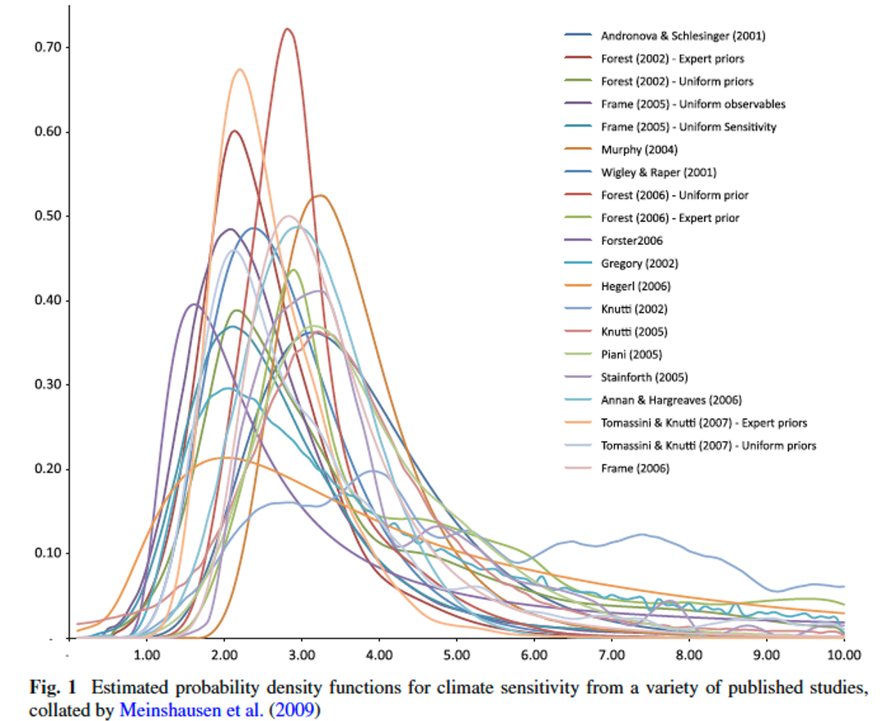
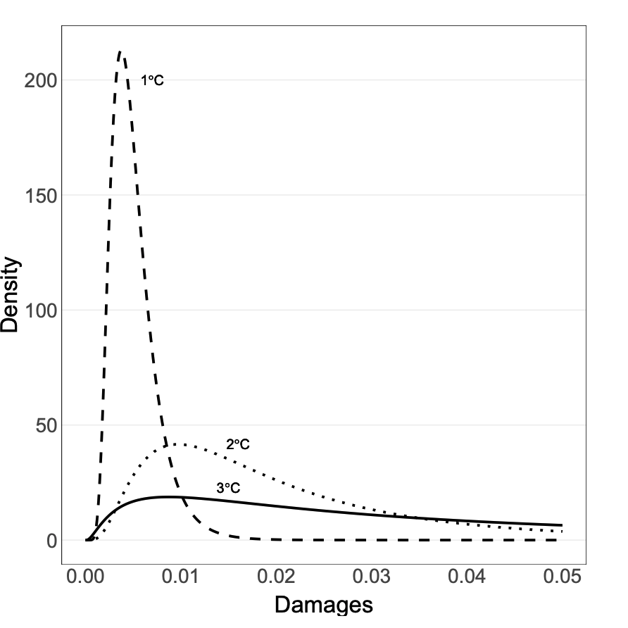
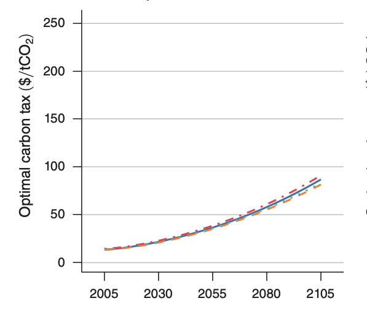

exclude: true
```{r setup}
if (!require("pacman")) install.packages("pacman")
pacman::p_load(
  tidyverse, xaringanExtra, rlang, patchwork, nycflights13, tweetrmd, vembedr
)
options(htmltools.dir.version = FALSE)
knitr::opts_hooks$set(fig.callout = function(options) {
  if (options$fig.callout) {
    options$echo <- FALSE
  }
knitr::opts_chunk$set(echo = TRUE, fig.align="center")
  options
})
```
```{r xaringanExtra, echo = FALSE}
xaringanExtra::use_xaringan_extra(c("tile_view", "panelset", "webcam"))

```
```{r echo=FALSE}
xaringanExtra::style_panelset(panel_tab_color_active = "red")
```

---

# Roadmap

1. What role does uncertainty play in economic analysis of the environment?
2. What are the implications of uncertainty for policy choice and welfare?


---

class: inverse, center, middle
name: tradable permits

# Uncertainty and the environment

<html><div style='float:left'></div><hr color='#EB811B' size=1px width=796px></html>

---

# Learning about arctic sea ice

```{r, out.width = "100%", echo = FALSE}
embed_url("https://youtu.be/MicU8h4-kNw") %>%
  use_align("center")
```

---

# Uncertainty and risk

.hi[Risk] refers to situations where the classification of states, events or alternatives is objective and known, and their probabilities can be objectively determined

.hi[Uncertainty] arises from "the impossibility of exhaustive classification of states": nature/economy can be so complex that all possible states are simply not known

---

# Uncertainty and risk

Uncertainty can factor into environmental policy-making in a number of ways:
--

- Scientific (uncertainty in MD)
--

- Strategic (uncertainty about MAC)
--

- Dynamic (uncertainty about what MD will be in the future)
--


The type of uncertainty can have implications for instrument choice


---

# Policy under uncertainty

.pull-left[
```{r perfect_info, echo = FALSE, fig.show = 'hide', warning = F}
mac <- function(x) 2 - 2/3*x
md <- function(x) x - 0.5
ab_cost <- tibble(x = c(1.5, 1.5, 3),
                     y = c(1, 0, 0))
tax_payment <- tibble(x = c(1.5, 1.5, 0, 0),
                     y = c(1, 0, 0, 1))
ggplot() +
  annotate("text", x = .3, y = 2, label = "MAC", size = 8) +
  annotate("text", x = 2.5, y = 2.5, label = "MD", size = 8) +
  annotate("text", x = 2.5, y = 0.9, label = expression(tau), size = 8) +
  stat_function(fun = mac, color = "#ca5670", size = 1.5) +
  stat_function(fun = md, color = "#638ccc", size = 1.5) +
  annotate("segment", x = 1.5, xend = 1.5, y = 0, yend = 1,
           linetype = "dashed", size = 1.5, color = "grey50") +
  annotate("segment", x = 0, xend = 3, y = .99, yend = .99,
           linetype = "dashed", size = 1.5, color = "#000000") +
  theme_minimal() +
  theme(
    legend.position = "none",
    title = element_text(size = 24),
    axis.text.x = element_text(size = 24), axis.text.y = element_text(size = 24, color = "#eeeeee"),
    axis.title.x = element_text(size = 24), axis.title.y = element_text(size = 24),
    panel.grid.minor.x = element_blank(), panel.grid.major.y = element_blank(),
    panel.grid.minor.y = element_blank(), panel.grid.major.x = element_blank(),
    panel.background = element_rect(fill = "#eeeeee",colour = NA),
    plot.background = element_rect(fill = "#eeeeee",colour = NA),
    axis.line = element_line(colour = "black")
  ) +
  labs(x = "Emissions",
       y = "Capital/$") +
  scale_x_continuous(expand = c(0,0), limits = c(0,3.1), breaks = c(1.5,3), labels = c(expression(E^'*'), expression(E[0]))) +
  scale_y_continuous(expand = c(0,0), limits = c(0,3.1))

```

`)
]

.pull-right[

With .hi[perfect information] we can achieve the efficient outcome using either a tax $\tau$ or an emission standard $\bar{E} = E^*$

Will this hold true even with uncertainty about MD or MAC?

]


---

# Scientific uncertainty

It is very likely that we don’t know much about how damaging a particular pollutant is<sup>1</sup>
.footnote[
<sup>1</sup>This is even ignoring the fact that we probably don't even know the slope of the marginal damage curve.
]

--

What are the actual health risks?

--

Who are affected?

--

Given risks and affected groups, how do we value lives/health?

--

How do we value threatened environmental amenities?

---

# Climate change

.pull-left[
<center>
```{r, out.width = "100%", fig.pos="c", echo = FALSE}

```
</center>
]

.pull-right[
These are our best estimates of the distribution of the .hi[equilibrium climate sensitivity:] how much the earth warms on average if we double CO<sub>2</sub> concentrations

Uncertainty in ECS means we are uncertain about the true costs of emitting a ton of CO<sub>2</sub> (i.e. the social cost of CO<sub>2</sub>)

]


---

# Climate change

.pull-left[
<center>
```{r, out.width = "100%", fig.pos="c", echo = FALSE}

```
</center>
Rudik (2020)

]

.pull-right[
There's also uncertainty over how costly a given amount of warming will be
- How bad is 1 degree of warming for agricultural yields?

These are distributions of damages to global GDP at given levels of warming

]

---

# Policy under scientific uncertainty

.pull-left[
```{r science_uncertain, echo = FALSE, fig.show = 'hide', warning = F}
mac <- function(x) 2 - 2/3*x
md <- function(x) x - 0.5
mdh <- function(x) x + 0.5
mdl <- function(x) x - 1.5
ab_cost <- tibble(x = c(1.5, 1.5, 3),
                     y = c(1, 0, 0))
tax_payment <- tibble(x = c(1.5, 1.5, 0, 0),
                     y = c(1, 0, 0, 1))
ggplot() +
  annotate("text", x = .3, y = 2, label = "MAC", size = 8) +
  annotate("text", x = 2.5, y = 2.3, label = expression(MD[e]), size = 8) +
  annotate("text", x = 1.6, y = 2.5, label = expression(MD[h]), size = 8) +
  annotate("text", x = 2.5, y = 1.3, label = expression(MD[l]), size = 8) +
  stat_function(fun = mac, color = "#ca5670", size = 1.5) +
  stat_function(fun = md, color = "#638ccc", size = 1.5, linetype = "dashed") +
  stat_function(fun = mdh, color = "#000000", size = 1.5) +
  stat_function(fun = mdl, color = "#000000", size = 1.5) +
  theme_minimal() +
  theme(
    legend.position = "none",
    title = element_text(size = 24),
    axis.text.x = element_text(size = 24), axis.text.y = element_text(size = 24, color = "#eeeeee"),
    axis.title.x = element_text(size = 24), axis.title.y = element_text(size = 24),
    panel.grid.minor.x = element_blank(), panel.grid.major.y = element_blank(),
    panel.grid.minor.y = element_blank(), panel.grid.major.x = element_blank(),
    panel.background = element_rect(fill = "#eeeeee",colour = NA),
    plot.background = element_rect(fill = "#eeeeee",colour = NA),
    axis.line = element_line(colour = "black")
  ) +
  labs(x = "Emissions",
       y = "Capital/$") +
  scale_x_continuous(expand = c(0,0), limits = c(0,3.1), breaks = c(3), labels = c( expression(E[0]))) +
  scale_y_continuous(expand = c(0,0), limits = c(0,3.1))

```

`)
]

.pull-right[

If we are uncertain about MD how should we set policy?

Suppose we have a best estimate, $MD_e$


Unfortunately our estimate was wrong, and the true MD curve is given by $MD_h$ or $MD_l$

Let's say the actual MD is $MD_l$, what happens under our policies?

]


---

# Policy under scientific uncertainty

.pull-left[
`)
]

.pull-right[

First: what tax and standard does the regulator set?

]


---

# Policy under scientific uncertainty

.pull-left[
```{r science_uncertain2, echo = FALSE, fig.show = 'hide', warning = F}
mac <- function(x) 2 - 2/3*x
md <- function(x) x - 0.5
mdh <- function(x) x + 0.5
mdl <- function(x) x - 1.5
ab_cost <- tibble(x = c(1.5, 1.5, 3),
                     y = c(1, 0, 0))
tax_payment <- tibble(x = c(1.5, 1.5, 0, 0),
                     y = c(1, 0, 0, 1))
ggplot() +
  annotate("text", x = .3, y = 2, label = "MAC", size = 8) +
  annotate("text", x = 2.5, y = 2.3, label = expression(MD[e]), size = 8) +
  annotate("text", x = 1.6, y = 2.5, label = expression(MD[h]), size = 8) +
  annotate("text", x = 2.5, y = 1.3, label = expression(MD[l]), size = 8) +
  annotate("segment", x = 0, xend = 3, y = 1, yend = 1,
           linetype = "dotted", size = 2, color = "firebrick") +
  annotate("segment", x = 1.5, xend = 1.5, y = 0, yend = 3,
           linetype = "dotted", size = 2, color = "firebrick") +
  stat_function(fun = mac, color = "#ca5670", size = 1.5) +
  stat_function(fun = md, color = "#638ccc", size = 1.5, linetype = "dashed") +
  stat_function(fun = mdh, color = "#000000", size = 1.5) +
  stat_function(fun = mdl, color = "#000000", size = 1.5) +
  theme_minimal() +
  theme(
    legend.position = "none",
    title = element_text(size = 24),
    axis.text.x = element_text(size = 24), axis.text.y = element_text(size = 24),
    axis.title.x = element_text(size = 24), axis.title.y = element_text(size = 24),
    panel.grid.minor.x = element_blank(), panel.grid.major.y = element_blank(),
    panel.grid.minor.y = element_blank(), panel.grid.major.x = element_blank(),
    panel.background = element_rect(fill = "#eeeeee",colour = NA),
    plot.background = element_rect(fill = "#eeeeee",colour = NA),
    axis.line = element_line(colour = "black")
  ) +
  labs(x = "Emissions",
       y = "Capital/$") +
  scale_x_continuous(expand = c(0,0), limits = c(0,3.1), breaks = c(1.5,3), labels = c(expression(E[e]), expression(E[0]))) +
  scale_y_continuous(expand = c(0,0), limits = c(0,3.1), breaks = 1, labels = expression(tau[e]))

```
`)
]

.pull-right[

First: what tax and standard does the regulator set?

The regulator selects a standard where she thinks MAC = MD: E<sub>e</sub>

The regulator selects a tax where she thinks MAC = MD: $\tau$<sub>e</sub>

With these two policies in place, what does the firm do?

]


---

# Policy under scientific uncertainty

.pull-left[
`)
]

.pull-right[

The firm emits at E<sub>e</sub> under both the tax and standard

We get the same outcome

Is there any deadweight loss?

If so, how much?

]


---

# Policy under scientific uncertainty

.pull-left[
```{r science_uncertain3, echo = FALSE, fig.show = 'hide', warning = F}
mac <- function(x) 2 - 2/3*x
md <- function(x) x - 0.5
mdh <- function(x) x + 0.5
mdl <- function(x) x - 1.5
ab_cost <- tibble(x = c(1.5, 1.5, 3),
                     y = c(1, 0, 0))
tax_payment <- tibble(x = c(1.5, 1.5, 0, 0),
                     y = c(1, 0, 0, 1))
ggplot() +
  annotate("text", x = .3, y = 2, label = "MAC", size = 8) +
  annotate("text", x = 2.5, y = 2.3, label = expression(MD[e]), size = 8) +
  annotate("text", x = 1.6, y = 2.5, label = expression(MD[h]), size = 8) +
  annotate("text", x = 2.5, y = 1.3, label = expression(MD[l]), size = 8) +
  annotate("segment", x = 21/10, xend = 21/10, y = 0, yend = 2- 2*21/10/3,
           linetype = "dotted", size = 2, color = "firebrick") +
  annotate("segment", x = 1.5, xend = 1.5, y = 0, yend = 1,
           linetype = "dotted", size = 2, color = "firebrick") +
  stat_function(fun = mac, color = "#ca5670", size = 1.5) +
  stat_function(fun = md, color = "#638ccc", size = 1.5, linetype = "dashed") +
  stat_function(fun = mdh, color = "#000000", size = 1.5) +
  stat_function(fun = mdl, color = "#000000", size = 1.5) +
  theme_minimal() +
  theme(
    legend.position = "none",
    title = element_text(size = 24),
    axis.text.x = element_text(size = 24), axis.text.y = element_text(size = 24),
    axis.title.x = element_text(size = 24), axis.title.y = element_text(size = 24),
    panel.grid.minor.x = element_blank(), panel.grid.major.y = element_blank(),
    panel.grid.minor.y = element_blank(), panel.grid.major.x = element_blank(),
    panel.background = element_rect(fill = "#eeeeee",colour = NA),
    plot.background = element_rect(fill = "#eeeeee",colour = NA),
    axis.line = element_line(colour = "black")
  ) +
  labs(x = "Emissions",
       y = "Capital/$") +
  scale_x_continuous(expand = c(0,0), limits = c(0,3.1), breaks = c(1.5,21/10,3), labels = c(expression(E[e]), expression(E^'*'),  expression(E[0]))) +
  scale_y_continuous(expand = c(0,0), limits = c(0,3.1), breaks = 1, labels = expression(tau[e]))

```
`)
]

.pull-right[

We actually want to be at E<sup>*</sup>

We are emitting too little because we overestimated damages

What is the DWL associated with under-emission?

]


---

# Policy under scientific uncertainty

.pull-left[
```{r science_uncertain4, echo = FALSE, fig.show = 'hide', warning = F}
mac <- function(x) 2 - 2/3*x
md <- function(x) x - 0.5
mdh <- function(x) x + 0.5
mdl <- function(x) x - 1.5
dwl <- tibble(x = c(21/10, 21/10, 1.5),
                     y = c(2- 2*21/10/3, 21/10-.5, 1))
ggplot() +
  geom_polygon(data = dwl, aes(x = x, y = y), fill = "red", alpha = 0.2) +
  annotate("text", x = .3, y = 2, label = "MAC", size = 8) +
  annotate("text", x = 2.5, y = 2.3, label = expression(MD[e]), size = 8) +
  annotate("text", x = 1.6, y = 2.5, label = expression(MD[h]), size = 8) +
  annotate("text", x = 2.5, y = 1.3, label = expression(MD[l]), size = 8) +
  annotate("segment", x = 21/10, xend = 21/10, y = 0, yend = 2- 2*21/10/3,
           linetype = "dotted", size = 2, color = "firebrick") +
  annotate("segment", x = 1.5, xend = 1.5, y = 0, yend = 1,
           linetype = "dotted", size = 2, color = "firebrick") +
  stat_function(fun = mac, color = "#ca5670", size = 1.5) +
  stat_function(fun = md, color = "#638ccc", size = 1.5, linetype = "dashed") +
  stat_function(fun = mdh, color = "#000000", size = 1.5) +
  stat_function(fun = mdl, color = "#000000", size = 1.5) +
  theme_minimal() +
  theme(
    legend.position = "none",
    title = element_text(size = 24),
    axis.text.x = element_text(size = 24), axis.text.y = element_text(size = 24),
    axis.title.x = element_text(size = 24), axis.title.y = element_text(size = 24),
    panel.grid.minor.x = element_blank(), panel.grid.major.y = element_blank(),
    panel.grid.minor.y = element_blank(), panel.grid.major.x = element_blank(),
    panel.background = element_rect(fill = "#eeeeee",colour = NA),
    plot.background = element_rect(fill = "#eeeeee",colour = NA),
    axis.line = element_line(colour = "black")
  ) +
  labs(x = "Emissions",
       y = "Capital/$") +
  scale_x_continuous(expand = c(0,0), limits = c(0,3.1), breaks = c(1.5,21/10,3), labels = c(expression(E[e]), expression(E^'*'),  expression(E[0]))) +
  scale_y_continuous(expand = c(0,0), limits = c(0,3.1), breaks = 1, labels = expression(tau[e]))

```
`)
]

.pull-right[

DWL comes from abatement costs in excess of the avoided damages

This is the area in red

With uncertain MD, we do not get the efficient outcome!

Will the story be any different if the true MD was instead MD<sub>h</sub>?

]


---

# Policy under strategic uncertainty

.pull-left[
```{r strategy_uncertain, echo = FALSE, fig.show = 'hide', warning = F}
mac <- function(x) 2 - 2/3*x
md <- function(x) x - 0.5
mach <- function(x) 2.5 - 2/3*x
macl <- function(x) 1 - 2/3*x
# dwl <- tibble(x = c(21/10, 21/10, 1.5),
#                      y = c(2- 2*21/10/3, 21/10-.5, 1))
ggplot() +
  # geom_polygon(data = dwl, aes(x = x, y = y), fill = "red", alpha = 0.2) +
  annotate("text", x = .3, y = 2, label = expression(MAC[e]), size = 8) +
  annotate("text", x = 2.5, y = 2.3, label = expression(MD), size = 8) +
  annotate("text", x = .3, y = 2.5, label = expression(MAC[h]), size = 8) +
  annotate("text", x = .3, y = .6, label = expression(MAC[l]), size = 8) +
  # annotate("segment", x = 21/10, xend = 21/10, y = 0, yend = 2- 2*21/10/3,
  #          linetype = "dotted", size = 2, color = "firebrick") +
  # annotate("segment", x = 1.5, xend = 1.5, y = 0, yend = 1,
  #          linetype = "dotted", size = 2, color = "firebrick") +
  stat_function(fun = mac, color = "#ca5670", size = 1.5, linetype = "dashed") +
  stat_function(fun = md, color = "#638ccc", size = 1.5, linetype = "solid") +
  stat_function(fun = mach, color = "#000000", size = 1.5) +
  stat_function(fun = macl, color = "#000000", size = 1.5) +
  theme_minimal() +
  theme(
    legend.position = "none",
    title = element_text(size = 24),
    axis.text.x = element_text(size = 24), axis.text.y = element_text(size = 24, color = "#EEEEEE"),
    axis.title.x = element_text(size = 24), axis.title.y = element_text(size = 24),
    panel.grid.minor.x = element_blank(), panel.grid.major.y = element_blank(),
    panel.grid.minor.y = element_blank(), panel.grid.major.x = element_blank(),
    panel.background = element_rect(fill = "#eeeeee",colour = NA),
    plot.background = element_rect(fill = "#eeeeee",colour = NA),
    axis.line = element_line(colour = "black")
  ) +
  labs(x = "Emissions",
       y = "Capital/$") +
  scale_x_continuous(expand = c(0,0), limits = c(0,3.1), breaks = c(3), labels = c(expression(E[0]))) +
  scale_y_continuous(expand = c(0,0), limits = c(0,3.1))

```
`)
]

.pull-right[

Now what if we have .hi[strategic uncertainty:] the regulator does not know the firms' MAC curves

The regulator thinks the MAC is MAC<sub>e</sub> but it may be MAC<sub>h</sub> or MAC<sub>l</sub>

Suppose the true MAC is MAC<sub>h</sub>

]


---

# Policy under strategic uncertainty

.pull-left[
```{r strategy_uncertain2, echo = FALSE, fig.show = 'hide', warning = F}
mac <- function(x) 2 - 2/3*x
md <- function(x) x - 0.5
mach <- function(x) 2.5 - 2/3*x
macl <- function(x) 1 - 2/3*x
# dwl <- tibble(x = c(21/10, 21/10, 1.5),
#                      y = c(2- 2*21/10/3, 21/10-.5, 1))
ggplot() +
  # geom_polygon(data = dwl, aes(x = x, y = y), fill = "red", alpha = 0.2) +
  annotate("text", x = .3, y = 2, label = expression(MAC[e]), size = 8) +
  annotate("text", x = 2.5, y = 2.3, label = expression(MD), size = 8) +
  annotate("text", x = .3, y = 2.5, label = expression(MAC[h]), size = 8) +
  annotate("text", x = .3, y = .6, label = expression(MAC[l]), size = 8) +
  annotate("segment", x = 0, xend = 3, y = 1, yend = 1,
           linetype = "dotted", size = 2, color = "firebrick") +
  annotate("segment", x = 1.5, xend = 1.5, y = 0, yend = 3,
           linetype = "dotted", size = 2, color = "firebrick") +
  annotate("segment", x = 9/5, xend = 9/5, y = 0, yend = 9/5-.5,
           linetype = "dotted", size = 1, color = "firebrick") +
  stat_function(fun = mac, color = "#ca5670", size = 1.5, linetype = "dashed") +
  stat_function(fun = md, color = "#638ccc", size = 1.5) +
  stat_function(fun = mach, color = "#000000", size = 1.5) +
  stat_function(fun = macl, color = "#000000", size = 1.5) +
  theme_minimal() +
  theme(
    legend.position = "none",
    title = element_text(size = 24),
    axis.text.x = element_text(size = 24), axis.text.y = element_text(size = 24),
    axis.title.x = element_text(size = 24), axis.title.y = element_text(size = 24),
    panel.grid.minor.x = element_blank(), panel.grid.major.y = element_blank(),
    panel.grid.minor.y = element_blank(), panel.grid.major.x = element_blank(),
    panel.background = element_rect(fill = "#eeeeee",colour = NA),
    plot.background = element_rect(fill = "#eeeeee",colour = NA),
    axis.line = element_line(colour = "black")
  ) +
  labs(x = "Emissions",
       y = "Capital/$") +
  scale_x_continuous(expand = c(0,0), limits = c(0,3.1), breaks = c(1.5,9/5,3), labels = c(expression(E[e]), expression(E^'*'),  expression(E[0]))) +
  scale_y_continuous(expand = c(0,0), limits = c(0,3.1), breaks = 1, labels = expression(tau[e]))

```
`)
]

.pull-right[

The regulator again sets a standard of E<sub>e</sub> and a tax of $\tau_e$

We know the efficient level of emissions is E<sup>*</sup>

What level of emissions do we actually get?

]


---

# Policy under strategic uncertainty

.pull-left[
`)
]

.pull-right[

Under a standard we get E<sub>e</sub>


]


---

# Policy under strategic uncertainty

.pull-left[
```{r strategy_uncertain3, echo = FALSE, fig.show = 'hide', warning = F}
mac <- function(x) 2 - 2/3*x
md <- function(x) x - 0.5
mach <- function(x) 2.5 - 2/3*x
macl <- function(x) 1 - 2/3*x
# dwl <- tibble(x = c(21/10, 21/10, 1.5),
#                      y = c(2- 2*21/10/3, 21/10-.5, 1))
ggplot() +
  # geom_polygon(data = dwl, aes(x = x, y = y), fill = "red", alpha = 0.2) +
  annotate("text", x = .3, y = 2, label = expression(MAC[e]), size = 8) +
  annotate("text", x = 2.5, y = 2.3, label = expression(MD), size = 8) +
  annotate("text", x = .3, y = 2.5, label = expression(MAC[h]), size = 8) +
  annotate("text", x = .3, y = .6, label = expression(MAC[l]), size = 8) +
  annotate("segment", x = 0, xend = 3, y = 1, yend = 1,
           linetype = "dotted", size = 2, color = "firebrick") +
  annotate("segment", x = 1.5, xend = 1.5, y = 0, yend = 3,
           linetype = "dotted", size = 2, color = "firebrick") +
  annotate("segment", x = 9/5, xend = 9/5, y = 0, yend = 9/5-.5,
           linetype = "dotted", size = 1, color = "firebrick") +
  annotate("segment", x = 2.25, xend = 2.25, y = 0, yend = 1,
           linetype = "dotted", size = 1, color = "firebrick") +
  stat_function(fun = mac, color = "#ca5670", size = 1.5, linetype = "dashed") +
  stat_function(fun = md, color = "#638ccc", size = 1.5) +
  stat_function(fun = mach, color = "#000000", size = 1.5) +
  stat_function(fun = macl, color = "#000000", size = 1.5) +
  theme_minimal() +
  theme(
    legend.position = "none",
    title = element_text(size = 24),
    axis.text.x = element_text(size = 24), axis.text.y = element_text(size = 24),
    axis.title.x = element_text(size = 24), axis.title.y = element_text(size = 24),
    panel.grid.minor.x = element_blank(), panel.grid.major.y = element_blank(),
    panel.grid.minor.y = element_blank(), panel.grid.major.x = element_blank(),
    panel.background = element_rect(fill = "#eeeeee",colour = NA),
    plot.background = element_rect(fill = "#eeeeee",colour = NA),
    axis.line = element_line(colour = "black")
  ) +
  labs(x = "Emissions",
       y = "Capital/$") +
  scale_x_continuous(expand = c(0,0), limits = c(0,3.1), breaks = c(1.5,9/5,2.25,3), labels = c(expression(E[e]), expression(E^'*'), expression(E[tau]),  expression(E[0]))) +
  scale_y_continuous(expand = c(0,0), limits = c(0,3.1), breaks = 1, labels = expression(tau[e]))

```
`)
]

.pull-right[

Under a standard we get E<sub>e</sub>

Under a tax we get $E_\tau$

Since we get different levels of emissions under the two policies, they may give us different levels of deadweight loss

Let's see..

]


---

# Policy under strategic uncertainty

.pull-left[
```{r strategy_uncertain4, echo = FALSE, fig.show = 'hide', warning = F}
mac <- function(x) 2 - 2/3*x
md <- function(x) x - 0.5
mach <- function(x) 2.5 - 2/3*x
macl <- function(x) 1 - 2/3*x
dwl <- tibble(x = c(9/5, 1.5, 1.5),
                     y = c(9/5-.5, 1.5, 1))
ggplot() +
  geom_polygon(data = dwl, aes(x = x, y = y), fill = "red", alpha = 0.4) +
  annotate("text", x = .3, y = 2, label = expression(MAC[e]), size = 8) +
  annotate("text", x = 2.5, y = 2.3, label = expression(MD), size = 8) +
  annotate("text", x = .3, y = 2.5, label = expression(MAC[h]), size = 8) +
  annotate("text", x = .3, y = .6, label = expression(MAC[l]), size = 8) +
  annotate("segment", x = 0, xend = 3, y = 1, yend = 1,
           linetype = "dotted", size = 2, color = "firebrick") +
  annotate("segment", x = 1.5, xend = 1.5, y = 0, yend = 3,
           linetype = "dotted", size = 2, color = "firebrick") +
  annotate("segment", x = 9/5, xend = 9/5, y = 0, yend = 9/5-.5,
           linetype = "dotted", size = 1, color = "firebrick") +
  annotate("segment", x = 2.25, xend = 2.25, y = 0, yend = 1,
           linetype = "dotted", size = 1, color = "firebrick") +
  stat_function(fun = mac, color = "#ca5670", size = 1.5, linetype = "dashed") +
  stat_function(fun = md, color = "#638ccc", size = 1.5) +
  stat_function(fun = mach, color = "#000000", size = 1.5) +
  stat_function(fun = macl, color = "#000000", size = 1.5) +
  theme_minimal() +
  theme(
    legend.position = "none",
    title = element_text(size = 24),
    axis.text.x = element_text(size = 24), axis.text.y = element_text(size = 24),
    axis.title.x = element_text(size = 24), axis.title.y = element_text(size = 24),
    panel.grid.minor.x = element_blank(), panel.grid.major.y = element_blank(),
    panel.grid.minor.y = element_blank(), panel.grid.major.x = element_blank(),
    panel.background = element_rect(fill = "#eeeeee",colour = NA),
    plot.background = element_rect(fill = "#eeeeee",colour = NA),
    axis.line = element_line(colour = "black")
  ) +
  labs(x = "Emissions",
       y = "Capital/$") +
  scale_x_continuous(expand = c(0,0), limits = c(0,3.1), breaks = c(1.5,9/5,2.25,3), labels = c(expression(E[e]), expression(E^'*'), expression(E[tau]),  expression(E[0]))) +
  scale_y_continuous(expand = c(0,0), limits = c(0,3.1), breaks = 1, labels = expression(tau[e]))

```
`)
]

.pull-right[

The DWL under a standard is given by the .hi-red[red] area

This is caused by .hi[too little emissions]

]


---

# Policy under strategic uncertainty

.pull-left[
```{r strategy_uncertain5, echo = FALSE, fig.show = 'hide', warning = F}
mac <- function(x) 2 - 2/3*x
md <- function(x) x - 0.5
mach <- function(x) 2.5 - 2/3*x
macl <- function(x) 1 - 2/3*x
dwl <- tibble(x = c(9/5, 1.5, 1.5),
                     y = c(9/5-.5, 1.5, 1))
dwl2 <- tibble(x = c(9/5, 2.25, 2.25),
                     y = c(9/5-.5, 1.75, 1))
ggplot() +
  geom_polygon(data = dwl, aes(x = x, y = y), fill = "red", alpha = 0.4) +
  geom_polygon(data = dwl2, aes(x = x, y = y), fill = "blue", alpha = 0.4) +
  annotate("text", x = .3, y = 2, label = expression(MAC[e]), size = 8) +
  annotate("text", x = 2.5, y = 2.3, label = expression(MD), size = 8) +
  annotate("text", x = .3, y = 2.5, label = expression(MAC[h]), size = 8) +
  annotate("text", x = .3, y = .6, label = expression(MAC[l]), size = 8) +
  annotate("segment", x = 0, xend = 3, y = 1, yend = 1,
           linetype = "dotted", size = 2, color = "firebrick") +
  annotate("segment", x = 1.5, xend = 1.5, y = 0, yend = 3,
           linetype = "dotted", size = 2, color = "firebrick") +
  annotate("segment", x = 9/5, xend = 9/5, y = 0, yend = 9/5-.5,
           linetype = "dotted", size = 1, color = "firebrick") +
  annotate("segment", x = 2.25, xend = 2.25, y = 0, yend = 1,
           linetype = "dotted", size = 1, color = "firebrick") +
  stat_function(fun = mac, color = "#ca5670", size = 1.5, linetype = "dashed") +
  stat_function(fun = md, color = "#638ccc", size = 1.5) +
  stat_function(fun = mach, color = "#000000", size = 1.5) +
  stat_function(fun = macl, color = "#000000", size = 1.5) +
  theme_minimal() +
  theme(
    legend.position = "none",
    title = element_text(size = 24),
    axis.text.x = element_text(size = 24), axis.text.y = element_text(size = 24),
    axis.title.x = element_text(size = 24), axis.title.y = element_text(size = 24),
    panel.grid.minor.x = element_blank(), panel.grid.major.y = element_blank(),
    panel.grid.minor.y = element_blank(), panel.grid.major.x = element_blank(),
    panel.background = element_rect(fill = "#eeeeee",colour = NA),
    plot.background = element_rect(fill = "#eeeeee",colour = NA),
    axis.line = element_line(colour = "black")
  ) +
  labs(x = "Emissions",
       y = "Capital/$") +
  scale_x_continuous(expand = c(0,0), limits = c(0,3.1), breaks = c(1.5,9/5,2.25,3), labels = c(expression(E[e]), expression(E^'*'), expression(E[tau]),  expression(E[0]))) +
  scale_y_continuous(expand = c(0,0), limits = c(0,3.1), breaks = 1, labels = expression(tau[e]))

```
`)
]

.pull-right[

The DWL under a standard is given by the .hi-red[red] area

This is caused by .hi[too little emissions]

The DWL under a tax is given by the .hi-blue[blue] area

This is caused by .hi[too many emissions]

]


---

# Policy under strategic uncertainty

.pull-left[
`)
]

.pull-right[

The DWLs are similar-ish in size

Why do we get the DWLs?


]


---

# Policy under strategic uncertainty

.pull-left[
`)
]

.pull-right[

.hi[Standard:] we under estimated the MAC and thought it'd be cheaper to abate than it actually was, so we set too stringent of a standard

.hi[Tax:] we under estimated the MAC and thought it'd be cheaper to abate than it actually was, so we set too low of a tax

The same error leads to different qualitative outcomes

]


---

# Policy under strategic uncertainty

.pull-left[
`)
]

.pull-right[

Which policy performs better depends on the relative slopes of the MAC and MD curves

Now consider an example where the MD curve is relatively .hi[steep]

Try to solve for the policy choices and DWLs yourself

]


---

# Policy under strategic uncertainty

.pull-left[
```{r strategy_steep, echo = FALSE, fig.show = 'hide', warning = F}
mac <- function(x) 2 - 2/3*x
md <- function(x) 2*x - 1
mach <- function(x) 2.5 - 2/3*x
dwl <- tibble(x = c(21/16, 9/8, 9/8),
                     y = c(2*21/16-1, 10/8, 2.5-2*9/3/8))
dwl2 <- tibble(x = c(21/16, 1.875, 1.875),
                     y = c(2*21/16-1, 10/8, 2*1.875-1))
ggplot() +
  geom_polygon(data = dwl, aes(x = x, y = y), fill = "red", alpha = 0.4) +
  geom_polygon(data = dwl2, aes(x = x, y = y), fill = "blue", alpha = 0.4) +
  annotate("text", x = .3, y = 2, label = expression(MAC[e]), size = 8) +
  annotate("text", x = 1.75, y = 2.8, label = expression(MD), size = 8) +
  annotate("text", x = .3, y = 2.5, label = expression(MAC[h]), size = 8) +
  annotate("segment", x = 0, xend = 3, y = 10/8, yend = 10/8,
           linetype = "dotted", size = 2, color = "firebrick") +
  annotate("segment", x = 9/8, xend = 9/8, y = 0, yend = 3,
           linetype = "dotted", size = 2, color = "firebrick") +
  annotate("segment", x = 1.875, xend = 1.875, y = 0, yend = 10/8,
           linetype = "dotted", size = 1, color = "firebrick") +
  annotate("segment", x = 21/16, xend = 21/16, y = 0, yend = 2*21/16-1,
           linetype = "dotted", size = 1, color = "firebrick") +
  stat_function(fun = mac, color = "#ca5670", size = 1.5, linetype = "dashed") +
  stat_function(fun = md, color = "#638ccc", size = 1.5) +
  stat_function(fun = mach, color = "#000000", size = 1.5) +
  theme_minimal() +
  theme(
    legend.position = "none",
    title = element_text(size = 24),
    axis.text.x = element_text(size = 24), axis.text.y = element_text(size = 24),
    axis.title.x = element_text(size = 24), axis.title.y = element_text(size = 24),
    panel.grid.minor.x = element_blank(), panel.grid.major.y = element_blank(),
    panel.grid.minor.y = element_blank(), panel.grid.major.x = element_blank(),
    panel.background = element_rect(fill = "#eeeeee",colour = NA),
    plot.background = element_rect(fill = "#eeeeee",colour = NA),
    axis.line = element_line(colour = "black")
  ) +
  labs(x = "Emissions",
       y = "Capital/$") +
  scale_x_continuous(expand = c(0,0), limits = c(0,3.1), breaks = c(9/8,21/16,1.875), labels = c(expression(E[e]), expression(E^'*'), expression(E[tau]))) +
  scale_y_continuous(expand = c(0,0), limits = c(0,3.1), breaks = 10/8, labels = expression(tau[e]))

```
`)
]

.pull-right[

If the MD curve is relatively steep a standard performs better, the .hi-red[red] DWL is smaller than the .hi-blue[blue] DWL

Why?

Taxes allow firms to choose the quantity

If the MD is relatively steep, an error in the quantity of emissions is very costly

]


---

# Steep MDs

A steep MD means the marginal external cost of emissions increases rapidly

--

Any examples?

--

One would be if there exist .hi[tipping points] in the climate system:
- Melt-back of Arctic summer sea ice
- Evidence that this is happening even without much additional warming
- Sea ice reflects light and cools polar regions
- This has big effects on air and ocean circulation

Collapse of Greenland ice sheet: could lead to a 7m rise in sea level


---

# Tipping points

Collapse of western Antarctic ice sheet
- Immediate risk of sea level rise

--

Die-back of Amazonian rainforest
- Species loss
- Effects on rainfall patterns in other parts of the world

--

Collapse of W. African monsoon season and many others


]


---

# Policy under strategic uncertainty

.pull-left[
```{r strategy_flat, echo = FALSE, fig.show = 'hide', warning = F}
mac <- function(x) 2 - 2/3*x
md <- function(x) 1 + x/4
mach <- function(x) 2.5 - 2/3*x
dwl <- tibble(x = c(1.5/(2/3+1/4), 9/8, 9/8),
                     y = c(1+1.5/(2/3+1/4)/4, 10/8, 2.5-2*9/3/8))
dwl2 <- tibble(x = c(1.5/(2/3+1/4), 1.875, 1.875),
                     y = c(1+1.5/(2/3+1/4)/4, 10/8, 1+1.875/4))
ggplot() +
  annotate("text", x = .3, y = 2, label = expression(MAC[e]), size = 8) +
  annotate("text", x = 2.8, y = 1.5, label = expression(MD), size = 8) +
  annotate("text", x = .3, y = 2.5, label = expression(MAC[h]), size = 8) +
  stat_function(fun = mac, color = "#ca5670", size = 1.5, linetype = "dashed") +
  stat_function(fun = md, color = "#638ccc", size = 1.5) +
  stat_function(fun = mach, color = "#000000", size = 1.5) +
  theme_minimal() +
  theme(
    legend.position = "none",
    title = element_text(size = 24),
    axis.text.x = element_text(size = 24), axis.text.y = element_text(size = 24),
    axis.title.x = element_text(size = 24), axis.title.y = element_text(size = 24),
    panel.grid.minor.x = element_blank(), panel.grid.major.y = element_blank(),
    panel.grid.minor.y = element_blank(), panel.grid.major.x = element_blank(),
    panel.background = element_rect(fill = "#eeeeee",colour = NA),
    plot.background = element_rect(fill = "#eeeeee",colour = NA),
    axis.line = element_line(colour = "black")
  ) +
  labs(x = "Emissions",
       y = "Capital/$") +
  scale_x_continuous(expand = c(0,0), limits = c(0,3.1), breaks = c(1.5/(2/3+1/4)), labels = c( expression(E^'*'))) +
  scale_y_continuous(expand = c(0,0), limits = c(0,3.1), breaks = 9, labels = expression(tau[e]))

```
`)
]

.pull-right[

Now what if MD is very flat?

Solve for the regulator's chosen policies and their associated DWL
]


---

# Policy under strategic uncertainty

.pull-left[
```{r strategy_flat2, echo = FALSE, fig.show = 'hide', warning = F}
mac <- function(x) 2 - 2/3*x
md <- function(x) 1 + x/4
mach <- function(x) 2.5 - 2/3*x
dwl <- tibble(x = c(1.5/(2/3+1/4), 9/8, 9/8),
                     y = c(1+1.5/(2/3+1/4)/4, 10/8, 2.5-2*9/3/8))
dwl2 <- tibble(x = c(1.5/(2/3+1/4), 1.875, 1.875),
                     y = c(1+1.5/(2/3+1/4)/4, 10/8, 1+1.875/4))
ggplot() +
  geom_polygon(data = dwl, aes(x = x, y = y), fill = "red", alpha = 0.4) +
  geom_polygon(data = dwl2, aes(x = x, y = y), fill = "blue", alpha = 0.4) +
  annotate("text", x = .3, y = 2, label = expression(MAC[e]), size = 8) +
  annotate("text", x = 2.8, y = 1.5, label = expression(MD), size = 8) +
  annotate("text", x = .3, y = 2.5, label = expression(MAC[h]), size = 8) +
  annotate("segment", x = 0, xend = 3, y = 10/8, yend = 10/8,
           linetype = "dotted", size = 2, color = "firebrick") +
  annotate("segment", x = 9/8, xend = 9/8, y = 0, yend = 3,
           linetype = "dotted", size = 2, color = "firebrick") +
  annotate("segment", x = 1.875, xend = 1.875, y = 0, yend = 10/8,
           linetype = "dotted", size = 1, color = "firebrick") +
  annotate("segment", x = 1.5/(2/3+1/4), xend = 1.5/(2/3+1/4), y = 0, yend = 1+1.5/(2/3+1/4)/4,
           linetype = "dotted", size = 1, color = "firebrick") +
  stat_function(fun = mac, color = "#ca5670", size = 1.5, linetype = "dashed") +
  stat_function(fun = md, color = "#638ccc", size = 1.5) +
  stat_function(fun = mach, color = "#000000", size = 1.5) +
  theme_minimal() +
  theme(
    legend.position = "none",
    title = element_text(size = 24),
    axis.text.x = element_text(size = 24), axis.text.y = element_text(size = 24),
    axis.title.x = element_text(size = 24), axis.title.y = element_text(size = 24),
    panel.grid.minor.x = element_blank(), panel.grid.major.y = element_blank(),
    panel.grid.minor.y = element_blank(), panel.grid.major.x = element_blank(),
    panel.background = element_rect(fill = "#eeeeee",colour = NA),
    plot.background = element_rect(fill = "#eeeeee",colour = NA),
    axis.line = element_line(colour = "black")
  ) +
  labs(x = "Emissions",
       y = "Capital/$") +
  scale_x_continuous(expand = c(0,0), limits = c(0,3.1), breaks = c(9/8,1.5/(2/3+1/4),1.875), labels = c(expression(E[e]), expression(E^'*'), expression(E[tau]))) +
  scale_y_continuous(expand = c(0,0), limits = c(0,3.1), breaks = 10/8, labels = expression(tau[e]))

```
`)
]

.pull-right[

If the MD curve is relatively flat a tax performs better, the .hi-blue[blue] DWL is smaller than the .hi-red[red] DWL

Why?

]


---

# Policy under strategic uncertainty

.pull-left[
`)
]

.pull-right[

Marginal damages are relatively constant no matter the quantity while abatement costs can change rapidly

It's valuable to let the firm flexibly choose abatement

Taxes impose a constant incentive on the firm, closer representation of the MD


]

---

# Dynamic uncertainty


.pull-left[
<center>
```{r, out.width = "100%", fig.pos="c", echo = FALSE}

```
Optimal carbon tax = MD
</center>
]

.pull-right[
Current MD may be zero, but future MD could be very high


e.g. greenhouse gases


1 ton emitted today is not as costly as 1 ton emitted tomorrow for a lot of reasons

]


---

# The Manne-Richel model

Two periods (current and future)

--

Two possible states of nature in the future (“good” with probability (1-p) and “bad” with probability p)

--

The bad state is the climate is .hi[very] sensitive to greenhouse gases, good state is the climate is not very sensitive (climate change is fake news!)

--

Each state requires different abatement to avoid climate catastrophe

| State 	| Probability 	| Cumulative Abatement Required 	|
|-------	|:-------------:	|:-------------------------------:	|
| Good  	| 1-p         	| 0                             	|
| Bad   	| p           	| 1                             	|

---

# The Manne-Richel model

Greenhouse gases are stock pollutants

--

Since greenhouse gases are very long-lived, abatement activity is cumulative (i.e. doing abatement activity today is as good as doing abatement activity in the future)

--

a<sub>1</sub>: current abatement  

a<sub>2</sub>: future abatement  

a<sub>1</sub>+a<sub>2</sub>: aggregate abatement

---

# The Manne-Richel model

If we do a<sub>1</sub> units of abatement today in the future we need to do:

--

1 - a<sub>1</sub> units with probability p (bad state)

--

0 with probability 1-p (good state)

--

Suppose abatement cost is given by: $C(a) = 0.5 a^2$

--

What is the regulator's problem?

---

# The Manne-Richel model

$$\min_{a_1} E[TC] = \underbrace{\frac{1}{2}a_1^2}_{\text{current cost}} + (1-p)\times \underbrace{0}_{\text{good state cost}} + p \times \underbrace{\frac{1}{2}(1-a_1)^2}_{\text{bad state cost}}$$

--

The first-order condition is:
$$\frac{d E[TC]}{da_1} = a^*_1 - p(1-a^*_1) = 0$$

--

This gives us that:
$$a^*_1 = \frac{p}{1-p}$$

---

# The Manne-Richel model

$$a^*_1 = \frac{p}{1-p}$$

If there is any chance of a bad state (p > 0), it is optimal to do *some* abatement today

--

If a bad state is guaranteed (p = 1), we want $a^*_1 = 1/2, a^*_2 = 1/2$

--

You can think about this as basically buying insurance

---

# The Manne-Richel model

It makes sense to do some abatement today, even if we are not sure there will be bad climate change, because the MAC is cheap for the first few units

--

In marginal terms: we want to equate the MAC today with the *expected* MAC in the future so that on average, we can't reallocate abatement and be better off

--

$$a^*_1 = p(1-a^*_1)$$

--

Now, what are some complications of this simple model?

---

# The Manne-Richel model

Abatement tech can improve: 

- future MAC different than current MAC
- future MAC might depend on current abatement (learning by doing)


---

# The Manne-Richel model

Discounting: how should we weigh future costs and benefits?

- Does this matter whether the future is the same generation or unborn generations?
- Does it matter how wealthy we think people are?

---

# The Manne-Richel model

Alternative decision frameworks:

- We just minimized expected total cost
- We could instead do .hi[minimax regret:] minimize the cost of the worst-case outcome
- We could use the .hi[precautionary principle:] use whatever is necessary to avoid irreversible damage