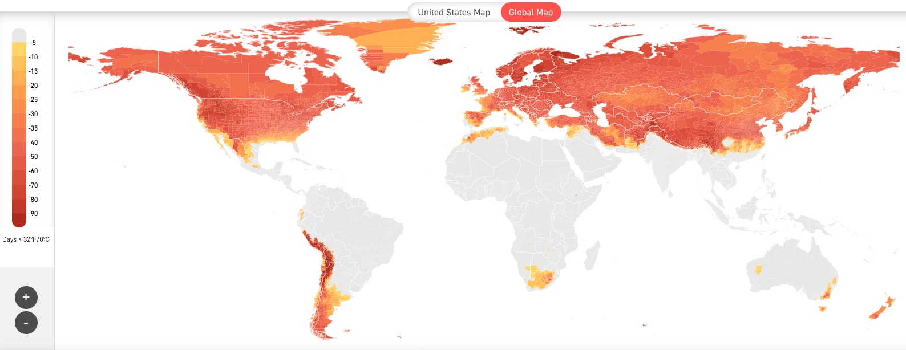

exclude: true
```{r setup}
if (!require("pacman")) install.packages("pacman")
pacman::p_load(
  tidyverse, xaringanExtra, rlang, patchwork, nycflights13, tweetrmd, vembedr
)
options(htmltools.dir.version = FALSE)
knitr::opts_hooks$set(fig.callout = function(options) {
  if (options$fig.callout) {
    options$echo <- FALSE
  }
knitr::opts_chunk$set(echo = TRUE, fig.align="center")
  options
})
```
```{r xaringanExtra, echo = FALSE}
xaringanExtra::use_xaringan_extra(c("tile_view", "panelset", "webcam"))

```
```{r echo=FALSE}
xaringanExtra::style_panelset(panel_tab_color_active = "red")
```

---

# Roadmap

1. What is discounting?
2. What determines the discount rate?
3. What are the implications of discounting on computing the costs and benefits of policies?


---

class: inverse, center, middle
name: tradable permits

# Discounting

<html><div style='float:left'></div><hr color='#EB811B' size=1px width=796px></html>

---

# Motivating discounting: http://impactlab.org/map

At the end of the century we will have much more hot days in some places
<center>
```{r, out.width = "100%", fig.pos="c", echo = FALSE}

```
</center>

---

# Motivating discounting: http://impactlab.org/map

At the end of the century we will have much fewer freezing days in others

<center>
```{r, out.width = "100%", fig.pos="c", echo = FALSE}

```
</center>

---

# Motivating discounting: http://impactlab.org/map

This has massive implications for mortality
<center>
```{r, out.width = "100%", fig.pos="c", echo = FALSE}
knitr::include_graphics("files/09-climate-damage.png")
```
</center>

---

# Motivating discounting

Some places are expecting to have huge gains in GDP from mortality risk

--

Others are expecting to have huge losses

--

This is all happening in 60-80 years

--

How do we compare these costs and benefits to those incurred today?

--

We use a .hi[discount rate:] a value that tells us how much future dollars are worth in today's terms

---

# Return to Manne-Richels

We ignored the idea of discounting in our discussion of the Manne-Richels model

--

Let $r$ be the discount rate, so $\beta = {1 \over 1+r}$ is the discount factor

--

Our new problem with discounting is then:

--

$$\min_{a_1} E[TC] = \underbrace{\frac{1}{2}a_1^2}_{\text{current cost}} + \beta\left[(1-p)\times \underbrace{0}_{\text{good state cost}} + p \times \underbrace{\frac{1}{2}(1-a_1)^2}_{\text{bad state cost}}\right]$$

---

# Return to Manne-Richels

The first-order condition is:
$$\frac{d E[TC]}{da_1} = a^*_1 - \beta p(1-a^*_1) = 0$$

--

This gives us that:
$$a^*_1 = \frac{\beta p}{1+\beta p}$$

--

How does discounting affect our decisionmaking?


---

# Discounting and decisionmaking

$$a^*_1 = \frac{\beta p}{1+\beta p}$$

--

First, notice as $r \rightarrow \infty$ we have $\beta = {1 \over 1 + r} \rightarrow 0$, we put less and less weight on the future

--

This means we do less abatement today in period 1!

--

That's intuitive, let's see what discount actually looks like graphically

--

What is the value of a future payment of $100?

---

# PV of $100

.pull-left[
```{r discounting, echo = FALSE, fig.show = 'hide', warning = F}
disc1 <- function(x) 100/(1.01)^x
disc3 <- function(x) 100/(1.03)^x
disc5 <- function(x) 100/(1.05)^x
disc7 <- function(x) 100/(1.10)^x

ggplot() +
  stat_function(fun = disc1, color = "#000000", size = 1.5, linetype = "solid") +
  stat_function(fun = disc3, color = "#000000", size = 1.5, linetype = "dashed") +
  stat_function(fun = disc5, color = "#000000", size = 1.5, linetype = "dotted") +
  stat_function(fun = disc7, color = "#000000", size = 1.5, linetype = "dotdash") +
  annotate("text", x = 50, y = 75, label = "1%", size = 8) +
  annotate("text", x = 50, y = 35, label = "3%", size = 8) +
  annotate("text", x = 50, y = 15, label = "5%", size = 8) +
  annotate("text", x = 23, y = 3, label = "10%", size = 8) +
  theme_minimal() +
  theme(
    legend.position = "none",
    title = element_text(size = 24),
    axis.text.x = element_text(size = 24), axis.text.y = element_text(size = 24),
    axis.title.x = element_text(size = 24), axis.title.y = element_text(size = 24),
    panel.grid.minor.x = element_blank(),
    panel.grid.minor.y = element_blank(),
    panel.background = element_rect(fill = "#eeeeee",colour = NA),
    plot.background = element_rect(fill = "#eeeeee",colour = NA),
    axis.line = element_line(colour = "black")
  ) +
  labs(x = "Years",
       y = "Dollars") +
  scale_x_continuous(limits = c(0,100)) +
  scale_y_continuous(limits = c(0,100))

```
`)
]

.pull-right[
Higher discount rates place less value on future benefits

Things > 30 years in the future have basically no value with a 10% discount rate

At a 1% discount rate we value things 100 years in the future at almost half their value today
]

---

# Discounting

Why does this matter?

--

Lots of things (like climate change) have costs or benefits that occur .hi[far] in the future

--

e.g. the benefits of taking action against climate change will be mostly borne by future generations, decades from now

--

Depending on our choice of discount rate these costs and benefits can be substantial or trivial

---

# Discounting

1 million in damages in 200 years at a discount rate of r = 2% is worth 19,053 today

--

1 million in damages in 200 years at a discount rate of r = 8% is worth only 21 cents today

--

5 orders of magnitude difference!

--

This makes the choice of the discount rate one of the most important (and contentious) things about climate change policy

---

# Discounting: how do we choose?

How do we choose the discount rate?

--

.hi[Option 1:] take the market rate

--

This is just the real interest paid on certain investments

--

In a perfect market equilibrium, it is the productivity of capital

--

Why might this not be the rate we want to choose as a regulator?


---

# Discounting: how do we choose?

Issues with market rates:

--

Market rates don't reflect externalities

--

Super-responsibility of government: the government represents future generations as well as current generations (only current ones are represented in the market)

--

Dual-role of individuals: in political roles, people are more concerned about future generations than in their day-to-day behavior which determines the market rate

---

# Discounting: how do we choose?

.hi[Option 2:] social discounting

--

With social discounting with determine the discount rate from economic and ethical considerations

--

Why should we discount the future?

--

Time: people are impatient

--

Growth: if someone is richer in 10 years, a dollar is worth more to them today than in 10 years in utility terms


---

# Ramsey Discounting

With a decent amount of math we can show that the discount rate $r$ is composed of three terms:
$$r = \delta + \eta \times g$$

$\delta$ is called the .hi[pure rate of time preference] or .hi[utility discount rate]: how much do we value future *utility*

$\eta$ is the .hi[elasticity of marginal utility]: how quickly does marginal utility decline in consumption?

$g$ is the .hi[growth rate]: how fast does consumption grow over time?

---

# Ramsey Discounting

Here's some alternative descriptions of how to think about these terms:

$\delta$: how much is 1 util tomorrow worth today?

$\eta$: how much do we value poorer vs richer times/generations? Bigger $\eta$ $\rightarrow$ more averse to inequality over time
- $\eta = - {U''(X)X \over U'(X)}$, how many percent does MU change if consumption changes by 1%

$g$: how rich will we / future generations be compared to today?

---

# Ramsey Discounting

$$r = \delta + \eta \times g$$

What this means is that if we have values for $r$, $\eta$, and $g$, we can compute the correct discount rate

--

How do we get values for these terms?

--

Two common approaches: descriptive and prescriptive


---

# Ramsey Discounting: the descriptive approach

The descriptive approach aims to calibrate the discount rate to the real world

--

We can observe $g$ in the data / forecasts

--

We can sometimes estimate $\eta$ from observed behavior over time

--

Once we pick a $\delta$ we have our discount rate $r$

--

The descriptive approach generally chooses $\delta$ so $r$ matches market rates

---

# Ramsey Discounting: the prescriptive approach

First we decide on the 'correct' level of $\delta$ and $\eta$

--

Then we observe $g$ in the data / forecasts

--

That gives us $r$

---

# What's the utility discount rate?

Both approaches depend on us choosing $\delta$

--

What is the right value for $\delta$?

--

Ramsey (1928): placing different weights upon the utility of different generations, as ‘ethically indefensible'

Harrod (1948): discounting utility represented a 'polite expression for rapacity and the conquest of reason by passion'

--

The above arguments are ethical arguments, so are typically used by those favoring the prescriptive approach


---

# What's the discount rate? Descriptive

The descriptive approach often results in $\delta$ being between 2-3% from reverse engineering the observed market rates

--

$\eta$ is then often engineered to be between 1 and 4

--

$g$ is observed and generally between 1 and 3%

--

Thus the discount rate usually lies between 2 and 7%

--

Quick example: $\delta = 2\%, \eta = 2, g = 2\% \rightarrow r = 6\%$

---

# What's the discount rate? Prescriptive

The prescriptive approach often results in $\delta$ being zero or nearly zero for the ethical reasons described above

---

# What's the discount rate? Prescriptive

Choosing $\eta$ also conveys ethical choices: how do we weigh the distribution of consumption across generations

Recall: $r = \delta + \eta g$

- $\eta = 0$: consumption in the future doesn't change our willingness to save/invest today (r is independent of g)

--

- $\eta$ is large: if there is positive growth, we are .hi[less] likely to invest in the future (future generations will be rich anyway)

--

- $\eta$ is large: if there is negative growth, we are .hi[more] likely to invest in the future (future generations will be poorer than today)

---

# Distributive justice

Rawl's theory of justice applied here would set $\delta = 0$ and $\eta = \infty$: fairness for all

--

More egalitarian perspectives with respect to:

- .hi[time] yields a smaller $\delta$ and $r$
- .hi[intergenerational inequality] yields a larger $\theta$ and larger $r$ if growth is positive


---

# What do the experts think? Weitzman (2001)

<center>
```{r, out.width = "80%", fig.pos="c", echo = FALSE}

```
</center>