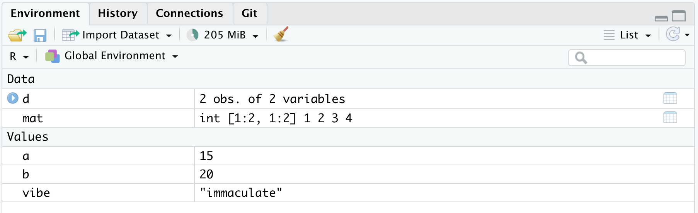
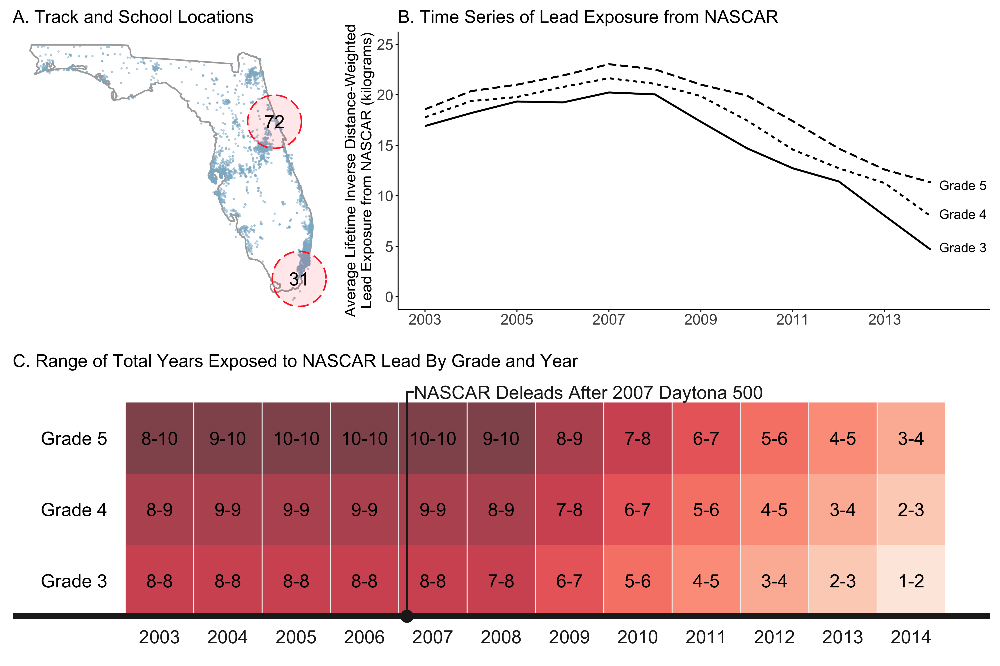

exclude: true
```{r setup}
if (!require("pacman")) install.packages("pacman")
pacman::p_load(
  tidyverse, xaringanExtra, rlang, patchwork, nycflights13, broom, viridis, janitor
)
options(htmltools.dir.version = FALSE)
knitr::opts_hooks$set(fig.callout = function(options) {
  if (options$fig.callout) {
    options$echo = FALSE
  }
knitr::opts_chunk$set(echo = TRUE, fig.align="center")
  options
})
red_pink = "#e64173"
# A blank theme for ggplot
theme_empty = theme_minimal() +
  theme(
    legend.position = "none",
    title = element_text(size = 24),
    axis.text.x = element_text(size = 24), axis.text.y = element_text(size = 24, color = "#ffffff"),
    axis.title.x = element_text(size = 24), axis.title.y = element_text(size = 24),
    panel.grid.minor.x = element_blank(), panel.grid.major.y = element_blank(),
    panel.grid.minor.y = element_blank(), panel.grid.major.x = element_blank(),
    panel.background = element_rect(fill = "#ffffff", colour = NA),
    plot.background = element_rect(fill = "#ffffff", colour = NA),
    axis.line = element_line(colour = "black"), axis.ticks = element_line(),
  )
theme_blank = theme_minimal() +
  theme(
    legend.position = "none",
    title = element_text(size = 24),
    axis.text.x = element_blank(), axis.text.y = element_blank(),
    axis.title.x = element_blank(), axis.title.y = element_blank(),
    panel.grid.minor.x = element_blank(), panel.grid.major.y = element_blank(),
    panel.grid.minor.y = element_blank(), panel.grid.major.x = element_blank(),
    panel.background = element_rect(fill = "#ffffff", colour = NA),
    plot.background = element_rect(fill = "#ffffff", colour = NA),
    axis.line = element_blank(), axis.ticks = element_blank(),
  ) 
theme_regular = 
  theme_minimal() +
  theme(
    legend.position = "none",
    title = element_text(size = 14),
    axis.text.x = element_text(size = 24), axis.text.y = element_text(size = 24),
    axis.title.x = element_text(size = 24), axis.title.y = element_text(size = 24),
    panel.grid.minor.x = element_blank(), panel.grid.minor.y = element_blank(),
    panel.grid.major.x = element_blank(), axis.ticks = element_line(),  axis.line = element_line(),
    panel.background = element_rect(fill = "#ffffff", colour = NA),
    plot.background = element_rect(fill = "#ffffff", colour = NA)
  ) 
```
```{r xaringanExtra, echo = FALSE}
xaringanExtra::use_xaringan_extra(c("tile_view", "panelset", "webcam"))

```
```{r echo=FALSE}
xaringanExtra::style_panelset(panel_tab_color_active = "red")
```

---

# Roadmap

- What is R?
- What is the tidyverse?
- How do we import and manipulate data?

Our goal is to take a hands on approach to learning how we actually .hi-blue[do] environmental economics

A good chunk of this lecture comes from Grant Mcdermott's [data science for economists](https://github.com/uo-ec607/lectures) notes, Ed Rubin's [intro to econometrics](https://github.com/edrubin/EC421S20), and [RStudio education](https://education.rstudio.com/)

---

class: inverse, center, middle
name: r

# RStudio Cloud

<html><div style='float:left'></div><hr color='#EB811B' size=1px width=796px></html>

---

# Getting started

We will be using [rstudio.cloud](https://rstudio.cloud) for our coding

--

Why?

--

You don't need to download/install anything

--

I can prepare the packages and code and make it easy to download

--

Let's get everything going...

---

# Getting started: login 


---

# Getting started: new project


---

# Getting started: wait for deployment


---

# Click on base-code in bottom-right


---

# Code script open!


---

# Now we're set

Now we're all set with our coding environment

--

You can write code in the top window and save it as a file

--


Or you can just enter it in the console in the bottom if you don't want to save it

--

Highlight code in the top window and press cmd+enter to run those highlighted lines

---

class: inverse, center, middle
name: r

# Quick intro to R

<html><div style='float:left'></div><hr color='#EB811B' size=1px width=796px></html>

---
class: inverse, center, middle
name: intro

# Introduction to base R

<html><div style='float:left'></div><hr color='#EB811B' size=1px width=796px></html>


---

# Basic arithmetic

R is a powerful calculator and recognizes all of the standard arithmetic operators:

```{r}
1+2 # add / subtraction
5/2 # divide
2^3 # exponentiate
2+4*1^3 # standard order of precedence (`*` before `+`, etc.)
```

---

# Logic

R also comes equipped with a full set of logical operators and Booleans

```{r}
1 > 2
(1 > 2) & (1 > 0.5) # "&" is the "and" operator
(1 > 2) | (1 > 0.5) # "|" is the "or" operator
```

---

# Logic

We can negate expressions with: `!`

This is helpful for filtering data

```{r}
is.na(1:10)
!is.na(1:10)
```

`NA` means **not available** (i.e., missing)

---

# Logic

For value matching we can use: `%in%`

To see whether an object is contained within (i.e., matches one of) a list of items, use `%in%`:
```{r}
4 %in% 1:10
4 %in% 5:10
```

---

# Logic

To evaluate whether two expressions are equal, we need to use **two** equal signs

```{r, error=T}
1 = 1 # This doesn't work
1 == 1 # This does.
1 != 2 # Note the single equal sign when combined with a negation.
```

---

# Logic

**Evaluation caveat:** What do you think will happen if we evaluate `0.1 + 0.2 == 0.3`?

--

```{r floating1}
0.1 + 0.2 == 0.3
```
Uh-oh! What went wrong here?

--

**Problem:** Computers represent numbers as binary (i.e., base 2) floating-points. More [here](https://floating-point-gui.de/basic/)
- Fast and memory efficient, but can lead to unexpected behavior
- Similar to how standard decimals can't precisely capture certain fractions (e.g., $\frac{1}{3} = 0.3333...$)

--

**Solution:** Use `all.equal()` for evaluating floats (i.e., fractions)

```{r floating2}
all.equal(0.1 + 0.2, 0.3)
```

---

# Assignment

In R, we can use either `<-` or `=` to handle assignment

--

### Assignment with `=`

`<-` is normally read aloud as "gets". You can think of it as a (left-facing) arrow saying *assign in this direction*.

```{r}
a = 10 + 5
a
```

---

# Assignment

### Assignment with `=`

You can also use `=` for assignment.

```{r}
b = 10 + 10
b
```

---

# Which assignment operator should you use?

The proper one to use is `<-`, which can be inserted using the keyboard shortcut Alt/Option + -

It doesn't really matter for our purposes, other languages use `=`

I will use `=`

**Bottom line:** Use whichever you prefer, just be consistent

---

# Help

For more information on a (named) function or object in R, consult the "help" documentation using `?`

For example:

```R
?plot 
```

---

# Vignettes

For some packages, `vignette()` will provide a detailed intro

```{r, eval = FALSE}
# Try this:
vignette("dplyr")
```

Vignettes are a great way to learn how and when to use a package

---

# Comments


Comments in R code are demarcated by `#`

Use comments to document your logic in `.R` scripts and within `.Rmd` code chunks

```{r, eval = FALSE}
# THIS IS A CODE SECTION ----
# this is a comment
cornell = "big red" 
```

--

Comments should be concise and used only when necessary (unlike the comments above)

---

# Comments

```{r, eval = FALSE}
# THIS IS A CODE SECTION ----
# this is a comment
cornell = "big red"
```

Using at least four trailing dashes (`----`) creates a code section, which simplifies navigation and code folding
- Also works with trailing equals (`====`) or pound signs (`####`)

--

**Keyboard shortcut:** use `Ctrl/Cmd+/` or `Ctrl/Cmd+Shift+C` in RStudio to (un)comment whole sections of highlighted code


---
class: inverse, center, middle
name: oop

# Object-oriented programming in R

<html><div style='float:left'></div><hr color='#EB811B' size=1px width=796px></html>


---

# Object-oriented programming

In R:

> **"Everything is an object and everything has a name."**

---
class: inverse, center, middle
name: eobject

# "Everything is an object"


---

# What are objects? 

There are many different *types* (or *classes*) of objects

Here are some objects that we'll be working with regularly:
- vectors
- matrices
- data frames
- lists
- functions


---

# Data frames

The most important object we will be working with is the **data frame**

You can think of it basically as an Excel spreadsheet

```{r d}
# Create a small data frame called "d"
d = data.frame(x = 1:2, y = 3:4) 
d
```

--

This is essentially just a table with columns named `x` and `y`

--

Each row is an observation telling us the values of both `x` and `y`

---

# Aside: built-in data frames

Base R and packages have a bunch of built in data frames with special names you can call on

For example we have `cars`:

.pull-left[
```{r}
head(cars)
```
]

.pull-right[
```{r plot-cars, fig.width=5, fig.height=4}
plot(cars)
```
]


---

# Back to objects

Each object class has its own set of rules for determining valid operations

```{r d2}
# Create a small data frame called "d"
d = data.frame(x = 1:2, y = 3:4) 
d
```

---

# Back to objects

At the same time, you can (usually) convert an object from one type to another

```{r mat}
# Convert it to (i.e., create) a matrix call "mat"
mat = as.matrix(d)
mat
```

---

# Working with multiple objects

In R we can have multiple data frames in memory at once

Even though we just made `mat`, `d` still exists:

```{r}
d
```

---

# Ways to learn about objects

Printing an object directly in the console is often handy
- e.g., Type `d` and hit Enter

--

`View()` is very helpful, and has the same effect as clicking on the object in your RStudio *Environment* pane
- e.g., Type `View(d)` and hit Enter

---

# Ways to learn about objects

Use the `str` command to learn about an object's **str**ucture

```{r}
# d = data.frame(x = 1:2, y = 3:4) # Create a small data frame called "d"
str(d) # Evaluate its structure
```

--

You can also use `class` to get an object's class without all the other details


---
name: global_env

# Global environment

Let's go back to the simple data frame that we created a few slides earlier.
```{r}
d
```

--

Now, let's try to do a logical comparison of these "x" and "y" variables:

```{r, error=T}
x < y
```

--

Uh-oh. What went wrong here?

---

# Global environment

The error message provides the answer to our question:

```
*## Error in eval(predvars, data, env): object 'x' not found
```

--

R looked in our *Global Environment* and couldn't find `x`

```{r environment, echo=FALSE, out.width='75%'}

```

--

We have to tell R that `x` and `y` belong to the object `d`

We will come back to this


---
class: inverse, center, middle
name: ename

# "Everything has a name"

<html><div style='float:left'></div><hr color='#EB811B' size=1px width=796px></html>


---

# Reserved words

R has a bunch of key/reserved words that serve specific functions
- You can't (re)assign these, even if you wanted to

See [here](http://stat.ethz.ch/R-manual/R-devel/library/base/html/Reserved.html) for a full list, including (but not limited to):

```R
if
else
while # looping
function
for # looping
TRUE
FALSE
NULL # null/undefined
Inf #infinity
NaN # not a number
NA # not available / missing
```

---

# Semi-reserved words

There are other words that are sort of reserved, in that they have a particular meaning
- These are named functions or constants (e.g., `pi`) that you can re-assign if you really want to... but that already come with important meanings from base R

The most important example is `c()`, which binds and concatenates objects together

```{r}
my_vector = c(1, 2, 5)
my_vector
```

---

# Semi-reserved words

What do you think will happen if you type the following?

```{r, eval=FALSE}
c = 4
c(1, 2 ,5)
```

--

```{r, echo=FALSE}
c = 4
c(1, 2 ,5)
```

--

In this case, R is "smart" enough to distinguish between the variable `c` and the built-in function `c()`

---

# Semi-reserved words (cont.)

But R won't always be able to distinguish between conflicting definitions! For example:
```{r}
pi
pi = 2
pi
```
--

**Bottom line:** Don't use (semi-)reserved words!


---
class: inverse, center, middle
name: indexing

# Indexing

<html><div style='float:left'></div><hr color='#EB811B' size=1px width=796px></html>


---

# Indexing

How do we index in R?

--

We've already seen an example of indexing in the form of R console output:

```{r}
1+2
```

The `[1]` above denotes the first (and, in this case, only) element of our output

--

In this case, a vector of length one equal to the value "3"

---

# Indexing

Try the following in your console to see a more explicit example of indexed output:

```{r, eval = FALSE}
rnorm(n = 50, mean = 0, sd = 1) # take 50 draws from the standard normal distribution
```

--

```{r, echo = FALSE}
rnorm(n = 50, mean = 0, sd = 1) # take 50 draws from the standard normal distribution
```


---

# Option 1: []

We can use `[]` to index objects that we create in R
```{r}
a = 1:10
a[4] ## Get the 4th element of object "a"
a[c(4, 6)] ## Get the 4th and 6th elements
```

---

# Option 1: []

This also works on larger arrays (vectors, matrices, data frames, and lists)
```{r}
starwars[1, 1] ## Show the cell corresponding to the 1st row & 1st column of the data frame.
```

--

What does `starwars[1:3, 1]` give you?

--

```{r, echo=FALSE}
starwars[1:3, 1]
```


---

# Option 1: []

We haven't discusssed them yet, but **lists** are a more complex type of array object in R

--

They can contain a collection of objects that don't share the same structure

--

For example, you can have lists containing:

- a scalar, a string, and a data frame
- a list of data frames
- a list of lists

---

# Option 1: []

The relevance to indexing is that lists require two square brackets `[[]]` to index the parent list item and then the standard `[]` within that parent item. An example might help to illustrate:
```{r my_list, cache=T}
my_list = list(
a = "hello",
b = c(1,2,3),
c = data.frame(x = 1:5, y = 6:10))
my_list[[1]] # Return the 1st list object
my_list[[2]][3] # Return the 3rd element of the 2nd list object
```

---

# Option 2: $


Lists provide a nice segue to our other indexing operator: `$`
- Let's continue with the `my_list` example from the previous slide.

```{r}
my_list
```

---
count: false

# Option 2: $


Lists provide a nice segue to our other indexing operator: `$`.
- Let's continue with the `my_list` example from the previous slide

```{r, eval=F}
my_list
```

```
*## $a
## [1] "hello"
##
*## $b
## [1] 1 2 3
##
*## $c
##   x  y
## 1 1  6
## 2 2  7
## 3 3  8
## 4 4  9
## 5 5 10
```

Notice how our (named) parent list objects are demarcated: `$a`,`$b` and `$c`

---

# Option 2: $

We can call these objects directly by name using the dollar sign, e.g.
```{r}
my_list$a ## Return list object "a"
my_list$b[3] ## Return the 3rd element of list object "b"
my_list$c$x ## Return column "x" of list object "c"
```

???

**Aside:** Typing `View(my_list)` (or, equivalently, clicking on the object in RStudio's environment pane) provides a nice interactive window for exploring the nested structure of lists.

---

# Option 2: $

The `$` form of indexing also works for other object types

In some cases, you can also combine the two index options:
```{r}
starwars$name[1]
```

???

Note some key differences between the output from this example and that of our previous `starwars[1, 1]` example. What are they?
- Hint: Apart from the visual cues, try wrapping each command in `str()`.

---

# Option 2: $

Finally, `$` provides another way to avoid the "object not found" problem that we ran into earlier

```{r, error=T}
x < y # Doesn't work
d$x < d$y # Works!
```

---
class: inverse, center, middle
name: cleaning

# Cleaning up

<html><div style='float:left'></div><hr color='#EB811B' size=1px width=796px></html>


---

# Removing objects

Use `rm()` to remove an object or objects from your working environment
```{r}
a = "hello"
b = "world"
rm(a, b)
```

You can use `rm(list = ls())` to remove all objects in your working environment, though this is [frowned upon](https://www.tidyverse.org/articles/2017/12/workflow-vs-script/)
- Better just to start a new R session

---

class: inverse, center, middle
name: tidyverse

# The tidyverse

<html><div style='float:left'></div><hr color='#EB811B' size=1px width=796px></html>

---

# What is "tidy" data?

What we are going to learn is how to use a set of packages called the .hi[tidyverse]

--

These sets of packages make working with data .hi-blue[extremely easy] and .hi-blue[intuitive]

---

# What is "tidy" data?

Resources:
- [Vignette](https://cran.r-project.org/web/packages/tidyr/vignettes/tidy-data.html) (from the **tidyr** package)
- [Original paper](https://vita.had.co.nz/papers/tidy-data.pdf) (Hadley Wickham, 2014 JSS)

--

Key points:
1. Each variable forms a column.
2. Each observation forms a row.
3. Each type of observational unit forms a table.

--

Basically, tidy data is more likely to be [long (i.e. narrow)](https://en.wikipedia.org/wiki/Wide_and_narrow_data) than wide

---

# Checklist

Install tidyverse: `install.packages('tidyverse')` (already done on cloud)

Install nycflights13: `install.packages('nycflights13', repos = 'https://cran.rstudio.com')`

---

# Tidyverse vs. base R

Lots of debate over tidyverse vs base R

--

The answer is [obvious](http://varianceexplained.org/r/teach-tidyverse/): We should teach the tidyverse first
- Good documentation and support
- Consistent philosophy and syntax
- Nice front-end for big data tools
- For data cleaning, plotting, the tidyverse is elite

---

# Tidyverse vs. base R

Base R is still great
- Base R is extremely flexible and powerful
- The tidyverse can't do everything
- Using base R and the tidyverse together is often a good idea

---

# Tidyverse vs. base R

One point of convenience is that there is often a direct correspondence between a tidyverse command and its base R equivalent:

| tidyverse  |  base |
|---|---|
| `?readr::read_csv`  | `?utils::read.csv` |
|  `?dplyr::if_else` |  `?base::ifelse` |
|  `?tibble::tibble` |  `?base::data.frame` |

Tidyverse functions typically have extra features on top of base R

--

There are always many ways to achieve a single goal in R

---

# Tidyverse packages

Let's load the tidyverse meta-package and check the output.
```{r tverse, cache = FALSE}
library(tidyverse)
```

--

We have actually loaded a number of packages: **ggplot2**, **tibble**, **dplyr**, etc

--

We can also see information about the package versions and some [namespace conflicts](https://raw.githack.com/uo-ec607/lectures/master/04-rlang/04-rlang.html#59)

---

# Tidyverse packages

The tidyverse actually comes with a lot more packages than those that are just loaded automatically
```{r tverse_pkgs}
tidyverse_packages()
```

e.g. the **lubridate** package is for working with dates and the **rvest** package is for webscraping

--

These packages have to be loaded separately

---

# Tidyverse packages

We're going to focus on two workhorse packages:
1. [**dplyr**](https://dplyr.tidyverse.org/)
2. [**tidyr**](https://tidyr.tidyverse.org/)

These are the packages for cleaning and wrangling data

--

They are thus the ones that you will likely make the most use of

--

Data cleaning and wrangling is important and knowing how to do it well is a good skill for any data-oriented job

---

# Pipes: |>

The pipe operator `|>` lets us perform a sequence of operations in a very nice and tidy way

--

Let's consider a fake example to get the idea for why its really beneficial
                                                                                      
---

# Pipes: |>

Let's say we wanted to apply a sequence of operations that tells the computer what you did throughout your day:

1. Wake up
2. Get out of bed
3. Comb hair
4. Go downstairs
5. Drink a cup
6. Grab hat
7. Catch bus

---

# Pipes: |>

If you were to code this up in a traditional way it might look one of two ways:

A bunch of lines doing all the different steps
```{r, eval = F}
me = wake_up(me)
me = get_out_of_bed(me)
me = comb_hair(me)
me = go(me, "downstairs")
me = drink(me, "cup")
me = grab(me, "hat")
me = catch(me, "bus")
```

---

# Pipes: |>

If you were to code this up in a traditional way it might look one of two ways:

Or if you're a little crazy then do it all in one line
```{r, eval = F}
me = catch(grab(drink(go(comb_hair(get_out_of_bed(wake_up(me))), where = "downstairs"), what = "cup"), what = "hat"), what = "bus")
```

These are kind of tedious or messy and out of the order you'd think

---

# Pipes: |>

With pipes we can do everything at once, but have it be .hi[in order]:

```{r, eval = F}
me = me |>
wake_up() |>
get_out_of_bed() |>
comb_hair() |>
go("downstairs") |>
drink("cup") |>
grab("hat") |>
catch("bus") 
```

This makes everything .hi[very intuitive] to read and code!


---

# Pipes: |>

Here's a real example: suppose we wanted to figure out the average highway miles per gallon of Audi's in the `mpg` dataset:
```{r}
mpg
```

---

# Pipes: |>

There's two ways you might do this without taking advantage of pipes:

--

The first is to do it step-by-step, line-by-line which requires a lot of variable assignment

```{r}
audis_mpg = filter(mpg, manufacturer=="audi")
audis_mpg_grouped = group_by(filter(mpg, manufacturer=="audi"), model)
summarise(audis_mpg_grouped, hwy_mean = mean(hwy))
```

---

# Pipes: |>

Next you could do it all in one line which is hard to read

```{r}
summarise(group_by(filter(mpg, manufacturer=="audi"), model), hwy_mean = mean(hwy))
```

---

# Pipes: |>

Or, you could use .hi-blue[pipes] `|>`:

```{r}
mpg |> filter(manufacturer=="audi") |> group_by(model) |> summarise(hwy_mean = mean(hwy))
```

--

It performs the operations from left to right, exactly like you'd think of them: take this object (mpg), do this (filter), then do this (group by car model), then do this (take the mean of highway miles)


---

# Use vertical space

Pipes are even more readable if we write it over several lines:
```{r pipe}
mpg |>
filter(manufacturer=="audi") |>
group_by(model) |>
summarise(hwy_mean = mean(hwy))
```

Using vertical space costs nothing and makes for much more readable code

---
class: inverse, center, middle
name: dplyr

# dplyr

<html><div style='float:left'></div><hr color='#EB811B' size=1px width=796px></html>

---

# Aside: dplyr 1.0.0 release

Please make sure that you are running at least **dplyr** 1.0.0 before continuing.

```{r dplyr_vers, cache=FALSE}
packageVersion("dplyr")
# install.packages('dplyr') ## install updated version if < 1.0.0
```


---

# The five key dplyr verbs

1. `filter`: Subset/filter rows based on their values

2. `arrange`: Reorder/arrange rows based on their values

3. `select`: Select columns/variables

4. `mutate`: Create new columns/variables

5. `summarise`: Collapse multiple rows into a single summary value, potentially by a grouping variable

--

Let's practice these commands together using the `starwars` data frame that comes pre-packaged with dplyr

---

# Starwars

Here's the `starwars` dataset, it has 87 observations of 14 variables
```{r starwars}
starwars
```


---

# 1) dplyr::filter

Why filter?

--

Filtering subsets your data

--

This means that you can take out data that meet certain characteristics

--

e.g. if you want to run your analysis only on low income areas, or if you want to focus on years after 2005

---

# 1) dplyr::filter

Here we are subsetting the observations of humans that are at least 190cm
```{r filter1}
starwars |>
filter(
  species == "Human",
  height >= 190
)
```

---

# 1) dplyr::filter

You can filter using regular expressions with grep-type commands or the `stringr` package
```{r filter2}
starwars |>
filter(stringr::str_detect(name, "Skywalker"))
```

This subsets the observations for individuals whose names contain "Skywalker"

---

# 1) dplyr::filter

A very common `filter` use case is identifying/removing missing data cases:
```{r filter3}
starwars |>
filter(is.na(height))
```

---

# 1) dplyr::filter

To remove missing observations, use negation:
```{r filter4}
starwars |>
  filter(!is.na(height))
```

---

# 2) dplyr::arrange

`arrange` sorts the data frame based on the variables you supply:
```{r arrange1}
starwars |>
  arrange(birth_year)
```

---

# 1) dplyr::arrange

Why arrange?

--

Arrange sorts your data

--

This makes it easy to check and see patterns in the data

---

# 2) dplyr::arrange

We can also arrange items in descending order using `arrange(desc())`
```{r arrange2}
starwars |>
  arrange(desc(birth_year))
```

---

# 3) dplyr::select

Why select?

--

Select lets you choose columns to keep or drop

--

This means you are essentially getting rid of variables, likely ones you do not need

--

e.g. if you used an emissions rate and marginal damage per unit of pollution variable to construct the marginal damage of output, you may not need the first two variables any more

---

# 3) dplyr::select

Use commas to select multiple columns out of a data frame, deselect a column with "-", select across multiple columns with "first:last":
```{r select1}
starwars |>
  select(name:skin_color, species, -height)
```

---

# 3) dplyr::select

You can also rename your selected variables in place
```{r select2}
starwars |>
  select(alias = name, crib = homeworld)
```

---

# 3) dplyr::select

If you just want to rename columns without subsetting them, you can use `rename`:
```{r}
starwars |>
  rename(alias = name, crib = homeworld)
```

---

# 3) dplyr::select *cont.*

The `select(contains(PATTERN))` option provides a nice shortcut in relevant cases.
```{r select3}
starwars |>
  select(name, contains("color"))
```

---

# 3) dplyr::select

The `select(..., everything())` option is another useful shortcut if you only want to bring some variable(s) to the "front" of a data frame

```{r select4}
starwars |>
  select(species, homeworld, everything()) |>
  head(5)
```

---

# 3) dplyr::select

You can also use `relocate` to do the same thing

```{r}
starwars |>
  relocate(species, homeworld) |>
  head(5)
```

---

# 4) dplyr::mutate

Why mutate?

--

You may need to create new variables

--

e.g. if I give you nominal house prices and the rate of house price inflation, you need to combine these two things to make a new .hi[real house price] variable

---

# 4) dplyr::mutate

You can create new columns from scratch as transformations of existing columns:
```{r mutate1}
starwars |>
  select(name, birth_year) |>
  mutate(dog_years = birth_year * 7) |>
  mutate(comment = paste0(name, " is ", dog_years, " in dog years."))
```

---


# 4) dplyr::mutate

*Note:* `mutate` creates variables in order, so you can chain multiple mutates in a single call
```{r mutate2}
starwars |>
  select(name, birth_year) |>
  mutate(
    dog_years = birth_year * 7, ## Separate with a comma
    comment = paste0(name, " is ", dog_years, " in dog years.")
  )
```

---

# 4) dplyr::mutate

Boolean, logical and conditional operators all work well with `mutate` too:
```{r mutate3}
starwars |>
  select(name, height) |>
  filter(name %in% c("Luke Skywalker", "Anakin Skywalker")) |>
  mutate(tall1 = height > 180) |> # TRUE or FALSE
  mutate(tall2 = ifelse(height > 180, "Tall", "Short")) ## Same effect, but can choose labels
```

---

# 4) dplyr::mutate

Lastly, combining `mutate` with `across` allows you to easily work on a subset of variables:
```{r, mutate4}
starwars |>
  select(name:eye_color) |>
  mutate(across(where(is.character), toupper)) |> # Take all character variables, uppercase them
  head(5)
```

---

# 5) dplyr::summarise

Why summarise?

--

Often we want to get summary statistics or *collapse* our data

--

e.g. if I gave you a data set of each individual's marginal damage in the US, we may want to aggregate up to county-level marginal damages

---

# 5) dplyr::summarise

Summarising useful in combination with the `group_by` command
```{r summ1}
starwars |>
  group_by(species, gender) |> # for each species-gender combo
  summarise(mean_height = mean(height, na.rm = TRUE)) # calculate the mean height
```

---

# 5) dplyr::summarise

Note that including "na.rm = TRUE" is usually a good idea with summarise functions, it keeps NAs from propagating to the end result
```{r summ2}
## Probably not what we want
starwars |>
  summarise(mean_height = mean(height))
```

---

# 5) dplyr::summarise

We can also use `across` within summarise:
```{r, summ4}
starwars |>
group_by(species) |> # for each species
summarise(across(where(is.numeric), mean, na.rm = T)) |> # take the mean of all numeric variables
head(5)
```

---

# Other dplyr goodies

`group_by` and `ungroup`: For (un)grouping
- Particularly useful with the `summarise` and `mutate` commands

--

`slice`: Subset rows by position rather than filtering by values
- E.g. `starwars |> slice(c(1, 5))`

---

# Other dplyr goodies

`pull`: Extract a column from as a data frame as a vector or scalar
- E.g. `starwars |> filter(gender=="female") |> pull(height)`

--

`count` and `distinct`: Number and isolate unique observations
- E.g. `starwars |> count(species)`, or `starwars |> distinct(species)`


---

# Other dplyr goodies

There are also a whole class of [window functions](https://cran.r-project.org/web/packages/dplyr/vignettes/window-functions.html) for getting leads and lags, percentiles, cumulative sums, etc.
- See `vignette("window-functions")`.

---

# dplyr::xxxx_join

The last set of commands we need are the `join` commands

--

These are the same as `merge` in stata but with a bit more functionality

--

Why join?

--

Suppose we want to understand how pollution affects housing prices

--

You may need to combine data sets: one data sets on house prices in all counties, and another data set on pollution levels in all counties

---

# dplyr::xxxx_join

How does joining work?

--

We need two datasets (e.g. housing prices and pollution)

--

Each dataset has the same set of .hi[key] variables (e.g. county)

--

When we join, we match up the two datasets on the key, and combine them into one

--

In our housing example, each row of the joined dataset would now tell us the house price, the county its in, and the county's pollution
                                                        

---
  
# dplyr::xxxx_join
  
We merge data with [join operations](https://cran.r-project.org/web/packages/dplyr/vignettes/two-table.html):
- `inner_join(df1, df2)`
- `left_join(df1, df2)`
- `right_join(df1, df2)`
- `full_join(df1, df2)`

(You can visualize the operations [here](https://r4ds.had.co.nz/relational-data.html))

---
  
# dplyr::xxxx_join
  
Lets use the data that comes with the the [nycflights13](http://github.com/hadley/nycflights13) package.

```{r}
library(nycflights13)
flights
```

---
  
# dplyr::xxxx_join
  
```{r}
planes
```

---
  
# Joining operations
  
Let's perform a left join on the flights and planes datasets
- *Note*: I'm going subset columns after the join, but only to keep text on the slide

--
  
```{r join1}
left_join(flights, planes) |>
  select(year, month, day, dep_time, arr_time, carrier, flight, tailnum, type, model)
```

---
  
# Joining operations

Note that dplyr made a reasonable guess about which columns to join on (i.e. columns that share the same name), and told us what it chose
```
*## Joining, by = c("year", "tailnum")
  ```

There's an obvious problem here: the variable `year` does not have a consistent meaning across our joining datasets

--

In one it refers to the *year of flight*, in the other it refers to *year of construction*

Luckily, there's an easy way to avoid this problem: try `?dplyr::join`

---
  
# Joining operations

You just need to be more explicit in your join call by using the `by = ` argument
```{r join2}
left_join(
  flights,
  planes |> rename(year_built = year), ## Not necessary w/ below line, but helpful
  by = "tailnum" ## Be specific about the joining column
) |>
  select(year, month, day, dep_time, arr_time, carrier, flight, tailnum, year_built, type, model) |>
  head(3) ## Just to save vertical space on the slide
```

---

# Joining operations

Note what happens if we again specify the join column but don't rename the ambiguous `year`:
```{r join3}
left_join(flights,
planes, ## Not renaming "year" to "year_built" this time
by = "tailnum") |>
select(contains("year"), month, day, dep_time, arr_time, carrier, flight, tailnum, type, model) |>
head(3)
```

--

Make sure you know what "year.x" and "year.y" are

---
class: inverse, center, middle
name: tidyr

# tidyr

<html><div style='float:left'></div><hr color='#EB811B' size=1px width=796px></html>

---

# Key tidyr verbs

1. `pivot_longer`: Pivot wide data into long format (i.e. "melt", "reshape long")

2. `pivot_wider`: Pivot long data into wide format (i.e. "cast", "reshape wide")

3. `separate`: Split one column into multiple columns

4. `unite`: Combine multiple columns into one

--

Let's practice these verbs together in class

---

# 1) tidyr::pivot_longer

```{r pivot_longer1a}
stocks = data.frame(
time = as.Date('2009-01-01') + 0:1,
stock_X = rnorm(2, 0, 1),
stock_Y = rnorm(2, 0, 2),
stock_Z = rnorm(2, 0, 4)
)
stocks
```

We have 4 variables, the date and the stocks

How do we get this in tidy form?

---

# 1) tidyr::pivot_longer

```{r pivot_longer1b, eval = F}
stocks |> pivot_longer(-time, names_to = "stock", values_to = "price")
```

We need to pivot the stock name variables `X, Y, Z` longer

1. Choose non-time variables: `-time`
2. Decide what variable holds the names: `names_to = "stock"`
3. Decide what variable holds the values: `values_to = "price"`

---

# 1) tidyr::pivot_longer

```{r pivot_longer1c}
stocks |> pivot_longer(-time, names_to = "stock", values_to = "price")
```

---

# 1) tidyr::pivot_longer

Let's quickly save the "tidy" (i.e. long) stocks data frame for use on the next slide

```{r pivot_longer2}
tidy_stocks = stocks |>
  pivot_longer(-time, names_to = "stock", values_to = "price")
```

---
  
  # 2) tidyr::pivot_wider
  
```{r pivot_wider1, dependson=tidy_stocks}
tidy_stocks |> pivot_wider(names_from = stock, values_from = price)
tidy_stocks |> pivot_wider(names_from = time, values_from = price)
```

--
  
  Note that the second example has effectively transposed the data
---
  
  # 3) tidyr::separate
  
```{r sep1}
economists = data.frame(name = c("Adam.Smith", "Paul.Samuelson", "Milton.Friedman"))
economists
economists |> separate(name, c("first_name", "last_name"))
```

--
  
This command is pretty smart. But to avoid ambiguity, you can also specify the separation character with `separate(..., sep=".")`

---
  
  # 4) tidyr::unite
  
```{r unite1a}
gdp = data.frame(
  yr = rep(2016, times = 4),
  mnth = rep(1, times = 4),
  dy = 1:4,
  gdp = rnorm(4, mean = 100, sd = 2)
)
gdp
```

---
  
  # 4) tidyr::unite
  
```{r unite1b}
## Combine "yr", "mnth", and "dy" into one "date" column
gdp |> unite(date, c("yr", "mnth", "dy"), sep = "-")
```

---
  
# 4) tidyr::unite
  
Note that `unite` will automatically create a character variable:
```{r unite2}
gdp_u = gdp |> unite(date, c("yr", "mnth", "dy"), sep = "-") |> as_tibble()
gdp_u
```

--
  
If you want to convert it to something else (e.g. date or numeric) then you will need to modify it using `mutate`

---

# 4) tidyr::unite

```{r unite3, message=F}
library(lubridate)
gdp_u |> mutate(date = ymd(date))
```


---
  
class: inverse, center, middle
name: tidyverse

# Regression and ordinary least squares

<html><div style='float:left'></div><hr color='#EB811B' size=1px width=796px></html>


---

# Why?

## Motivation

Let's start with a few .hi[basic, general questions]

--

1. What is the goal of econometrics?

2. Why do economists (or other people) study or use econometrics?

--

.hi[One simple answer:] Learn about the world using data


---

# Why? Example

GPA is an output from endowments (ability), and hours studied (inputs), and pollution exposure (externality)

--

One might hypothesize a model:
$\text{GPA}=f(I, P, \text{SAT}, H)$

where $H$ is hours studied, $P$ is pollution exposure, $\text{SAT}$ is SAT score and $\text{I}$ is family income

--

We expect that GPA will rise with some variables, and decrease with others

--

But who needs to _expect_?

--

We can test these hypotheses .hi[using a regression model]

---

# How?

We can write down a linear regression model of the relationship between GPA and (H, P, SAT, PCT):
$$ \text{GPA}_i = \beta_0 + \beta_1 I_i + \beta_2 P_i + \beta_3 \text{SAT}_i + \beta_4 H_i + \varepsilon_i $$

--

The left hand side of the equals sign is our .hi-blue[dependent variable] GPA

--

The right hand side of the equals sign contains all of our .hi-red[independent variables] (I, P, SAT, H), and an error term $\varepsilon_i$ (described later)

--

The subscript $i$ means that the variable contains the value for some person $i$ in our dataset where $i = 1,\dots,N$

---

# How?

$$ \text{GPA}_i = \beta_0 + \beta_1 I_i + \beta_2 P_i + \beta_3 \text{SAT}_i + \beta_4 H_i + \varepsilon_i $$

We are interested in how pollution P affects GPA

--

This is given by $\beta_2$

--

Notice that $\beta_2 = \frac{\partial\text{GPA}_i}{\partial\text{P}_i}$

--

$\beta_2$ tells us how GPA changes, given a 1 unit increase in pollution!

--

Our goal will be to estimate $\beta_2$, we denote estimates with hats: $\hat{\beta}_2$


---

# How?

How do we estimate $\beta_2$?

--

First, suppose we have a set of estimates for all of our $\beta$s, then we can *estimate* the GPA $(\widehat{GPA}_i)$ for any given person based on just (I, P, SAT, H):
$$\widehat{GPA}_i = \hat{\beta}_0 + \hat{\beta}_1 I_i + \hat{\beta}_2 P_i + \hat{\beta}_3 \text{SAT}_i + \hat{\beta}_4 H_i$$

---

# How?

We estimate the $\beta$s with .hi[linear regression], specifically ordinary least squares

.hi[Ordinary least squares:] choose all the $\beta$s so that the sum of squared errors between the *real* GPAs and model-estimated GPAs are minimized:
$$SSE = \sum_{i=1}^N (GPA_i - \widehat{GPA}_i)^2$$

--

Choosing the $\beta$s in this fashion gives us the best-fit line through the data

---

# How?


```{R, gen dataset, include = F, cache = T}
# Set population and sample sizes
n_p = 100
n_s = 10
# Set the seed
set.seed(12468)
# Generate data
pop_df = tibble(
i = 3,
x = rnorm(n_p, mean = 5, sd = 1.5),
e = rnorm(n_p, mean = 0, sd = 1),
y = i - 0.5 * x + e,
row = rep(1:sqrt(n_p), times = sqrt(n_p)),
col = rep(1:sqrt(n_p), each = sqrt(n_p)),
s1 = sample(x = c(rep(T, n_s), rep(F, n_p - n_s))),
s2 = sample(x = c(rep(T, n_s), rep(F, n_p - n_s))),
s3 = sample(x = c(rep(T, n_s), rep(F, n_p - n_s)))
)
# Regressions
lm0 = lm(y ~ x, data = pop_df)
lm1 = lm(y ~ x, data = filter(pop_df, s1 == T))
lm2 = lm(y ~ x, data = filter(pop_df, s2 == T))
lm3 = lm(y ~ x, data = filter(pop_df, s3 == T))
# Simulation
set.seed(12468)
sim_df = lapply(X = 1:1e3, FUN = function(x, size = n_s) {
lm(y ~ x, data = pop_df %>% sample_n(size = size)) %>% tidy()
}) %>% do.call(rbind, .) %>% as_tibble()
```

---

# Simple example

Suppose we were only looking at GPA and pollution (lead/Pb):

$$\text{GPA}_i = \beta_0 + \beta_1 P_i + \varepsilon_i $$

```{R, ols vs lines 1, echo = F, dev = "svg", fig.height = 4.5, fig.width = 10}
ggplot(data = pop_df, aes(x = x, y = y)) +
geom_point(size = 5, color = "darkslategray", alpha = 0.9) +
theme_empty +
labs(y = "GPA", x = "Average Annual Lead Exposure (grams)")
```

---
count: false
# Simple example


For any line $\left(\hat{GPA}_i = \hat{\beta}_0 + \hat{\beta}_1 P_i\right)$

```{R, vs lines 2, echo = F, dev = "svg", fig.height = 4.5, fig.width = 10}
# Define a function
y_hat = function(x, b0, b1) {b0 + b1 * x}
# Define line's parameters
b0 = 6
b1 = 0.2
# The plot
ggplot(data = pop_df, aes(x = x, y = y)) +
# geom_segment(aes(x = x, xend = x, y = y, yend = y_hat(x, b0, b1)), size = 0.5, alpha = 0.2) +
geom_point(size = 5, color = "darkslategray", alpha = 0.9) +
geom_abline(intercept = b0, slope = b1, color = "#3C93DC", size = 2, alpha = 0.9) +
theme_empty +
labs(y = "GPA", x = "Average Annual Lead Exposure (grams)")
```

---
count: false
# Simple example


For any line $\left(\hat{GPA}_i = \hat{\beta}_0 + \hat{\beta}_1 P_i\right)$, we calculate errors: $e_i = GPA_i - \hat{GPA}_i$

```{R, ols vs lines 3, echo = F, dev = "svg", fig.height = 4.5, fig.width = 10}
# Define a function
y_hat = function(x, b0, b1) {b0 + b1 * x}
# Define line's parameters
b0 = 6
b1 = 0.2
# The plot
ggplot(data = pop_df, aes(x = x, y = y)) +
geom_segment(aes(x = x, xend = x, y = y, yend = y_hat(x, b0, b1)), size = 0.5, alpha = 0.2) +
geom_point(size = 5, color = "darkslategray", alpha = 0.9) +
geom_abline(intercept = b0, slope = b1, color = "#3C93DC", size = 2, alpha = 0.9) +
theme_empty +
labs(y = "GPA", x = "Average Annual Lead Exposure (grams)")
```

---
count: false
# Simple example


For any line $\left(\hat{GPA}_i = \hat{\beta}_0 + \hat{\beta}_1 P_i\right)$, we calculate errors: $e_i = GPA_i - \hat{GPA}_i$

```{R, ols vs lines 4, echo = F, dev = "svg", fig.height = 4.5, fig.width = 10}
# Define a function
y_hat = function(x, b0, b1) {b0 + b1 * x}
# Define line's parameters
b0 = 3
b1 = 0.2
# The plot
ggplot(data = pop_df, aes(x = x, y = y)) +
geom_segment(aes(x = x, xend = x, y = y, yend = y_hat(x, b0, b1)), size = 0.5, alpha = 0.2) +
geom_point(size = 5, color = "darkslategray", alpha = 0.9) +
geom_abline(intercept = b0, slope = b1, color = "#3C93DC", size = 2, alpha = 0.9) +
theme_empty +
labs(y = "GPA", x = "Average Annual Lead Exposure (grams)")
```

---
count: false
# Simple example


For any line $\left(\hat{GPA}_i = \hat{\beta}_0 + \hat{\beta}_1 P_i\right)$, we calculate errors: $e_i = GPA_i - \hat{GPA}_i$

```{R, ols vs lines 5, echo = F, dev = "svg", fig.height = 4.5, fig.width = 10}
# Define a function
y_hat = function(x, b0, b1) {b0 + b1 * x}
# Define line's parameters
b0 = 10
b1 = -0.8
# The plot
ggplot(data = pop_df, aes(x = x, y = y)) +
geom_segment(aes(x = x, xend = x, y = y, yend = y_hat(x, b0, b1)), size = 0.5, alpha = 0.2) +
geom_point(size = 5, color = "darkslategray", alpha = 0.9) +
geom_abline(intercept = b0, slope = b1, color = "#3C93DC", size = 2, alpha = 0.9) +
theme_empty +
labs(y = "GPA", x = "Average Annual Lead Exposure (grams)")
```

---
count: false
# Simple example


SSE squares the errors $\left(\sum e_i^2\right)$: bigger errors get bigger penalties

```{R, ols vs lines 6, echo = F, dev = "svg", fig.height = 4.5, fig.width = 10}
# Define a function
y_hat = function(x, b0, b1) {b0 + b1 * x}
# Define line's parameters
b0 = 10
b1 = -0.8
# The plot
ggplot(data = pop_df, aes(x = x, y = y)) +
geom_segment(aes(x = x, xend = x, y = y, yend = y_hat(x, b0, b1), color = (y - y_hat(x, b0, b1))^2), size = 0.5, alpha = 0.8) +
geom_point(size = 5, color = "darkslategray", alpha = 0.9) +
geom_abline(intercept = b0, slope = b1, color = "#3C93DC", size = 2, alpha = 0.9) +
scale_color_viridis(option = "cividis", direction = -1) +
theme_empty +
labs(y = "GPA", x = "Average Annual Lead Exposure (grams)")
```

---
count: false
# Simple example


The OLS estimate is the combination of $\hat{\beta}_0$ and $\hat{\beta}_1$ that minimize SSE

```{R, ols vs lines 7, echo = F, dev = "svg", fig.height = 4.5, fig.width = 10}
# Define a function
y_hat = function(x, b0, b1) {b0 + b1 * x}
# Define line's parameters
b0 = lm0$coefficients[1]
b1 = lm0$coefficients[2]
# The plot
ggplot(data = pop_df, aes(x = x, y = y)) +
geom_segment(aes(x = x, xend = x, y = y, yend = y_hat(x, b0, b1), color = (y - y_hat(x, b0, b1))^2), size = 0.5, alpha = 0.8) +
geom_point(size = 5, color = "darkslategray", alpha = 0.9) +
geom_abline(intercept = b0, slope = b1, color = "#ff0000", size = 2, alpha = 0.9) +
scale_color_viridis(option = "cividis", direction = -1) +
theme_empty +
labs(y = "GPA", x = "Average Annual Lead Exposure (grams)")
```

---

# OLS error term

So OLS is just the best-fit line through your data

--

Remember: for any given $i$, we won't have that $GPA_i = \widehat{GPA}_i$, there's always some error

--

Why?

--

Our model isn't perfect, the people in our dataset (i.e. our sample) may not perfectly match up to the entire population of people

---

# OLS error term

There's .hi[a lot] of other stuff that determines GPAs!

--

We jam all that stuff into error term $\varepsilon_i$:
$$ \text{GPA}_i = \beta_0 + \beta_1 I_i + \beta_2 P_i + \beta_3 \text{SAT}_i + \beta_4 H_i + \varepsilon_i $$

--

So $\varepsilon_i$ contains all the determinants of GPA that we aren't explicitly addressing in our model

---

# OLS properties

OLS has one .hi[very] nice property relevant for this class:

--

<center>
.hi-blue[Unbiasedness:] $E[\hat{\beta}] = \beta$
</center>
---

# OLS properties

.hi-blue[Unbiasedness:] $E[\hat{\beta}] = \beta$

On average, our estimate $\hat{\beta}$ exactly equals the .hi[true] $\beta$

--

The key is .hi-red[on average:] we are estimating our model using only some sample of the data

--

The estimated $\beta$ won't exactly be right for the entire population, but on average, we expect it to match

--

Let's see in an example where we only have a subsample of the full population of data

---

# OLS properties


.pull-left[

```{R, pop1, echo = F, fig.width = 4, fig.height = 4, fig.align = 'center', dev = "svg"}
ggplot(data = pop_df, aes(x = row, y = col)) +
geom_point(color = "darkslategray", size = 10) +
theme_blank
```

.center[**Population**]

]

--

.pull-right[

```{R, scatter1, echo = F, fig.width = 4, fig.height = 3, fig.align = 'center', dev = "svg"}
ggplot(data = pop_df, aes(x = x, y = y)) +
geom_abline(
intercept = lm0$coefficients[1], slope = lm0$coefficients[2],
color = "#3C93DC", size = 3
) +
geom_point(color = "darkslategray", size = 6) +
theme_blank
```

.center[**Population relationship**]

$$ y_i = `r round(lm0$coefficients[1], 2)` + `r round(lm0$coefficients[2], 2)` x_i + u_i $$

$$ y_i = \beta_0 + \beta_1 x_i + u_i $$


]

---

.pull-left[


```{R, sample1, echo = F, fig.width = 4, fig.height = 4, fig.align = 'center', dev = "svg"}
ggplot(data = pop_df, aes(x = row, y = col, shape = s1)) +
geom_point(color = "darkslategray", size = 10) +
scale_shape_manual(values = c(1, 19)) +
theme_blank
```

.center[**Sample 1:** 10 random individuals]


]

--

.pull-right[


```{R, sample1 scatter, echo = F, fig.width = 4, fig.height = 3, fig.align = 'center', dev = "svg"}
ggplot(data = pop_df, aes(x = x, y = y)) +
geom_abline(
intercept = lm0$coefficients[1], slope = lm0$coefficients[2],
color = red_pink, size = 3, alpha = 0.3
) +
geom_point(aes(shape = s1), color = "darkslategray", size = 6) +
geom_abline(
intercept = lm1$coefficients[1], slope = lm1$coefficients[2],
size = 2, linetype = 2, color = "black"
) +
scale_shape_manual(values = c(1, 19)) +
theme_blank
```


.center[

**Population relationship**
<br>
$y_i = `r round(lm0$coefficients[1], 2)` + `r round(lm0$coefficients[2], 2)` x_i + u_i$

**Sample relationship**
<br>
$\hat{y}_i = `r round(lm1$coefficients[1], 2)` + `r round(lm1$coefficients[2], 2)` x_i$

]

]

---
count: false

.pull-left[

```{R, sample2, echo = F, fig.width = 4, fig.height = 4, fig.align = 'center', dev = "svg"}
ggplot(data = pop_df, aes(x = row, y = col, shape = s2)) +
geom_point(color = "darkslategray", size = 10) +
scale_shape_manual(values = c(1, 19)) +
theme_blank
```

.center[**Sample 2:** 10 random individuals]

]

.pull-right[

```{R, sample2 scatter, echo = F, fig.width = 4, fig.height = 3, fig.align = 'center', dev = "svg"}
ggplot(data = pop_df, aes(x = x, y = y)) +
geom_abline(
intercept = lm0$coefficients[1], slope = lm0$coefficients[2],
color = red_pink, size = 3, alpha = 0.3
) +
geom_point(aes(shape = s2), color = "darkslategray", size = 6) +
geom_abline(
intercept = lm1$coefficients[1], slope = lm1$coefficients[2],
size = 2, linetype = 2, color = "black", alpha = 0.3
) +
geom_abline(
intercept = lm2$coefficients[1], slope = lm2$coefficients[2],
size = 2, linetype = 2, color = "black"
) +
scale_shape_manual(values = c(1, 19)) +
theme_blank
```

.center[

**Population relationship**
<br>
$y_i = `r round(lm0$coefficients[1], 2)` + `r round(lm0$coefficients[2], 2)` x_i + u_i$

**Sample relationship**
<br>
$\hat{y}_i = `r round(lm2$coefficients[1], 2)` + `r round(lm2$coefficients[2], 2)` x_i$

]

]
---
count: false

.pull-left[

```{R, sample3, echo = F, fig.width = 4, fig.height = 4, fig.align = 'center', dev = "svg"}
ggplot(data = pop_df, aes(x = row, y = col, shape = s3)) +
geom_point(color = "darkslategray", size = 10) +
scale_shape_manual(values = c(1, 19)) +
theme_blank
```

.center[**Sample 3:** 10 random individuals]

]

.pull-right[

```{R, sample3 scatter, echo = F, fig.width = 4, fig.height = 3, fig.align = 'center', dev = "svg"}
ggplot(data = pop_df, aes(x = x, y = y)) +
geom_abline(
intercept = lm0$coefficients[1], slope = lm0$coefficients[2],
color = red_pink, size = 3, alpha = 0.3
) +
geom_point(aes(shape = s3), color = "darkslategray", size = 6) +
geom_abline(
intercept = lm1$coefficients[1], slope = lm1$coefficients[2],
size = 2, linetype = 2, color = "black", alpha = 0.3
) +
geom_abline(
intercept = lm2$coefficients[1], slope = lm2$coefficients[2],
size = 2, linetype = 2, color = "black", alpha = 0.3
) +
geom_abline(
intercept = lm3$coefficients[1], slope = lm3$coefficients[2],
size = 2, linetype = 2, color = "black"
) +
scale_shape_manual(values = c(1, 19)) +
theme_blank
```

.center[

**Population relationship**
<br>
$y_i = `r round(lm0$coefficients[1], 2)` + `r round(lm0$coefficients[2], 2)` x_i + u_i$

**Sample relationship**
<br>
$\hat{y}_i = `r round(lm3$coefficients[1], 2)` + `r round(lm3$coefficients[2], 2)` x_i$

]

]

---
layout: false
class: clear, middle

Let's repeat this **1,000 times**.

(This exercise is called a (Monte Carlo) simulation.)

---

# Population *vs.* sample

```{R, simulation scatter, echo = F, dev = "png", dpi = 300, cache = F, fig.height = 3}
# Reshape sim_df
line_df = tibble(
intercept = sim_df |> filter(term != "x") |> select(estimate) |> unlist(),
slope = sim_df |> filter(term == "x") |> select(estimate) |> unlist()
)
ggplot() +
geom_abline(data = line_df, aes(intercept = intercept, slope = slope), alpha = 0.02, color = "darkslategray") +
geom_point(data = pop_df, aes(x = x, y = y), size = 3, color = "darkslategray") +
geom_abline(
  intercept = lm0$coefficients[1], slope = lm0$coefficients[2],
  color = "#3C93DC", size = 1.5
) +
theme_blank
```

---

# Population *vs.* sample

**Question:** Why do we care about *population vs. sample*?

---

.pull-left[ 
  ```{R fig.fullwidth=T, fig.height=6, cache=FALSE, dev="png", dpi=300, echo=F}
  # Reshape sim_df
  line_df = tibble(
    intercept = sim_df |> filter(term != "x") |> select(estimate) |> unlist(),
    slope = sim_df |> filter(term == "x") |> select(estimate) |> unlist()
  ) 
  ggplot() + 
    geom_abline(data = line_df, aes(intercept = intercept, slope = slope), alpha = 0.01, size = 1) +
    geom_point(data = pop_df, aes(x = x, y = y), size = 6, color = "darkslategray") +
    geom_abline(
      intercept = lm0$coefficients[1], slope = lm0$coefficients[2],
      color = "#3C93DC", size = 3
    ) +
    theme_blank
  ```
]

.pull-right[

On .hi-blue[average], our regression lines match the population line very nicely

However, .hi[individual lines] (samples) can really miss the mark

Differences between individual samples and the population lead to **uncertainty** for us in the true effect

]

---

# Population *vs.* sample

**Answer:** Uncertainty matters!

--

$\hat{\beta}$ itself is random, it will depend on the sample of data we have

--

When we take a sample and run a regression, we don't know if it's a 'good' sample ( $\hat{\beta}$ is close to $\beta$) or a 'bad sample' (our sample differs greatly from the population)

---

# Unbiasedness

For OLS to be unbiased and give us, on average, the causal effect of some X on some Y we need a few assumptions to hold

--

Whether or not these assumptions are true is why you often hear *correlation is not causation*

--

If we want some $\hat{\beta}_1$ on a variable $x$ to be unbiased we need the following to be true:
$$E[x \varepsilon] = 0 \quad \leftrightarrow \quad \text{correlation}(x,\varepsilon) = 0$$

--

The variable you are interested in .hi[cannot] be correlated with the error term

---

# Unbiasedness

The variable you are interested in .hi[cannot] be correlated with the error term

--

What does this mean in words?

--

The error term contains all variables that determine $y$, but we *omitted* from our model

--

We are assuming that our variable of interest, x, is not correlated with any of these omitted variable

--

If x is correlated with any of them, then we will have something called .hi[omitted variable bias]

---

# Omitted variable bias

Here's an intuitive example

--

Suppose we wanted to understand the effect of lead exposure $P$ on GPAs

--

lead harm's children's brain development, especially before age 6

--

We should expect early-life lead exposure to reduce future GPAs

---

# Omitted variable bias

Our model might look like:
$$\text{GPA}_i = \beta_0 + \beta_1 \text{P}_i + \varepsilon_i$$

--

We want to know $\beta_1$

--

What would happen if we took a sample of *real world data* and used OLS to estimate $\hat{\beta}_1$?

---

# Omitted variable bias

We would have omitted variable bias

--

Why? What are some examples?

--

.hi[Who] is more likely to be exposed to lead?

--

Poorer families likely have more lead exposure, why?

--

Richer families can move away, pay to replace lead paint, lead pipes, etc

--

This means lead exposure is correlated with lower income

---

# Omitted variable bias

Why does this correlation cause us problems?

--

Family income *also* matters for GPA, it is in $\varepsilon_i$, so our assumption that $\text{correlation}(x,\varepsilon) = 0$ is violated

--

Children from richer families tend to have higher GPAs

--

Why?

--

Access to tutoring, better schools, parental pressure, etc, etc

---

# Omitted variable bias

If we just look at the effect of lead exposure on GPAs without addressing its correlation with income, lead exposure will look worse than it actually is

--

This is because our data on lead exposure is also proxying for income (since $\text{correlation}(x,\varepsilon) = 0$ )

--

So $\hat{\beta}_1$ will pick up the effect of both!

--

Our estimate $\hat{\beta}_1$ is .hi[biased] and overstates the negative effects of lead

---

# Omitted variable bias

How do we fix this bias?

--

Make income not omitted: control for it in our model

--

If we have data on family income $I$ we can instead write our model as:
$$\text{GPA}_i = \beta_0 + \beta_1 \text{P}_i + \beta_2 \text{I}_i + \varepsilon_i$$

$I$ is no longer omitted

--

Independent variables in our model that we include to address bias are called .hi[controls]

---

class: inverse, center, middle
name: reg_in_r

# Regression in R

<html><div style='float:left'></div><hr color='#EB811B' size=1px width=796px></html>

---

# How do we actually run regressions?

Now we are going to learn how to run regressions in R

--

There's a lot of regression packages, built-in is `lm`, or you can also use a new one called `fixest`

--

We will also be using the `broom` package to make our output look nice

--

They work almost identically


---

# Using regression packages


To run a regression we need 3 things:

--

1. The package that will run the regression
2. Our regression formula
3. The dataframe that contains our data

--

In general, we will always run a regression like this: `package_name(formula_here, data = dataframe_here)`

--

You can then store the output by assigning it to a variable: `results = package_name(formula_here, data = dataframe_here)`

---

# Using regression packages

Let's start by using the built-in `lm` package along with the `starwars` dataset

```{r}
starwars
```

---

# Using regression packages

Suppose we wanted to see what was the effect of height on mass:
$$ mass_i = \beta_0 + \beta_1 height_i + \varepsilon_i $$

---

# Using regression packages

Before we begin lets look at the data and see what the relationship looks like:
.center[
  ```{r, echo = F, dev = "svg", dpi = 300, cache = T, fig.height = 4, fig.width = 6, warning = F}
  ggplot(starwars, aes(x = height, y = mass)) +
    geom_point(size = 3) +
    theme_regular +
    labs(y = "Mass (kg)", x = "Height (cm)")
  ```
]

Looks like there's an outlier!


---

# Using regression packages

What if we plot it in log units?
.center[
```{r, echo = F, dev = "svg", dpi = 300, cache = T, fig.height = 4, fig.width = 6, warning = F}
ggplot(starwars, aes(x = log(height), y = log(mass))) +
geom_point(size = 3) +
theme_regular +
labs(y = "Log(Mass) (kg)", x = "Log(Height) (cm)")
```
]

That dampens the outlier, the positive association is really clear!


---

# Using regression packages

What if we plot it in log units?
.center[
```{r, echo = F, dev = "svg", dpi = 300, cache = T, fig.height = 4, fig.width = 6, warning = F}
ggplot(starwars, aes(x = log(height), y = log(mass))) +
geom_point(size = 3) +
geom_smooth(formula = y ~ x, se = F, method = "lm", size = 2, color = red_pink) +
theme_regular +
labs(y = "Log(Mass) (kg)", x = "Log(Height) (cm)")
```
]

Here's the best fit line, now let's actually estimate $\beta_0, \beta_1$


---

# Using regression packages

First we need to construct our formula

--

We do this like: `dependent variable ~ independent variable 1 + independent variable 2 + ... + independent variable N`

--

For this example we would write: `mass ~ height`

---

# Using regression packages

$$ mass_i = \beta_0 + \beta_1 height_i + \varepsilon_i $$

We can run the following code:

```{r}
# package_name(formula_here, data = dataframe_here)
lm(mass ~ height, data = starwars)
```

This gives us the coefficient estimate $\hat{\beta}_0$ (intercept), and $\hat{\beta}_1$ (height)

---

# Using regression packages

We can clean up the output a bit and get other statistics by piping it to `broom::tidy`:

```{r}
# package_name(formula_here, data = dataframe_here)
lm(mass ~ height, data = starwars) |>
broom::tidy()
```

The coefficient estimates are now in column `estimates`, and we have a few other things

---

# Using regression packages

```{r, echo = F}
# package_name(formula_here, data = dataframe_here)
starwars1 = lm(mass ~ height, data = starwars) |>
broom::tidy()
```

The first column gives us our estimates: $\hat{\beta_0}, \hat{\beta}_1$

--

The last column is the .hi[p-value]: the probability that we would have gotten an estimate at least that large, if the *true* value was actually 0

--

Smaller values generally mean it is more likely that height has an effect on mass: the probability that we could have gotten our estimated value if height didn't matter is very low

--

Alternatively: smaller values mean it is more likely that we can reject that $\beta_1 = 0$
  

---

# Interpreting coefficient estimates

```{r, echo = F}
starwars1
```

What do these coefficient estimates mean?

--

The estimate for the $\beta$ on height means: people who are 1cm taller tend to be 0.639kg heavier

--

This just comes from our previous example where $\beta_1 = \frac{\partial mass_i}{\partial height_i}$

---

# Interpreting coefficient estimates

```{r, echo = F}
starwars1
```

How do we interpret $\beta_0$, the estimate of the *intercept*?

--

Well, it is just the estimated mass, given someone had zero height:
$$\hat{\beta}_0 = \hat{\beta}_0 + \hat{\beta}_1 \times 0$$

--

It's kind of a nonsense interpretation here since no one has zero height

--

Generally we don't read too much into the intercept terms

---
  
  # Interpreting coefficient estimates
  
  Now, what if we changed our model a bit so it was instead:
  $$\log(\text{mass}_i) = \beta_0 + \beta_1 \log(\text{height}_i) + \varepsilon_i$$
  
  What does $\beta_1$ mean now?
  
  --
  
  $$\beta_1 = \frac{\partial \log(\text{mass}_i)}{\partial \log(\text{height}_i)}$$
  
  --
  
  But we can rewrite this as:
  $$\beta_1 = \frac{\partial \log(\text{mass}_i)}{\partial \log(\text{height}_i)} = \frac{\partial \log(\text{mass}_i)}{\partial \text{mass}_i}\frac{\partial \text{mass}_i}{\partial \text{height}_i}\frac{\partial \text{height}_i}{\partial \log(\text{height}_i)}$$
  
  ---
  
  # Interpreting coefficient estimates
  
  $$\beta_1 = \frac{\partial \log(\text{mass}_i)}{\partial \log(\text{height}_i)} = \frac{\partial \log(\text{mass}_i)}{\partial \text{mass}_i}\frac{\partial \text{mass}_i}{\partial \text{height}_i}\frac{\partial \text{height}_i}{\partial \log(\text{height}_i)}$$
  
  And this is equal to:
  $$\beta_1 = \frac{\partial \log(\text{mass}_i)}{\partial \log(\text{height}_i)} = \frac{1}{\text{mass}_i}\frac{\partial \text{mass}_i}{\partial \text{height}_i}\frac{\text{height}_i}{1}$$
  
  --
  
  And finally:
  $$\beta_1 = \frac{\partial \log(\text{mass}_i)}{\partial \log(\text{height}_i)} = \frac{\text{height}_i}{\text{mass}_i}\frac{\partial \text{mass}_i}{\partial \text{height}_i}$$
  
  which is the definition of the elasticity of mass with respect to height

---
  
  # Interpreting coefficient estimates
  
  $$\log(\text{mass}_i) = \beta_0 + \beta_1 \log(\text{height}_i) + \varepsilon_i$$
  
  In a *log-log* model, $\beta_1$ tells us the percent change in mass, given a percent change in height

--
  
  Let's run the regression:

```{r}
# package_name(formula_here, data = dataframe_here)
lm(log(mass) ~ log(height), data = starwars) |>
broom::tidy()
```

---

# Interpreting coefficient estimates

```{r}
# package_name(formula_here, data = dataframe_here)
lm(log(mass) ~ log(height), data = starwars) |>
broom::tidy()
```

A 1% increase in height is associated with a 1.58% increase in mass!


---

class: inverse, center, middle
name: r

# Hands-on pollution education example

<html><div style='float:left'></div><hr color='#EB811B' size=1px width=796px></html>


---

# Real pollution education example

<center>
```{r, out.width = "80%", fig.pos="c", echo = FALSE}
knitr::include_graphics("files/10-alex-nascar.png")
```
</center>

---

# Real pollution education example

In .hi[3 hours], one NASCAR race emits more lead than a majority of industrial facilities do in an .hi[entire year]

.center[
```{r, tri histogram, echo = F, dev = "svg", fig.width = 12, fig.height = 5, warning = FALSE, message = FALSE}

tri <- read_csv("data/TRI_2005_US.csv") %>%
  as_tibble() %>%
  filter(str_detect(CHEMICAL, "LEAD")) %>%
  clean_names() %>%
  mutate(emissions = log10(x5_1_fugitive_air + x5_2_stack_air)) %>%
  select(emissions) %>%
  filter(!is.infinite(emissions))


ggplot(tri) +
  geom_histogram(aes(x = emissions), fill = "#3C93DC", color = "#3C93DC", bins = 50) +
  geom_vline(xintercept = median(tri$emissions), color = "black", linetype = "dotdash", size = 2) +
  geom_vline(xintercept = 1.53, color = "#ff0000", size = 2) +
  geom_vline(xintercept = 1.75, color = "#FFAC0F", linetype = "longdash", size = 2) +
  geom_vline(xintercept = 6.04, color = "#FFAC0F", linetype = "longdash", size = 2) +
  annotate("text", size = 6, label = "Median Facility", x = -.2, y = 490) +
  annotate("text", size = 6, label = "1 NASCAR Race", x = .6, y = 590, color = "#ff0000") +
  annotate("text", size = 6, label = "1 Airport", x = 2.2, y = 590, color = "#FFAC0F") +
  annotate("text", size = 6, label = "All Airports", x = 5.3, y = 590, color = "#FFAC0F") +
  theme_regular +
  labs(x = "Annual Emissions (pounds)",
       y = "Number of Industrial Facilities") +
  coord_cartesian(xlim = c(-4, 6.1)) +
  scale_x_continuous(breaks = c(-4, -2, 0, 2, 4, 6),
                     labels = c(.0001, .01, 1, 100, 10000, 1000000))
```
]

---

# We will look at Florida

<center>
```{r, out.width = "80%", fig.pos="c", echo = FALSE}

```
</center>

---

# All the data are public, you can look at scores yourself!

<center>
```{r, out.width = "80%", fig.pos="c", echo = FALSE}

```
</center>

---

# Let's look at the data

```{r, warning = F, results = 'hide'}
nascar_df = read_csv("data/10-florida-nascar.csv") |> 
  as_tibble() 
```
```{r}
nascar_df
```

---

# My sister is in these observations!

```{r}
nascar_df |> # only keep Saturn Elementary School
  filter(school_name == "SATURN ELEM")
```

---

# Let's look at the data

```{r, warning = F}
summary(nascar_df)
```

---

# The variables

- .hi[zscore]: the school's score for the average student in terms of standard deviations above or below the state-wide average
- .hi[nascar lead]: lifetime exposure to lead emissions from NASCAR tracks within 50 miles
- .hi[nascar lead weighted]: same as .hi[nascar lead], but counts emissions closer to the school more
- .hi[industrial lead]: lead emissions from industrial sources (e.g. factories) within 50 miles
- .hi[unemp rate]: the school district's unemployment rate
- .hi[median income]: the school district's median incoe
- .hi[num students]: the number of students at the school
- .hi[school id, school name, grade, and year]: self-explanatory

---

# What does the distribution of scores look like?

```{r}
hist(nascar_df$zscore)
```

---

# What about exposure to NASCAR lead

.pull-left[
```{r}
hist(nascar_df$nascar_lead)
```
]
.pull-right[

`hist(nascar_df$nascar_lead)` generates a histogram for a variable

Most schools have zero exposure

Some have a lot

Units are 10s of kilograms

]

---

# What about exposure to NASCAR lead

.pull-left[
```{r}
hist(nascar_df$nascar_lead_weighted)
```
]
.pull-right[
Most schools have zero exposure

Some have a lot
]

---

# What is the association between lead and scores?

.pull-left[
```{r pure_corr, echo = FALSE, fig.show = 'hide', warning = F}
ggplot(nascar_df, aes(x = nascar_lead_weighted, y = zscore)) +
  geom_point(size = 1, color = "darkslategray", alpha = 0.25) +
  geom_smooth(formula = y ~ x + I(x^2), color = red_pink) +
  theme_regular +
  scale_y_continuous(breaks = scales::pretty_breaks()) +
  scale_x_continuous(breaks = scales::pretty_breaks()) +
  labs(
    y = "Test Score (standard deviations)",
    x = "Lead Exposure\n(tens of weighted kilograms)"
  )
``` 

`)
]

.pull-right[
Let's look at the pure correlation between test scores and lead

There's a lot of data so it's kind of hard to see but it appears there's a .hi-red[negative] association: lead is bad for test scores


]


---

# What is the association between lead and scores?

.pull-left[
```{r binned, echo = FALSE, fig.show = 'hide', warning = F}
bin_df = nascar_df |>
  mutate(nascar_lead_weighted = round(nascar_lead_weighted)) %>%
  group_by(nascar_lead_weighted) |>
  summarise(
    mean_score = mean(zscore)
  ) |>
  ungroup()

ggplot(bin_df, aes(x = nascar_lead_weighted, y = mean_score)) +
  geom_point(size = 5, color = "darkslategray") +
  geom_smooth(formula = y ~ x, color = red_pink, method = "lm", se = FALSE) +
  theme_regular +
  scale_y_continuous(breaks = scales::pretty_breaks()) +
  scale_x_continuous(breaks = scales::pretty_breaks()) +
  labs(
    y = "Test Score (standard deviations)",
    x = "Lead Exposure\n(tens of weighted kilograms)"
  )
``` 

`)
]

.pull-right[

Lets .hi[bin] the data to see the pattern more clearly

All I'm doing is:

- Rounding lead to the nearest integer
- Taking the average of test scores for that bin
- Plot the average scores versus rounded lead


]

---

# What is the association between lead and scores?

We can get a better sense by running a regression: 
$$zscore_{sgy} = \beta_0 + \beta_1 nascar_lead_weighted_{sgy}$$ $(s$ is school, $g$ is grade, $y$ is year)

```{r, eval = F}
lm(zscore ~ nascar_lead_weighted, nascar_df) |>
  broom::tidy()
```

The `broom::tidy()` at the end just makes the results look a bit cleaner on the screen

---

# What is the association between lead and scores?

```{r, eval = F}
lm(zscore ~ nascar_lead_weighted, nascar_df) |>
  broom::tidy()
```

```
## # A tibble: 2 × 5
##   term                 estimate 
##   <chr>               <dbl>      
## 1 (Intercept)           0.002   
*## 2 nascar_lead_weighted -0.004   
```

What does this mean?

An additional 10 kg of lead exposure is associated with a school having an average test score 0.004 standard deviations lower

---

# Do we believe this number?

What's a potential issue with just looking at the raw association?

--

Schools near NASCAR tracks are probably a lot different than schools further away

--

We want to control for things that are potentially correlated with both test scores and being close to NASCAR

--

Two broad important things: lead emissions from other sources, socioeconomic status

---

# Do we believe this number?

```{r, eval = F}
lm(zscore ~ nascar_lead_weighted + industrial_lead + unemp_rate + median_income, nascar_df) |>
  broom::tidy()
```
```
## # A tibble: 5 × 5
##   term                      estimate  
##   <chr>                        <dbl>  
## 1 (Intercept)          -0.846     
*## 2 nascar_lead_weighted -0.0008   (versus -0.004 above)
## 3 industrial_lead      -0.00000006
## 4 unemp_rate           -0.640    
## 5 median_income         0.00002
```

Controlling for other things matters: new estimate is 1/4 the size

---

# Why did this matter?

.pull-left[
```{r income, echo = FALSE, fig.show = 'hide', warning = F}
bin_df = nascar_df |>
  mutate(nascar_lead_weighted = round(nascar_lead_weighted)) %>%
  group_by(nascar_lead_weighted) |>
  summarise(
    mean_income = mean(median_income)
  ) |>
  ungroup()

ggplot(bin_df, aes(x = nascar_lead_weighted, y = mean_income)) +
  geom_point(size = 5, color = "darkslategray") +
  geom_smooth(formula = y ~ x, color = red_pink, method = "lm", se = FALSE) +
  theme_regular +
  scale_y_continuous(breaks = scales::pretty_breaks()) +
  scale_x_continuous(breaks = scales::pretty_breaks()) +
  labs(
    y = "Median Income (thousands of dollars)",
    x = "Lead Exposure\n(tens of weighted kilograms)"
  )
``` 

`)
]

.pull-right[
Mainly because places with NASCAR tracks tend to be poorer:

```{r}
lm(median_income ~ nascar_lead_weighted, nascar_df)
```
]