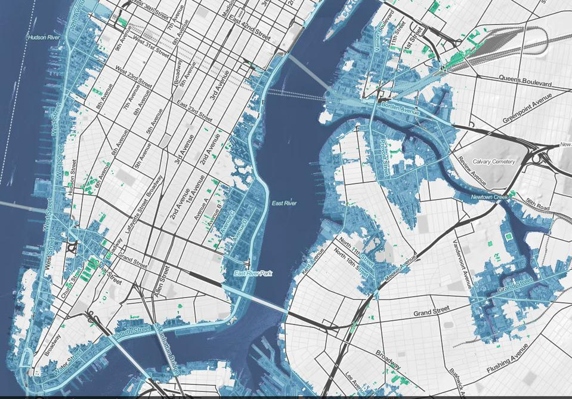
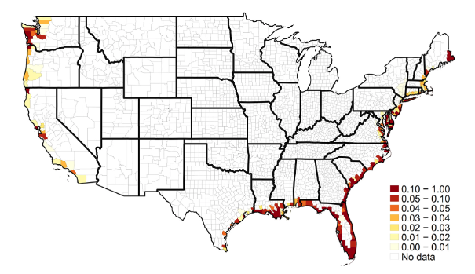
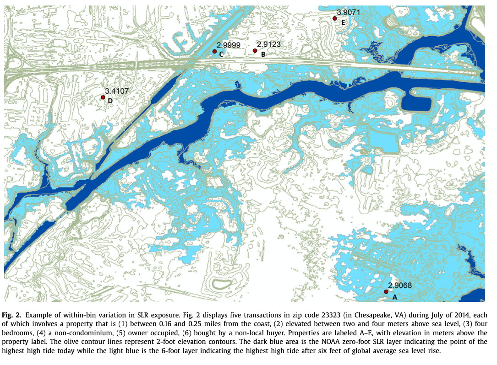
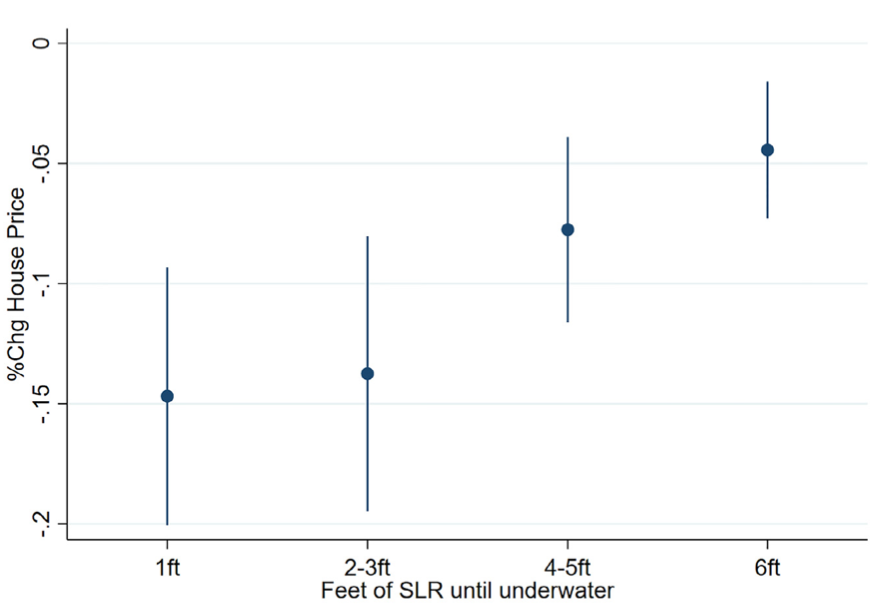
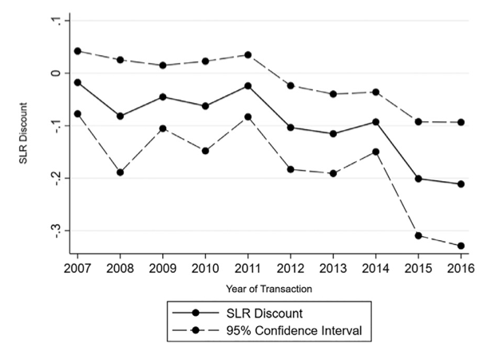
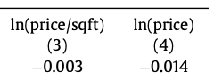

# Sea level rise

<div style= "float:right;position: relative;">
```{r, out.width = "600px", echo = FALSE}

```
</div> 

Sea level rise (SLR) is a long run phenomenon

Not .hi[a lot] of flooding now, but by 2050 sizable portions of NYC will be flooded

By 2100 average SLR will be over 2 feet

--

.hi[Question:] should sea level rise be capitalized into housing prices?

---

# Sea level rise

.hi[Question:] should sea level rise be capitalized into housing prices?

SLR does not affect current homeowners (much), should it still affect prices?

--

.hi[Yes,] why?

--

Let's work through the logical steps

---

# Sea level rise

1. SLR is bad and imposes extra costs (flooding damage, needing to evacuate, etc)
--

2. SLR doesn't affect current buyers, but will affect future buyers of the property
--

3. Future buyers are not willing to pay as much for the house because of the extra costs
--

4. Current buyers will not be able to resell it for as much in the future
--

5. Current buyers are not willing to pay as much because the future resale value goes down

--

Effects decades in the future can affect current prices


---

# Sea level rise

Here's an alternative way to think about it: property as an investment

--

Houses are kind of like annuities:
  - Pay an upfront cost (mortgage)
  - Get a future stream of revenues (rental payments from renters)
  
--

The price of an annuity should be equal to the present value of the stream of payments (minus upkeep costs)
  - Think about why this must be true

---

# Sea level rise

The price of a house is the present value of the stream of profit: rental payments minus upkeep costs

--

If SLR reduces future demand for rentals (decreases rental payments) or increases upkeep costs (e.g. more maintenance of the house), future rental profit goes down

--

Similar to annuities, this should decrease the price of the house

---

# Sea level rise: where is it happening?

<div style= "float:right;position: relative;">
```{r, out.width = "600px", echo = FALSE}

```
</div> 

The map shows the share of houses sold between 2007-2017 that would be flooded with 6 feet of SLR

--

Lots of houses in the Southeast are exposed!


---

# Sea level rise and housing prices

Bernstein, Gustafson, and Lewis (BGL) (2019) estimate how expected SLR affects current housing prices

--

How do they do it?

--

Use a regression model to compare houses exposed to different amounts of SLR, but controlling for (i.e. have the exact same):
  - Distance to the coast
  - Zipcode
  - Property characteristics (bedrooms, bathrooms, square footage, etc)
  - Month of sale


---

# Sea level rise: where is it happening?

<div style= "float:right;position: relative;">
```{r, out.width = "600px", echo = FALSE}

```
</div> 
BGL are *basically* computing the difference in house prices between two houses that are identical, in the same place, but one happened to be at higher elevation

This zipcode is only 92 square miles, and between 3 and 20 feet of elevation

---

# Sea level rise: what is the effect?

<div style= "float:right;position: relative;">
```{r, out.width = "600px", echo = FALSE}

```
</div> 

Houses that would be under water with 1 foot of SLR sell .hi[15 percent] cheaper than the exact same house that is not SLR-exposed

The discount for houses exposed to 6 feet of SLR is only 5%


---

# Sea level rise: what is the effect?

<div style= "float:right;position: relative;">
```{r, out.width = "600px", echo = FALSE}

```
</div> 

The discount from SLR (>6 feet) is getting .hi[bigger] over time

--

Why might this be?

--

SLR projections may be updated over time and more dire

--

Buyers may be becoming more informed about SLR


---

# Sea level rise: what about rents?

<div style= "float:right;position: relative;">
```{r, out.width = "400px", echo = FALSE}

```
</div> 

SLR isn't happening until far into the future so it shouldn't affect rents .hi[today]

--

BGL estimate how future SLR affects current rents and finds very small effects like we'd expect: discounts of 1.4% or smaller
