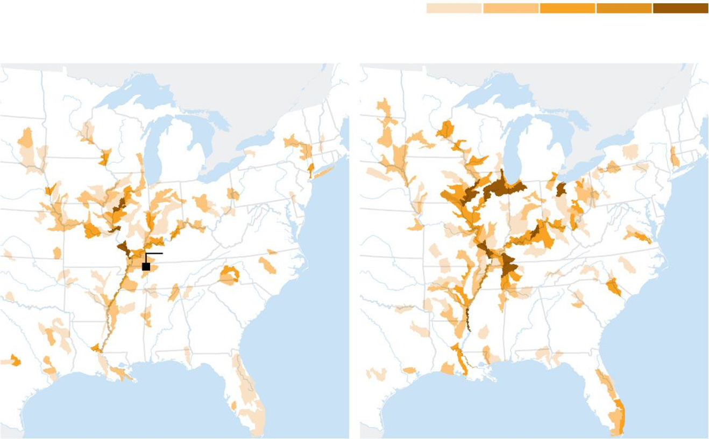
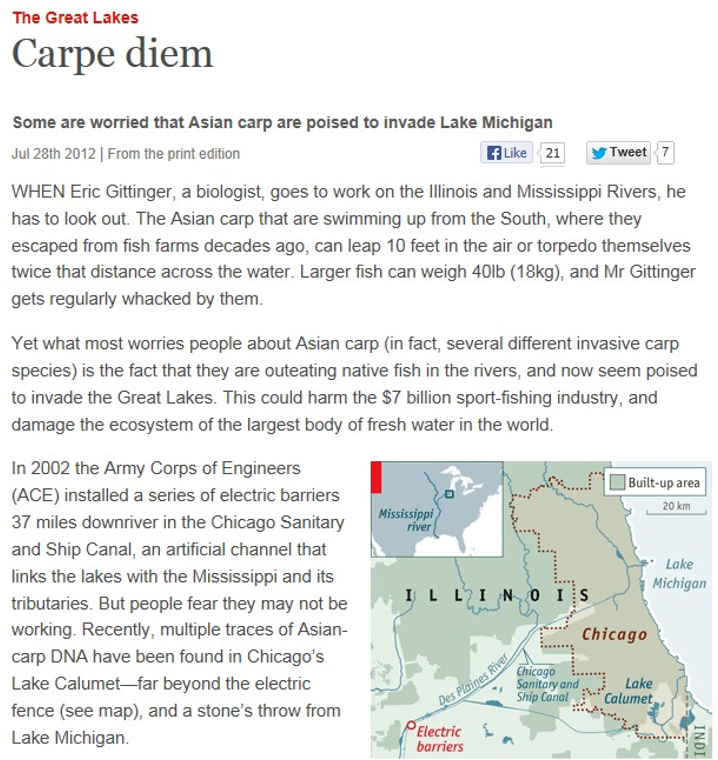

exclude: true
```{r setup}
if (!require("pacman")) install.packages("pacman")
pacman::p_load( 
  tidyverse, magrittr, xaringanExtra, rlang, patchwork, broom, viridis, fixest, maps, tigris, sf
)
set.seed(1)
options(htmltools.dir.version = FALSE)
knitr::opts_hooks$set(fig.callout = function(options) {
  if (options$fig.callout) {
    options$echo <- FALSE
  }
knitr::opts_chunk$set(echo = TRUE, fig.align="center")
  options
})
red_pink <- "#e64173"
blue <- "#3C93DC"
red <- "#ff0000"
```
```{r xaringanExtra, echo = FALSE}
xaringanExtra::use_xaringan_extra(c("tile_view", "panelset", "webcam"))
xaringanExtra::style_panelset(panel_tab_color_active = "red")
```
```{r themes}
red_pink <- "#e64173"
# A blank theme for ggplot
theme_empty <- theme_minimal() +
  theme(
    legend.position = "none",
    title = element_text(size = 24),
    axis.text.x = element_text(size = 24), axis.text.y = element_text(size = 24, color = "#ffffff"),
    axis.title.x = element_text(size = 24), axis.title.y = element_text(size = 24),
    panel.grid.minor.x = element_blank(), panel.grid.major.y = element_blank(),
    panel.grid.minor.y = element_blank(), panel.grid.major.x = element_blank(),
    panel.background = element_rect(fill = "#ffffff", colour = NA),
    plot.background = element_rect(fill = "#ffffff", colour = NA),
    axis.line = element_line(colour = "black"), axis.ticks = element_line(),
  )
theme_blank <- theme_minimal() +
  theme(
    legend.position = "none",
    title = element_text(size = 24),
    axis.text.x = element_blank(), axis.text.y = element_blank(),
    axis.title.x = element_blank(), axis.title.y = element_blank(),
    panel.grid.minor.x = element_blank(), panel.grid.major.y = element_blank(),
    panel.grid.minor.y = element_blank(), panel.grid.major.x = element_blank(),
    panel.background = element_rect(fill = "#ffffff", colour = NA),
    plot.background = element_rect(fill = "#ffffff", colour = NA),
    axis.line = element_blank(), axis.ticks = element_blank(),
  ) 
theme_regular <- 
  theme_minimal() +
  theme(
    legend.position = "none",
    title = element_text(size = 14),
    axis.text.x = element_text(size = 24), axis.text.y = element_text(size = 24),
    axis.title.x = element_text(size = 24), axis.title.y = element_text(size = 24),
    panel.grid.minor.x = element_blank(), panel.grid.minor.y = element_blank(),
    panel.grid.major.x = element_blank(), axis.ticks = element_line(),  axis.line = element_line(),
    panel.background = element_rect(fill = "#ffffff", colour = NA),
    plot.background = element_rect(fill = "#ffffff", colour = NA)
  ) 
```
```{r data}
# initialize seed and data
set.seed(1000)
num_trips <- 100
trip_data <- expand.grid(
  house_num = seq(from = 1, to = num_trips),
  site = 1:26
)

# make fake dataset
trip_data <- trip_data %>%
  as_tibble() %>%
  mutate(
    trips = sample(0:8, num_trips * 26, replace = TRUE),
    income = exp(rnorm(num_trips * 26)) * 3000 + 50000 + rnorm(num_trips * 2) * 15000,
    income = ifelse(income < 10000, 10000, income),
    travel_cost = exp(rnorm(num_trips * 26)) * 30,
    travel_cost_other = exp(rnorm(num_trips * 26)) * 35,
    trips = round(-.01 * travel_cost + .01 * travel_cost_other + 3 / 100000 * income),
    water_clarity = runif(num_trips * 26)
  ) %>%
  group_by(site) %>%
  mutate(water_clarity = mean(water_clarity)) %>%
  ungroup() %>%
  mutate(trips = case_when(
    trips <= 0 ~ 0,
    TRUE ~ trips + 3 * round(water_clarity)
  ))
```

---

# Roadmap

- How do we estimate the value of recreational goods?

---

class: inverse, center, middle
name: background

# Background

<html><div style='float:left'></div><hr color='#EB811B' size=1px width=796px></html>

---

# Should we separate the Great Lakes and Mississippi?

```{r, echo = FALSE}
embed_url("https://youtu.be/lIRXDDG6yB8") %>%
  use_align("center")
```

---

# Should we separate the Great Lakes and Mississippi?

.center[
```{r, out.width = "70%", fig.pos="c", echo = FALSE}

```
]

---

# Should we separate the Great Lakes and Mississippi?

.center[
```{r, out.width = "50%", fig.pos="c", echo = FALSE}

```
]

---

# Should we separate the Great Lakes and Mississippi?

Benefits from barriers accrue to anglers in the Great Lakes, both commercial and recreational 

Costs come from cost of building the barriers plus cost of maintaining them,  plus costs of reduced shipping (if any), plus any other costs associated with the barriers

How do we figure out the benefits from recreational anglers? 

---

# Why do we need travel cost?

Recreational areas .hi[have value]

--

Their quality also has value

--

Not placing a value on recreation is essentially giving it a value of .hi-purple[zero]

--

This is likely inappropriate

--

If someone dumped toxic waste in Taughannock does that have zero cost?

---

# What is the travel cost method?

The travel cost method uses observable data on recreation visitation to infer the recreational value of environmental amenities

--

The central idea is that the time and travel cost expenses that people incur to visit a site represent the .hi[price] of access to the site

--

This means that people's WTP to visit can be estimated based on the number of visits they make to sites of different prices

--

This gives us a demand curve for sites/amenities, so we can value changes in these environmental amenities

---

# Hotelling

After WWII, the U.S. national park service solicited advice from economists on methods for quantifying the value of specific park properties

--

Would total entrance fee that people pay measure the value?

--

.hi-red[No!]

--

Harold Hotelling proposed the first indirect method for measuring the demand of a non-market good in 1947

---

# Hotelling

> Let concentric zones be defined around each park so that the cost of travel to the park from all points in one of these zones is approximately constant. The persons entering the park in a year, or a suitable chosen sample of them, are to be listed according to the zone from which they came. The fact that they come means that the service of the park is at least worth the cost, and this cost can probably be estimated with fair accuracy. 

---

# Hotelling

> A comparison of the cost of coming from a zone with the number of people who do come from it, together with a count of the population of the zone, enables us to plot one point for each zone on a demand curve for the service of the park. By a judicious process of fitting, it should be possible to get a good enough approximation to this demand curve to provide, through integration, a measure of consumers’ surplus.. 

--

About twelve years after, Trice and Wood (1958) and Clawson (1959) independently implemented the methodology 

---

# Theoretical foundation

Here's the theory for how we can use observed data to tell us something about willingness to pay

--

Consider a single consumer and a single recreation site

--

The consumer has:

- Total number of recreation trips: x, to site of quality: q
- Total budget of time: T
- Working time: H
- Non-recreation, non-work time: l
- Hourly wage: w
- Money cost of reaching the site: c
- Expenditures on other market goods: z


---

# Theoretical foundation

This lets us write down the consumer's utility maximization problem:
$$\max_{x,z,l} U(x,z,l,q) \,\,\,\, \text{subject to: }\,\,\, \underbrace{wH = cx + z}_{\text{money budget}}, \,\, \underbrace{T = H + l + tx}_{\text{time budget}}$$
--

Combine the two constraints to get:

--

$$\max_{x,z,l} U(x,z,l,q) \,\,\,\, \text{subject to: }\,\,\, \underbrace{wT = z + (c+wt)x + wl}_{\text{combined money/time budget}}$$

---

# Theoretical foundation

Let $Y = wT$ be the consumer's *full income*, their money value of total time budget

--

Let $p = c+wt$ be the consumer's *full price*, their total cost to reach the site

Then we can write the problem as:

--
$$\max_{x,z,l} U(x,z,l,q) \,\,\,\, \text{subject to: }\,\,\, \underbrace{Y = z + px + wl}_{\text{combined budget}}$$

--

Solve the constraint for $z$ and substitute into the utility function...

---

# Theoretical foundation

$$\max_{x,l} U\left(x,Y-px-wl,l,q\right)$$

--

This has first-order conditions:
$$[x] \,\,\, U_x - pU_z = 0 \rightarrow \frac{U_x}{U_z} = p$$

and
$$[l] \,\,\, -wU_z + U_l = 0 \rightarrow \frac{U_l}{U_z} = w$$

---

# Theoretical foundation

$\frac{U_x}{U_z} = p$ tells us the consumer equates the marginal rate of substitution between recreational trips and consumption to be the full price of the recreational trip

--

What does this mean?

--

.hi[The value of the recreational trip to the consumer, in dollar terms, is revealed by the full price p]

---

# Theoretical foundation

$U_x - pU_z = 0 \qquad -wU_z + U_l = 0$

The above FOCs are two equations, the consumer had two choices (x,l) so we had two unknowns

We can thus solve for x (and l) as a function of the parameters (p,Y,q):

$$x = f(p,Y,q)$$

This is simply the consumer's .hi-blue[demand curves] for recreation as a function of the full price p, full budget Y, and quality q

---

# Theoretical foundation

$$x = f(p,Y,q)$$

If we observe consumers going to sites of different full prices $p_1,p_2,\dots,p_n$, we are moving up and down their recreation demand curve

--

This lets us trace out the demand curve

--

Changing Y or q shifts the demand curve in or out: these are income and quasi-price effects

--

Once we have it, we can compute surplus!

---

# Zonal (single-site) model

Here's the most basic travel cost model to start

--

- Construct distance zones (i) as concentric circles emanating from the recreation site
  - Travel costs from all points within each zone to the site are sufficiently close in magnitude to justify neglecting the differences
--

- From a sample of visitors $(v_i)$ at the recreation site, determine zones of origin and their populations $(n_i)$
--

- Calculate the per capita visitation rates for each zone of origin $(t_i = (v_i/n_i))$


---

# Zonal (single-site) model

- Construct a travel cost measure $(tc_i)$ that reflects the round-trip costs of travel from the zone of origin to the recreation site (time and gas), + an entry fee $(fee)$ which may be zero and does not vary across zones

--

- Collect relevant socioeconomic data $(x_i)$ such as income and education for each distance zone

--

- Use statistical methods to estimate the trip demand curve: the relationship between per-capita visitation rates, cost per visit, [and travel costs to other sites $(tc_{si})$] controlling for socioeconomic differences

--

- $t_i = g(tc_i + fee; tc_{si}, x_i) + \varepsilon_i$ where $g$ can be linear

---

# Zonal (single-site) model

Here's a simple example of a set of zones 1-5:
```{R, sample2 scatter, echo = F, fig.width = 5, fig.height = 5, fig.align = 'center', dev = "svg"}
xy <- data.frame(x=rnorm(100),y=rnorm(100))
rmax = sqrt(max(xy$x)^2+max(xy$y)^2)
theta=seq(from=0,by=.01,to=2*pi)
ncirc=5

dat.circ = do.call(rbind,
  lapply(seq_len(ncirc),function(n){
  r <- n*rmax/ncirc
  data.frame(x=r*sin(theta),y=r*cos(theta),r=round(r,2))
}))

rr <- unique(dat.circ$r)
labels <- 1:ncirc
dat.text = data.frame(x=rr*cos(30),y=rr*sin(30),label = labels)


ggplot(xy,aes(x,y))+
   geom_path(data = dat.circ, aes(group=factor(r)), color = blue) +
   geom_text(data = dat.text, aes(label=label), vjust=-1, size = 5) +
  theme_blank
```

---

# Zonal (single-site) model

Suppose we have the following data:

```{r, echo = F}
df <- tribble(
  ~zone, ~dist, ~pop, ~cost, ~vpp,
  "A", 2, 10000, 20, 15,
  "B", 30, 10000, 30, 13,
  "C", 90, 20000, 65, 6,
  "D", 140, 10000, 80, 3,
  "E", 150, 10000, 90, 1
)
df
```

If we plot cost by visits per person, we have a measure of the demand curve...

---

# Zonal (single-site) model

.pull-left[
This is a very simple example where it happens to be an exactly straight line, most likely the data won't be this perfect

The line is simply from estimating: $$t_i = \beta_0 + \beta_1 tc_i + \varepsilon_i$$
]

.pull-right[
```{r, zonal example, echo = F, fig.width = 5, fig.height = 5, fig.align = 'center', dev = "svg"}
ggplot(data = df, aes(x = vpp, y = cost)) +
  geom_point(size = 5, color = blue) +
  geom_smooth(formula = y~x, method = "lm", se = F, color = "darkslategray") +
  theme_regular +
  labs(y = "Cost (tc)", x = "Trips per Person (t)")
```
]

---

# Zonal (single-site) model

.pull-left[
The data will most likely look like this, but even this is probably too clean

It ignores things like income, other sites, other household characteristics
]

.pull-right[
```{r, zonal example 2, echo = F, fig.width = 5, fig.height = 5, fig.align = 'center', dev = "svg"}

df_noisy <- tibble(vpp = 1:12, cost = 80 - 3*vpp + 20*runif(12))
ggplot(data = df_noisy, aes(x = vpp, y = cost)) +
  geom_point(size = 5, color = blue) +
  geom_smooth(formula = y~x, method = "lm", se = F, color = "darkslategray") +
  theme_regular +
  labs(y = "Cost", x = "Visits per Person") +
  scale_x_continuous(breaks = scales::pretty_breaks())
```
]

---

# Zonal (single-site) model

Based on the estimate model coefficients, construct the (inverse) demand curve

--

.hi[For each zone:] predict total visitation given various fees

--

Entry fee on the y-axis (price), and the number of predicted total visits on the x-axis (quantity)

--

The demand curve is different for different zone because different social economic variables

--

The (use) value of the park/site to each zone is given by the area underneath the corresponding demand curve

---

# Issues with the single-site model

What are some potential issues and concerns with this approach?

--

It ignores non-use value (automatically zero for non-users)

--

What are the right zones to choose?

--

What is the right functional form for demand?

--

How do we measure the opportunity cost of time?

--

How do we treat multi-purpose trips?

--

How do we value particular site attributes? Can't disentangle them at a single site


---

# Multi-site model

To value particular site attributes we need to have multiple sites (with different attributes!)

--

We can answer questions like:

--

What is the benefit of a fish restocking program?
  - Need to know the value of fish catch rate for visitors

--

What is the benefit of water clarity?

--

What is the benefit of tree replanting?


---

# Multi-site model

Suppose we have a dataset with a large number of individuals and sites

--

Individuals are given by $i=1,\dots,N$ and sites are given by $j=1,\dots,J$

--

We observe the number of times each individual visited each site

--

The multi-site model works as follows


---

# Multi-site model

.hi[Step 1:] Do the single-site estimation for each site:
$$T_{ij} = \beta_{0j} + \beta_{1j} tc_{ij} + \beta_{2j} tc_{sij} + \beta_{3j} x_i + \varepsilon_{ij}$$

--

.hi[Step 2:] Recover all the $\beta$s from each step 1 regression so that we have a set of J $\beta_{0j}$s for $j=1\dots,J$, $\beta_{1j}$s for $j=1\dots,J$, etc

--

These $\beta$s tell us the slope $(\beta_{1j})$ and intercept $(\beta_{0j}, \beta_{2j}, \beta_{3j})$

--

$\beta_{2j}, \beta_{3j}$ capture how the cost of substitute sites and household characteristics shift demand up and down

---

# Multi-site model

.hi[Step 3:] Take each set of $J$ coefficient estimates and use them as the dependent variable in a regression on site attributes $z$:
$$\hat{\beta}_{0j} = \alpha_{00} + \alpha_{01}z_j + \epsilon_{0j}$$
$$\hat{\beta}_{1j} = \alpha_{10} + \alpha_{11}z_j + \epsilon_{1j}$$
$$\hat{\beta}_{2j} = \alpha_{20} + \alpha_{21}z_j + \epsilon_{2j}$$
$$\hat{\beta}_{3j} = \alpha_{30} + \alpha_{31}z_j + \epsilon_{3j}$$

The $\alpha_{\times1}$ coefficients tell us how the demand curve shifts $(\alpha_{00}, \alpha_{02}, \alpha_{03})$ or rotates $(\alpha_{01})$ as we change $z$

---

# Valuing attributes with a multi-site model

.pull-left[
If we improve the quality of a site from z<sub>1</sub> to z<sub>2</sub>, demand for that site shifts up

The gain in CS, holding the cost fixed, is given by the blue area

Once we estimate demand curves, we can see how welfare changes when we alter quality characteristics!

]

.pull-right[
```{r, multi site example, echo = F, fig.width = 5, fig.height = 5, fig.align = 'center', dev = "svg"}

dwl_points <- tibble(x = c(0, 0, 20, 50),
                     y = c(80, 50, 30, 30))

ggplot() +
  geom_abline(
    intercept = 80, slope = -1,
    size = 2, color = blue
  ) +
  geom_abline(
    intercept = 50, slope = -1,
    size = 2, color = red
  ) +
  geom_polygon(data = dwl_points, aes(x = x, y = y), fill = blue, alpha = 0.25) +
  geom_hline(
    yintercept = 30,
    size = 2,
    color = "darkslategray",
    linetype = "longdash"
  ) +
  annotate("segment", x = 20, xend = 20, y = 0, yend = 30,
           linetype = "dashed", size = 1.5, color = "grey50") +
  annotate("segment", x = 50, xend = 50, y = 0, yend = 30,
           linetype = "dashed", size = 1.5, color = "grey50") +
  annotate("text", x = 25, y = 10, label = "D(z1)", size = 8) +
  annotate("text", x = 85, y = 10, label = "D(z2)", size = 8) +
  theme_empty +
  labs(y = "Cost", x = "Visits per Person") +
  scale_x_continuous(breaks = c(20,50), labels = c(expression(t[1]), expression(t[2])),
                     limits = c(0, 100), expand = c(0, 0)) +
  scale_y_continuous(breaks = 30, labels = expression(tc[i]), limits = c(0, 100))
```
]

---

# Multi-site example

```{r}
trip_data
```

---

# First stage estimation

```{r}
# first stage of multi-site
site_estimates <- map_dfr(unique(trip_data$site), function(site_in){
  lm(trips ~ travel_cost + travel_cost_other + income, 
     trip_data %>% filter(site == site_in)) %>% 
    broom::tidy() %>% 
    select(estimate) %>% 
    mutate(site = site_in) %>% 
    list() %>% 
    tibble_row() %>% 
    unlist() 
}) %>% 
  select(1:5) %>% 
  magrittr::set_colnames(c("intercept", "own_price", "cross_price", "income", "site"))
```

---

# First stage estimation

```{r}
site_estimates
```

---

# Take estimates, join with water clarity

```{r}
# merge in water clarity
estimation_df <- site_estimates %>% 
  left_join(trip_data %>% distinct(site, water_clarity))
estimation_df
```

---

# Second stage

```{r}
# second stage of multi-site
demand_shifts <- map_dfr(names(estimation_df)[1:4],
        function(coefficient) {
          reg_formula <- as.formula(paste0(coefficient, " ~ water_clarity"))
          lm(reg_formula, estimation_df) %>% 
            broom::tidy() %>% 
            mutate(coeff = coefficient) %>% 
            slice(2)
        }
) |> 
  select(term, estimate, coeff)
```

---

# Second stage

```{r}
demand_shifts
```
The estimates column tells us how a change in water clarity (from 0 to 100%), shifts or rotates our demand curve

---

# Real world data: central park

Standard travel cost method is costly

--

Need to survey households

--

This takes time and money

--

What alternatives do we have?

---

# Mobility data from cell phones

.hi[Cell phones] track where people live, go, etc

--

We can use these data to do the travel cost method

--

Same data used by NYT, WaPo, etc for COVID analysis of restaurants, etc

--

Here we will be looking at visits to central park

---

# Mobility data from cell phones

```{r, message = FALSE}
central_park_data = read_csv("data/12-central-park-phone-data.csv")
central_park_data
```

---

# Real world data: central park

The dataframe tells us for each .hi[census block group (CBG)] (600-3000 person locations):
  - visits per month to a particular location in central park by all cell phones in the CBG
  - how far the CBG is from the central park location (time and distance)
  - The median income of the CBG
  - The median age of the CBG
  
```{r, message = FALSE, echo = FALSE}
central_park_data
```

---

# Visits by where people live

```{r, echo = FALSE, message = FALSE, fig.align = "center"}

# download block groups geometries from the US Census (the map)
block_groups_df = map_dfr(state.abb[c(32)], block_groups) |>
  select(visitor_cbgs = GEOID) |> 
  st_transform(5070) |> 
  filter(substr(visitor_cbgs, 1, 2) != "02" & substr(visitor_cbgs, 1, 2) != "15") |>
  mutate(visitor_cbgs = as.numeric(visitor_cbgs))

# state and county outlines (the map)
county_sdf <- st_as_sf(map("county", plot = FALSE, fill = TRUE)) |> 
  st_transform(5070) |>
  # only keep new york counties
  filter(substr(ID, 1, 5) == "new y") |>
  # only keep 4 NYC counties near central park
  filter(
      str_detect(ID, "bronx") |
      str_detect(ID, "new york, new york") |
      str_detect(ID, "kings") |
      str_detect(ID, "queens")
      )

# make the visit data for plotting
map_plot = central_park_data |> 
  group_by(visitor_cbgs) |> 
  summarise(visits = sum(visits, na.rm = T)) |> 
  inner_join(block_groups_df)

# make the park location
park_location = central_park_data |> 
  as_tibble() |> 
  select(latitude, longitude) |> 
  distinct() |> 
  filter(longitude > -140) |> 
  st_as_sf(coords = c("longitude", "latitude"), crs = 4326) |> 
  st_transform(5070)

# make the map
ggplot() +
  # plot the county boundaries
  geom_sf(data = county_sdf, 
          col = "#888888", 
          size = 0.2, 
          fill = "transparent") +
  # plot the visit data
  geom_sf(data = map_plot, 
          size = 0.05,
          aes(fill = visits, geometry = geometry)) +
  # plot the locations in the park that 'count' visits
  # geom_sf(data = park_location,
  #         size = 3,
  #         shape = 4,
  #         color = "red",
  #         aes(geometry = geometry)) +
  scale_fill_viridis_c(option = "magma", trans = "log10", breaks = c(1, 10, 100, 1000, 10000)) +
  theme_minimal() + 
  theme(axis.title = element_text(size = 1, color = "#FFFFFF"), 
        panel.grid = element_blank(),
        axis.text = element_text(size = 1, color = "#FFFFFF"),
        legend.position = c(.55, .95),
        legend.direction = "horizontal",
        legend.spacing.x = unit(-.05, 'cm'),
        legend.key.width = unit(3, "cm"),
        legend.key.height = unit(1, "cm"),
        legend.text = element_text(size = 18),
        legend.title = element_text(size = 18)) + 
  guides(fill = 
           guide_legend(
             nrow = 1,
             label.position = "bottom",
             title = "Visits   "
           )
  ) 
```

---

# Travel cost estimation with cell data


We don't have the exact cost of households going to central park, but we have variables that are a good proxy

--

Estimate a simple travel cost model, what does it tell you (tip: use `feols` instead of `lm`)

--

```{r}
central_park_demand = feols(
  log(visits) ~ log(travel_distance_km), 
  central_park_data
  ) |>
  tidy() |>
  select(term, estimate)
```

---

# Travel cost estimation with cell data

Regression: `log(visits) ~ log(travel_distance_km)`

```{r}
central_park_demand
```

What do the estimates mean?

---

# Visualizing the relationship

.pull-left[
```{r, echo = FALSE, message = FALSE}
df <- central_park_data |> 
  as_tibble() |> 
  mutate(dist_deciles = ntile(travel_distance_km, 20)) |> 
  group_by(dist_deciles) |> 
  summarise(mean_dist = log(mean(travel_distance_km, na.rm = T)),
            visits = log(mean(visits, na.rm = T)) )

ggplot(data = df, aes(x = mean_dist, y = visits)) +
  geom_point(size = 2) +
  geom_smooth(formula = "y~x", method = "lm", se = F) +
  theme_regular +
  labs(x = "log(travel distance)",
       y = "log(visits)") +
  scale_x_continuous(breaks = scales::pretty_breaks()) +
  scale_y_continuous(breaks = scales::pretty_breaks())
```
]

.pull-right[
The number of visits decreases in distance

The slope is the elasticity (-0.0593)

A 1 percent increase in distance decreases visits by 0.0593 percent

]

---

# The elasticity and omitted variables

Other things probably affect how far someone lives from central park and how often they visit central park

--

Ideas?

--

New regression controlling for these factors:

```{r}
central_park_demand = feols(
  log(visits) ~ log(travel_distance_km) + log(median_income) + log(median_age), 
  central_park_data
  ) |>
  tidy() |>
  select(term, estimate)
```


---

# The elasticity and omitted variables

```{r, eval = F}
central_park_demand
```
```
## # A tibble: 4 × 2
##   term                    estimate
##   <chr>                      <dbl>
## 1 (Intercept)               0.578 
*## 2 log(travel_distance_km)  -0.0252 versus -0.593
## 3 log(median_income)        0.0858
## 4 log(median_age)           0.134
```

The elasticity dropped by two-thirds!

--

Why?

---

# The elasticity and omitted variables

Rich people go to central park more than poorer people

Older people go to central park more than younger people

Where do richer older people tend to live?


---

# The elasticity and omitted variables

```{r, message = FALSE}
feols(log(travel_distance_km) ~ log(median_income), central_park_data) |> tidy()
feols(log(travel_distance_km) ~ log(median_age), central_park_data) |> tidy()
```

Richer and older people live closer to central park

---

# The elasticity and omitted variables

Why does this matter?

--

Rich people can afford to live in Manhattan and they also like parks a lot

--

Ignoring this makes it seem like the average person visits a lot less if they live further away

--

But it is just the fact that poorer households tend to live in the outer boroughs of New York and likely cannot afford as many trips as richer households