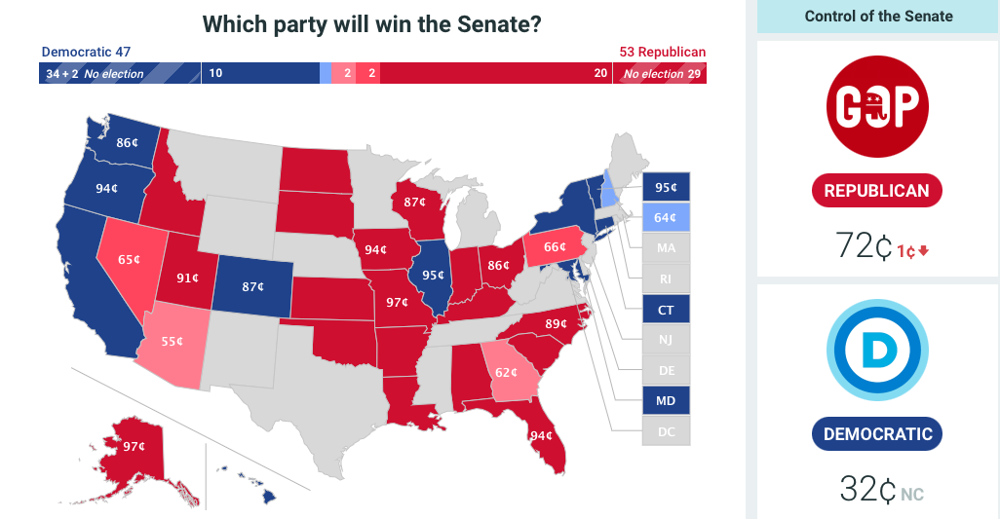
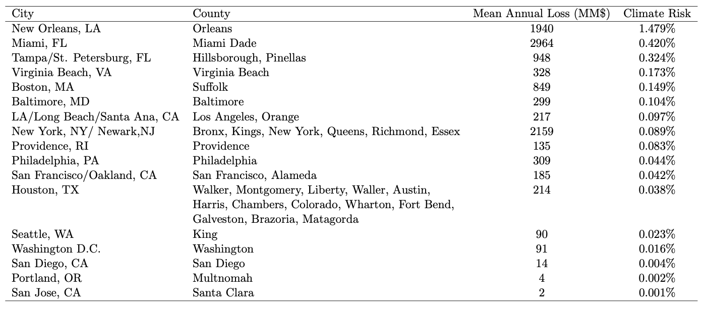
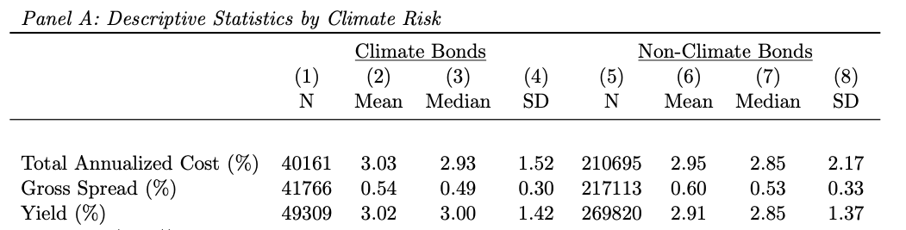
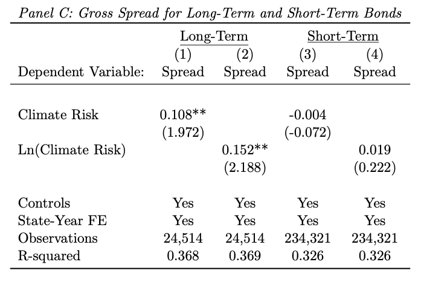
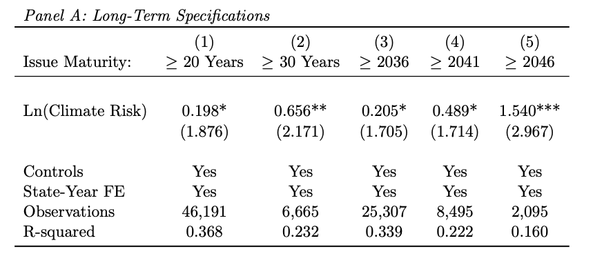

exclude: true 
```{r setup}
if (!require("pacman")) install.packages("pacman")
pacman::p_load(
  tidyverse, xaringanExtra, rlang, patchwork
)
options(htmltools.dir.version = FALSE)
knitr::opts_hooks$set(fig.callout = function(options) {
  if (options$fig.callout) {
    options$echo <- FALSE
  }
knitr::opts_chunk$set(echo = TRUE, fig.align="center")
  options
})
```
```{r xaringanExtra, echo = FALSE}
xaringanExtra::use_xaringan_extra(c("tile_view", "panelset", "webcam"))

```
```{r echo=FALSE}
xaringanExtra::style_panelset(panel_tab_color_active = "red")
```

---

# Roadmap

1. Quick overview on financial instruments
2. What can they tell us about climate change?


---

class: inverse, center, middle
name: overview

# Quick overview on financial instruments

<html><div style='float:left'></div><hr color='#EB811B' size=1px width=796px></html>

---

# The idea behind this part of class

The two pieces of the formula for the first half of class are .hi-blue[MAC] and .hi[MD]

--

If we know both of these quantities we have a good sense of what we should be doing about climate change

--

Measuring abatement costs and damages can be super hard (think about why)
  - e.g. early 2022 vs late 2022 expected cost of Russian gas restrictions

--

What we will see is financial markets contain the information we need, here we will look at:
  - Stock markets and prediction markets: MAC
  - Bond markets: MD
  
    
---

# Betting on the weather

The purpose of this lecture is to see whether financial markets price climate risk

--

Our first step: prove to ourselves that traders even recognize climate change

--

How?

--

Studying the market for weather derivatives
  
---

# Prediction markets

<div style= "float:right;position: relative;">
```{r, out.width = "700px", echo = FALSE}

```
</div> 

Prediction markets are where traders bet on binary outcomes

--

Will Republicans win the senate?

--

How does it work?

---

# Prediction markets

<div style= "float:right;position: relative;">
```{r, out.width = "700px", echo = FALSE}

```
</div> 

You can buy a share (asset) for whether the event will happen or not happen

--

The price of this share is:
 - 72c for Republicans winning
 - 32c for Democrats winning


---

# Prediction markets

After the election:
  - The shares for the winning side pay off $1 each
  - The shares for the losing side are worth $0
  
What does the prediction market tell us?

--

Let's think about the economics of the market

--

Let:
  - The cost of a share be $c$ dollars
  - Your belief about the probability of an event happening be $p$ percent
  

---

# Prediction markets

Based on your beliefs about the event, your expected profit from buying a share is: $[p \times 1 + (1-p) \times 0] - c$

--

You make a profit if $p > c$, you make a loss if $p < c$

--

Suppose $p > c$, what happens?

--

You expect a profit, you start buying shares...

--

This drives up the price $c$

--

This is true as long as $p > c$


---

# Prediction markets


Suppose $p < c$, what happens?

--

You expect a loss, you start selling your existing shares...

--

This drives down the price $c$

--

This is true as long as $p < c$

--

Individual profit motives always drive $c$ toward $p$

--

.hi[The price of the share tells us the market's expectation about the probability of the event!]


---

# Bonds

.hi[Bonds:] what are they?

--

> [Wiki] A bond is a type of security under which the issuer (debtor) owes the holder (creditor) a debt, and is obliged – depending on the terms – to repay the principal (i.e. amount borrowed) of the bond at the maturity date as well as interest (called the coupon) over a specified amount of time. 

--

A bond is basically a loan with a defined term/maturity

--

Bonds are assets, can be traded on secondary markets

---

# Bonds

Why do bonds exist?

--

Bonds are a way to raise money:
  - At time $t$, issue bonds with maturity $T$
  - Get money from creditors
  - Pay back interest/coupon over time between $t$ and $T$
  - Pay back principal at some future date $t+T$
  
--

We will focus on .hi[municipal bonds (munis)] for pricing climate risk, why?


---

# Municipal bonds

Why munis for pricing climate risk?

--

Suppose Starbucks has coffee packaging plants in Miami

--

Miami is expecting disastrous sea level rise, what can Starbucks do to manage it?

--

Move its plants somewhere else away from the ocean

--

The city of Miami does not have the same option: it bears the full potential cost of sea level rise


---

# Municipal bonds

How do munis work?

--

Local governments issue munis for financing public projects (roads, infrastructure, etc)

--

Debt is typically paid back in a pre-specified way
  - .hi[General obligation bonds:] paid using tax revenue
  - .hi[Revenue bonds:] project-specific revenue (e.g. parking garage revenues)
  
--

General obligation bonds are typically less risky

---

# Municipal bonds

How do bonds work?

--

They have some .hi[face value] $FV$, the price paid when the bond matures

--

They pay out a .hi[coupon] (assume annually) $C$

--

They trade on the bond market at some .hi[price] $P$ which will depend on:
  - The face value
  - The coupon
  - When the bond matures
  - *Other underlying economic conditions*
  

---

# Municipal bonds

We can define the .hi[yield to maturity] $y$ as:
$$P = \left[\sum_{t=1}^T \frac{C}{(1+y)^t}\right] + \frac{FV}{(1+y)^T}$$

$y$ is the effective interest rate the investor is getting on a price $P$ bond

--

Given some price $P$, a higher yield $y$ means that the flow of coupons $C$ or face value $FV$ must be higher

--

Given some coupon $C$ and face value $FV$, a higher yield $y$ means a lower price $P$

  
---

# Municipal bonds

Why would future climate risk be capitalized into munis? Examples for why?

--

1. If climate change (e.g. sea level rise) destroys infrastructure, raises municipal costs, raises risk of bankruptcy and non-payment of the bond
--

2. If climate change induces people to leave, this shrinks the tax base, makes it more difficult for the municipality to pay back the bond, raises risk of non-payment

--

Factors like these should be priced into the bond if traders understand climate risk

---

# Municipal bonds

Let's work with a simple one-period zero coupon example: $C=0$, $T=1$, $FV = 105$:
$$P = \frac{105}{(1+y)^1}$$

Suppose there is no climate change and the market yield is 5%, the price of the muni is:

--

$$P = \frac{105}{1+.05} = 100$$
---

# Municipal bonds

Now suppose we are considering the same muni, but there is a 7% chance that the city will be destroyed by sea level rise before next year
  - Additional 7% chance that the bond will not be paid
  
To bear this additional risk, traders will demand a higher yield (lower price)
  
---

# Municipal bonds 
  
We can solve for the new price:
$$P = \frac{105}{1+.05} \times \underbrace{(1 - .07)}_{1/(1+.075)} = \frac{105}{1+.05} \times \frac{1}{1+.075}=93$$
and the associated yield:
\begin{align}
  \frac{1}{1+y} &= \frac{1}{1+.05} \times (1 - .07) = \frac{.93}{1.05} \\
  \Rightarrow y &= \frac{1.05}{.93} - 1 = .129
\end{align}

---

# Municipal bonds 

The additional 7% climate risk:
- Decreased the price by 7% from 100 to 93
- Increased the yield by 7.9 percentage points from 5% to 12.9%

--

As climate risk rises, traders demand greater yields to offset the chances of non-payment

--

We can measure the financial risks of climate change by looking at how places with different climate risk have munis with different yields


---

# Municipal bonds and sea level rise

Painter (2020) looks at how sea level rise (SLR) risk affects bond yields
  - Also looks at other things outside what we're doing in class
  
--

How should SLR affect bond yields of different maturities?

--

SLR is a slow phenomenon, will matter increasingly over the next century
--

  - non-existent in the short run: short-term bonds shouldn't be affected
--

  - only shows up in the long run: long-run bonds should be affected if investors care
  
---

# Municipal bonds and sea level rise

.center[
```{r, out.width = "800px", echo = FALSE}

```
]

Climate risk: expected percent loss of city GDP

Where is the climate risk?

---

# Municipal bonds and sea level rise

.center[
```{r, out.width = "800px", echo = FALSE}

```
]

What does the raw data say about climate/SLR exposed and non-exposed munis?

--

Climate(-exposed) bonds are 8 basis points more expensive to offer

11 basis points higher yield


---

# Yield

<div style= "float:right;position: relative;">
```{r, out.width = "700px", echo = FALSE}
knitr::include_graphics("files/15-yield-results.png")
```
</div> 

Comparing munis offered in the same state and year, controlling for other factors:

.hi[Areas at risk for SLR must offer greater yields by 16pp]

---

# Gross spread

<div style= "float:right;position: relative;">
```{r, out.width = "700px", echo = FALSE}

```
</div> 

They have higher gross spreads (higher underwriter search costs): 10-15bp higher for long-term bonds

---

# Maturities

<div style= "float:right;position: relative;">
```{r, out.width = "700px", echo = FALSE}

```
</div> 

Effect is larger for longer-maturity bonds: bonds maturing 

---

# Credit ratings

<div style= "float:right;position: relative;">
```{r, out.width = "700px", echo = FALSE}
knitr::include_graphics("files/15-credit-rating.png")
```
</div> 

SLR matters most for bonds with lower ratings:

Non-high grade munis costs are 50bp higher with higher climate risk


---

# What does this all mean?

We've seen that places more exposed to SLR:
- Must offer higher yields on long-term bonds, with yields increasing in time to maturing
- Incur higher gross spreads
- Must offer even higher yields if they do not have a high credit rating

--

Think about the long-run equilibrium of economic activity, where people live, etc

--

What does this suggest will happen?


---

# What does this all mean?

1. Capital is becoming more expensive in SLR-exposed cities
--

2. These cities will be less able to fund public projects (e.g. parks), making them less desirable
--

3. Marginal households who value these projects move elsewhere
--

4. Tax base shrinks $\rightarrow$ feedback loop

--

Does this tell the whole story?

---

# What does this all mean?

Alternatively:

1. Capital is becoming more expensive in SLR-exposed cities
--

2. These cities will be less able to fund public projects (e.g. parks), making them less desirable
--

3. City funds adaptation projects (e.g. sea walls) to reduce exposure, decreasing yields and capital costs

--

In both cases, muni markets serve an important function for directing resources and people to the most productive areas