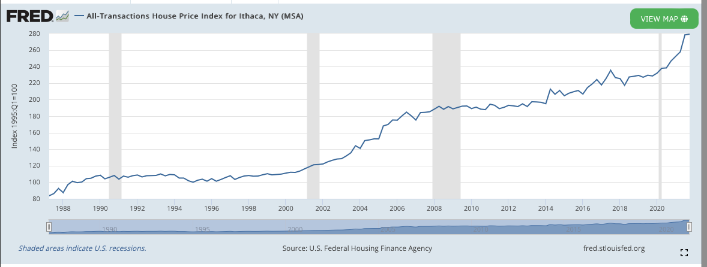
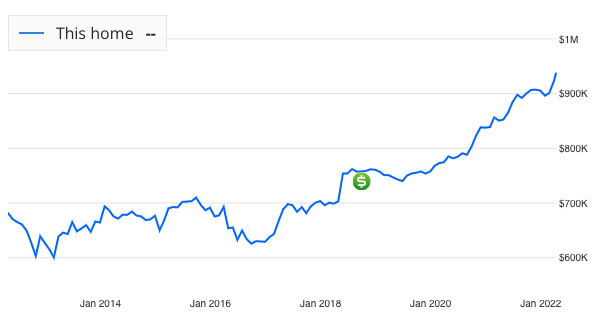
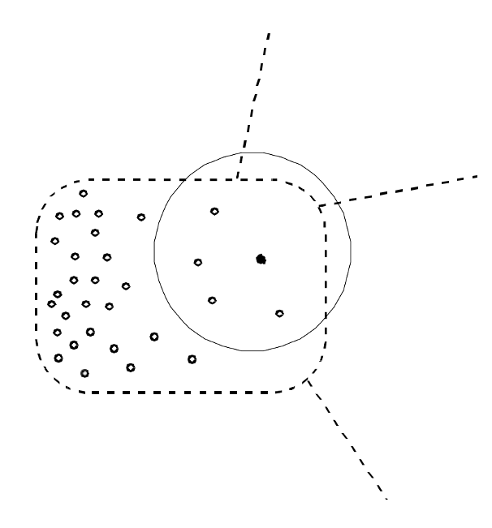
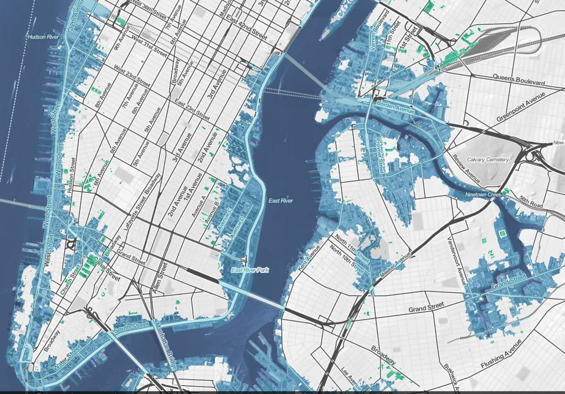
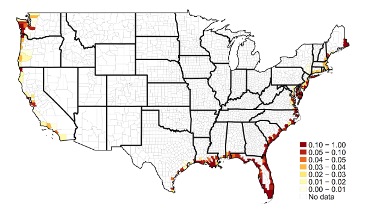
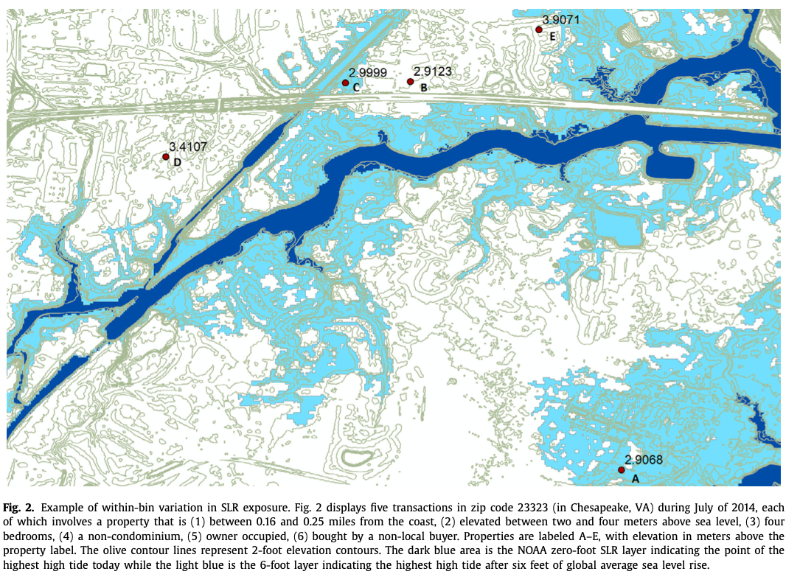
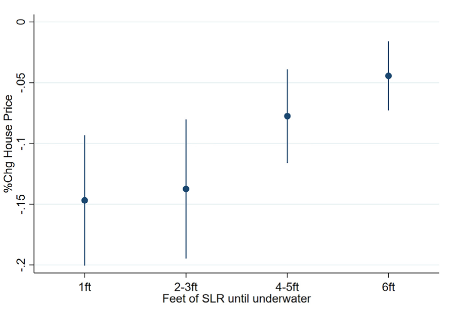
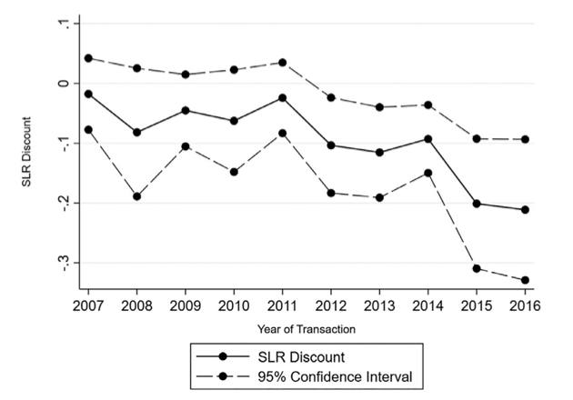
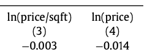

exclude: true
```{r setup}
if (!require("pacman")) install.packages("pacman")
pacman::p_load(
  tidyverse, xaringanExtra, rlang, patchwork, nycflights13, tweetrmd, vembedr
)
options(htmltools.dir.version = FALSE)
knitr::opts_hooks$set(fig.callout = function(options) {
  if (options$fig.callout) {
    options$echo <- FALSE
  }
knitr::opts_chunk$set(echo = TRUE, fig.align="center")
  options
})
```
```{r xaringanExtra, echo = FALSE}
xaringanExtra::use_xaringan_extra(c("tile_view", "panelset", "webcam"))
xaringanExtra::style_panelset(panel_tab_color_active = "red")
```
```{r themes}
red_pink <- "#e64173"
# A blank theme for ggplot
theme_empty <- theme_minimal() +
  theme(
    legend.position = "none",
    title = element_text(size = 24),
    axis.text.x = element_text(size = 24), axis.text.y = element_text(size = 24, color = "#ffffff"),
    axis.title.x = element_text(size = 24), axis.title.y = element_text(size = 24),
    panel.grid.minor.x = element_blank(), panel.grid.major.y = element_blank(),
    panel.grid.minor.y = element_blank(), panel.grid.major.x = element_blank(),
    panel.background = element_rect(fill = "#ffffff", colour = NA),
    plot.background = element_rect(fill = "#ffffff", colour = NA),
    axis.line = element_line(colour = "black"), axis.ticks = element_line(),
  )
theme_blank <- theme_minimal() +
  theme(
    legend.position = "none",
    title = element_text(size = 24),
    axis.text.x = element_blank(), axis.text.y = element_blank(),
    axis.title.x = element_blank(), axis.title.y = element_blank(),
    panel.grid.minor.x = element_blank(), panel.grid.major.y = element_blank(),
    panel.grid.minor.y = element_blank(), panel.grid.major.x = element_blank(),
    panel.background = element_rect(fill = "#ffffff", colour = NA),
    plot.background = element_rect(fill = "#ffffff", colour = NA),
    axis.line = element_blank(), axis.ticks = element_blank(),
  ) 
theme_regular <- 
  theme_minimal() +
  theme(
    legend.position = "none",
    title = element_text(size = 24),
    axis.text.x = element_text(size = 24), axis.text.y = element_text(size = 24),
    axis.title.x = element_text(size = 24), axis.title.y = element_text(size = 24),
    panel.grid.minor.x = element_blank(), panel.grid.minor.y = element_blank(),
    panel.grid.major.x = element_blank(), axis.ticks = element_line(),  axis.line = element_line(),
    panel.background = element_rect(fill = "#ffffff", colour = NA),
    plot.background = element_rect(fill = "#ffffff", colour = NA)
  ) 
```

---

# Roadmap

- What can we use to infer the demand for environmental goods?
- What do housing prices tell us?
- What is the demand for hazardous waste? (Greenstone and Gallagher, 2008)
- What is the demand for sea level rise? (Bernstein, et al. 2019)

---

class: inverse, center, middle
name: hedonics

# Hedonic valuation

<html><div style='float:left'></div><hr color='#EB811B' size=1px width=796px></html>


---

# Revealed preference approaches

There is no clear way to .hi[directly] value changes in quantities of environmental goods

--

Why?

--

There aren't any markets for them!

--

Is there a way we can reveal the value of these goods?

---

# Revealed preference approaches

One way to circumvent this problem is to look at private goods that interact with the environmental good

--

If there are changes in the environmental good, 
--
holding everything else fixed, 
--
that should be reflected in *some way* in changes in the price of the related private good

--

This change in price can tell us something about how people value the change in the environmental good

---

# Revealed preference approaches: example

There is no market for orcas

--

Suppose there's a massive decline in orcas off the Washington coast, what happens?

--

We will likely see demand for sightseeing tours go down (MB of these tours went down!)

--

This drops the price of tours

--

A non-market good had an effect on a market price

--

What does this price change mean?

---

# Hedonics: Property value models

Common market goods to use for revealed preference valuation are .hi-blue[properties]

--

When people buy a home they are purchasing a bundle of goods:
  - Rooms
  - Bathrooms
  - School quality
  - .hi[Environmental quality]

--

Homes located in pristine areas are likely to be more valuable than identical homes located near toxic facilities

---

# Hedonics: Property value models

Real estate is virtually ideal for measuring environmental changes

--

Real estate markets are often competitive and thick

--

Property purchases are large and consequential: buyers and sellers are likely to be well-informed

--

It is uncontroversial that property values should reflect local attributes

--

e.g. homes in better school districts are typically more expensive

---

class: inverse, center, middle
name: superfund

# BCA of Superfund

<html><div style='float:left'></div><hr color='#EB811B' size=1px width=796px></html>

---

# Superfund

```{r, echo = FALSE}
embed_url("https://youtu.be/Kjobz14i8kM") %>%
  use_align("center")
```


---

# Superfund

Congress passes Comprehensive Environmental Response, Compensation, and Liability Act (“Superfund”) in 1980

--

Located and analyzed hazardous waste sites nation-wide

--

Since then, the EPA has identified more than 47,000 hazardous waste sites that potentially require some sort of cleanup action

--

By 2005: $35 billion in federal funding has been spent at roughly 800 sites

---

# Superfund

.hi[Superfund site cleanups are not cheap]

--

Even before the budget crisis in Washington, there were many calls for an evaluation of the costs and the benefits of the program 

--

The costs requiring a careful accounting of all the resources that go into a cleanup, and the benefits necessitating a .hi[non-market valuation] exercise: superfund cleanups do not trade in the marketplace

--

How do we do it?

---

# Superfund

Recognize that the houses surrounding a remediated site trade in the marketplace

--

This provides one of the most simple and straightforward ways in which to look for estimates of the benefits of a Superfund cleanup: .hi[through change in property values]

--

Main idea: Take two otherwise very similar houses: one in a neighborhood surrounding a site that has been cleaned up and one in a neighborhood surrounding a site that has not

--

How do their prices differ?

---

# The hedonic method

The hedonic pricing approach derives from the characteristics theory of value first proposed by Lancaster (1966)

--

This seeks to explain the value of a commodity as a bundle of valuable characteristics

--

One or more of these characteristics may be environmental

--

Ridker and Henning (1967) first applied method to environmental valuation in a study of the effect of air pollution on property values in St. Louis

--

It motivated the conceptual model of Rosen (1974) of how we might use hedonic prices to estimate peoples’ values for site-specific amenities

---

# The hedonic method

What might housing prices depend on?

--

Site characteristics (parcel size, bedrooms, etc)

--

Neighboorhood characteristics (school district, crime, public transit, etc)

--

Environmental quality (air quality, noise, etc)

---

# The hedonic model

Property value approaches are called .hi-blue[hedonics]

--

Suppose that we have some quality-differentiated good (i.e. a home)

--

This good is characterized by a set of $J$ property characteristics $x$
  - parcel size, school quality, bedrooms, etc
  
--

It is also characterized by an environmental good $q$

--

Lets get some intuition for how housing markets reveal the value of environmental goods


---

# Hedonics intuition: L.O. Taylor, 2003

Imagine the following hypothetical scenario in which there are two identical lakes each with 100 identical homes surrounding them

--

All homes are lakefront, and all the characteristics of the homes themselves, the land, and the neighborhoods are identical across the properties

--

At the current equilibrium price of $200,000 per house, all 200 hundred homes on either lake are equally preferred

---

# Hedonics intuition: L.O. Taylor, 2003

Suppose the clarity on one lake, Lake A, for example, is improved

--

This increases the benefit of buying a Lake A home

--

If prices have not changed, consumers would all want to buy lake A houses

--

.hi[In other words:] at current prices, there is excess demand on Lake A

--

Lake A prices .hi-red[increase] to bring the market back into equilibrium


---

# Hedonics intuition: L.O. Taylor, 2003

The new equilibrium price difference is the .hi[implicit price] that consumers are willing to pay for that change in water clarity

--

This WTP for water clarity is directly revealed to us through the market prices of the homes

--

If Lake A houses sell for 210,000, while Lake B houses sell for 200,000, the "implicit price" of increased water clarity is 10,000 dollars

--

.hi[Real world considerations:] 
--
houses aren't going to be perfectly comparable, etc

--

.hi[Sidebar:] think about US cities in the last 20 years and urban residential prices


---

# Housing prices in Ithaca are increasing .hi[fast], why?

<center>
```{r, out.width = "80%", fig.pos="c", echo = FALSE}
knitr::include_graphics("files/11-ithaca-housing-prices-1.png")
```
```{r, out.width = "80%", fig.pos="c", echo = FALSE}

```
</center>

---

# Another Dyson professor's house

<center>
```{r, out.width = "80%", fig.pos="c", echo = FALSE}

```
</center>

---

# The hedonic model

The price of a house is determined by a .hi[hedonic price curve] $P(x,q)$


--

$P$ tells us the market value of the home based on its characteristics $x$ and local environmental quality $q$

--

For a particular house $k$ its price is $p_k = P(x_k,q_k)$

--

$P$ arises in equilibrium from the interaction of all buyers in sellers in the market

--

Here we will assume the supply of houses is fixed in the short run so the price curve arises solely from buyer behavior

---

# The hedonic model: the price curve


.pull-left[
```{r price_fct, echo = FALSE, fig.show = 'hide', warning = F}
logx <- function(x) -x^2 + 4*x + 1

ggplot() +
  stat_function(fun = logx, color = "darkslategray", size = 1.5, linetype = "solid") +
  theme_regular +
  labs(x = "Quantity of Environmental good (q)",
       y = "Price of Property (100,000 $)",
       title = "The Hedonic Price Curve") +
  scale_x_continuous(limits = c(0,2), breaks = scales::pretty_breaks()) +
  scale_y_continuous(limits = c(0,6), breaks = scales::pretty_breaks())

```
`)
]

.pull-right[

The hedonic price curve is $P(x,q)$

It's increasing in q (q is good) but at a decreasing rate (decreasing marginal utility)

This is holding $x$ fixed

Analogous to regular demand curves holding income fixed

]


---

# The hedonic model: the price curve


.pull-left[
```{r implicit_price, echo = FALSE, fig.show = 'hide', warning = F}
logx <- function(x) x^2 + -4*x + 5

ggplot() +
  stat_function(fun = logx, color = "darkslategray", size = 1.5, linetype = "solid") +
  theme_minimal() +
  theme_regular +
  labs(x = "Quantity of Environmental good (q)",
       y = "Implicit Price of q ($)",
       title = "The Implicit Price Curve") +
  scale_x_continuous(limits = c(0,1.5), breaks = scales::pretty_breaks()) +
  scale_y_continuous(limits = c(0,6), breaks = scales::pretty_breaks())

```
`)
]

.pull-right[

The implicit price curve for q is ${\partial P(x,q) \over \partial q}$

It tells us how the price changes in q

It's positive, but downward sloping

This is effectively the environmental good demand curve

]

---

# Price curve example

<center>
```{r, out.width = "80%", fig.pos="c", echo = FALSE}
knitr::include_graphics("files/11-woburn.png")
```
</center>

---

# The hedonic model: consumer's choice problem

Households buy a single property given their budget constraint and their preferences for housing characteristics

--

Here we will assume that households are effectively just choosing $(x,q)$ instead of a specific house with the following objective:

--

$$\max_{x,q,z} U(x,q,z;s) \,\,\,\,\, \text{subject to:} \,\,\,\,\, \underbrace{y = z + P(x,q)}_{\text{budget constraint}}$$

--

- $z$ is the numeraire good (spending on other private goods)
- $y$ is income
- $s$ is the set of the household's characteristics like family size, ages, etc


---

# Unrealistic pieces of the model

One unrealistic part of this model is that we are assuming household characteristics are continuous

--

Many housing characteristics are discrete (bedrooms, bathrooms, etc)

--

Another is that you just can't purchase some sets of $x$ (i.e. a huge lot in downtown Manhattan with a farm)

--

We won't touch on this in class because it's a lot more complicated, but economists know how to deal with these problems


---

# Choosing q

Another thing to note: the consumer *chooses* $q$

--

The idea is that mobile households can move to get their desired level of the environmental good

--

We are thus also implicitly assuming $q$ varies across space so that households can sort into areas they prefer
  - q is really picking up .hi[local] environmental goods
  

---

# What is $P(x,q)$

In the model we are thinking of $P(x,q)$ as the annual .hi-blue[rental rate], not the purchase price

--

This allows us to mesh more cleanly with annual income and view the problem as an annual choice

--

This clearly works well for renting households

--

For homeowners we are basically assuming they rent from themselves every year

---

# The hedonic model: consumer's choice problem

$$\max_{x,q,z} U(x,q,z;s) \,\,\,\,\, \text{subject to:} \,\,\,\,\, y = z + P(x,q)$$

Plug in the constraint for $z$ to get:

$$\max_{x,q} U(x,q,\underbrace{y-P(x,q)}_{z};s)$$

--

The FOCs for this problem are:

--

\begin{align}
  {\partial U \over \partial x_j} =& {\partial U \over \partial z} {\partial P \over \partial x_j} \,\,\, j=1,\dots,J \tag{house characteristics} \\
  {\partial U \over \partial q} =& {\partial U \over \partial z} {\partial P \over \partial q} \tag{environmental good}
\end{align}

---

# The hedonic model: consumer's choice problem

\begin{align}
  {\partial U \over \partial q} = {\partial U \over \partial z} {\partial P \over \partial q}
\end{align}
gives us that
$${\partial P \over \partial q} = {\partial U \over \partial q} \bigg/ {\partial U \over \partial z}$$

--

What does this mean?

---

# The hedonic model: consumer's choice problem

$${\partial P \over \partial q} = {\partial U \over \partial q} \bigg/ {\partial U \over \partial z}$$

---

# The hedonic model: consumer's choice problem

$$\underbrace{{\partial P \over \partial q}}_{\text{implicit cost of q}} = {\partial U \over \partial q} \bigg/ {\partial U \over \partial z}$$

---

# The hedonic model: consumer's choice problem

$$\underbrace{{\partial P \over \partial q}}_{\text{implicit cost of q}} = \underbrace{{\partial U \over \partial q} \bigg/ {\partial U \over \partial z}}_{\text{q-z MRS}}$$


---

# The hedonic model: consumer's choice problem

$$\underbrace{{\partial P \over \partial q}}_{\text{implicit cost of q}} = \underbrace{{\partial U \over \partial q} \bigg/ {\partial U \over \partial z}}_{\text{q-z MRS}}$$

At a utility-maximizing choice, 
--
a household equates their MRS between $q$ and $z$ and the marginal implicit cost of $q$

--

.hi[Recall from intro/intermediate micro:] the MRS tells us how the household trades off $q$ and $z$ while keeping utility constant

---

# The hedonic model: consumer's choice problem

$${\partial P \over \partial q} = {\partial U \over \partial q} \bigg/ {\partial U \over \partial z}$$

$z$ is the numeraire good so we can think of it in terms of dollars

--

.hi[This means that the MRS is the WTP for] $q$: the reduction in income needed to compensate for an additional unit of $q$, while maintaining the same level of utility

--

How prices change in the environmental good, *holding all else constant*, tells us about WTP

---

# The hedonic model in practice

What if all else isn't constant?

--

e.g. what if air quality improved in Syracuse because we are in a recession?

- Recessions make air quality better and prices higher (polluters aren't producing as much because demand is low)
- But recessions also decrease demand for houses and make prices lower (people are unemployed)

--

If we see higher home prices as air quality improves (but we ignore the recession), then we are under-valuing air quality

--

The housing prices went up .hi[despite] the recession!

---

# The hedonic model in practice

How do we get around this?

Find a control city (e.g. Ithaca): houses that were also hit by the recession but .hi[didn't] have an air quality improvement (why? maybe no polluters near by)

--

The change in prices of Ithaca houses tells us the impact of the recession, if we subtract it from the change in prices of Syracuse homes we get the effect of air quality alone!

- Syracuse price change - ithaca price change = air quality effect
- (air quality effect + recession effect) - (recession effect) = air quality effect

--

Subtract this change from the

---

# Housing prices and superfund clean up

Greenstone, Michael, and Justin Gallagher (2008). “Does Hazardous Waste Matter? Evidence from the Housing Market and the Superfund Program.” Quarterly Journal of Economics 

--

.hi[Main question:] How does superfund site clean up affects the housing price in the adjacent areas? 

--

.hi[How they do it:] Compare housing market outcomes in the areas surrounding the first 400 hazardous sites chosen for Superfund clean-ups to the areas surrounding the 290 sites that narrowly missed qualifying for these clean-ups

---

# Housing prices and superfund clean up

Each site is given a Hazardous Ranking System (HRS) Score (0-100)

--

Because of funding limit, cutoff: HRS > 28.5 cleaned up, HRS < 28.5 are not

--

Cutoff is .hi[arbitrary] (imposed by congressional budget constraints)

--

Places right below 28.5 probably aren't systematically different than those right above 28.5

--

.hi[Key idea:] Any differences between housing values in these locations is most likely due to Superfund clean up, not other factors

---

# Superfund location

<center>
```{r, out.width = "50%", fig.pos="c", echo = FALSE}
knitr::include_graphics("files/11-superfund-location.png")
```
</center>


---

# Regression

What do GG 2008 do?

--

They regress:
$$\log(\text{2000 median home price})_c = \theta \underbrace{1(\text{cleaned up in 2000})_c}_{\text{= 1 if true, = 0 otherwise}} + \beta \underbrace{X_c}_{\text{controls}} + \varepsilon_{c}$$

--

They are interested in $\theta$ which tells us the percent change in a census tract median home price if it was cleaned up

--

$-\theta$ is telling us the .hi-red[cost] of a superfund site to households

---

# Superfund results: "quasi-experimental"

<center>
```{r, out.width = "80%", fig.pos="c", echo = FALSE}
knitr::include_graphics("files/11-superfund-results2.png")
```
</center>

Top row of the last three columns are the important ones

---

# Superfund results

Superfund cleanups had .hi[economically and statistically insignificant effects] on property values, rental rates, housing supply, population, who lives near the site: 0.7-2.7% depending on the model

--

Suggests the mean benefits of Superfund cleanup are small

--

Some recent and more granular studies (Timmins and Gamper) dispute these findings: http://www.nber.org/papers/w16655.pdf 

--

Why does granularity matter?

---

# Superfund: zoom in


.pull-left[

Superfund sites are a localized disamenity

Previous attempts to value cleanup looked at changes in census tract median housing values and found no impacts

Need to look .hi[within] census tracts

]

.pull-right[

<center>
```{r, out.width = "100%", fig.pos="c", echo = FALSE}

```
</center>

]


---

# Superfund: zoom in


.pull-left[

Consider changes in other percentiles of within-tract house value distribution:

*deletion of a site raises tract-level housing values by 18.2% at the 10th percentile, 15.4% at the median, and 11.4% at the 60th percentile*


]

.pull-right[

<center>
```{r, out.width = "100%", fig.pos="c", echo = FALSE}

```
</center>

]

---

# Sea level rise

<div style= "float:right;position: relative;">
```{r, out.width = "600px", echo = FALSE}

```
</div> 

Sea level rise (SLR) is a long run phenomenon

Not .hi[a lot] of flooding now, but by 2050 sizable portions of NYC will be flooded

By 2100 average SLR will be over 2 feet

--

.hi[Question:] should sea level rise be capitalized into housing prices?

---

# Sea level rise

.hi[Question:] should sea level rise be capitalized into housing prices?

SLR does not affect current homeowners (much), should it still affect prices?

--

.hi[Yes,] why?

--

Let's work through the logical steps

---

# Sea level rise

1. SLR is bad and imposes extra costs (flooding damage, needing to evacuate, etc)
--

2. SLR doesn't affect current buyers, but will affect future buyers of the property
--

3. Future buyers are not willing to pay as much for the house because of the extra costs
--

4. Current buyers will not be able to resell it for as much in the future
--

5. Current buyers are not willing to pay as much because the future resale value goes down

--

Effects decades in the future can affect current prices


---

# Sea level rise

Here's an alternative way to think about it: property as an investment

--

Houses are kind of like annuities:
  - Pay an upfront cost (mortgage)
  - Get a future stream of revenues (rental payments from renters)
  
--

The price of an annuity should be equal to the present value of the stream of payments (minus upkeep costs)
  - Think about why this must be true

---

# Sea level rise

The price of a house is the present value of the stream of profit: rental payments minus upkeep costs

--

If SLR reduces future demand for rentals (decreases rental payments) or increases upkeep costs (e.g. more maintenance of the house), future rental profit goes down

--

Similar to annuities, this should decrease the price of the house

---

# Sea level rise: where is it happening?

<div style= "float:right;position: relative;">
```{r, out.width = "600px", echo = FALSE}

```
</div> 

The map shows the share of houses sold between 2007-2017 that would be flooded with 6 feet of SLR

--

Lots of houses in the Southeast are exposed!


---

# Sea level rise and housing prices

Bernstein, Gustafson, and Lewis (BGL) (2019) estimate how expected SLR affects current housing prices

--

How do they do it?

--

Use a regression model to compare houses exposed to different amounts of SLR, but controlling for (i.e. have the exact same):
  - Distance to the coast
  - Zipcode
  - Property characteristics (bedrooms, bathrooms, square footage, etc)
  - Month of sale


---

# Sea level rise: where is it happening?

<div style= "float:right;position: relative;">
```{r, out.width = "600px", echo = FALSE}

```
</div> 
BGL are *basically* computing the difference in house prices between two houses that are identical, in the same place, but one happened to be at higher elevation

This zipcode is only 92 square miles, and between 3 and 20 feet of elevation

---

# Sea level rise: what is the effect?

<div style= "float:right;position: relative;">
```{r, out.width = "600px", echo = FALSE}

```
</div> 

Houses that would be under water with 1 foot of SLR sell .hi[15 percent] cheaper than the exact same house that is not SLR-exposed

The discount for houses exposed to 6 feet of SLR is only 5%


---

# Sea level rise: what is the effect?

<div style= "float:right;position: relative;">
```{r, out.width = "600px", echo = FALSE}

```
</div> 

The discount from SLR (>6 feet) is getting .hi[bigger] over time

--

Why might this be?

--

SLR projections may be updated over time and more dire

--

Buyers may be becoming more informed about SLR


---

# Sea level rise: what about rents?

<div style= "float:right;position: relative;">
```{r, out.width = "400px", echo = FALSE}

```
</div> 

SLR isn't happening until far into the future so it shouldn't affect rents .hi[today]

--

BGL estimate how future SLR affects current rents and finds very small effects like we'd expect: discounts of 1.4% or smaller


---

# Value of a statistical life (VSL)

How much should society spend, at the margin, to save a 'statistical life'?

--

A statistical life is a probabilistic concept

--

VSL reflects willingness to pay for a reduction in the risk of death

--

VSL is more appropriately called the .hi[value of mortality risk]

---

# Value of a statistical life (VSL)

How do you get a credible estimate of the VSL?

--

People can't just .hi[tell] you it

--

But we can observe it from behavior

--

How?

--

See tradeoffs people make between cost and safety

---

# Value of a statistical life (VSL)

Some examples:

--

Driving speed

--

Vehicle choice

--

Wage-risk relationship

--

There's lots of studies, and lots of different answers

---

# VSL

> EPA recommends that the central estimate of $7.4 million ($2006), updated to the year of the analysis, be used in all benefits analyses that seek to quantify mortality risk reduction benefits regardless of the age, income, or other population characteristics of the affected population until revised guidance becomes available

---

# VSL thought experiment

Suppose that individuals are willing to adopt a safety procedure, for which they have to give up 25 cents per hour, to reduce risk of on-the-job fatality by 1 in 10,000 (annual risk)

--

This translates into 2000 hours per year $\times$ 0.25 dollars per hour = $500 per year

--

Consider 10,000 independent workers

--

This procedure would result in one fewer person dying on average

--

VSL = $500*10,000 = 5 million dollars

---

# Estimating a hedonic wage function

We can estimate a .hi[hedonic wage function:]
$$ w_i = \alpha + \beta_1 H_i  + \beta_2  X_i + \gamma_1 p_i + \gamma_2 q_i + \gamma_3 WC_i + \varepsilon_i$$

--

$w$: wage  
$H$: worker personal characteristics  
$X$: job characteristics  
$p$: .hi[risk of death at the job]  
$q$: non-fatal risk at the job  
$WC$: workers' compensation benefits for injury  

${\partial w \over \partial p}$ is the wage-risk trade off for marginal changes in risk

---

# VSL from the hedonic wage function

Suppose:

- Wages were in thousands of dollars
- Risk is deaths per 10,000 people
- Coefficient on mortality risk $p$ is $\gamma_1 = 0.4$

--

This implies an average WTP (reduced wage) of 
--
400 dollars to reduce risk by 1 in 10,000


---

# VSL from the hedonic wage function

WTP (reduced wage) of 400 dollars to reduce risk by 1/10,000

--

This means that the VSL is:

--
 
$$VSL = \underbrace{(0.4 \times 1000)}_{\substack{\text{WTP to reduce} \\ \text{risk by 1 in 10000}}} \times 10,000)  = 4 \text{ million dollars}$$

--

Suppose a policy reduces mortality risk by 1/10,000 for 60,000 people (saves 6 lives on average)

--

This policy has a value of:
$$ 400*60,000 = 24  \text{ million dollars}$$

---

# VSL estimates

<center>
```{r, out.width = "50%", fig.pos="c", echo = FALSE}
knitr::include_graphics("files/11-vsl-estimates.png")
```
</center>