exclude: true
```{r setup}
if (!require("pacman")) install.packages("pacman")
pacman::p_load(
  tidyverse, xaringanExtra, rlang, patchwork, nycflights13, data.table
)
options(htmltools.dir.version = FALSE)
knitr::opts_hooks$set(fig.callout = function(options) {
  if (options$fig.callout) {
    options$echo <- FALSE
  }
knitr::opts_chunk$set(echo = TRUE, fig.align="center")
  options
})
```
```{r xaringanExtra, echo = FALSE}
xaringanExtra::use_xaringan_extra(c("tile_view", "panelset", "webcam"))

```
```{r echo=FALSE}
xaringanExtra::style_panelset(panel_tab_color_active = "red")
```
```{r themes}
red_pink <- "#e64173"
# A blank theme for ggplot
theme_empty <- theme_minimal() +
  theme(
    legend.position = "none",
    title = element_text(size = 24),
    axis.text.x = element_text(size = 24), axis.text.y = element_text(size = 24, color = "#ffffff"),
    axis.title.x = element_text(size = 24), axis.title.y = element_text(size = 24),
    panel.grid.minor.x = element_blank(), panel.grid.major.y = element_blank(),
    panel.grid.minor.y = element_blank(), panel.grid.major.x = element_blank(),
    panel.background = element_rect(fill = "#ffffff", colour = NA),
    plot.background = element_rect(fill = "#ffffff", colour = NA),
    axis.line = element_line(colour = "black"), axis.ticks = element_line(),
  )
theme_blank <- theme_minimal() +
  theme(
    legend.position = "none",
    title = element_text(size = 24),
    axis.text.x = element_blank(), axis.text.y = element_blank(),
    axis.title.x = element_blank(), axis.title.y = element_blank(),
    panel.grid.minor.x = element_blank(), panel.grid.major.y = element_blank(),
    panel.grid.minor.y = element_blank(), panel.grid.major.x = element_blank(),
    panel.background = element_rect(fill = "#ffffff", colour = NA),
    plot.background = element_rect(fill = "#ffffff", colour = NA),
    axis.line = element_blank(), axis.ticks = element_blank(),
  ) 
theme_regular <- 
  theme_minimal() +
  theme(
    legend.position = "none",
    title = element_text(size = 14),
    axis.text.x = element_text(size = 24), axis.text.y = element_text(size = 24),
    axis.title.x = element_text(size = 24), axis.title.y = element_text(size = 24),
    panel.grid.minor.x = element_blank(), panel.grid.minor.y = element_blank(),
    panel.grid.major.x = element_blank(), axis.ticks = element_line(),  axis.line = element_line(),
    panel.background = element_rect(fill = "#ffffff", colour = NA),
    plot.background = element_rect(fill = "#ffffff", colour = NA)
  ) 
```
```{r data set up}
data <- fread("data/GrowthClimateDataset.csv") %>%
  select(iso, country = countryname, year, gdp_growth = growthWDI,
         ag_gdp_growth = AgrGDPgrowthCap, non_ag_gdp_growth = NonAgrGDPgrowthCap,
         precip = UDel_precip_popweight, temp = UDel_temp_popweight) %>%
  as_tibble() %>% 
  drop_na(temp)

fwrite(data, "data/14-bhm.csv")
```

---

# Roadmap

- Estimating the effects of climate change
  - Ricardian model
  - Weather / two way fixed effects approach
- Integrated assessment
  - Dynamic Integrate Climate-Economy (DICE) model

---

# Estimating the effect of climate change: ideal

In an ideal scenario how would we estimate the effects of climate change?

--

Basically run an experiment:

--

1. Have two identical copies of earth
--

2. Randomly pump a lot of $CO_2$ into the atmosphere of one of the earths to change the climate, hold the other climate constant
--

3. Compare outcomes across the two earths

--

This is the gold standard in science: a randomized control trial (RCT)

---

# Estimating the effect of climate change: cross-section

We don't have an alternative earth so we need to make due with just one

--

The simplest way to try to recover an estimate of the effect of climate change is to use a .hi-blue[cross-sectional regression]

--

Main idea: compare areas with different climates, look at how economic outcomes of interest differ (e.g. income, mortality, employment, etc)

--

What is the association between climate and outcomes at a given point in time?

--

Mendelsohn, Nordhaus, Shaw (1994) pioneered this for agriculture

---

# Mendelsohn, Nordhaus, Shaw (1994)

<div style= "float:right;position: relative;">
```{r, out.width = "575px", echo = FALSE}
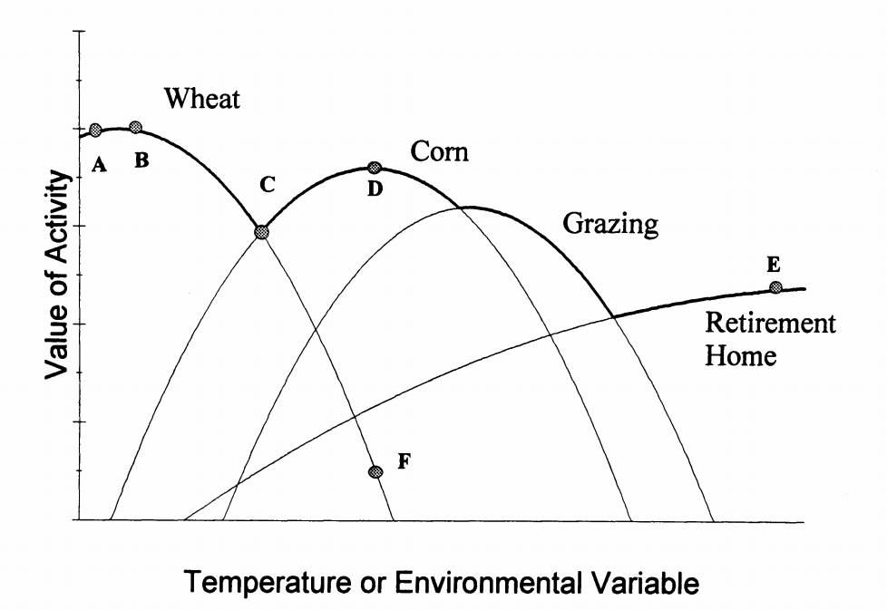
```
</div>

Main idea: Compare *farmland values* in areas with different climates, conditional on other relevant variables

--

Why farmland values instead of profits or production?

--

What do farmland values tell us?

---

# Mendelsohn, Nordhaus, Shaw (1994)

The value of land is the .hi-blue[present value of the expected stream of profits] that can be obtained from that land (Hedonics-eqsue argument!)

--

That means farmland values internalize expected future climate impacts and expected future farmer behavior on the land like crop switching, input substitution, irrigation, etc

--

Why focus on agriculture?

--

1. Agriculture is expected to be very climate sensitive
--

2. Lots of good data relative to other sectors (for 1994)

---

# Mendelsohn, Nordhaus, Shaw (1994): Data

Ag data: 1982 Census of Agriculture

Climate data: 30 year average temperature and precipitation (normal) from 1951-1980

Socio-economic data

Soil data

---

# Mendelsohn, Nordhaus, Shaw (1994): Estimation

$$ \text{farmland value}_i = \alpha + \mathbf{\beta} \cdot \textbf{climate vars}_i  + \mathbf{\gamma} \cdot  \textbf{controls}_i + \varepsilon_i $$

--

We are interested in $\mathbf{\beta}$ which tells us the .hi-blue[average marginal effect of changes in climate variables]: $\frac{\partial \text{farmland value}_i}{\partial \textbf{climate vars}_i}$

--

Key assumption for $\beta$ to be estimated correctly/unbiased:

--

$$\text{correlation}\left(\textbf{climate vars}_i, \varepsilon_i \right) = 0$$

--

Climate must be uncorrelated with omitted variables (conditional on controls), .hi[no omitted variable bias] -- examples later


---

# Mendelsohn, Nordhaus, Shaw (1994)

<center>
```{r, out.width = "500px", echo = FALSE}
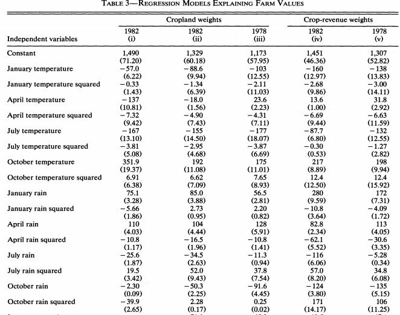
```
</center>

Data are weighted either by cropland or crop-revenue

Results are pretty sensitive to this choice: cropland weights

---

# Mendelsohn, Nordhaus, Shaw (1994)

<center>
```{r, out.width = "575px", echo = FALSE}
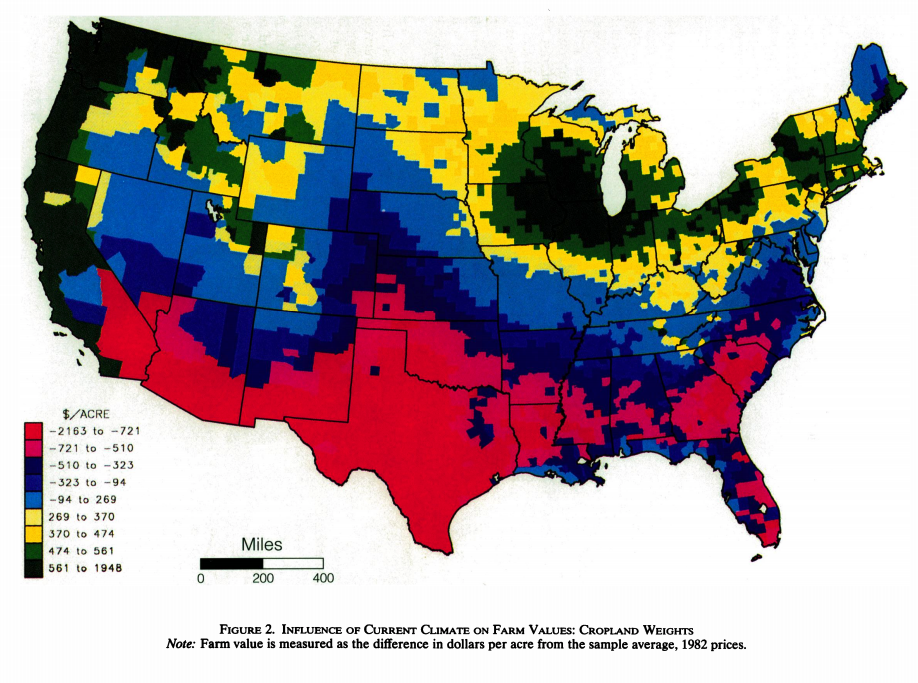
```
</center>

The value of current climate for farmland across the US

---

# Mendelsohn, Nordhaus, Shaw (1994)

<center>
```{r, out.width = "575px", echo = FALSE}
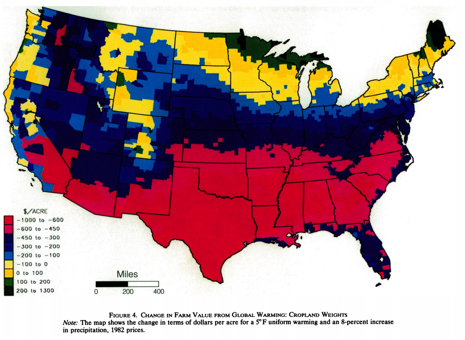
```
</center>

The value of $5^\circ$C of warming and 8% increase in precipitation under farmland weighting

---

# Mendelsohn, Nordhaus, Shaw (1994)

<div style= "float:right;position: relative;">
```{r, out.width = "575px", echo = FALSE}
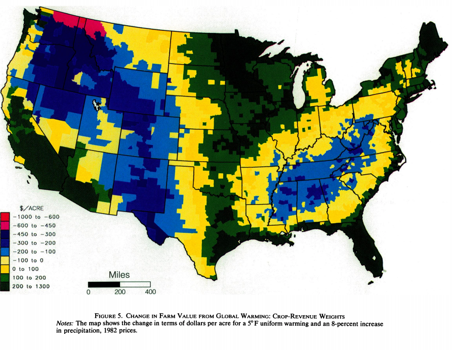
```
</div>

The value of $5^\circ$C of warming and 8% increase in precipitation under crop-revenue weighting

This shows a very different story because crop-revenue weights put more emphasis on irrigated land and products which will likely do better under a warmer, more humid climate

---

# Mendelsohn, Nordhaus, Shaw (1994)

<center>
```{r, out.width = "700px", echo = FALSE}
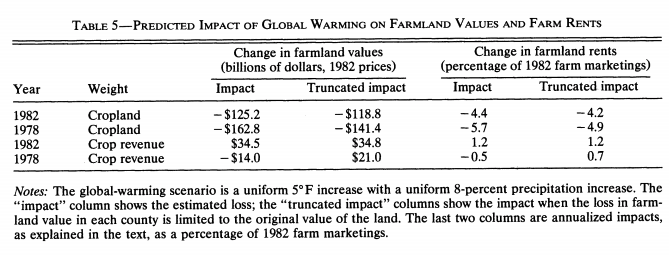
```
</center>

Results are pretty different depending on weighting

.hi-red[Overall takeaway:] climate change could be moderately bad (4-6% losses), or mildly positive


---

# Cross-section issues

Should we believe these results? Why or why not?

--

Remember the .hi-red[key assumption:] climate is uncorrelated with omitted variables conditional on controls

--

This is .hi[very] unlikely to hold in the cross-section

--

What else varies across space similarly to temperature?

--

Ozone, wealth, other productive uses of land besides agriculture, lots of things

---

# Ortiz-Bobea (2019)

<div style= "float:right;position: relative;">
```{r, out.width = "705px", echo = FALSE}
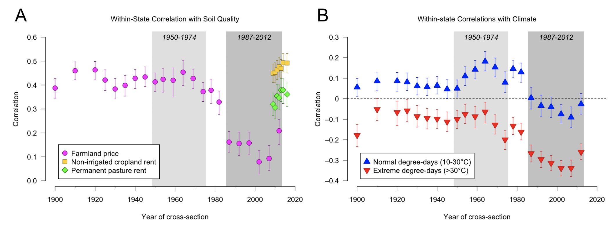
```
</div>

--

Since 1900, correlations between farmland values and soil quality and measures of climate are decreasing

--

This indicates that there are other major factors influencing farmland values

--

What could be driving this?

---

# Ortiz-Bobea (2019)

<div style= "float:right;position: relative;">
```{r, out.width = "600px", echo = FALSE}
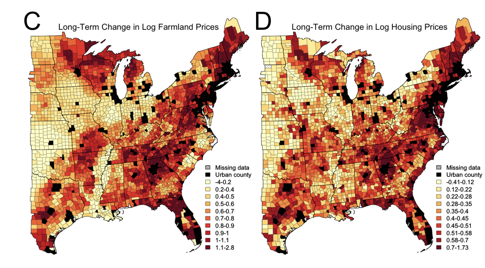
```
</div>

Big increases in farmland value in weird places (Ozark and Appalachin Mountains, Vermont, upper Minnesota)

--

Strong correlation between changes in farmland values and changes in housing values

--

This points to demand for land for non-farm purposes (vacation homes!) as a primary driver of farmland values

---

# Ortiz-Bobea (2019)

So demand for non-farm purposes appears to affect farmland value

--

Why is this a problem for estimating the effects of climate change?

--

People's demand for housing is a function of climate

--

Demand for housing is in $\varepsilon_i$ since it affects farmland values

--

$\rightarrow$ .hi-red[our key assumption is violated]

--

Estimates may be biased up or down depending on how housing demand depends on climate

---

# The problem with cross-sectional approaches

The big issue with cross-sectional approaches is that there are .hi[A LOT] of time-invariant variables we don't have data for

--

These will be inside $\varepsilon_i$ and many of them may be correlated with climate, so we need to control for them

--

It is difficult to control for lots and lots of variables in the cross-section so this approach has fallen out of favor in recent years

---

# The problem with cross-sectional approaches

Example: effect of climate on global mortality

--

Very hot and very cold temperatures are both bad for mortality, what's the overall effect of climate change?

--

Problems:

Climate is spatially correlated with economic development: countries in cooler climates are generally richer, have more safety net policies, etc
--

  - Comparing in the cross-section will .hi[overstate] the effect of climate change on mortality: countries in cooler climates are healthier because they're rich, not only because their climate is cooler

---

# The problem with cross-sectional approaches

Example: effect of climate on global mortality

--

Problems:

Very hot and very cold temperatures are both bad for mortality, what's the overall effect of climate change?

Will not account for adaptation: mortality doesn't capture expected future outcomes like farmland values do, people will migrate, buy air conditioning, etc
--

 - Comparing in the cross-section will .hi[overstate] the effect of climate change: we are ignoring the possibility of adaptation
 
 
---

# The problem with cross-sectional approaches

Example: effect of climate on crop yields

--

Problems:

Very hot temperatures are bad for yields

In the short run, farmers can irrigate their crops using groundwater, 
--
in the long run this water might not exist

--

 - Comparing in the cross-section will .hi[understate] the effect of climate change: we are ignoring the fact that we can't draw upon groundwater forever

---

# Panel approaches to estimation

How can we find a way to handle all these possible omitted variables?

--

Use .hi[panel/longitudinal data]: data where you have a .hi-blue[time series] of data for each person, country, etc over time

--

Why does this help?

--

Having multiple observations of each person/country/etc allows us to better control for large sets of variables for which we might not have data

--

How? Let's find out

---

# Panel approaches to estimation

Suppose that the true relationship for climate change on farmland value is
$$\text{farmland value}_{it} = \textbf{time invariant vars}_i\cdot\alpha + \\ \textbf{climate vars}_{it}' \cdot \mathbf{\beta} + \textbf{controls}_{it}' \cdot \mathbf{\gamma} + \varepsilon_{it}$$

It is the same as before but now we have observations for each county $i$ and year $t$

--

We also broke out the .hi-blue[entire] set of variables that are specific to each county $i$, but *do not vary over time*: $\text{time invariant vars}_i$

--

We are going to show how to control for .hi[all] of these in a simple way

---

# Panel approaches to estimation

What we can do is estimate this using an approach called .hi-blue[fixed effects]

--

This effectively demeans all the data .hi[within each i] 
--
(for each location $i$, subtract the mean within $i$ across $t$ off each $it$ observation)
--
, let bars indicate means within $i$
--
, demeaning gives us:
$$\text{farmland value}_{it} - \overline{\text{farmland value}}_{it} = \\
(\textbf{time invariant vars}_i' - \overline{\textbf{time invariant vars}_i}')\cdot\alpha + \\
(\textbf{climate vars}_{it}' - \overline{\textbf{climate vars}_{it}}') \cdot \mathbf{\beta} + \\
(\textbf{controls}_{it}' - \overline{\textbf{controls}_{it}}') \cdot \mathbf{\gamma} + \varepsilon_{it}$$

---

# Panel approaches to estimation

Remember: $\text{time invariant vars}_i$ does not vary over time

--

This means that when we average within $i$, we have that $$\overline{\textbf{time invariant vars}_i} = \textbf{time invariant vars}_i$$

--

It falls out of the estimating equation!

--

This is why this approach is called .hi-blue[fixed effects:] we can control for anything 'fixed' (i.e. time-invariant) within $i$ by demeaning the data within $i$

---

# Panel approaches to estimation

$$\text{farmland value}_{it} - \overline{\text{farmland value}}_{it} = \\
(\textbf{climate vars}_{it}' - \overline{\textbf{climate vars}_{it}}') \cdot \mathbf{\beta} +
(\textbf{controls}_{it}' - \overline{\textbf{controls}_{it}}') \cdot \mathbf{\gamma} + \varepsilon_{it}$$

What does this mean?

--

.hi-red[All] variables that are time-invariant within a county over time are implicitly controlled for when we demean the data!

This means we do not need to explicitly control for time-invariant things like soil quality, elevation, average sunlight, etc for which we might not have data

---

# Panel approaches to estimation

We re-write the equation by including county fixed effects $\mathbf{\alpha_i}$

$$\text{farmland value}_{it} =
\mathbf{\alpha_i} + \textbf{climate vars}_{it}' \cdot \mathbf{\beta} +
\textbf{controls}_{it}' \cdot \mathbf{\gamma} +  \varepsilon_{it}$$

where $\alpha_i$ is a dummy variable equal to 1 for county $i$ and 0 otherwise


--

Since $\alpha_i$ is always the same for county $i$ no matter which year $t$, it effectively controls for all things in county $i$ that are not changing over time, $\textbf{time invariant vars}_i'$, just like demeaning the data

--

Mathematically, it just gives each county $i$ its own intercept term $\mathbf{\alpha_i}$

---

# Panel approaches to estimation

Notice that there's nothing special about doing this with respect to $i$

--

We could easily do this with respect to $t$ for variables that are changing over time but are common across all counties so there is no $i$ index

$$\text{farmland value}_{it} = \textbf{common vars}_t' \cdot\alpha + \\
\textbf{climate vars}_{it}' \cdot \mathbf{\beta} + \textbf{controls}_{it}' \cdot \mathbf{\gamma} + \varepsilon_{it}$$
--

Take the average of the all the variables within a given year $t$ (across all counties), and then demean the variables

---

# Panel approaches to estimation

$$\text{farmland value}_{it} - \overline{\text{farmland value}}_{it} = \\
(\textbf{common vars}_t' - \overline{\textbf{common vars}_t}')\cdot\alpha + \\
(\textbf{climate vars}_{it}' - \overline{\textbf{climate vars}_{it}}') \cdot \mathbf{\beta} + \\
(\textbf{controls}_{it}' - \overline{\textbf{controls}_{it}}') \cdot \mathbf{\gamma} + \varepsilon_{it}$$

where now the bar indicates the average within each year $t$

--

Similar to before, $\textbf{common vars}_t' = \overline{\textbf{common vars}_t}$ since these variables are not changing within a given $t$

---

# Panel approaches to estimation

This gives us:
$$\text{farmland value}_{it} - \overline{\text{farmland value}}_{it} = \\
(\textbf{climate vars}_{it}' - \overline{\textbf{climate vars}_{it}}') \cdot \mathbf{\beta} +
(\textbf{controls}_{it}' - \overline{\textbf{controls}_{it}}') \cdot \mathbf{\gamma} + \varepsilon_{it}$$

This is the same idea as when we demeaned within each county $i$ so its equivalent to each year having its own intercept:
$$\text{farmland value}_{it} =
\mathbf{\eta_t} + \textbf{climate vars}_{it}' \cdot \mathbf{\beta} +
\textbf{controls}_{it}' \cdot \mathbf{\gamma} +  \varepsilon_{it}$$

where $\mathbf{\eta_t}$ is called a year fixed effect

---

# Panel approaches to estimation

What does this mean?

--

.hi-red[All] variables that are invariant across all counties within a year are implicitly controlled for when we demean the data

--

What does this control for?

--

Recessions, the current president, nationwide ag policy, etc

--

This effectively gives each .hi[year] $t$ its own unique intercept $\mathbf{\eta_t}$

---

# Two way demeaning: fixed effects

Key thing: we can have fixed effects for $i$ and $t$ at the same time to simultaneously control for:
1. Variables that are constant within a county over time
2. Variables that are constant across counties within a given year

$$\text{farm outcome}_{it} =
\mathbf{\alpha_i} + \mathbf{\eta_t} + \textbf{climate vars}_{it}' \cdot \mathbf{\beta} +
\textbf{controls}_{it}' \cdot \mathbf{\gamma} +  \varepsilon_{it}$$

--

This implicitly controls for A LOT of variables

--

What's left 'omitted' that can cause us problems with estimating the effects of climate change?

---

# Two way demeaning: fixed effects

What's left 'omitted' that can cause us problems with estimating the effects of climate change?

--

Only variables that are changing both within a county .hi-red[AND] over time

--

This is the norm for panel regressions in applied economics (although you can't do this with farmland values)

---

# Two way demeaning: fixed effects

Note that you can't have a fixed effect with respect to $i$ **and** $t$ here

--

e.g. $\omega_{it}$, a county-by-year fixed effect

--

A county-by-year fixed effect controls for all things that are time-invariant within a county-year (e.g. things not changing in Tompkins County in 2019)

--

Our data only vary at the county-year level

--

A county-by-year fixed effect would control for everything on which we have data: we can't actually estimate anything

---

# Alternative explanation for FE in climate economics

What's the "gold standard" for estimating causal effects?

--

Randomized control trials

--

Suppose we have a group of 100 people and want to know the effect of a drug on hypertension

We randomly assign 50 people to get treatment (e.g. drugs), and the other 50 people are controls (e.g. no drugs)

---

# Alternative explanation for FE in climate economics

Since we randomly assigned treatment, both groups should be identical .hi-blue[on average]

--

The difference we see between the two groups in average hypertension outcomes after the drug treatment can be attributed to the drug

--

.hi[Randomization] is key for estimating the effect of different kinds of treatments

---

# Alternative explanation for FE in climate economics

Is climate random from our (the economist's) perspective?

--

No!

--

People move to specific climates because of tastes

--

Farmers select crops that are suitable to grow in their current climate

--

Tourist economies are selected to be in specific climates


---

# Alternative explanation for FE in climate economics

Is weather random from our (the economist's) perspective?

--

Sort of: Randomness comes from weather being a random variable drawn from $\psi(C_{it})$

--

$i$: We know Ithaca's generally cold in January and warm in July

--

But in Ithaca in January, *there's some randomness in how cold it is, given the climate $C_{it}$*

---

# Alternative explanation for FE in climate economics

$t$: We know the climate is generally getting warmer across the earth

--

But in any given year, *there's some randomness in global temperature, given the climate $C_{it}$*

---

# As good as random weather

If we demean the data to control for time-invariant climate features of a county $i$, and trends in climate $t$ what are we estimating the effect of?

--

Deviations in weather from average weather

--

We might think these are as good as random

--

When farmers decide to plant in spring, they can't predict deviations from average weather during the growing season

--

They appear to be effectively random

---

# Weather vs climate

If weather is random, then we can estimate the .hi-blue[marginal effect of weather] $c_{it}$

--

Does this help us understand the marginal effect of climate $C_{it}$?

--

A reasonable guess is that the effect of weather provides an upper bound on the effect of climate change

--

Why?

---

# Weather vs climate

Climate change is a long-run phenomenon: in the long-run we can adapt

--

Farmers can switch crops, people can migrate, households can install air conditioning

--

These actions aren't possible on a day to day basis

--

Estimating the effect of weather is useful then, it tells us how bad climate change might be

---

# Deschenes and Greenstone

This 'random weather' approach was used by Deschenes and Greenstone (2007) to estimate the effect of weather on .hi[farm profits]

$$\text{farm profits}_{it} =
\mathbf{\alpha_i} + \mathbf{\eta_t} + \textbf{climate vars}_{it}' \cdot \mathbf{\beta} +
\textbf{controls}_{it}' \cdot \mathbf{\gamma} +  \varepsilon_{it}$$

--

Why profits?

--

Because farmland values shouldn't change in response to random annual weather shocks (since they're random and transient, not permanent changes)


---

# Deschenes and Greenstone: cross-section

DG shows why the cross-sectional approach doesn't cut it, the estimated effects are very sensitive to controls, sample
<center>
```{r, out.width = "700px", echo = FALSE}
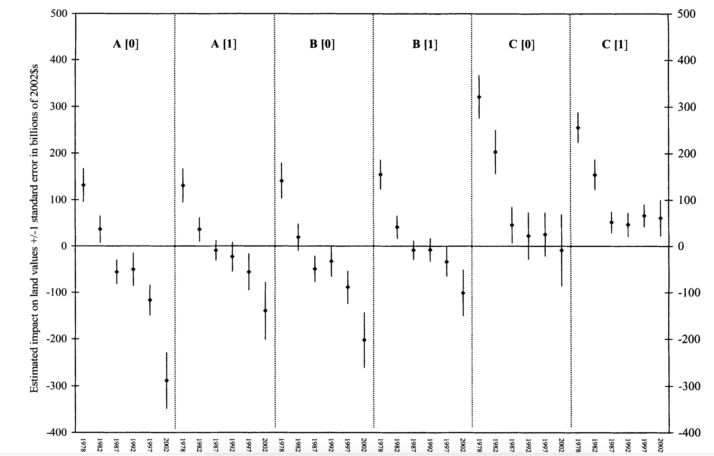
```
</center>

---

# Deschenes and Greenstone: panel

DG use .hi-blue[degree days] to capture climate: the sum of daily average temperature during the growing season

<center>
```{r, out.width = "600px", echo = FALSE}
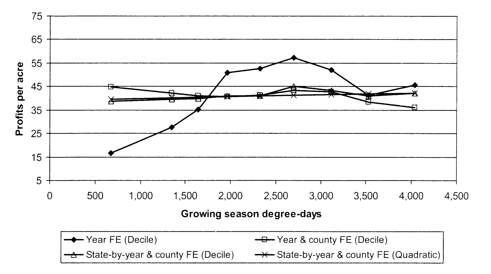
```
</center>

Main takeaway: little effect of climate change!

---

# Deschenes and Greenstone: panel

<div style= "float:right;position: relative;">
```{r, out.width = "575px", echo = FALSE}
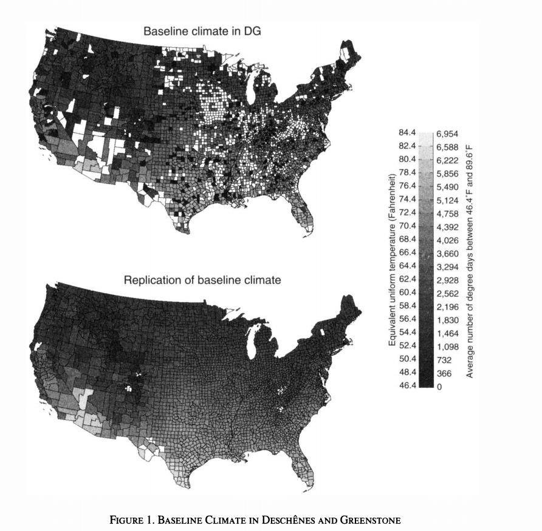
```
</div>

This is super surprising right?

--

It should be

--

In the short run, we'd think very hot weather would be bad for crops

--

We'd expect farmers have little ability to adapt to (randomly) hot weather during the growing season

---

# Deschenes and Greenstone: panel

<div style= "float:right;position: relative;">
```{r, out.width = "575px", echo = FALSE}

```
</div>


In the long run, it would be less surprising to find little effect since farmers can change crops or add irrigation if its persistently hot

--

Turns out this result is because of a massive data error and too liberal use of fixed effects

--

.hi-blue[Moral of the story:] data cleaning is the most important part of research, be extremely careful

---

# Burke, Hsiang, Miguel (2015)

BHM 2015 is one of the most influential papers in this area

--

What do they do?

--

Regress GDP growth on annual average temperature $T_{it}$:
$$\text{GDP Growth}_{it} = \beta_1 T_{it} + \beta_2 T_{it}^2 + \gamma \text{controls}_{it} + \text{Country FEs} + \text{Year FEs} + \varepsilon_{it}$$

--

The $\beta_1$ and $\beta_2$ terms allows for temperature to have a .hi[non-linear] effect on growth


---

# Burke, Hsiang, Miguel (2015)

.pull-left[

Growth has an inverse-U shaped relationship with temperature

"Optimal" temperature is around $13^\circ$C

This is about where the US, Japan, and China are

Europe is colder, Africa and much of Asia are warmer

]

.pull-right[
```{r, out.width = "650px", echo = FALSE}
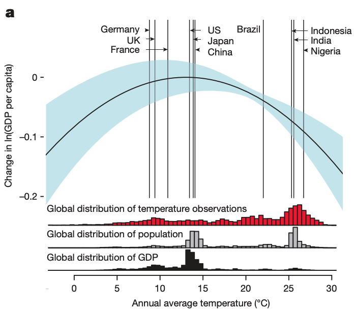
```
]

---

# Burke, Hsiang, Miguel (2015)

.pull-left[

Temperature has stronger effects on poor countries

Agriculture is a major factor in the effect of temperature on growth

Especially in poor countries (below median GDP)

]

.pull-right[
```{r, out.width = "525px", echo = FALSE}
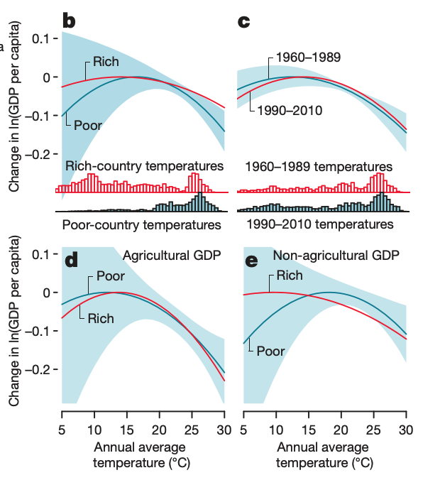
```
]

---

# Burke, Hsiang, Miguel (2015)

.pull-left[

Along RCP 8.5 (very high end of warming):

Most countries have major losses in GDP/capita

Canada, Europe, Russia tend to be better off

]

.pull-right[
```{r, out.width = "900px", echo = FALSE}
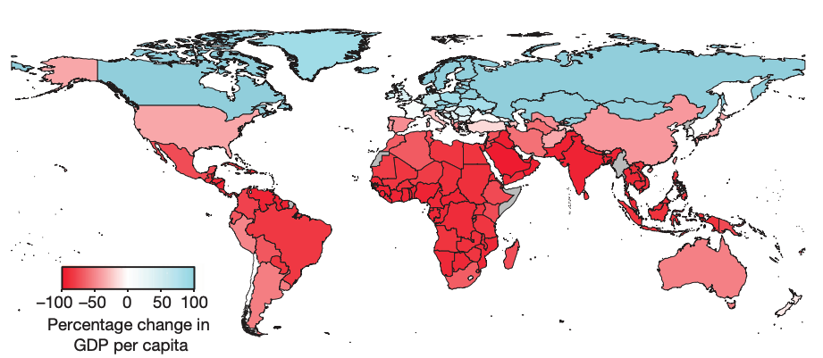
```
]

---

# Burke, Hsiang, Miguel (2015)

.pull-left[

Lots of uncertainty in the areas that gain

Some predictions are kind of nuts: South Asia and Sub-Saharan Africa lose virtually all GDP

Why might this not be believable?

]

.pull-right[
```{r, out.width = "550px", echo = FALSE}
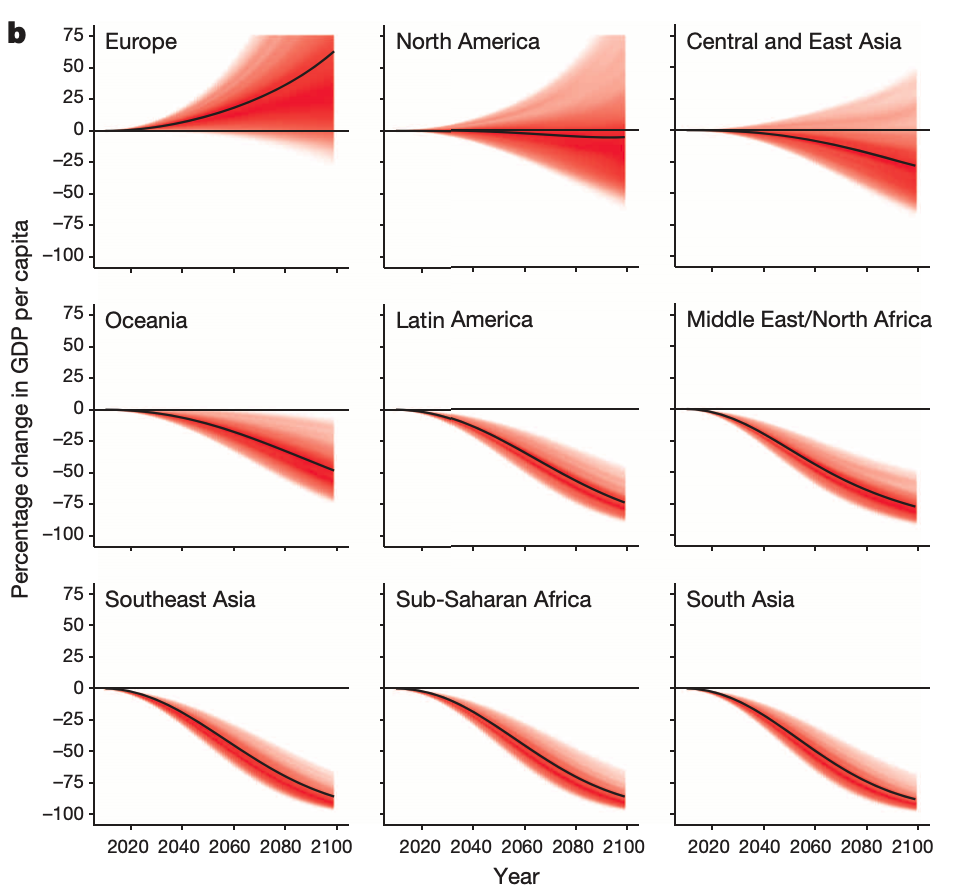
```
]

---

# Burke, Hsiang, Miguel (2015)

.pull-left[

Warming is highly regressive

The estimates from this paper are .hi-blue[much] larger than what comes out of the benchmark .hi[integrated assessment models] (more later)

]

.pull-right[
```{r, out.width = "600px", echo = FALSE}
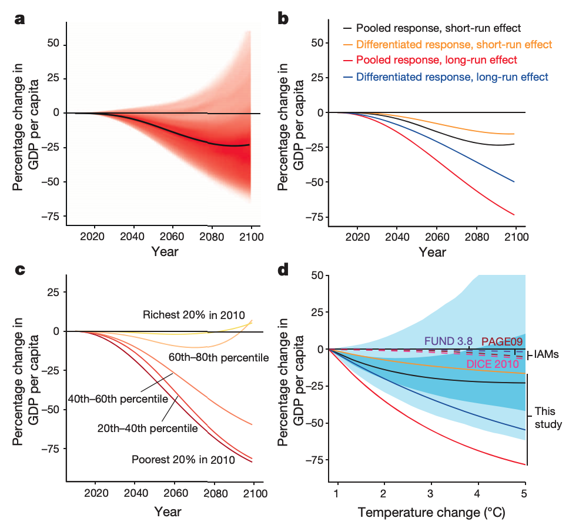
```
]


---

# Burke, Hsiang, Miguel (2015)

Now let's actually play with their data

```{r}
df <- read_csv("data/14-bhm.csv")
```

---

# Burke, Hsiang, Miguel (2015)

```{r}
df
```

---

# Burke, Hsiang, Miguel (2015)

Let's run their same regression using `fixest::feols`

--

`fixest::feols` works the same as `lm`, but we have another piece of the formula that is explicitly for fixed effects: 

`dependent variable ~ independent variables | fixed effects`


---

# Burke, Hsiang, Miguel (2015)

BHM's formula is:

`gdp_growth ~ temp + temp^2 + precip + precip^2 | 
                country + year + country[year] + country[year^2]`

Note BHM include `country[year]`, a .hi[country time trend]

We haven't discussed this much but it accounts for all variables that are trending *linearly* over time in each country

---

# Burke, Hsiang, Miguel (2015)

```{r bhm reg}
fixest::feols(gdp_growth ~ temp + temp^2 + precip + precip^2 | 
                country + year + country[year] + country[year^2], 
              df)
```


---

# Burke, Hsiang, Miguel (2015)

```{r}
reg_out <- fixest::feols(gdp_growth ~ temp + temp^2 + precip + precip^2 | 
                country + year + country[year] + country[year^2], 
              df) %>% broom::tidy()
reg_out
```

Optimal temperature is $-\beta_1/(2\beta_2) \approx 13^\circ$C


---

# Burke, Hsiang, Miguel (2015)

Let's plot the response function and see what we've got

```{r}
# Generate points to plot
points <- tibble(
  # make grid of x's from -3 to 30 degrees
  x = seq(-3, 30, .1),
  # effect on growth is given by: beta1*x + beta2*x^2
  y = reg_out$estimate[1]*x + reg_out$estimate[2]*x^2, 
) %>% 
  mutate(y = y - max(y)) # shift down so optimal temperature is at zero

# plot the change in growth
plot <- ggplot(points, aes(x = x, y = y)) +
  geom_line(size = 0.5) +
  theme_regular +
  labs(x = "Annual average temperature",
       y = "GDP growth per capita\nrelative to optimum")
```
---

# Burke, Hsiang, Miguel (2015)

Let's plot the response function and see what we've got

.center[
```{r, echo = F, dev = "svg", fig.height = 4.5, fig.width = 8}
plot
```
]
---

# Identifying climate from weather

Are there cases where the effect of a change in weather tells us the effect of a change in climate?

--

Recall, climate affects outcomes through two channels:

--

1. .hi-red[Direct effect:] The climate during $\tau$ affects the actual weather realizations $\mathbf{c}$ which affects the economy
2. .hi-blue[Belief effect:] Beliefs $\mathbf{b}$ about $\mathbf{C}$ can affect decisions and economic outcomes regardless of what $\mathbf{c}$ actually happens

---

# Identifying climate from weather

If there are situations where belief effects are approximately zero,  
then marginal effect of weather $=$ marginal effect of climate

--

Suppose we're considering a farmer who's maximizing profit:

--

$$\pi_t(x_t; C_t) = \max_{x_t} \mathbb{E}_t \left\{ p^o_t [\alpha(C_{t}) \, x_t(C_t)] - p^i_t x_t(C_t)^2/2  \right\}$$

where $\pi_t(x_t; C_t)$ is maximized expected profit, $x_t(C_t)$ is how many acre are planted as a function of the expected climate, $p^o_t$ is the output price, $p^i_t$ is the input price, and $\alpha(C_{t})$ is how climate affects output

---

# Identifying climate from weather

Suppose we're considering a farmer who's maximizing profit:
$$\pi_t(x_t; C_t) = \max_{x_t} \mathbb{E}_t \left\{ p^o_t [\alpha(C_{t}) \, x_t(C_t)] - p^i_t x_t(C_t)^2/2  \right\}$$

--

Let $x^*_t(C_t)$ be the optimal choice of $x_t$ given some climate $C_t$ (i.e. the solution to the maximization problem)

--

We can re-write the problem as:
$$\pi_t(x^*_t; C_t) = \mathbb{E}_t \left\{ p^o_t [\alpha(C_{t}) \, x_t^*(C_t)] - p^i_t x_t^*(C_t)^2/2  \right\}$$

--

Now differentiate with respect to $C_t$

---

# Identifying climate from weather

Differentiate with respect to $C_t$:
$$\frac{d \pi_t}{d C_t} =
\mathbb{E}_t \left\{p^o_t \left[\frac{d\alpha(C_{t})}{d C_t} \, x_t^*(C_t) + \alpha(C_{t}) \frac{d x_t^*(C_t)}{d C_t}\right] - p^i_t x_t^*(C_t) \frac{d x_t^*(C_t)}{d C_t}  \right\}$$

--

Collect terms into direct effects and belief effects:

--

$$\frac{d \pi_t}{d C_t} =
\mathbb{E}_t \left\{p^o_t \frac{d\alpha(C_{t})}{d C_t} \, x_t^*(C_t) +
\left[ p^o_t \alpha(C_{t}) - p^i_t x_t^*(C_t) \right] \frac{d x_t^*(C_t)}{d C_t}  \right\}$$

--

The first term is the .hi-red[direct effect] while the second is the .hi-blue[belief effect]

---

# Identifying climate from weather

What does the firm's profit-max FOCs tell us about the direct effect?

--

From the firm's profit maximization problem, 
$$\left[ p^o_t \alpha(C_{t}) - p^i_t x_t^*(C_t) \right] = \frac{d\pi(x_t)}{dx} = 0 \text{ at } x^*_t$$

--

This gives us that
\begin{align}
  \frac{d \pi_t}{d C_t} =&
  \mathbb{E}_t \left\{p^o_t \frac{d\alpha(C_{t})}{d C_t} \, x_t^*(C_t) +
  \left[ p^o_t \alpha(C_{t}) - p^i_t x_t^*(C_t) \right] \frac{d x_t^*(C_t)}{d C_t}  \right\}
   \notag\\
  =&\mathbb{E}_t \left\{p^o_t \frac{d\alpha(C_{t})}{d C_t} \, x_t^*(C_t) \right\} \notag
\end{align}

---

# Identifying climate from weather

\begin{align}
  \frac{d \pi_t}{d C_t} = \mathbb{E}_t \left\{p^o_t \frac{d\alpha(C_{t})}{d C_t} \, x_t^*(C_t) \right\} \notag
\end{align}

All that's left is the .hi-red[direct effect!]

--

This is an application of the **Envelope Theorem**

--

Envelope Theorem:
> The marginal effect of a parameter (climate) on an optimized objective (profit) is only composed of its direct effect and not secondary effects through changes in choice variables (belief effect)

---

# Envelope theorem

Why is the envelope theorem useful?

--

The direct effect of climate is .hi[just the effect of weather]

--

For outcomes that are optimized objectives, the marginal effect of weather is equivalent to the marginal effect of climate!

--

This helps us better pin down the effects of climate change on a subset of interesting outcomes on which we may have data:

--

1. Firm profits
2. Ag land values (discounted stream of profits)
4. Income

---

# Deryugina and Hsiang

<div style= "float:right;position: relative;">
```{r, out.width = "575px", echo = FALSE}
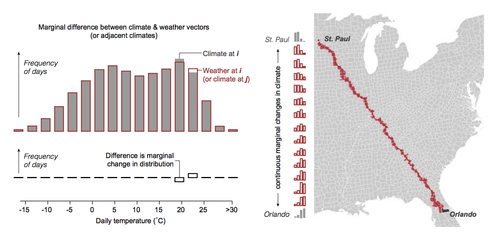
```
</div>

If we have the marginal effect of climate change, we can integrate across climates to get the .hi-blue[total effect of climate change]

--

The left hand side shows the variation that allows us to estimate the marginal effect of climate change

.grey[Gray:] The actual climate (average weather distribution)  
.red[Red:] Weather as drawn from the distribution of climate  
.blue[Difference:] Deviations from average

---

# Deryugina and Hsiang

<div style= "float:right;position: relative;">
```{r, out.width = "575px", echo = FALSE}

```
</div>


The right side shows us how we can estimate the effect of non-marginal changes in climate:
we integrate (sum) over marginal changes in climate

--

If we want to know what happens to St. Paul with Orlando's climate we just add up all the marginal effects for climates along the way (red)

---

# Integrated assessment

Integrated assessment is the combination of both economic and climate models

The most famous integrated assessment model (IAM) is Bill Nordhaus' Dynamic Integrated Climate Economy (DICE) model

<center>
```{r, out.width = "900px", echo = FALSE}
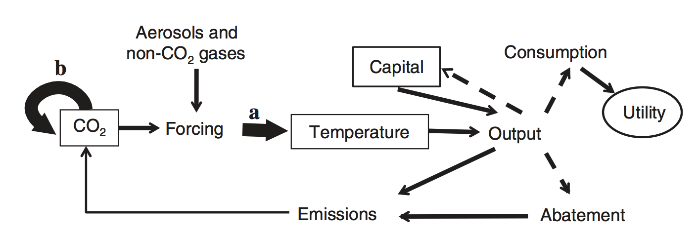
```
</center>


---

# Integrated assessment

Why do we need integrated assessment models?

--

So we can compute the .hi-blue[social cost of carbon (SCC):]
the present value of the marginal damage caused by an extra ton of $CO_2$ along a given economic trajectory

---

# Integrated assessment

We compute the SCC at time $t$ in a three step procedure:
1. Take a baseline economy (trajectories of emissions, consumption, temperature, etc)
2. Take this baseline and then increase $CO_2$ emissions at some time $t$ by 1 ton
3. Compute the SCC at time $t$ as the difference in present value of the sum of damage after time $t$ between 1. and 2.

---

# Integrated assessment

The baseline economy can be anything you want, business as usual, an optimal economy, whatever

--

The social cost of carbon is defined for any particular future trajectory

--

.hi-red[Key:] the social cost of carbon along the optimal trajectory will also be the socially optimal carbon tax

---

# Integrated assessment


The social cost of carbon depends on what we believe the economy and climate will be doing in the future

--

Consider two possible futures: high economic growth and low economic growth

--

The lower economic growth world is poorer $\rightarrow$
we should save more for the future

--

One way we can save for the future is by *avoiding the accumulation $CO_2$*

--

If we think of the environment as an asset we are saving for the future by preserving/saving environmental quality

---

# Integrated assessment: economic module

We have iso-elastic utility: $U(c_t) = c_t^{1-\eta}/(1-\eta)$

--

We store wealth as capital $K_t$ and it can accumulate over time through investment,
it also depreciates over time: $K_{t+1} = (1-\delta)K_t + I_t$

--

We produce output $Y_t$ using a Cobb-Douglas production function: $Y_t = A_t K_t^\alpha L_t^{1-\alpha}$ where $A_t$ measures productivity and $L_t$ is labor

--

The production process generates industrial emissions $E_t$ as a by-product which go into the atmospheric $CO_2$ stock $M^a_t$

---

# Integrated assessment: climate module

There are also exogenous non-industrial emissions $B_t$ (e.g. land-use change) that enter the atmospheric $CO_2$ stock $M^a_t$

Net emissions are $e_t = (1-\alpha_t)E_t + B_t$ where $\alpha_t \in [0,1]$ is the percent of industrial emissions abated

---

# Integrated assessment: climate module

There are three different $CO_2$ stocks: atmosphere $M^a_t$, upper ocean $M^u_t$, and lower ocean $M^l_t$

$CO_2$ can move according to the following linear system:
$$
\begin{bmatrix}
  M^{a}_{t+1} \\ M^{u}_{t+1} \\ M^{l}_{t+1}
\end{bmatrix}
=
\begin{bmatrix}
\phi_{11} & \phi_{21} & 0 \\
\phi_{12} & \phi_{22} & \phi_{32} \\
0 & \phi_{23} & \phi_{33}
\end{bmatrix}
\begin{bmatrix}
M^{a}_{t} \\ M^{u}_{t} \\ M^{l}_{t}
\end{bmatrix}
+
\begin{bmatrix}
e_t \\ 0 \\ 0
\end{bmatrix}
$$

$CO_2$ in the atmosphere can be exchanged with the upper ocean  
The opper ocean can exchange with the atmosphere and lower ocean  
The lower ocean can exchange only with the upper ocean  
Emissions only directly enter the atmosphere

---

# Integrated assessment: climate module

Atmospheric $CO_2$ traps heat and increases radiative forcing which is a function of the $CO_2$ stock and other exogenous forcers $EF_t$
$$F_{t}(M_{t}^{a}) = f_{2x} \, log_2(M_{t}^{atm}/M_{pre}) + EF_{t}$$

---

# Integrated assessment: climate module

Temperature at the surface of the earth $T^s_t$ and in the lower ocean $T^o_t$ is:
\begin{align}
T^s_{t+1} &= T^s_t + C_1 \left[F_{t+1}(M^{a}_{t+1}) - \frac{f_{2x}}{s}T^s_t + C_3 \left(T^o_t - T^s_t \right) \right] \notag\\
T^o_{t+1} &= C_4 \, T^s_t + (1-C_4)\,T^o_t
\end{align}

Surface temperature is a function of itself (first and third term), radiative forcing (second term), and heat transfer with the ocean (last term)

Ocean temperature is a convex combination of itself and surface temperature where $C_4$ determines how quickly the lower ocean warms

---

# Integrated assessment: climate-economy linkage

Surface temperature causes damages to production of output so that output net of damages is:
$$Y^n_t = \frac{Y_t}{1 + d_1 \, T_t^2}$$

--

Net output can be used for consumption, investment, and abatement
$$Y^n_t = c_t + I_t + Y^n_t G_t(\alpha_t)$$
where $G_t(\alpha_t)$ is the fraction of output spent on abatement


---

# Integrated assessment: web version

Plug and play version of the DICE model: [http://webdice.rdcep.org/](http://webdice.rdcep.org/)

Under the parameters tab you can simulate outcomes that optimize policy, choose a particular kind of carbon tax, or enforce a climate treaty

You can also change parameters (e.g. growth, sensitivity of climate to emissions, etc)