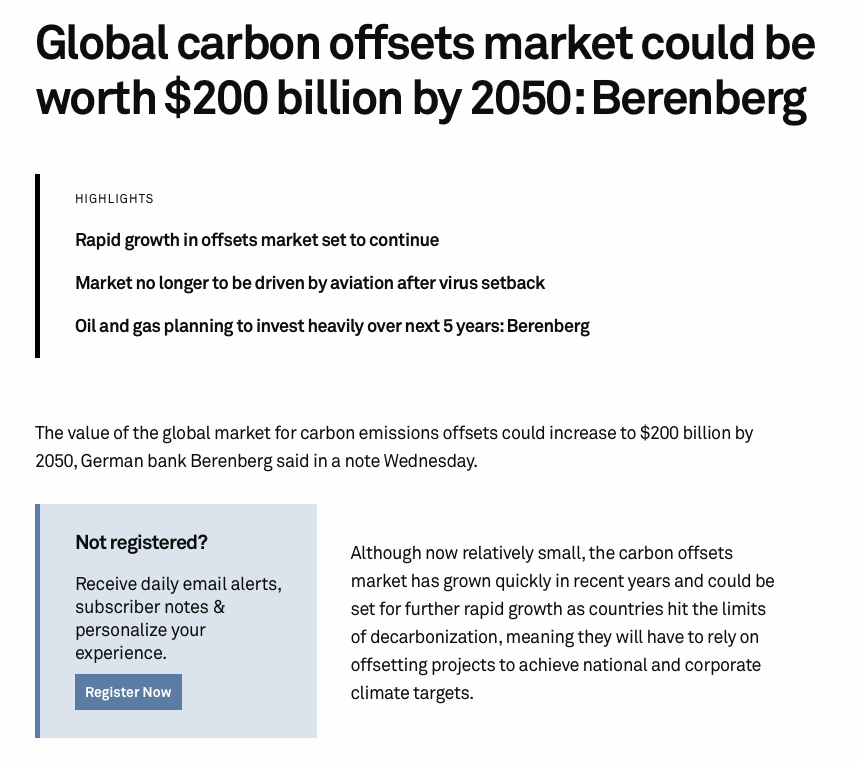

exclude: true 
```{r setup}
if (!require("pacman")) install.packages("pacman")
pacman::p_load(
  tidyverse, xaringanExtra, rlang, patchwork
)
options(htmltools.dir.version = FALSE)
knitr::opts_hooks$set(fig.callout = function(options) {
  if (options$fig.callout) {
    options$echo <- FALSE
  }
knitr::opts_chunk$set(echo = TRUE, fig.align="center")
  options
})
```
```{r xaringanExtra, echo = FALSE}
xaringanExtra::use_xaringan_extra(c("tile_view", "panelset", "webcam"))

```
```{r echo=FALSE}
xaringanExtra::style_panelset(panel_tab_color_active = "red")
```

---

# Roadmap

1. What are offsets?
2. What issues might they have?
3. How do they work in practice?

<!-- --- -->

<!-- class: inverse, center, middle -->
<!-- name: offsets -->

<!-- # How do we account for carbon? -->

<!-- <html><div style='float:left'></div><hr color='#EB811B' size=1px width=796px></html> -->

<!-- --- -->

<!-- # Carbon accounting -->

<!-- To measure the efficacy of different carbon policies and practices in the real world, we need a way to classify and add up emissions across firms -->

<!-- -- -->

<!-- The current standard is to use the .hi[Greenhouse Gas Protocol (GGP)] -->

<!-- -- -->

<!-- The GGP breaks emissions down into three .hi[scopes]: -->
<!-- - Scope 1: emissions from your own operations -->
<!-- - Scope 2: emissions from electricity you purchase -->
<!-- - Scope 3: emissions generated by your buyers or your suppliers -->

<!-- -- -->

<!-- Which ones really matter? -->

<!-- --- -->

<!-- # Carbon accounting -->

<!-- We will do our accounting using a simple .hi[input-output] model of the economy -->

<!-- -- -->

<!-- Our economy will have: -->
<!-- - $n$ different firms each producing one good -->
<!-- - each firm using a production process that is linear in inputs -->
<!-- - use of goods as inputs generating emissions -->

<!-- -- -->

<!-- The variables defining our economy are: -->

---

class: inverse, center, middle
name: offsets

# What are offsets?

<html><div style='float:left'></div><hr color='#EB811B' size=1px width=796px></html>

---

# What are offsets?

Governments and organizations have adopted ambitious carbon reduction goals
  - EU: net-zero by 2050
  - Microsoft: carbon-*negative* by 2030
  - Harvard: carbon-neutral by 2026
  
--

How can these goals be achieved?

--

These orgs can reduce their own emissions, 
--
or .hi[pay others] to reduce emissions to offset their own

--

These are called .hi[carbon offsets]


---

# What are offsets?

If you buy as many offsets as your total emissions, technically you are net-zero

--

Offsets are potentially a great idea, why?

--

Emissions reductions in the EU might be really expensive: we already did all the cheap carbon abatement
   
--

Other places haven't done much at all so there are still lots of low-cost opportunities

--

This can reduce costs since it doesn't really matter *where* we reduce carbon emissions


---

# Offset markets around the world


<div style= "float:right;position: relative;">
```{r, out.width = "575px", echo = FALSE}

```
</div> 

Offset markets are currently small but are expected to grow as countries march up their MAC curves

--

There are (at least) two big sets of carbon offsets:
- Forest carbon offsets
- Clean development mechanism


---

# Forest carbon offsets

How do forest carbon offsets work?

--

There's a person or group or owns some land (e.g. farmer, indigenous tribe, government, etc)

--

The group is paid by another organization to:
1. Preserve the forest they otherwise were going to cut down in the near future
2. Plant a forest on barren land

--

The avoided emissions from burned trees (1) or absorbed carbon (2) are the .hi[carbon offsets]

---

# Forest carbon offsets

.center[
```{r, out.width = "70%", fig.pos="l", echo = FALSE}

```
]

How much carbon can a tree absorb?

---

# Forest carbon offsets

*[...] studies have estimated an average American’s carbon footprint at around 16 tons of CO2 annually, one of the highest figures for any country because of the energy-intensive American lifestyle. A single mature tree, meanwhile, may take in about 50 pounds of carbon dioxide per year. At this rate, it would take 640 trees per person to account for all American emissions, which adds up to more than 200 billion trees.*

50 pounds per trees $\times$ 3 trillion trees $=$ 70 billion tons of carbon stored in trees

This is about 2 years worth of emissions

---

class: inverse, center, middle
name: offsets

# Potential issues with offsets

<html><div style='float:left'></div><hr color='#EB811B' size=1px width=796px></html>

---

# Challenges with offsets

What do you see as potential issues with carbon offsets?

--

.hi[Additionality:] the landowner would have preserved or planted the forest even in the absence of offset payments

--

.hi[Leakage:] preserving or afforesting one area leads to increased deforestation elsewhere

--

These (especially leakage) are challenges that arise with most environmental policies

---

# Challenges with offsets: additionality

Suppose we have a farmer growing corn

--

This farmer can convert $a$ acres of land to forest at some cost $PC(a)$

--

To keep things simple, 1 acre of land contains 1 unit of carbon

--

The private benefits of planting trees is $PB(a)$ (e.g. the farmer likes trees, trees help with soil degradation and retain moisture, other stuff)

--

The avoided carbon externalities is $EB(a)$ for total social benefits $SB(a) = PB(a) + EB(a)$

--

The farmer's optimal decision is given by the usual $PMB(a) = PMC(a)$


---

# Challenges with offsets: additionality


.pull-left[
```{r additionality, echo = FALSE, fig.show = 'hide', warning = F}
mb <- function(x) 2.5 - 2/3*x
pmb <- function(x) 2 - 2/3*x
md <- function(x) 1

dwl <- tibble(x = c(1.5, 3, 3),
                     y = c(1, 1, 0))
ggplot() +
  # geom_polygon(data = dwl, aes(x = x, y = y), fill = "red", alpha = 0.2) +
  annotate("text", x = 2, y = 0.4, label = "PMB", size = 8) +
  annotate("text", x = 1, y = 2.1, label = "SMB", size = 8) +
  # annotate("text", x = 2.5, y = 1.2, label = "PMC", size = 8) +
  annotate("text", x = 2.6, y = 1.2, label = "PMC", size = 8) +
  # annotate("text", x = 2.5, y = 0.7, label = "DWL", size = 8) +
  stat_function(fun = pmb, color = "#ca5670", size = 1.5) +
  stat_function(fun = mb, color = "black", size = 1.5) +
  stat_function(fun = md, color = "#638ccc", size = 1.5) +
  annotate("segment", x = 1.5, xend = 1.5, y = 0, yend = 1,
           linetype = "dashed", size = 1.5, color = "grey50") +
  annotate("segment", x = 2.25, xend = 2.25, y = 0, yend = 1,
           linetype = "dashed", size = 1.5, color = "grey50") +
  theme_minimal() +
  theme(
    legend.position = "none",
    title = element_text(size = 24),
    axis.text.x = element_text(size = 24), axis.text.y = element_text(size = 24, color = "#ffffff"),
    axis.title.x = element_text(size = 24), axis.title.y = element_text(size = 24),
    panel.grid.minor.x = element_blank(), panel.grid.major.y = element_blank(),
    panel.grid.minor.y = element_blank(), panel.grid.major.x = element_blank(),
    panel.background = element_rect(fill = "#ffffff",colour = NA),
    plot.background = element_rect(fill = "#ffffff",colour = NA),
    axis.line = element_line(colour = "black")
  ) +
  labs(x = "Acres Planted",
       y = "$") +
  scale_x_continuous(expand = c(0,0), limits = c(0,3.1), breaks = c(1.5, 2.25), labels = c(expression(A^'p'), expression(A^'*'))) +
  scale_y_continuous(expand = c(0,0), limits = c(0,3.1))

```

`)
]

.pull-right[

The farmer plants $A^p$

]


---

# Challenges with offsets: additionality

.pull-left[
  `)
]

.pull-right[
  
  The farmer plants $A^p$
  
  Now, suppose Microsoft offers to pay the farmer some amount of money to plant $A^o$ acres to avoid $A^o$ extra units of carbon
  
  To keep things simple suppose this payment is exactly the marginal external benefit $MEB(a)$
  
  What happens?

]


---

# Challenges with offsets: additionality


.pull-left[
```{r additionality2, echo = FALSE, fig.show = 'hide', warning = F}
#mb <- function(x) 2.5 - 2/3*x
pmb <- function(x) (2.5 - 2/3*x)*(x < .5) + (2 - 2/3*x)*(x > .5) 
md <- function(x) 1

dwl <- tibble(x = c(1.5, 3, 3),
                     y = c(1, 1, 0))
ggplot() +
  # geom_polygon(data = dwl, aes(x = x, y = y), fill = "red", alpha = 0.2) +
  annotate("text", x = 2, y = 0.4, label = "PMB", size = 8) +
  #annotate("text", x = 1, y = 2.1, label = "SMB", size = 8) +
  # annotate("text", x = 2.5, y = 1.2, label = "PMC", size = 8) +
  annotate("text", x = 2.6, y = 1.2, label = "PMC", size = 8) +
  # annotate("text", x = 2.5, y = 0.7, label = "DWL", size = 8) +
  #stat_function(fun = mb, color = "black", size = 1.5) +
  stat_function(fun = pmb, color = "#ca5670", size = 1.5) +
  stat_function(fun = md, color = "#638ccc", size = 1.5) +
  annotate("segment", x = 1.5, xend = 1.5, y = 0, yend = 1,
           linetype = "dashed", size = 1.5, color = "grey50") +
  annotate("segment", x = 2.25, xend = 2.25, y = 0, yend = 1,
           linetype = "dashed", size = 1.5, color = "grey50") +
  annotate("segment", x = 0.5, xend = 0.5, y = 0, yend = 1,
           linetype = "dashed", size = 1.5, color = "grey50") +
  theme_minimal() +
  theme(
    legend.position = "none",
    title = element_text(size = 24),
    axis.text.x = element_text(size = 24), axis.text.y = element_text(size = 24, color = "#ffffff"),
    axis.title.x = element_text(size = 24), axis.title.y = element_text(size = 24),
    panel.grid.minor.x = element_blank(), panel.grid.major.y = element_blank(),
    panel.grid.minor.y = element_blank(), panel.grid.major.x = element_blank(),
    panel.background = element_rect(fill = "#ffffff",colour = NA),
    plot.background = element_rect(fill = "#ffffff",colour = NA),
    axis.line = element_line(colour = "black")
  ) +
  labs(x = "Acres Planted",
       y = "$") +
  scale_x_continuous(expand = c(0,0), limits = c(0,3.1), breaks = c(0.5, 1.5, 2.25), labels = c(expression(A^'o'), expression(A^'p'), expression(A^'*'))) +
  scale_y_continuous(expand = c(0,0), limits = c(0,3.1))

```

`)
]

.pull-right[

If $A^o < A^*$ the new PMB function will look something like this

]


---

# Challenges with offsets: additionality


.pull-left[
`)
]

.pull-right[

If $A^o < A^*$ the new PMB function will look something like this

The farmer gets the additional payment for the $A^0$ acres, but the offset did not change the value of the .hi[marginal acre]

The offset payments did not actually increase forest planting at all: was not .hi[additional]

]


---

# Challenges with offsets: additionality


.pull-left[
```{r additionality3, echo = FALSE, fig.show = 'hide', warning = F}
#mb <- function(x) 2.5 - 2/3*x
pmb <- function(x) (2.5 - 2/3*x)*(x < 1.75) + (2 - 2/3*x)*(x > 1.75) 
md <- function(x) 1

dwl <- tibble(x = c(1.5, 3, 3),
                     y = c(1, 1, 0))
ggplot() +
  # geom_polygon(data = dwl, aes(x = x, y = y), fill = "red", alpha = 0.2) +
  annotate("text", x = 2, y = 0.4, label = "PMB", size = 8) +
  #annotate("text", x = 1, y = 2.1, label = "SMB", size = 8) +
  # annotate("text", x = 2.5, y = 1.2, label = "PMC", size = 8) +
  annotate("text", x = 2.6, y = 1.2, label = "PMC", size = 8) +
  # annotate("text", x = 2.5, y = 0.7, label = "DWL", size = 8) +
  #stat_function(fun = mb, color = "black", size = 1.5) +
  stat_function(fun = pmb, color = "#ca5670", size = 1.5) +
  stat_function(fun = md, color = "#638ccc", size = 1.5) +
  annotate("segment", x = 1.5, xend = 1.5, y = 0, yend = 1,
           linetype = "dashed", size = 1.5, color = "grey50") +
  annotate("segment", x = 2.25, xend = 2.25, y = 0, yend = 1,
           linetype = "dashed", size = 1.5, color = "grey50") +
  annotate("segment", x = 1.75, xend = 1.75, y = 0, yend = 1,
           linetype = "dashed", size = 1.5, color = "grey50") +
  theme_minimal() +
  theme(
    legend.position = "none",
    title = element_text(size = 24),
    axis.text.x = element_text(size = 24), axis.text.y = element_text(size = 24, color = "#ffffff"),
    axis.title.x = element_text(size = 24), axis.title.y = element_text(size = 24),
    panel.grid.minor.x = element_blank(), panel.grid.major.y = element_blank(),
    panel.grid.minor.y = element_blank(), panel.grid.major.x = element_blank(),
    panel.background = element_rect(fill = "#ffffff",colour = NA),
    plot.background = element_rect(fill = "#ffffff",colour = NA),
    axis.line = element_line(colour = "black")
  ) +
  labs(x = "Acres Planted",
       y = "$") +
  scale_x_continuous(expand = c(0,0), limits = c(0,3.1), breaks = c(1.5, 1.75, 2.25), labels = c(expression(A^'p'), expression(A^'o'), expression(A^'*'))) +
  scale_y_continuous(expand = c(0,0), limits = c(0,3.1))

```

`)
]

.pull-right[

If $A^0 > A^*$ the new PMB function will look something like this

Paying the farmer for more acres than they otherwise would have planted actually increases forest cover!

]


---

# Challenges with offsets: additionality


.pull-left[
`)
]

.pull-right[

If $A^0 > A^*$ the new PMB function will look something like this

Paying the farmer for more acres than they otherwise would have planted actually increases forest cover!

.hi[Problem:] we paid the farmer for $A^p$ acres they would have planted anyway and got zero .hi[additional] forest for it

]


---

# Challenges with offsets: additionality

What are the takeaways?

--

Some carbon reduction efforts .hi[would have happened anyway]

--

We either got $0$ or we got $A^o - A^p$ units, not the planned $A^o$ additional units of carbon reduction

--

The money spent on the offsets could have potentially been spent elsewhere to get truly additional carbon reductions

--

Incentives need to matter .hi[on the margin] to affect behavior


---

# Challenges with offsets: leakage

Suppose we have no problems with additionality: we pay the farmer for $A^o$ acres, and the farmer plants $A^o$ additional acres

Are we guaranteed to now have $A^o$ units of total carbon reductions?

--

It turns out the answer to this is .hi[no]

--

Why?

---

# Challenges with offsets: leakage

A simple .hi[new] example to get the intuition

--

Suppose there are two cotton farmers, Ann and Bob

--

Ann and Bob both have $\bar{A}$ units of forested land, one unit of land can produce one unit of cotton

--

The cost of converting land to cotton production both Ann and Bob is $C(a)$

--

Ann and Bob face identical demand for cotton: $D(a)$

--

The price $p$ clears the cotton market


---

# Challenges with offsets: leakage

.pull-left[
```{r base-leakage-ann, echo = FALSE, fig.show = 'hide', warning = F}
supply <- function(x) 5 + 0.5*x
demand <- function(x) 30 - x
ggplot() +
  annotate("text", x = 26, y = 22, label = "Ann Supply", size = 8) +
  annotate("text", x = 27, y = 10, label = "Demand", size = 8) +
  stat_function(fun = demand, color = "#ca5670", size = 1.5) +
  stat_function(fun = supply, color = "#638ccc", size = 1.5) +
  annotate("segment", x = 0, xend = 16.67, y = 13.33, yend = 13.33,
           linetype = "dashed", size = 1.5, color = "grey50") +
  annotate("segment", x = 16.67, xend = 16.67, y = 0, yend = 13.33,
           linetype = "dashed", size = 1.5, color = "grey50") +
  theme_minimal() +
  theme(
    legend.position = "none",
    title = element_text(size = 24),
    axis.text.x = element_text(size = 24), axis.text.y = element_text(size = 24),
    axis.title.x = element_text(size = 24), axis.title.y = element_text(size = 24),
    panel.grid.minor.x = element_blank(), panel.grid.major.y = element_blank(),
    panel.grid.minor.y = element_blank(), panel.grid.major.x = element_blank(),
    panel.background = element_rect(fill = "#ffffff",colour = NA),
    plot.background = element_rect(fill = "#ffffff",colour = NA),
    axis.line = element_line(colour = "black")
  ) +
  scale_x_continuous(labels = expression(A[a]^'p'), breaks = c(16.67), limits = c(0,30)) +
  scale_y_continuous(labels = expression(P[a]^'p'), breaks = c(13.33), limits = c(0,30)) +
  labs(x = "Quantity (Ann)",
       y = "Price (Ann)") 

```

`)
]


.pull-right[
  Suppose we pay Ann to keep $A^o$ acres of land as forest
]


---

# Challenges with offsets: leakage

.pull-left[
```{r base-leakage-ann2, echo = FALSE, fig.show = 'hide', warning = F}
supply <- function(x) 15 + 0.5*x
demand <- function(x) 30 - x
ggplot() +
  annotate("text", x = 26, y = 22, label = "Ann Supply", size = 8) +
  annotate("text", x = 27, y = 10, label = "Demand", size = 8) +
  stat_function(fun = demand, color = "#ca5670", size = 1.5) +
  stat_function(fun = supply, color = "#638ccc", size = 1.5) +
  annotate("segment", x = 0, xend = 16.67, y = 13.33, yend = 13.33,
           linetype = "dashed", size = 1.5, color = "grey50") +
  annotate("segment", x = 0, xend = 10, y = 20, yend = 20,
           linetype = "dashed", size = 1.5, color = "grey50") +
  annotate("segment", x = 16.67, xend = 16.67, y = 0, yend = 13.33,
           linetype = "dashed", size = 1.5, color = "grey50") +
  annotate("segment", x = 10, xend = 10, y = 0, yend = 20,
           linetype = "dashed", size = 1.5, color = "grey50") +
  theme_minimal() +
  theme(
    legend.position = "none",
    title = element_text(size = 24),
    axis.text.x = element_text(size = 24), axis.text.y = element_text(size = 24),
    axis.title.x = element_text(size = 24), axis.title.y = element_text(size = 24),
    panel.grid.minor.x = element_blank(), panel.grid.major.y = element_blank(),
    panel.grid.minor.y = element_blank(), panel.grid.major.x = element_blank(),
    panel.background = element_rect(fill = "#ffffff",colour = NA),
    plot.background = element_rect(fill = "#ffffff",colour = NA),
    axis.line = element_line(colour = "black")
  ) +
  scale_x_continuous(labels = c(expression(A[a]^'p'-A[a]^'o'), expression(A[a]^'p')), breaks = c(10, 16.67), limits = c(0,30)) +
  scale_y_continuous(labels = c(expression(P[a]^'o'), expression(P[a]^'p')), breaks = c(20, 13.33), limits = c(0,30)) +
  labs(x = "Quantity (Ann)",
       y = "Price (Ann)") 

```

`)
]


.pull-right[
  Suppose we pay Ann to keep $A^o$ acres of land as forest
  
  This reduces Ann's supply of cotton by $A^o$, raising the price of cotton to $P^o > P^p$
  
  People who were paying more than $P^p$ but less than $P^o$ are no longer buying cotton from Ann
]


---

# Challenges with offsets: leakage


.pull-left[

Bob has the exact same cost (supply) as Ann

He faces a .hi[residual demand curve:] demand everyone in the market who did not buy from Ann

What happens to Bob when Ann takes $A^o$ acres of land out of cotton production?

]

.pull-right[
```{r base-leakage-bob, echo = FALSE, fig.show = 'hide', warning = F}
supply <- function(x) 5 + 0.5*x
demand <- function(x) 30 - x
ggplot() +
  annotate("text", x = 26, y = 22, label = "Bob Supply", size = 8) +
  annotate("text", x = 27, y = 10, label = "Residual\nDemand", size = 8) +
  stat_function(fun = demand, color = "#ca5670", size = 1.5) +
  stat_function(fun = supply, color = "#638ccc", size = 1.5) +
  annotate("segment", x = 0, xend = 16.67, y = 13.33, yend = 13.33,
           linetype = "dashed", size = 1.5, color = "grey50") +
  annotate("segment", x = 16.67, xend = 16.67, y = 0, yend = 13.33,
           linetype = "dashed", size = 1.5, color = "grey50") +
  annotate("segment", x = 0, xend = 30, y = 20, yend = 20,
           linetype = "dashed", size = 1.5, color = "grey50") +
  theme_minimal() +
  theme(
    legend.position = "none",
    title = element_text(size = 24),
    axis.text.x = element_text(size = 24), axis.text.y = element_text(size = 24),
    axis.title.x = element_text(size = 24), axis.title.y = element_text(size = 24),
    panel.grid.minor.x = element_blank(), panel.grid.major.y = element_blank(),
    panel.grid.minor.y = element_blank(), panel.grid.major.x = element_blank(),
    panel.background = element_rect(fill = "#ffffff",colour = NA),
    plot.background = element_rect(fill = "#ffffff",colour = NA),
    axis.line = element_line(colour = "black")
  ) +
  scale_x_continuous(labels = expression(A[b]^'p'), breaks = c(16.67), limits = c(0,30)) +
  scale_y_continuous(labels = expression(P[a]^'o', P[b]^'p'), breaks = c(20, 13.33), limits = c(0,30)) +
  labs(x = "Quantity (Bob)",
       y = "Price (Bob)") 

```

`)
]


---

# Challenges with offsets: leakage


.pull-left[

After the offsets, Ann can supply fewer consumers

People who were willing to pay more than $P^p$ but less than $P_a^o$ are no longer Ann's customers

]

.pull-right[
`)
]


---

# Challenges with offsets: leakage


.pull-left[

After the offsets, Ann can supply fewer consumers

People who were willing to pay more than $P^p$ but less than $P^o_a$ are no longer Ann's customers

.hi[But,] they can still buy from Bob!

People who were willing to pay less than $P^o$ increase Bob's residual demand

]

.pull-right[
`)
]


---

# Challenges with offsets: leakage


.pull-left[

This shifts out Bob's demand at prices less than $P^o_a$

Bob's price rises to $P^o_b$

Bob then puts $A^o_b - A^p_b$ extra units of land into cotton production

$A^o_b - A^p_b$ units of carbon "leaked" from Ann to Bob

]

.pull-right[
```{r base-leakage-bob2, echo = FALSE, fig.show = 'hide', warning = F}
supply <- function(x) 5 + 0.5*x
demand <- function(x) (30 - x)*(x < 10) + (25 - .5*x)*(x >= 10) 
ggplot() +
  annotate("text", x = 26, y = 22, label = "Bob Supply", size = 8) +
  annotate("text", x = 27, y = 8, label = "Residual\nDemand", size = 8) +
  stat_function(fun = demand, color = "#ca5670", size = 1.5) +
  stat_function(fun = supply, color = "#638ccc", size = 1.5) +
  annotate("segment", x = 16.67, xend = 16.67, y = 0, yend = 13.33,
           linetype = "dashed", size = 1.5, color = "grey50") +
  annotate("segment", x = 20, xend = 20, y = 0, yend = 15,
           linetype = "dashed", size = 1.5, color = "grey50") +
  annotate("segment", x = 0, xend = 30, y = 20, yend = 20,
           linetype = "dashed", size = 1.5, color = "grey50") +
  annotate("segment", x = 0, xend = 20, y = 15, yend = 15,
           linetype = "dashed", size = 1.5, color = "grey50") +
  theme_minimal() +
  theme(
    legend.position = "none",
    title = element_text(size = 24),
    axis.text.x = element_text(size = 24), axis.text.y = element_text(size = 24),
    axis.title.x = element_text(size = 24), axis.title.y = element_text(size = 24),
    panel.grid.minor.x = element_blank(), panel.grid.major.y = element_blank(),
    panel.grid.minor.y = element_blank(), panel.grid.major.x = element_blank(),
    panel.background = element_rect(fill = "#ffffff",colour = NA),
    plot.background = element_rect(fill = "#ffffff",colour = NA),
    axis.line = element_line(colour = "black")
  ) +
  scale_x_continuous(labels = expression(A[b]^'p', A[b]^'o'), breaks = c(16.67, 20), limits = c(0,30)) +
  scale_y_continuous(labels = expression(P[a]^'o', P[b]^'o'), breaks = c(20, 15), limits = c(0,30)) +
  labs(x = "Quantity (Bob)",
       y = "Price (Bob)") 

```

`)
]


---

# Challenges with offsets: leakage


.pull-left[
```{r base-leakage-ann-joint, echo = FALSE, fig.show = 'hide', warning = F}
supply <- function(x) 15 + 0.5*x
demand <- function(x) 30 - x
ggplot() +
  annotate("text", x = 26, y = 22, label = "Ann Supply", size = 8) +
  annotate("text", x = 27, y = 10, label = "Demand", size = 8) +
  stat_function(fun = demand, color = "#ca5670", size = 1.5) +
  stat_function(fun = supply, color = "#638ccc", size = 1.5) +
  annotate("segment", x = 0, xend = 30, y = 13.33, yend = 13.33,
           linetype = "dashed", size = 1.5, color = "grey50") +
  annotate("segment", x = 16.67, xend = 16.67, y = 0, yend = 13.33,
           linetype = "dashed", size = 1.5, color = "grey50") +
  annotate("segment", x = 10, xend = 10, y = 0, yend = 20,
           linetype = "dashed", size = 1.5, color = "grey50") +
  annotate("segment", x = 0, xend = 30, y = 20, yend = 20,
           linetype = "dashed", size = 1.5, color = "grey50") +
  theme_minimal() +
  theme(
    legend.position = "none",
    title = element_text(size = 24),
    axis.text.x = element_text(size = 24), axis.text.y = element_text(size = 24),
    axis.title.x = element_text(size = 24), axis.title.y = element_text(size = 24),
    panel.grid.minor.x = element_blank(), panel.grid.major.y = element_blank(),
    panel.grid.minor.y = element_blank(), panel.grid.major.x = element_blank(),
    panel.background = element_rect(fill = "#ffffff",colour = NA),
    plot.background = element_rect(fill = "#ffffff",colour = NA),
    axis.line = element_line(colour = "black")
  ) +
  scale_x_continuous(labels = c(expression(A[a]^'p'-A[a]^'o'), expression(A[a]^'p')), breaks = c(10, 16.67), limits = c(0,30)) +
  scale_y_continuous(labels = c(expression(P[a]^'o'), expression(P^'p')), breaks = c(20, 13.33), limits = c(0,30)) +
  labs(x = "Quantity (Ann)",
       y = "Price (Ann)") 

```

`)
]

.pull-right[

`)
]


---

# Challenges with offsets: leakage


---

# Challenges with offsets: leakage

What are the takeaways?

--

If we pay people to not use something that has economic value, the price of its output will rise on global markets

--

This incentivizes extra production by others: the carbon we are trying to offset .hi[leaks] to other locations

--

How bad is leakage?

--

Depends on elasticities of supply and demand


---

# Challenges with offsets: leakage


Leakage is usually expressed as a percent of the original carbon reductions

--

In what situations (elasticities) is leakage worse or better?

--

Suppose supply for Ann and Bob was .hi[perfectly inelastic], how much leakage is there?

--

.hi[0%], why?

--

If Bob's supply is perfectly inelastic, his quantity of cotton does not adjust to the increase in price $\rightarrow$ no additional deforestation

--

Same deal if demand is perfectly inelastic


---

# Challenges with offsets: leakage


Suppose supply for Ann and Bob was .hi[perfectly elastic], how much leakage is there?

--

.hi[0%], why?

--

Prices don't change

--

But if supply is perfectly elastic then the offsets can't really be additional

--

Same deal if demand is perfectly elastic

---

# Challenges with offsets: leakage

Leakage matters when supply and demand are elastic, but not perfectly elastic


---

class: inverse, center, middle
name: in-practice

# How do offsets work in practice?

<html><div style='float:left'></div><hr color='#EB811B' size=1px width=796px></html>

---

# The Clean Development Mechanism (CDM)

The .hi[Clean Development Mechanism (CDM)] is the largest carbon offset program on the planet
  - Established in 1997 under Kyoto Protocol
  - Lets developed countries meet Kyoto targets by developing or financing emission reduction projects in developing countries

--

CDM is projected to issue 12 billion offsets by 2030
   - Equivalent to current emissions of US and Europe combined


---

# The Clean Development Mechanism (CDM)

How does it work?

--

UN issues .hi[certified emissions reductions (CER)] credits to approved projects
  - One CER (offset) is one avoided ton of CO<sub>2</sub>
  - CERs can then be sold to developed country firms
  
--

Projects are evaluated for .hi[additionality] by national governments and the CDM executive board

--

How does this evaluation work?

---

# Evaluating CDM additionality: wind projects

For renewables the evaluation goes like this:

1. Calculate internal rate of return with and without CER credit revenues
--

2. If IRR with CER revenues $>$ some benchmark rate .hi[and] IRR without CER revenues $<$ that benchmark rate then the project is deemed .hi[additional]
--

3. CER revenues are calculated (typically) using a weighted-average of emissions per unit of electricity in the region
  - Implicitly assuming that the new project is replacing the same amount of average local generating capacity (business as usual emissions)
  
--

Let's think through potential issues with this approach to evaluating additionality


---

# Evaluating CDM additionality: wind projects

What are some potential issues?
  - i.e. why might this lead us to misclassify projects as additional or not
  
--

Evaluating IRRs is hard!
--

  - Need to make subjective judgments on future revenues
--

  - Developers often don't provide data to defend their calculations
  
--
  
  
---

# Evaluating CDM additionality: wind projects

What are some potential issues?
  - i.e. why might this lead us to misclassify projects as additional or not
  
--

It is making big assumptions about the emissions being displaced
--

  - Is the average power plant the one being displaced by the new project today?
--

  - Should we expect emissions to be the same in the future?
  

Let's see how well the CDM worked in India: Calel et al. (2022)

---

# Evaluating CDM additionality: wind projects


<div style= "float:right;position: relative;">
```{r, out.width = "575px", echo = FALSE}

```
</div> 

Half of projects generated CERs (~50 million total expected CERs)

20x'ed the size of India's wind capacity

Wind is an area where CDM was expected to work well
  - Easy target: Chinese/Russian firms manufactured HFC-23 just to destroy it to get CERs
  
  
---

# Evaluating CDM additionality: wind projects

Calel et al. do not try to find all non-additional / inframarginal projects

They do something much easier: 
--
look for what they call blatantly inframarginal projects (.hi[BLIMPS])

--

These are projects that are obviously not additional based on observable data

---

# Evaluating CDM additionality: wind projects

.hi[Main idea:]

Suppose there are two wind projects $X$ and $Y$ and $Y$ has a bigger expected return than $X$

--

If $X$ is built without any CER revenues, then $Y$ must not be additional

--

What they do is go through each CDM project and try to find a clearly "better" project that was built without any CER payments
  - "Better" is bigger, and windier, and closer to a connection point
  
---

# India is BLIMP-city (i.e. SUPER not additional)

```{r, out.width = "1200px", echo = FALSE}

```


Half of the projects, capacity, and offsets in India are BLIMPs

---

# How bad is it?

The CDM approach for determining additionality seems to be poor

Half the emissions reductions were from projects that were more profitable than existing non-CDM projects: they were going to be built even without the CDM

--

Lets compare this against a lottery: randomly assigning CDM-approved status, holding fixed the total number of CDM projects

--

This is a conservative benchmark, isn't even trying to target additional projects


---

# How bad is it? Bad

.center[
```{r, out.width = "800px", echo = FALSE}

```
]

87% of the time a lottery generates fewer BLIMP projects

99% of the time the lottery subsidizes less BLIMP capacity and CERs


---

# CDM takeaways

The current way we do CDM in India is not good
  - 653 out of 666 proposed projects were approved for CDM
  
We need to be very thoughtful about how we allocate valuable funding if we want it to have a real impact